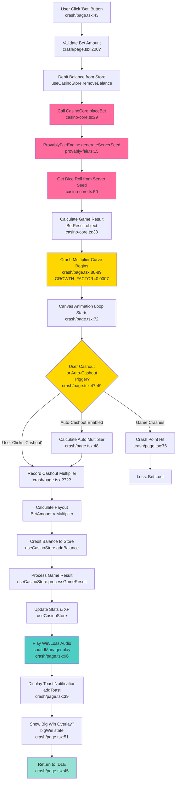
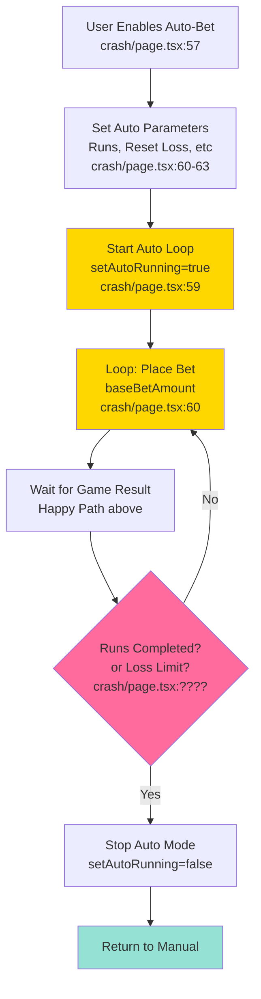
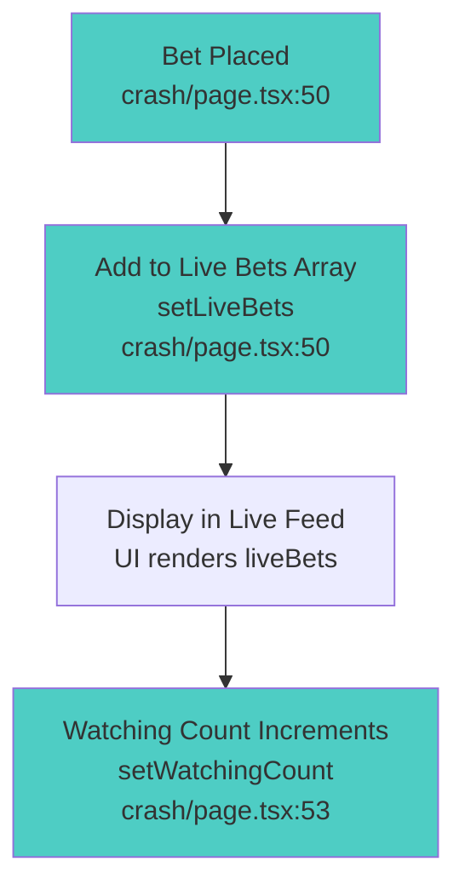
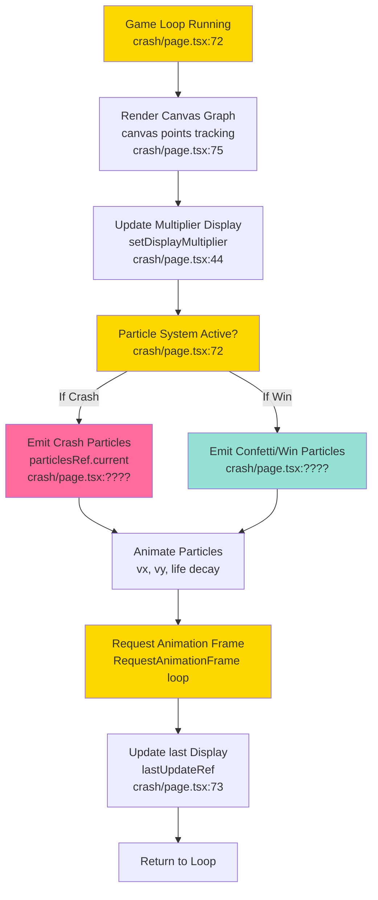
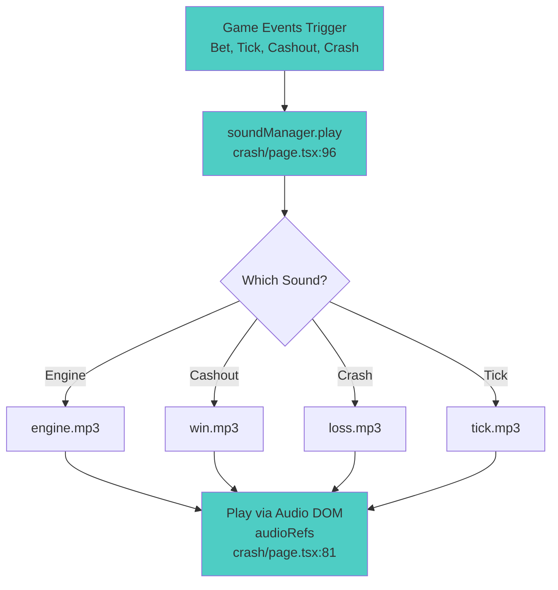
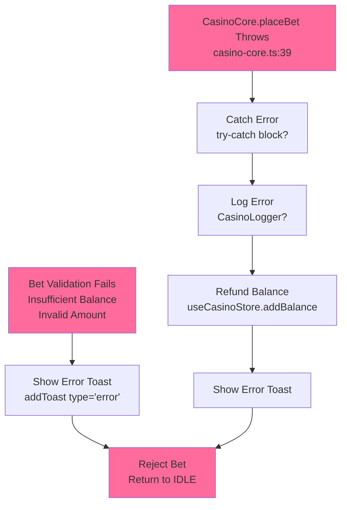

# 🎯 Crash Game - Feature Flowchart

**Source**: `src/app/games/crash/page.tsx` (969 LOC)  
**Last Updated**: 2026-05-10

---

## 🔄 Primary Happy Path: Bet → Run → Cashout → Payout

---

## 🔧 Sub-Flow: Auto-Bet Mode (Advanced)

---

## 🎤 Side Effect: Live Bet Broadcasting

---

## 🎨 Side Effect: Canvas Animation & Particle System

---

## 🔊 Side Effect: Audio Management

---

## ⚠️ Error Paths

---

## 📊 State Dependencies

| State Variable | Source | Used By | Risk |
|---|---|---|---|
| `betAmount` | Local state (line 43) | Bet placement | 🟡 Not persisted |
| `displayMultiplier` | Local state (line 44) | UI display | 🟡 Client-only |
| `status` | Local state (line 45) | Game flow | 🟡 Sync issue (ref + state) |
| `balance` | useCasinoStore | Validation | 🔴 Client-side wallet |
| `crashHistory` | useCasinoStore (line 34) | Fairness info | 🟢 Read-only |
| `liveBets` | Local state (line 50) | Live feed | 🟡 Not persisted |
| `autoBetSettings` | useCasinoStore (line 61) | Auto mode | 🟡 Decoupled from core |

---

## 🔗 External Dependencies

| Dependency | Used For | Location |
|---|---|---|
| `useCasinoStore` | State mgmt | crash/page.tsx:5 |
| `CasinoCore.placeBet()` | Game logic | casino-core.ts:29 |
| `ProvablyFairEngine` | Randomness | provably-fair.ts:11 |
| `soundManager` | Audio | crash/page.tsx:7 |
| `framer-motion` | Animations | crash/page.tsx:8 |
| `@clerk/nextjs` | Auth | crash/page.tsx:4 |
| `lucide-react` | Icons | crash/page.tsx:3 |

---

## 🚨 Identified Issues

1. **Monolithic Component**: All logic inline (969 LOC)
   - Should split: GameController → GameCanvas → GameUI

2. **Ref + State Sync**: statusRef & status both tracked (lines 79, 84)
   - Risk: Closure stale data in event listeners

3. **Client-Side Wallet**: Balance debit/credit in UI
   - Per MASTER_PLAN 1.4: "TODO — Server-Side State Transition"
   - Risk: Manipulable via console

4. **No Explicit Error Boundaries**: Missing try-catch in game loop
   - Per AGENTS.md: "Bug-Hunter must inject error boundaries"

5. **Auto-Bet Decoupled**: autoBetSettings in store but execution in component
   - Risk: Config + execution drift
