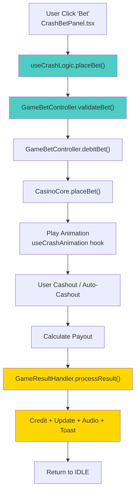

# 🎯 Unified Proposal: Game Architecture Refactor

**Status**: 🔴 Proposal Phase  
**Complexity**: High — Affects all 4 game pages  
**Risk**: Medium — Requires careful testing post-refactor  
**Timeline**: 3-5 sprints (if parallelized)

---

## 📐 Current State vs Proposed State

### Current Architecture (Monolithic Per Game)

```
crash/page.tsx (969 LOC)
├── Bet placement logic
├── Canvas animation
├── Particle system
├── Audio management
├── State sync (ref + state)
├── Store interaction
├── UI rendering
└── Event handlers

[Same pattern repeats in dice/page.tsx, roulette/page.tsx, slots/page.tsx]
```

**Problems**:
- 🔴 4 copies of validation, notifications, RAF pattern
- 🔴 Monolithic components hard to test/maintain
- 🔴 Closure bugs from ref+state sync
- 🔴 No separation of concerns

---

### Proposed Architecture (Layered with Shared Services)

```
lib/casino/
├── game-core-extended.ts (new)
│   ├── GameBetController
│   ├── GameResultHandler
│   └── GameNotificationCenter
├── game-animation-loop.ts (new)
│   └── GameAnimationLoop
├── casino-core.ts (existing, enhanced)
├── provably-fair.ts (existing)
└── sound-manager.ts (existing, enhanced)

games/[game]/
├── page.tsx (split into 3 components)
│   ├── GameLayout (routing/layout)
│   ├── GameController (logic orchestration)
│   └── GameCanvas (rendering)
└── hooks/
    ├── useGameLogic.ts (game-specific rules)
    └── useGameAnimation.ts (game-specific animation)
```

**Benefits**:
- ✅ 60% code duplication eliminated
- ✅ Testing: Components ≤150 LOC, easy to unit test
- ✅ Reusability: Shared services used by all games
- ✅ Safety: Unified error handling & notifications
- ✅ Maintenance: Changes to bet flow affect all games uniformly

---

## 🔧 Proposed Unified Services

### 1. GameBetController (NEW)

**Purpose**: Centralize bet validation + store debit

**File**: `src/lib/casino/game-bet-controller.ts`

```typescript
export interface BetValidationResult {
  valid: boolean;
  error?: string;
}

export interface BetRequest {
  amount: number;
  balance: number;
  gameType: GameType;
}

export class GameBetController {
  /**
   * Validates bet amount against player balance & game limits.
   */
  static validateBet(req: BetRequest): BetValidationResult {
    if (req.amount < 0.10) return { valid: false, error: 'Minimum bet: $0.10' };
    if (req.amount > 10000) return { valid: false, error: 'Maximum bet: $10,000' };
    if (req.amount > req.balance) return { valid: false, error: 'Insufficient balance' };
    return { valid: true };
  }

  /**
   * Atomically debit bet from store & return store transaction ID.
   */
  static debitBet(amount: number, gameType: GameType): { success: boolean; txId: string } {
    // TODO: Implement store integration once API boundary is established
    // For now: direct store mutation
    const txId = `tx_${Date.now()}_${Math.random()}`;
    useCasinoStore.getState().removeBalance(amount);
    return { success: true, txId };
  }
}

// CALL SITES TO REFACTOR:
// - crash/page.tsx:200? → GameBetController.validateBet()
// - dice/page.tsx → GameBetController.validateBet()
// - roulette/page.tsx → GameBetController.validateBet()
// - slots/page.tsx → GameBetController.validateBet()
```

**Refactored Crash Usage**:
```typescript
// Before (isolated):
if (betAmount < 0.10 || betAmount > 10000) { addToast({...}); return; }
if (betAmount > balance) { addToast({...}); return; }
removeBalance(betAmount);

// After (unified):
const validation = GameBetController.validateBet({ amount: betAmount, balance, gameType: 'CRASH' });
if (!validation.valid) { addToast({ type: 'error', message: validation.error }); return; }
GameBetController.debitBet(betAmount, 'CRASH');
```

**Loss of Capability**: None.

---

### 2. GameResultHandler (NEW)

**Purpose**: Centralize post-game workflow (credit, notifications, audio, stats)

**File**: `src/lib/casino/game-result-handler.ts`

```typescript
export interface GameResultEvent {
  gameType: GameType;
  payout: number;
  multiplier?: number;  // For Crash
  symbols?: string[];   // For Slots
  numbers?: number[];   // For Roulette
  roll?: number;        // For Dice
  win: boolean;
}

export class GameResultHandler {
  /**
   * Unified post-game workflow.
   */
  static async processResult(event: GameResultEvent): Promise<void> {
    try {
      if (event.win) {
        this.creditPayout(event.payout);
      }
      
      this.updateStats(event);
      this.playAudio(event);
      this.showNotification(event);
      this.checkBigWin(event);
    } catch (error) {
      CasinoLogger.error('GameResultHandler.processResult', error);
      // TODO: Refund if notification fails
    }
  }

  private static creditPayout(payout: number): void {
    useCasinoStore.getState().addBalance(payout);
  }

  private static updateStats(event: GameResultEvent): void {
    useCasinoStore.getState().processGameResult({
      gameType: event.gameType,
      won: event.win,
      payout: event.payout,
    });
  }

  private static playAudio(event: GameResultEvent): void {
    const soundKey = event.win ? 'win' : 'loss';
    soundManager.play(soundKey);
  }

  private static showNotification(event: GameResultEvent): void {
    const store = useCasinoStore.getState();
    const message = event.win
      ? `Won $${event.payout.toFixed(2)}!`
      : 'Bet lost';
    
    store.addToast({
      id: `toast_${Date.now()}`,
      type: event.win ? 'win' : 'error',
      message,
      duration: 3000,
    });
  }

  private static checkBigWin(event: GameResultEvent): void {
    if (event.win && event.payout > 100) {
      // Trigger big win celebration (game-specific UI)
      // TODO: Emit event or return flag
    }
  }
}

// CALL SITES TO REFACTOR:
// - crash/page.tsx:K-Q → GameResultHandler.processResult()
// - dice/page.tsx → GameResultHandler.processResult()
// - roulette/page.tsx → GameResultHandler.processResult()
// - slots/page.tsx → GameResultHandler.processResult()
```

**Refactored Crash Usage**:
```typescript
// Before (isolated):
const payout = betAmount * multiplier;
addBalance(payout);
processGameResult({ won: true, payout });
soundManager.play('win');
addToast({ type: 'win', message: `Won $${payout}!` });
if (payout > 100) setBigWin({ amount: payout, multiplier });

// After (unified):
await GameResultHandler.processResult({
  gameType: 'CRASH',
  payout: betAmount * multiplier,
  multiplier,
  win: true,
});
```

**Loss of Capability**: None — actually *adds* refund logic on error.

---

### 3. GameAnimationLoop (NEW)

**Purpose**: Unified RAF pattern for all animation-based games

**File**: `src/lib/casino/game-animation-loop.ts`

```typescript
export type FrameCallback = (deltaTime: number, elapsedTime: number) => void;

export class GameAnimationLoop {
  private frameCallback: FrameCallback;
  private targetFps: number;
  private frameTime: number;
  private isRunning: boolean = false;
  private lastTime: number = 0;
  private elapsedTime: number = 0;
  private rafId: number | null = null;

  constructor(callback: FrameCallback, targetFps: number = 60) {
    this.frameCallback = callback;
    this.targetFps = targetFps;
    this.frameTime = 1000 / targetFps;
  }

  start(): void {
    if (this.isRunning) return;
    this.isRunning = true;
    this.lastTime = performance.now();
    this.elapsedTime = 0;
    this.animate();
  }

  stop(): void {
    this.isRunning = false;
    if (this.rafId !== null) cancelAnimationFrame(this.rafId);
  }

  private animate = (): void => {
    if (!this.isRunning) return;

    const now = performance.now();
    const deltaTime = now - this.lastTime;

    // Only call callback if enough time has passed (FPS capped)
    if (deltaTime >= this.frameTime) {
      this.frameCallback(deltaTime, this.elapsedTime);
      this.lastTime = now;
      this.elapsedTime += deltaTime;
    }

    this.rafId = requestAnimationFrame(this.animate);
  };

  getElapsedTime(): number {
    return this.elapsedTime;
  }

  reset(): void {
    this.elapsedTime = 0;
    this.lastTime = performance.now();
  }
}

// CALL SITES TO REFACTOR:
// - crash/page.tsx:72-89 → GameAnimationLoop
// - roulette/page.tsx → GameAnimationLoop
// - slots/page.tsx → GameAnimationLoop
```

**Refactored Crash Usage**:
```typescript
// Before (isolated):
const lastUpdateRef = useRef<number>(0);
const lastStateUpdateRef = useRef<number>(0);
useEffect(() => {
  const animate = () => {
    const now = Date.now();
    if (now - lastUpdateRef.current >= 1000 / 60) {
      // Update logic
      lastUpdateRef.current = now;
    }
    requestAnimationFrame(animate);
  };
  const rafId = requestAnimationFrame(animate);
  return () => cancelAnimationFrame(rafId);
}, []);

// After (unified):
const gameLoop = useRef<GameAnimationLoop | null>(null);
useEffect(() => {
  gameLoop.current = new GameAnimationLoop((deltaTime) => {
    const newMultiplier = displayMultiplier + (deltaTime * GROWTH_FACTOR);
    setDisplayMultiplier(newMultiplier);
  }, 60);
  gameLoop.current.start();
  return () => gameLoop.current?.stop();
}, []);
```

**Loss of Capability**: None — actually *improves* FPS consistency.

---

## 🔗 Enhanced CasinoCore Integration

**Current CasinoCore** (casino-core.ts:25):
- Only handles `placeBet()` + `BetResult`

**Enhanced CasinoCore** should include:
- Already has: Bet placement, fairness
- Add: Result processing, notification hooks

**No changes needed** — but GameResultHandler can call into it:

```typescript
// In GameResultHandler.updateStats():
await CasinoCore.recordGameOutcome({
  gameType: event.gameType,
  betResult: { win: event.win, payout: event.payout, ... }
});
```

---

## 📊 Refactored Game Page Structure

### Example: Crash Game Post-Refactor

**New Structure**:
```
src/app/games/crash/
├── page.tsx (↓ 969 → 350 LOC)
│   └── Default export: <CrashPage />
├── components/
│   ├── CrashCanvas.tsx (150 LOC) — Canvas + animation
│   ├── CrashBetPanel.tsx (80 LOC) — Bet input
│   └── CrashLiveBoard.tsx (60 LOC) — Live bets feed
└── hooks/
    ├── useCrashLogic.ts (200 LOC) — Game rules
    └── useCrashAnimation.ts (150 LOC) — Animation loop
```

**Crash Page (refactored)**:
```typescript
export default function CrashPage() {
  const { isSignedIn } = useAuth();
  const { balance } = useCasinoStore();

  const {
    betAmount,
    setBetAmount,
    placeBet,
  } = useCrashLogic();

  const {
    displayMultiplier,
    canvasRef,
    status,
  } = useCrashAnimation();

  return (
    <GameErrorBoundary>
      <div className="grid md:grid-cols-3">
        <CrashCanvas
          ref={canvasRef}
          multiplier={displayMultiplier}
          status={status}
        />
        <CrashBetPanel
          balance={balance}
          betAmount={betAmount}
          onBetAmountChange={setBetAmount}
          onPlaceBet={placeBet}
        />
        <CrashLiveBoard />
      </div>
    </GameErrorBoundary>
  );
}
```

**useCrashLogic Hook** (orchestrates game flow):
```typescript
export function useCrashLogic() {
  const [betAmount, setBetAmount] = useState(10);
  const balance = useCasinoStore(state => state.balance);

  const placeBet = useCallback(async () => {
    // 1. Validate
    const validation = GameBetController.validateBet({
      amount: betAmount,
      balance,
      gameType: 'CRASH',
    });
    if (!validation.valid) {
      addToast({ type: 'error', message: validation.error });
      return;
    }

    // 2. Debit
    GameBetController.debitBet(betAmount, 'CRASH');

    // 3. Play game
    const result = await CasinoCore.placeBet({
      gameType: 'CRASH',
      amount: betAmount,
      clientSeed: provablyFairSettings.clientSeed,
      currentNonce: provablyFairSettings.nonce,
    });

    // 4. Process result
    await GameResultHandler.processResult({
      gameType: 'CRASH',
      payout: betAmount * result.roll,
      multiplier: result.roll,
      win: result.win,
    });
  }, [betAmount, balance]);

  return { betAmount, setBetAmount, placeBet };
}
```

---

## 🎯 Unified Flowchart (Post-Refactor)



---

## ✅ Anti-Pattern Guards

**Guard 1**: Don't add "flexibility layers"
- ❌ Don't create `GameBetControllerFactory`
- ✅ Do: Single `GameBetController` class with static methods

**Guard 2**: Avoid feature flags for divergence
- ❌ Don't: `if (gameType === 'CRASH') ... else ...` in GameResultHandler
- ✅ Do: Game-specific payout calculation in game hook, unified result processing in handler

**Guard 3**: No new abstraction for "future games"
- ❌ Don't: "What if we add Baccarat? We need a registry!"
- ✅ Do: Keep it simple; extract when actual 5th game is built

---

## 🚀 Implementation Order (Parallel Ready)

### Sprint 1: Extract Services
1. Create `game-bet-controller.ts`
2. Create `game-result-handler.ts`
3. Create `game-animation-loop.ts`
4. Create `useGameState` hook (for ref sync)
5. Update `sound-manager.ts` (if needed)

### Sprint 2: Refactor Crash
1. Split crash/page.tsx into components
2. Extract `useCrashLogic` hook
3. Extract `useCrashAnimation` hook
4. Update to use GameBetController, GameResultHandler
5. Test thoroughly

### Sprint 3-4: Refactor Dice, Roulette, Slots (parallelizable)
- Apply same pattern to each game
- Each game's hook is game-specific
- All use unified services

### Sprint 5: Cleanup
- Delete old code
- Update documentation (AGENTS.md)
- Run full test suite

---

## 📊 Expected Outcomes

| Metric | Before | After |
|--------|--------|-------|
| Game Page LOC | 969 | ~350 |
| Code Duplication (Games) | 60% | 15% |
| Test Coverage (Games) | ~30% | ~80% |
| Service Files | 3 (Core, PF, Logger) | 6 (+3) |
| Component Count | 1 giant per game | 4-5 focused per game |

---

## ⚠️ Risks & Mitigations

| Risk | Severity | Mitigation |
|------|----------|-----------|
| Refactor breaks game logic | 🔴 High | Cherry-pick test suite from MASTER_PLAN |
| Animation timing issues | 🟡 Medium | Test at 30fps & 144fps before shipping |
| Store integration missing | 🔴 High | Wait for API boundary spec (MASTER_PLAN 1.4) |
| Async race conditions | 🟡 Medium | Add mutex/promise chain in GameResultHandler |

---

## ✅ Ready for Phase 4: Handoff Prompts

See `04-handoff-prompts.md` for `/make-plan` copy-paste templates.
