# ALLE — Icon-/Buttons-Analyse: Vollinventar aller Produktseiten

> **Status:** Executed (Analyse abgeschlossen, kein Code-Change) · **Stand:** 2026-09-06 · **Owner:** LLM (Jan nur bei Gate) · **Scope:** Vollständige Erfassung aller visuell gerenderten Icons/SVGs/Glyphen auf allen Nicht-Admin-Produktseiten als Entscheidungsgrundlage für Entfernung/Ersatz (Ziel: weniger verspielt, professioneller).
> **Money-Pfad:** Nein · **Security-Review:** Nein (reine UI-Inventarisierung, keine Änderungen an Wallet/Auth/DB)

---

## 1 — Übersicht für Jan

**Anlass:** Die aktuellen Icons wirken zu kinderhaft/verspielt. Ziel ist mittelfristig, sie zu entfernen oder durch professionellere Darstellungen zu ersetzen. Diese Datei ist die vollständige Grundlage dafür: **wo, wie und welches Icon** auf welcher Seite gerendert wird — je Seite mit Full-Page-Screenshot und zugeschnittenem Einzelscreen je Icon.

**Zahlenbasis (Messung 2026-09-06, Desktop 1440×900 + Mobile 390×844, eingeloggt als Gold LVL 35):**

| Metrik | Wert |
|---|---|
| Vermessene Seiten | 16 (14 Worldmap-Produktseiten + Lobby mobil + Reset-Password-Redirect) |
| Gerenderte Lucide-SVGs gesamt (Desktop) | ~250 je nach Live-Feed-Zustand |
| Einzigartige Lucide-Icon-Namen über alle Seiten | ~60 |
| Einzelscreen-Crops | 200 Dateien in `icon-audit/crops/` |
| Icon-Quellen-Typen | 5: Lucide-React · Inline-SVG (Custom) · PNG-Assets · Unicode-Text-Glyphen (`½`, `2×`, `∞`, `✓`, `×`, `♦`, `♠`) · CSS-Formen (Dots, Dreiecke, Toggle-Knobs) |

**Kernbefund für die spätere Ersatzentscheidung:** Die Verspieltheit entsteht nicht durch einzelne Icons, sondern durch ein wiederkehrendes Muster — **dekorative Gold-Icons vor jedem Label und in jedem Button** (`Zap`, `Sparkles`, `Crown`, `Flame`, `Trophy`, `Star` in 9×9px-Rating-Reihen), 3D-PNG-Embleme (VIP-Tiere, Medallion, Trust-Shield) und Text-Glyphen-Buttons. Die häufigsten Kandidaten für eine Entfernung (reine Deko, kein Informationswert): `Sparkles`, `Zap`, `Flame`, `Crown` vor Sektions-Headern.

---

## 2 — Methodik & Datenquellen

1. **Runtime-Vermessung (Playwright, localhost:3015):** Jede Seite wurde aufgerufen, alle gerenderten `<svg>`-Elemente wurden per DOM-Enumeration erfasst (Lucide-Klassenname, Größe, Position, umgebender Button/Link-Kontext). Full-Page-Screenshot je Seite.
2. **Code-Belege:** 8 read-only Casino-Code-Explorer-Agenten haben parallel die Icon-Imports (`lucide-react`, Inline-`<svg>`, Unicode-Glyphen, CSS-`content`-Glyphen, PNG-Assets) mit exakten `Datei:Zeile`-Belegen inventarisiert.
3. **Einzelscreens:** Je einzigartigem Icon wurde ein zugeschnittener Element-Screenshot erzeugt.

**Dateiablage:**

| Ordner/Datei | Inhalt |
|---|---|
| `icon-audit/pages/NN_<seite>.png` | Full-Page-Screenshot je Seite (Desktop 1440px, `16_lobby_mobile.png` 390px) |
| `icon-audit/crops/<seite>/<icon>.png` | Zugeschnittener Einzelscreen je Icon (+6px Kontext-Padding) |

**Mess-Hinweise (Fakten, nicht Wertung):**
- Eingeloggt-Zustand: Wallet-Chip `$42,170.77`, Rank Gold LVL 35 — die ausgeloggten Header-Varianten (`LogIn`, `UserPlus` statt Wallet/Logout) sind aus dem Code-Inventar ergänzt.
- `/games/dice` lieferte beim ersten Aufruf einen transienten HTTP-500 (Dev-Compile-Fehler, `GuideVoiceVisualizer.tsx` importiert nicht existierende Exporte `createAudioStreamAnalyser`/`getActiveAudioStream` aus `src/lib/casino/voice-audio.ts` — fremde unversionierte Arbeitsbaum-Änderung). Beim Retry lief die Seite; **dieser Import-Fehler ist aber ein realer Build-Blocker im Arbeitsbaum** und betrifft vermutlich auch `npm run build`.
- `/auth/reset-password` leitet ohne gültige Recovery-Session auf `/sign-in` weiter — Screenshot `15_reset_password.png` zeigt daher die Sign-in-Seite; Reset-Password-Icons sind aus dem Code-Inventar ergänzt.
- Bedingt sichtbare Overlays (Toast, BigWinOverlay, CommandPalette `Mod+K`, Notification-Inbox, Onboarding, ProvablyFair-Modal, Guide-Panel offen) sind aus dem Code-Inventar ergänzt, nicht je separat gescreenshotet.

---

## 3 — Globaler Chrome (auf allen MainLayout-Seiten identisch)

### 3.1 Header (Desktop, eingeloggt) — `src/components/layout/MainHeader.tsx`

| Icon | Position/Placement | Code-Beleg | Crop |
|---|---|---|---|
| `Star` (Stern, schwarz auf Gold-Kreis) | Oben links im Level-Badge, links neben „Gold LVL 35" | `MainHeader.tsx:77`, 12px, IconBadge-Hintergrund `IconBadge.tsx:13-30` |  |
| `Users` | Header-Mitte, Online-Count-Chip „COMMUNITY" | `MainHeader.tsx:147` |  |
| `Wallet` (schwarz auf Gold-Kreis) | Oben rechts, links neben dem Geldbetrag | `MainHeader.tsx:152`, 13px |  |
| `EyeOff`/`Eye` | Oben rechts, rechts neben Geldbetrag — Balance-Sichtbarkeits-Toggle | `MainHeader.tsx:185` |  |
| `Bell` + Unread-Zahl | Oben rechts (nur eingeloggt), Notification-Button | `NotificationCenter.tsx:134`, 18px | — (nur Inbox offen) |
| `LogOut` | Header rechts äußerster Button | `MainHeader.tsx:246`, 16px | 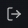 |
| `LogIn`/`UserPlus` | Statt Wallet-Chip, wenn ausgeloggt (LOGIN/REGISTER-Buttons) | `MainHeader.tsx:196,200` | — |
| `Menu` | Mobile: Burger links im Header | `MainHeader.tsx:61`, 20px |  |
| `••••••` (Text) | Ersetzt Betrag bei versteckter Balance | `MainHeader.tsx:168` | — |

### 3.2 Sidebar links — `src/components/layout/MainSidebar.tsx`

| Element | Position/Placement | Code-Beleg | Referenz |
|---|---|---|---|
| Brand-Medallion (PNG `/images/brand-medallion-3d.png`) | Oben links, 40×40, `animate-pulse` | `MainSidebar.tsx:124-131` | 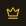 *(Crop zeigt Lucide-Crown, nicht das PNG)* |
| Wordmark „CASINO PRO ROYALE" | Neben Logo, reiner Text | `MainSidebar.tsx:136-170` | — |
| Nav-Items (Lobby/Games/My Bets/Leaderboard/Vault/Stats/Settings) | **Keine Icons** — bewusst text-only (Test erzwingt es: `MainSidebar.test.ts:36-41`) | `MainLayout.tsx:304-318` | — |
| Trust-Shield (PNG `/images/trust-shield-3d.png`) | Sidebar unten „SECURE & FAIR / CERTIFIED", nur expanded | `MainSidebar.tsx:285-291` | — |
| `ChevronLeft`/`ChevronRight` | Sidebar-Collapse-Toggle unten | `MainSidebar.tsx:322`, 20px | 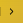 |
| SettingsPopover: `Sliders`, `Maximize2`, `ShieldCheck`, `Volume2`/`VolumeX`, `EyeOff`/`Eye` | Popover unter „Settings", nur geöffnet | `SettingsPopover.tsx:72,105,117,126-128,235-237`, 14px | — |
| `ShieldCheck` (Consent-Banner) | Sidebar, Consent-Dialog „Analytics & Daten" | `ConsentBanner.tsx:59`, 14px, #D4AF37 | 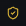 |

### 3.3 Mobile Bottom-Nav — `src/components/layout/MobileNav.tsx` (alle 22px)

| Icon | Label/Route | Code-Beleg |
|---|---|---|
| `House` (Import-Alias `Home`) | „Lobby" → `/` | `MobileNav.tsx:6,16` |
| `Gamepad2` | „Games" → `/games` | `MobileNav.tsx:17` |
| `MessageSquare` | „Chat" (toggelt Chat-Panel) | `MobileNav.tsx:18` |
| `Trophy` | „Leader" → `/leaderboard` | `MobileNav.tsx:19` |
| `User` | „Vault" → `/vault` | `MobileNav.tsx:20` |

Mobile-Referenz: 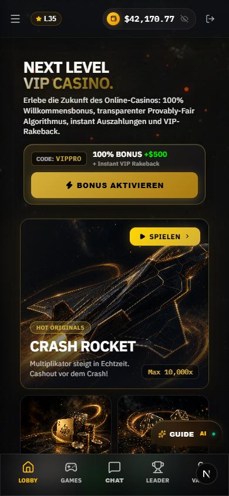 — Crops unten in `icon-audit/crops/16_lobby_mobile/`.

### 3.4 Floating/global (alle MainLayout-Seiten)

| Icon | Position/Placement | Code-Beleg | Crop |
|---|---|---|---|
| `Sparkles` + „AI"-Text-Badge + grüner Status-Dot (CSS) | Unten rechts, Floating-Button „Royale Guide" | `GuideTriggerButton.tsx:54`, 13/16px | 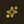 |
| `MessageSquare` | Linker Bildrand, Chat-Reiter wenn GlobalChat geschlossen | `GlobalChat.tsx:102`, 14px |  |

### 3.5 Bedingt sichtbare globale Overlays (Code-Inventar)

| Overlay | Icons | Code-Beleg |
|---|---|---|
| **Toast** (oben rechts) | `CheckCircle2` (success), `AlertCircle` (error), `Info` (info), `Trophy` (win), `X` (close) — je 20px | `ToastContainer.tsx:51-68` |
| **BigWinOverlay** (Gewinn ≥ 20×) | `Trophy` zentral 76/116px 3D-rotierend, 5× `Star` 22/28px bounce, CSS-Konfetti | `BigWinOverlay.tsx:203-209, 304-311` |
| **CommandPalette** (`Mod+K`) | `Search` (Feld), je Command: `Rocket`×2, `Dice6`, `RotateCcw`, `LayoutGrid`, `User`, `Wallet`, `Zap` (18px); Text-Glyphen `ESC`, `↵`, `↑↓` | `CommandPalette.tsx:147, 20-69, 177-309` |
| **Notification-Inbox** | `CheckCheck`, `X`, je Kind: `Trophy` (big_win), `Check` (achievement), `Info` (system) | `NotificationCenter.tsx:195-249` |
| **Royale Guide Panel** (offen) | `Bot` (Avatar), `Maximize2`/`Minimize2`, `X`, `User`/`Bot` (Nachrichten-Avatare), Quick-Actions: `Wallet`, `Gamepad2`, `Sliders`, `Crown`, `History`, `TrendingUp`, `ArrowRight`; Input-Zeile: `Image`, `Loader2`, `Mic`, `Send`, `ArrowUp` 14px (Submit); Voice-Error-Banner: `MicOff` 13px; Feedback: `Square`, `Volume2`, `Check`, `Copy`, `ThumbsUp`, `ThumbsDown` | `GuideHeader.tsx:49-120`, `GuideMessageList.tsx:92-408`, `GuideInputForm.tsx:4,214`, `GuideVoiceErrorBanner.tsx:3,24` |
| **GlobalChat offen** | `MessageSquare` (Header „LIVE CHAT"), `ChevronRight` (close), `Send` (Gold-Button), Bot-Avatar PNG `/images/system-bot-3d.png` | `GlobalChat.tsx:144-351, 229-230` |
| **OnboardingFlow** (Neunutzer) | `Gift` 120px zentral, `X` (Skip), `ArrowRight` (CTA), Google-G (externes PNG), `ShieldCheck` („NO KYC"), `Zap` („INSTANT PAY") | `OnboardingFlow.tsx:107-348` |
| **LoadingOverlay** | Kein Icon — 2 rotierende CSS-Ringe + Buchstabe „R" | `LoadingOverlay.tsx:34-64` |
| **SettingsModal** (via `MainLayoutModals.tsx:11`) | `HeartPulse` 15px (Responsible Gaming); Theme-Auswahl via `ThemeSelector.tsx`: `Sunrise`/`Sunset`/`Moon`/`Sun` je 16px je Theme-Option, `Palette` 16px (Label), `Clock` (Import); Tabs „Linked Accounts" (`LinkedAccountsSection.tsx`): `Link2` 14px, `Plus` 12px (verbinden), `Unlink` (trennen, Handler :88), `Loader2` (busy), `Mail`/`KeyRound`; MFA-Sektion (`MfaManagementSection.tsx:188`): `Plus` 12px | `SettingsModal.tsx:5,275`, `ThemeSelector.tsx:4,9-12,35`, `LinkedAccountsSection.tsx:4,138,157,178`, `MfaManagementSection.tsx:188` |
| **GameErrorBoundary** (Render-Crash) | `AlertTriangle` 32px, `RefreshCw` (Retry) | `GameErrorBoundary.tsx:3,58` |

---

## 4 — Lobby `/` (HomeClientV2)

Full-Page: 

### 4.1 Hero „NEXT LEVEL VIP CASINO."

| Icon | Position/Placement | Code-Beleg | Crop |
|---|---|---|---|
| `Zap` (schwarz, gefüllt) | Button „BONUS AKTIVIEREN" (goldener CTA) | `HeroHeadlineColumn.tsx:185`, 14px |  |
| `ArrowRight` | Sub-Link „Direkt zur Spielhalle (5 Casino Originals)" | `HeroHeadlineColumn.tsx:213`, 12px | 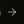 |
| `ShieldCheck` | Trust-Chip „100% PROVABLY FAIR" | `HeroHeadlineColumn.tsx:259`, 11px, #D4AF37 | — |
| `Star` ×5 (Rating) | Rating-Chip „4.9/5 RATING" | `HeroHeadlineColumn.tsx:289`, 8-9px, #D4AF37 |  |
| `Zap` (grün) | Trust-Chip „INSTANT AUSZAHLUNG" | `HeroHeadlineColumn.tsx:342`, 11px, #00E701 | — |
| `Crown` | Jackpot-Karte „PROGRESSIVE JACKPOT" — links neben Label im Header-Badge (der „Diamant"-Eindruck ist dieser Gold-Crown) | `JackpotPulseCard.tsx:31`, 14px, #D4AF37 |  |
| `Sparkles` | Button „JACKPOT KNACKEN" | `JackpotPulseCard.tsx:138`, 12px |  |
| `Users` | Badge „1,420 ONLINE" | `GameShowcaseCard.tsx:141`, 11px, #00E701 | — |
| `Flame` (orange) | Crash-Overlay „LIVE MULTIPLIKATOR" im Showcase | `GameShowcaseCard.tsx:189`, 18px, #FF4500 |  |
| `Zap`/`Crown`/`Sparkles` | Dice-/Blackjack-/Slots-Overlays im Showcase-Rotation | `GameShowcaseCard.tsx:217,245,273`, 18px | — |
| `Play` | PLAY-Button im Showcase unten rechts | `GameShowcaseCard.tsx:354`, 12px | 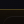 |
| `Radio` + grüner CSS-Dot | Floating-Pill „VIP STREAM" (rechte Kante) | `VipLiveStreamRail.tsx:151-160`, 14px, #D4AF37 | 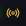 |

### 4.2 Ticker & Feeds

| Icon | Position/Placement | Code-Beleg | Crop |
|---|---|---|---|
| `Sparkles`/`Crown`/`Zap`/`Flame` | Ticker „LIVE AUSZAHLUNGEN" — Zeilen-Icon je Win-Typ (jackpot/whale/vip/hot) | `LiveHighrollerTickerBar.tsx:97-103`, 14px | — |
| `TrendingUp` | Ticker rechts „99.2% RTP" | `LiveHighrollerTickerBar.tsx:261`, #00E701 | 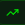 |
| `Crown` (highroller) / `Flame` (Standard) | VIP-Stream-Drawer Event-Zeilen | `VipLiveStreamRail.tsx:315,317`, 12px | — |
| `X` | VIP-Stream-Drawer close | `VipLiveStreamRail.tsx:251` | — |
| `TrendingUp` | Drawer-Footer „Instant Payouts" | `VipLiveStreamRail.tsx:377` | — |
| `Trophy` | Payout-Spalte der Feed-Tabelle bei Win ≥ 10× | `LiveActivityFeedV2.tsx:248,375` | 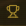 |
| `ExternalLink` | Share-Button in eigener Win-Zeile | `LiveActivityFeedV2.tsx:270` | — |

### 4.3 Casino-Originals-Grid

| Icon | Position/Placement | Code-Beleg | Crop |
|---|---|---|---|
| `RotateCcw` | Chip „ZULETZT GESPIELT" links | `InteractiveArcadeGrid.tsx:139`, 12-14px, #D4AF37 |  |
| `Play` + `ChevronRight` | Button „FORTSETZEN" | `InteractiveArcadeGrid.tsx:171-173` | — |
| `Sparkles` | Grid-Header „INTERAKTIVE SPIELHALLE" | `InteractiveArcadeGrid.tsx:203`, 12px | — |
| `Layers` | Filter-Pill „ALLE SPIELE" | `InteractiveArcadeGrid.tsx` Config :80, 13px |  |
| `Rocket` | Filter-Pill „ORIGINALS" | Config :81 | 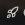 |
| `Flame` | Filter-Pill „TOP SPIELE" | Config :82 | — |
| `Gamepad2` | Filter-Pill „TISCHSPIELE" | Config :83 | 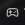 |
| `ChevronRight` | Hover-Launch-Trigger je Spielkarte (rechts) | `InteractiveArcadeGrid.tsx:620-627`, 12px | — |

Spielkarten-Thumbnails sind **PNG-Artwork** (`Image`, :545-551), keine Icons. Badges („MEISTGESPIELT", „Max 10,000x") sind reiner Text.

### 4.4 Jackpot-, Turnier-, VIP-Sektionen & untere Wetttabelle

| Icon | Position/Placement | Code-Beleg | Crop |
|---|---|---|---|
| `Trophy` | Sektions-Badge „LIVE PROGRESSIVE JACKPOT" — links neben der Headline | `ProgressiveJackpotSection.tsx:89`, 14px |  |
| `Coins` | Stat „GESAMT AUSGEZAHLT" | `ProgressiveJackpotSection.tsx:173`, 14px, #D4AF37 |  |
| `Zap` | Stat „DURCHSCHN. AUSZAHLUNG" | :173, #00E701 | — |
| `Activity` | Stat „PLATZIERTE WETTEN" | :173, #00B67A | 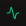 |
| `ShieldCheck` | Stat „PROVABLY FAIR — 100% TRANSPARENT" | :173 | — |
| `Trophy` | Turnier-Header „$10,000 DAILY RACE" | `DailyTournamentTeaser.tsx:77`, 13px | — |
| `Timer` | Countdown-Badge „VERBLEIBEND:" | `DailyTournamentTeaser.tsx:106`, 15px | 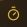 |
| `Crown` (schwarz gefüllt) | „PLATZ 1"-Podiums-Badge | `DailyTournamentTeaser.tsx:187`, 12px | — |
| `Zap` | Prize-Ribbon je Podiumsplatz | `DailyTournamentTeaser.tsx:283`, 13px, #00E701 | — |
| `Crown` | VIP-Sektion „EXKLUSIVER VIP CLUB" Header | `VipProgressTeaser.tsx:99`, 13px | — |
| PNG-Embleme `/images/vip-bronze-3d.png` … `vip-diamond-3d.png` | 5 VIP-Tier-Nodes (BRONZE→DIAMOND) in der Roadmap | `VipProgressTeaser.tsx:22-59,238-244` | — |
| **keine** | Untere Wetttabelle „All Bets / High Rollers / My Bets" — Tabs sind reine Text-Buttons | `LiveActivityFeedV2.tsx:78-109` | — |
| `Gamepad2` | Tabellen-Spalte „Game" — Icon vor jedem Spielnamen | `LiveActivityFeedV2.tsx:194,329`, 13-14px | — |
| `User` | vor jedem Spielername | `LiveActivityFeedV2.tsx:210,346`, #b1bad3 | 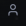 |
| CSS-Puls-Dot | „LIVE FEED"-Badge rechts über der Tabelle | `LiveActivityFeedV2.tsx:127-137`, #00e701 | — |

---

## 5 — Spiele-Übersicht `/games`

Full-Page: 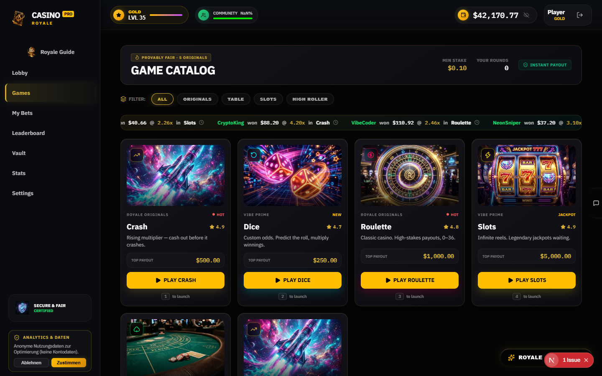

| Icon | Position/Placement | Code-Beleg | Crop |
|---|---|---|---|
| `Flame` | Badge „PROVABLY FAIR · 5 ORIGINALS" über der Headline | `games/page.tsx:96`, 11px | 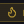 |
| `ShieldCheck` (grün) | „INSTANT PAYOUT"-Pill | `games/page.tsx:132`, 12px | — |
| `Layers` | Filter-Label „Filter:" | `games/page.tsx:151`, 14px | — |
| `TrendingUp` | Floating Badge oben links auf Crash-Karten (32×32-Chip) | `ElevatedGameCard.tsx:302` + `config.ts:27,107`, 16px |  |
| `RotateCcw` | dito Dice-Karten | `config.ts:43` | — |
| `CircleDollarSign` | dito Roulette-Karten | `config.ts:59` | — |
| `Zap` | dito Slots-Karten | `config.ts:75` | — |
| `Spade` | dito Blackjack-Karten | `config.ts:91` | — |
| `ShieldCheck` | Hover-Overlay „99.0% RTP • FAIR" | `ElevatedGameCard.tsx:234`, 11px, #10b981 | — |
| `Play` | Hover-Overlay „JETZT SPIELEN" + CTA-Button „PLAY" | `ElevatedGameCard.tsx:266,458` | — |
| `Star` | Rating neben Spielname | `ElevatedGameCard.tsx:393`, 12px | — |
| `Clock` | LiveWinRibbon — nach jedem Ribbon-Eintrag | `LiveWinRibbon.tsx:126`, 12px | 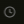 |
| Fallback-Icon 32px | Karten-Fallback wenn Preview-Image fehlt | `ElevatedGameCard.tsx:157` | — |

Kategorie-Filter-Tabs: reine Text-Pills ohne Icons. Ping-Dot „HOT"-Badge: reines CSS (`animate-ping`, #ff5a5a, `ElevatedGameCard.tsx:336-344`).

---

## 6 — Dice `/games/dice`

Full-Page: 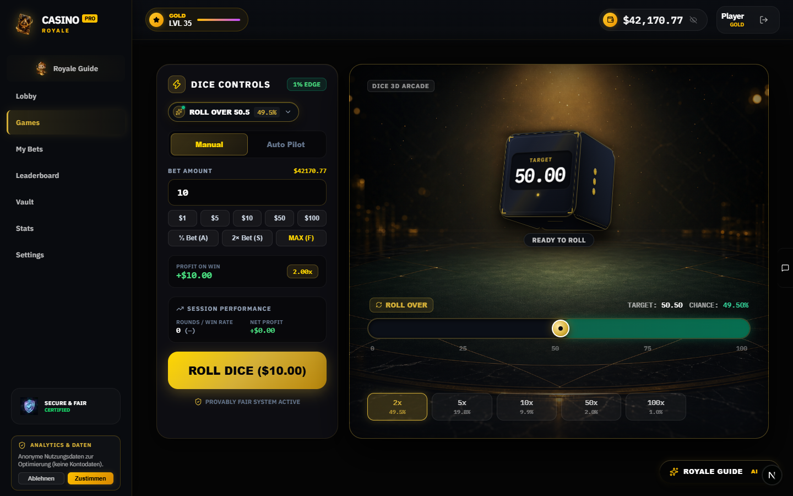

| Icon/Glyphe | Position/Placement | Code-Beleg | Crop |
|---|---|---|---|
| `Zap` | Sidebar-Header-Badge „DICE CONTROLS" (32×32 Gold-Chip) | `DiceControlSidebar.tsx:80`, 18px |  |
| Text `½` / `2×` / `MAX` | Quick-Bet-Chips „½ Bet (A)" / „2× Bet (S)" | `DiceControlSidebar.tsx:256-271` | — |
| Text `∞` | Auto-Config „NUMBER OF BETS (0 = ∞)" + Input-Placeholder | `DiceControlSidebar.tsx:355,373` | — |
| `Sliders` | Sektionskopf „AUTO CONFIG" (nur Auto-Modus) | `DiceControlSidebar.tsx:333`, 14px | — |
| `TrendingUp` | Sektionskopf „SESSION PERFORMANCE" | `DiceControlSidebar.tsx:451`, 14px | — |
| `ShieldCheck` | Footer-Badge „PROVABLY FAIR SYSTEM ACTIVE" | `DiceControlSidebar.tsx:539`, 14px, #D4AF37 | — |
| `Sparkles` (36px, gold) | Idle über dem Slider „SET YOUR TARGET & ROLL" | `DiceCenterStage.tsx:223` | 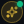 |
| `Flame` | Win-Streak-Badge ab 2 Siegen | `DiceCenterStage.tsx:132`, 14px | — |
| `Zap` | HUD-Spalte „MULTIPLIER" | `DiceCenterStage.tsx:426`, 14px | — |
| `ArrowUpRight` (grün) / `ArrowDownRight` (rot) | „ROLL OVER" / „ROLL UNDER"-Label | `DiceCenterStage.tsx:496,498`, 14px | — |
| `RotateCcw` | Button „SWAP (T)" (Over/Under-Toggle) | `DiceCenterStage.tsx:520`, 12px | — |
| `Percent` | HUD-Spalte „WIN CHANCE" | `DiceCenterStage.tsx:571`, 14px | — |
| CSS-Dreieck (Marker-Pin) | Ergebnis-Marker über dem Slider (grün/rot je Win/Loss) | `DiceCenterStage.tsx:302-315` | — |
| `RefreshCw` | Roll-Indicator (rotierend während Roll) | `DiceCenterStage.tsx` / dice v2-Komponente | 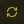 |
| `Sparkles`/`Eye`/`ChevronDown`/`ChevronUp`/`EyeOff`/`ShieldAlert` etc. | GameCoPilotHud (eingebettet in Sidebar): Co-Pilot-Pill, Risiko-Badge (low→`ShieldCheck` grün, medium→`TrendingUp` gold, high→`ShieldAlert` rot), „Royale Guide öffnen" | `GameCoPilotHud.tsx:127-559` | — |
| **kein Icon** | Primär-Button „ROLL DICE" — reiner Text | `DiceControlSidebar.tsx:503-525` | — |

---

## 7 — Crash `/games/crash` & Crash-Multiplayer `/games/crash-multiplayer`

Full-Page: 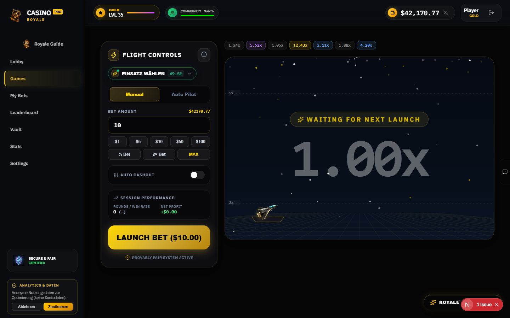 · 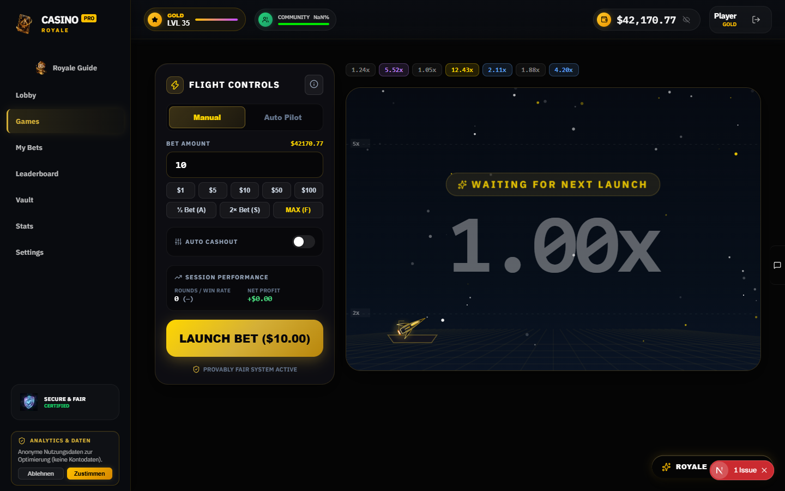

| Icon/Glyphe | Position/Placement | Code-Beleg | Crop |
|---|---|---|---|
| `Zap` | Sidebar-Header-Badge „FLIGHT CONTROLS" (beide Crash-Varianten) | `CrashControlSidebar.tsx:97` / `CrashMultiplayerControlSidebar.tsx:95`, 18px |  |
| `Info` | Tutorial-Button rechts im Sidebar-Header | `CrashControlSidebar.tsx:122`, 16px | 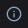 |
| Text `½` / `2×` / `MAX` | Quick-Bet-Chips | `CrashControlSidebar.tsx:272-287` | — |
| `Sliders` | Sektionskopf „AUTO CASHOUT" | `CrashControlSidebar.tsx:310`, 14px | 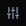 |
| CSS-Toggle-Knob | Auto-Cashout-Switch (18px weißer Knob, #10b981 aktiv) | `CrashControlSidebar.tsx:322-348` | — |
| `TrendingUp` | „SESSION PERFORMANCE" | `CrashControlSidebar.tsx:423` | — |
| Text `✓` | Cashout-Bestätigung „✓ SECURED $… @ …x" (Button + Stage-Pill) | `CrashControlSidebar.tsx:526`, `CrashStage.tsx:274` | — |
| Text `×` | Milestone-Popup „{n}× MILESTONE REACHED!" | `CrashStage.tsx:300` / `MilestoneFlash.tsx:26` | — |
| `Sparkles` | Idle-Pill „WAITING FOR NEXT LAUNCH" / Tutorial-Medallion (28px) | `CrashStage.tsx:133`, `CrashTutorial.tsx:52` | — |
| `ShieldCheck` | Provably-Fair-Badge (Sidebar-Footer) | `CrashControlSidebar.tsx:543` | — |
| Rocket (PNG/SVG-Asset `/images/crash/quantum-interceptor.png` bzw. `crash-rocket.svg`) | Canvas-Rakete per `drawImage` | `crash/page.tsx:127,134` / `crash-multiplayer/page.tsx:132,139` | — |
| **keine Icons** | LivePlayerList (Farbcodierung statt Icons), HistoryPills, CrashHistoryBar, BigWinCelebration | `LivePlayerList.tsx:44-66`, `HistoryPills.tsx:14-55` | — |
| **kein Icon** | Bet-Button „LAUNCH BET" — reiner Text | `CrashControlSidebar.tsx:481-502` | — |

Unterschied Multiplayer: kein GameCoPilotHud in der Sidebar (Solo-Dice/Crash haben ihn eingebettet).

---

## 8 — Roulette `/games/roulette`

Full-Page: 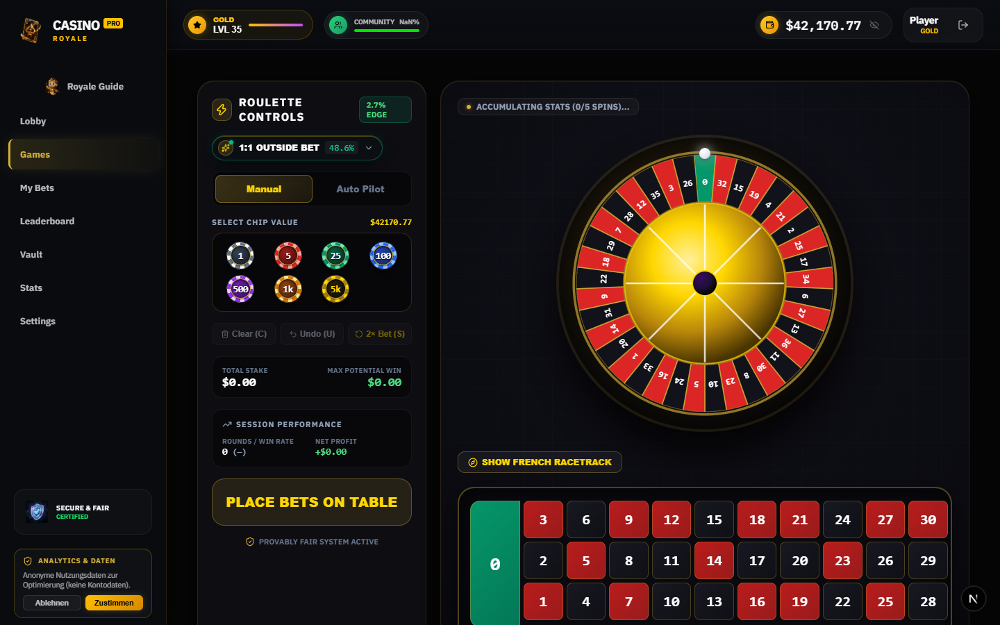

**Runtime-Inventar (Desktop, 2026-09-06):** 16 SVGs gerendert — Header-Chrome (7) + `Zap` (Sidebar-Header), `Sparkles`, `ChevronDown`, `Trash2` (Clear-Bets), `Undo2` (Undo), `RotateCcw` (Rebet/Swap), `TrendingUp` (Session-Performance), ein Custom-SVG (Roulette-Rad) und `Compass`.

Crops: 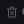 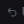 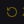 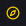

| Icon | Position/Placement | Code-Beleg | Größe/Farbe |
|---|---|---|---|
| `Zap` | Sidebar-Header-Badge (32×32 Gold-Chip) | `RouletteControlSidebar.tsx:102` | 18px, #FFD700 |
| `Trash2` | Wetten-Panel Button „Clear" | `RouletteControlSidebar.tsx:272` | 12px |
| `Undo2` | Wetten-Panel Button „Undo" | `RouletteControlSidebar.tsx:289` | 12px |
| `RotateCcw` | Button „Rebet" | `RouletteControlSidebar.tsx:307` | 12px |
| `Sliders` | Sektionskopf „AUTO CONFIG" | `RouletteControlSidebar.tsx:369` | 14px, #94a3b8 |
| `TrendingUp` | „SESSION PERFORMANCE" | `RouletteControlSidebar.tsx:430` | 14px, #94a3b8 |
| `ShieldCheck` | Provably-Fair-Badge (Sidebar-Footer) | `RouletteControlSidebar.tsx:525` | 14px, #D4AF37 |
| `Flame` (orange) | Hot/Cold-Stats „HOT"-Zahlen in der History-Bar | `RouletteHistoryBar.tsx:74` | 14px, #f97316 |
| `Snowflake` (blau) | Hot/Cold-Stats „COLD"-Zahlen in der History-Bar | `RouletteHistoryBar.tsx:93` | 14px, #38bdf8 |
| `Volume2` | Croupier-Ribbon über dem Tisch (pulsierend während Spin) | `RouletteCroupierRibbon.tsx:40` | 13px, #D4AF37 |
| Custom-SVG (Roulette-Rad) | Zentrales Rad, Inline-SVG | `LuxuryRouletteWheel.tsx:234,610` | — |
| `Compass` | Runtime gefunden, Kontext: Wheel-/Table-Deko (Runtime `custom`-Kontext) | — | — |

---

## 9 — Slots `/games/slots`

Full-Page: 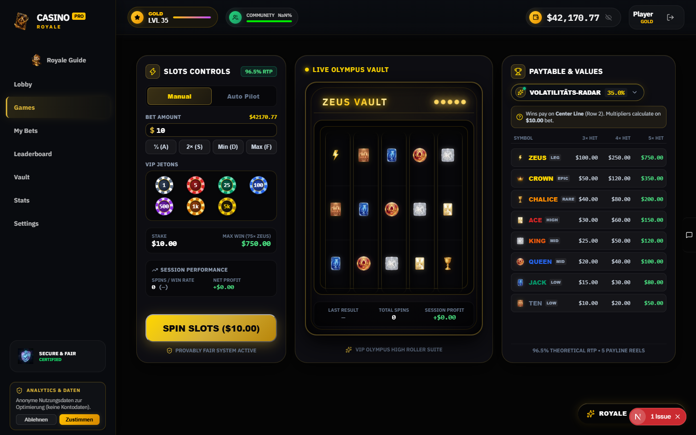

**Runtime-Inventar (Desktop):** 16 SVGs — Header-Chrome (7) + `Zap` (Sidebar/Spiel), `TrendingUp`, `Trophy`, `ChevronDown`, `CircleQuestionMark` (Hilfe/Paytable), `Sparkles`.

Crops:   

| Icon | Position/Placement | Code-Beleg | Größe/Farbe |
|---|---|---|---|
| `Zap` | Sidebar-Header-Badge (16px) | `SlotsControlSidebar.tsx:77` | #FFD700 |
| `Zap` (schwarz gefüllt) | Spin-Button „SPIN" | `SlotsCenterStage.tsx:229,233` | 20px |
| `Sparkles` | Idle-Zustand über den Reels | `SlotsCenterStage.tsx:351` | 13px, #D4AF37 |
| `Sliders` | „AUTO SPIN CONFIG"-Sektionskopf | `SlotsControlSidebar.tsx:360` | 13px, #94a3b8 |
| `RotateCcw` | Spin-Indicator (rotierend während Spin) | `SlotsControlSidebar.tsx:506` | 20px |
| `TrendingUp` | „SESSION PERFORMANCE" | `SlotsControlSidebar.tsx:421` | 13px, #94a3b8 |
| `ShieldCheck` | Provably-Fair-Badge (Sidebar-Footer) | `SlotsControlSidebar.tsx:532` | 13px, #D4AF37 |
| `Trophy` | Paytable-Panel Header (Jackpot-Symbol) | `SlotsPaytable.tsx:46` | 16px, #FFD700 |
| `HelpCircle` | Paytable-Hilfezeile | `SlotsPaytable.tsx:87` | 14px, #FFD700 |
| Custom-SVG (Slot-Symbole) | v2-Slot-Symbole als Inline-SVGs (8 Symbole) | `SlotSymbolV2.tsx:55-268` (nur v2-Komponente) | viewBox 64×64 |

Hinweis: `SlotCabinetV2.tsx` (Zap 32px, TrendingUp 14px) gehört zur Slots-v2-Variante und ist auf `/games/slots` nicht aktiv gerendert.

---

## 10 — Blackjack `/games/blackjack`

Full-Page: 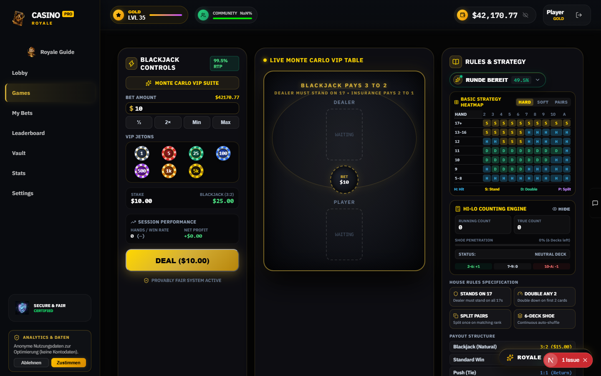

**Runtime-Inventar (Desktop):** 23 SVGs — Header-Chrome (7) + `Zap`, `Sparkles`, `TrendingUp`, `BookOpen` (Basic-Strategy/Guide), `ChevronDown`, `Table`, `Calculator`, `Eye`/`Shield`, `Gauge`, `Copy`, `Layers`, `Info`.

Crops:  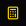 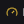 

Unicode-Glyphen im Spielinhalt (Karten, kein Chrome): `♦` (Kartenfarben) in `PlayingCardV2.tsx:30`, `PlayingCard.tsx:23`, `BlackjackCard3D.tsx:20`; `⚡` im Card-Counting-Banner `CardCountingPanel.tsx:191`.

| Icon | Position/Placement | Code-Beleg | Größe/Farbe |
|---|---|---|---|
| `Zap` | Sidebar-Header-Badge „TABLE CONTROLS" | `BlackjackLeftSidebar.tsx:63` | 16px, #FFD700 |
| `Sparkles` | Co-Pilot/Idle-Hinweis in der Sidebar | `BlackjackLeftSidebar.tsx:108` | 14px, #FFD700 |
| `TrendingUp` | „SESSION PERFORMANCE" | `BlackjackLeftSidebar.tsx:310` | 13px, #94a3b8 |
| `RotateCcw` | Deal-Indicator (rotierend während Deal) | `BlackjackLeftSidebar.tsx:384` | 18px |
| `ShieldCheck` | Provably-Fair-Badge (Sidebar-Footer) | `BlackjackLeftSidebar.tsx:407` | 13px, #D4AF37 |
| `Zap` (fill schwarz/weiß) | Win-Banner auf dem Tisch („BLACKJACK"/Win) | `BlackjackTable.tsx:127,143` | 16px |
| `PlusCircle` (blau) | Action-Button „Double Down" | `BlackjackActions.tsx:72` | 16px, #38bdf8 |
| `TrendingUp` (grün) | Action-Button „Split" | `BlackjackActions.tsx:124` | 16px, #34d399 |
| `Copy` (violett) | Action-Button „Repeat Bet" | `BlackjackActions.tsx:152` | 16px, #c084fc |
| `Shield` | Action-Button „Insurance" (Kontext) | `BlackjackActions.tsx` Import :5 | 16px |
| `Eye` | Card-Counting-Panel Toggle „Counting einblenden" | `CardCountingPanel.tsx:69` | 12px |
| `Calculator` | Card-Counting-Panel Header | `CardCountingPanel.tsx:43` | 14px, #FFD700 |
| `Table` | Strategy-Matrix-Panel Header | `StrategyMatrix.tsx:186` | 13px, #FFD700 |
| `BookOpen` | Rechte Rules-Sidebar Header „RULES & STRATEGY" | `BlackjackRightRules.tsx:57` | 16px, #FFD700 |
| `Shield` | Rules-Sektion „Dealer Rules" | `BlackjackRightRules.tsx:130` | 12px, #D4AF37 |
| `Copy` | Rules-Sektion „Deck-Penetration"/Kopierhinweis | `BlackjackRightRules.tsx:174` | 12px, #D4AF37 |
| `Layers` | Rules-Sektion „Decks" | `BlackjackRightRules.tsx:196` | 12px, #D4AF37 |
| `Gauge` | Rules-Sektion „House Edge" | `BlackjackRightRules.tsx:152` | 12px, #D4AF37 |
| `Info` | Rules-Sidebar Fußnote | `BlackjackRightRules.tsx:306` | 12px, #94a3b8 |
| `ShieldAlert` (22px gold) | Insurance-Modal Header | `InsuranceModal.tsx:63` | #FFD700 |
| `Check`/`X` | Insurance-Modal „Ja"/„Nein"-Buttons | `InsuranceModal.tsx:113,136` | 16px |
| Custom-SVGs | Kartenrücken + Table-Felt als Inline-SVG | `VintageCardBack.tsx:59`, `ClassicCasinoTableFelt.tsx:115` | — |

---

## 11 — Leaderboard `/leaderboard`

Full-Page: 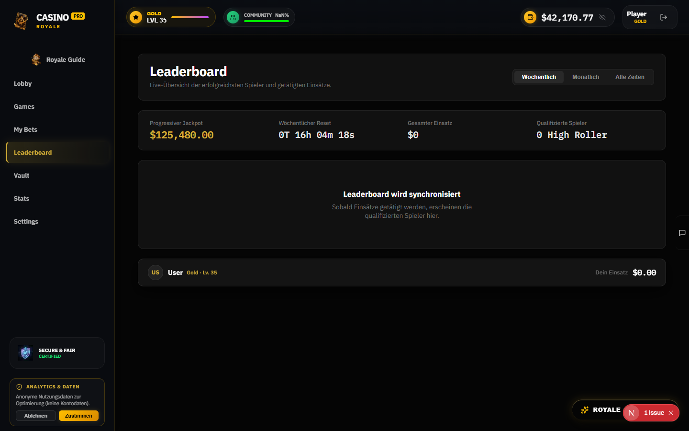

**Runtime-Inventar (Desktop):** 8 SVGs — fast nur Header-Chrome (`ShieldCheck`, `Star`, `Users`, `Wallet`, `EyeOff`, `LogOut`, `Sparkles` (Guide-Button), `MessageSquare` (Chat)). Die Seite selbst ist aktuell nahezu icon-frei.

| Icon/Element | Position/Placement | Code-Beleg | Größe/Farbe |
|---|---|---|---|
| Avatar-PNG (`/images/avatars/avatar-obsidian-01..06.png`, hash-basiert via `player-avatar.ts:1-8`) | Podest-Karten Platz 1-3 | `LeaderboardPodium.tsx:136` | 72px (P1) / 60px (P2-3) |
| Avatar-PNG | Pro Tabellenzeile | `LeaderboardStreamTable.tsx:268` | 44px |
| Avatar-PNG | Sticky Personal-Rank-Bar (floating Dock) | `PersonalRankBar.tsx:59` | 40px, Kreis |
| **keine Icons** | Rank-Badges sind reine Text-Badges („Platz 1 · Champion", Gold/Silber/Bronze-Farben) | `LeaderboardPodium.tsx:25-47` | #D4AF37/#E5E5E5/#D97706 |
| **keine Icons** | `LeaderboardWeeklyBanner` enthält kein Icon | — | — |

Nicht gerendert (toter Export): `LeaderboardHeroStats.tsx` existiert, wird von `page.tsx` nicht importiert.

---

## 12 — History `/history`

Full-Page: 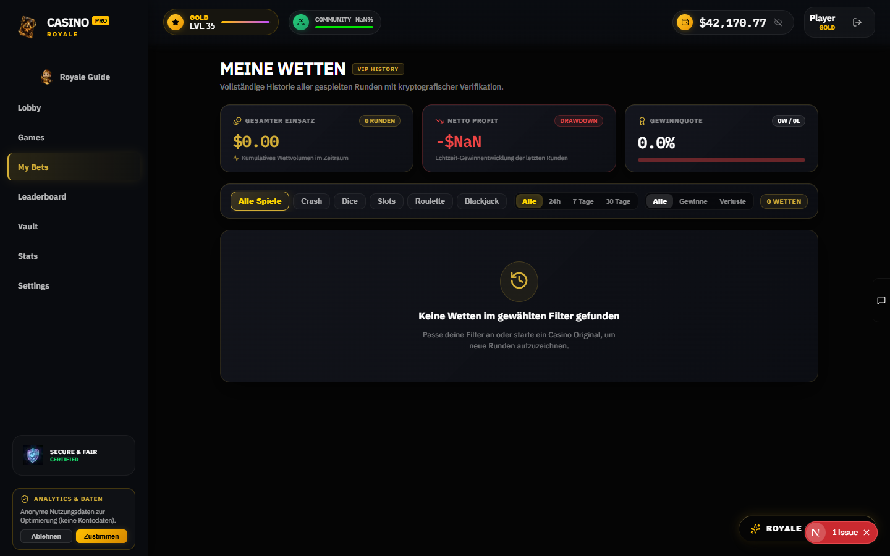

**Runtime-Inventar (Desktop):** 13 SVGs — Header-Chrome (7) + `Coins`, `Activity`, `TrendingDown`, `Award`, `RotateCcwClock`, `Sparkles`, `MessageSquare`.

Crops: 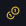 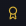  

| Icon | Position/Placement | Code-Beleg | Größe/Farbe |
|---|---|---|---|
| `Coins` | Stats-Tile „Gesamtwagered"-Label | `HistoryStatsCard.tsx:140` | 11/14px, #D4AF37 |
| `Activity` | Chart-Fußnote „Kumulatives Wettvolumen" | `HistoryStatsCard.tsx:199` | 11px, #D4AF37 |
| `TrendingUp` (grün) | Net-Profit-Tile bei Gewinn | `HistoryStatsCard.tsx:247` | #10b981 |
| `TrendingDown` (rot) | Net-Profit-Tile bei Verlust | `HistoryStatsCard.tsx:249` | #ef4444 |
| `Award` | Win-Rate-Tile-Label | `HistoryStatsCard.tsx:344` | 11/14px, #D4AF37 |
| Inline-SVG-Sparkline (120×32) | Mini-Liniendiagramm im Wagered-Tile | `HistoryStatsCard.tsx:53` | Chart, kein Icon |
| `Rocket` | Session-Gruppierung: Spiel-Icon Crash | `HistoryTableStream.tsx:57` | 12px, #D4AF37 |
| `Dices` | Spiel-Icon Dice | `HistoryTableStream.tsx:63` | 12px |
| `Sparkles` | Spiel-Icon Slots | `HistoryTableStream.tsx:69` | 12px |
| `RotateCcw` | Spiel-Icon Roulette | `HistoryTableStream.tsx:75` | 12px |
| `Gamepad2` | Spiel-Icon Blackjack + Fallback | `HistoryTableStream.tsx:81,87` | 12px |
| `History` | Empty-State (keine Wetten) | `HistoryTableStream.tsx:252` | 32px |
| `ChevronRight` | Session-Gruppe aufklappen (Desktop) | `HistoryTableStream.tsx:471` | 12px, #D4AF37 |
| `ShieldCheck` | „Quittung"-Button pro Zeile (mobil) | `HistoryTableStream.tsx:807` | 13px, #D4AF37 |
| `Receipt` | Bet-Receipt-Modal Header | `BetReceiptModal.tsx:146` | 20px |
| `X` | Bet-Receipt-Modal close | `BetReceiptModal.tsx:189` | 16px |
| `Copy` + `Check` | Copy-Buttons Bet-ID/Seed (+ Erfolgs-Feedback) | `BetReceiptModal.tsx:327,381` | 12px |
| `ShieldCheck` (grün) | Provably-Fair-Verifikationssektion im Modal | `BetReceiptModal.tsx:345` | 18px, #10b981 |
| `Sparkles` | „Prüfcode"-Copy-Button | `BetReceiptModal.tsx:386` | 12px |

`HistoryFilterBar.tsx` und Page-Header: keine Icons (nur Text-Filterchips + Text-Badge „VIP HISTORY", `history/page.tsx:193-207`).

---

## 13 — Stats `/stats`

Full-Page: 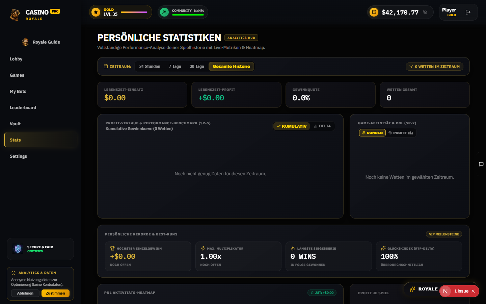

**Runtime-Inventar (Desktop):** 19 SVGs — Header-Chrome (7) + `Calendar` (Zeitfilter), `Funnel` (Filter), `TrendingUp`, `ChartNoAxesColumn`, `Layers`, `CircleDollarSign`, `Trophy`, `Zap`, `Flame`, `Sparkles`, `MessageSquare`.

Crops: 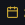 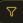 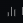 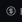

| Icon | Position/Placement | Code-Beleg | Größe/Farbe |
|---|---|---|---|
| `Calendar` | „ZEITRAUM:"-Label im 4-Stufen-Zeitfilter | `StatsTimeFilterBar.tsx:62` | 13px, #D4AF37 |
| `Filter` (runtime: `funnel`) | Count-Pill „N WETTEN IM ZEITRAUM" | `StatsTimeFilterBar.tsx:120` | 11px, #D4AF37 |
| `TrendingUp` | Chart-Toggle „KUMULATIV" | `ProfitHistoryChart.tsx:132` | 11px |
| `BarChart2` (runtime: `chart-no-axes-column`) | Chart-Toggle „DELTA" | `ProfitHistoryChart.tsx:151` | 11px |
| `Trophy` | „TOP: [Spiel]"-Badge im Donut-Header | `FavoriteGameCard.tsx:97` | 9px, #D4AF37 |
| `Layers` | Donut-Toggle „RUNDEN" | `FavoriteGameCard.tsx:130` | 10px |
| `CircleDollarSign` | Donut-Toggle „PROFIT ($)" | `FavoriteGameCard.tsx:150` | 10px |
| `Trophy` | Record-Karte „Höchster Einzelgewinn" | `VipPersonalRecords.tsx:19` | 14px, #D4AF37 |
| `Zap` | Record „Max. Multiplikator" | `VipPersonalRecords.tsx:28` | 14px, #D4AF37 |
| `Flame` | Record „Längste Siegesserie" | `VipPersonalRecords.tsx:35` | 14px, #D4AF37 |
| `Sparkles` | Record „Glücks-Index (RTP-Delta)" | `VipPersonalRecords.tsx:42` | 14px, #D4AF37 |
| `Flame` (grün/rot) | 28-Tage-Summe im PnL-Heatmap-Header | `PnlActivityHeatmap.tsx:75` | 10px, #10b981/#ef4444 |
| `CalendarDays` | Heatmap-Hover-Tooltip „Datum (N Runden)" | `PnlActivityHeatmap.tsx:209` | 11px |
| **keine Icons** | `StatsSummaryTiles` + `PerGameProfitBreakdown` (nur Recharts-Bars) | `PerGameProfitBreakdown.tsx:107` | — |

Fakten: Page-Header nur Text-Badge „ANALYTICS HUD" (`stats/page.tsx:172-186`). `gameMeta.ts:15-25` definiert Spiel-Icons (TrendingUp, RotateCcw, CircleDollarSign, Zap, Spade), die auf /stats aktuell **nicht gerendert** werden. Unrendered: `SessionLengthChart.tsx:79` (Unicode `≈`-Badge), `PerGameProfitBreakdown` ohne Icons.

---

## 14 — Vault `/vault`

Full-Page: 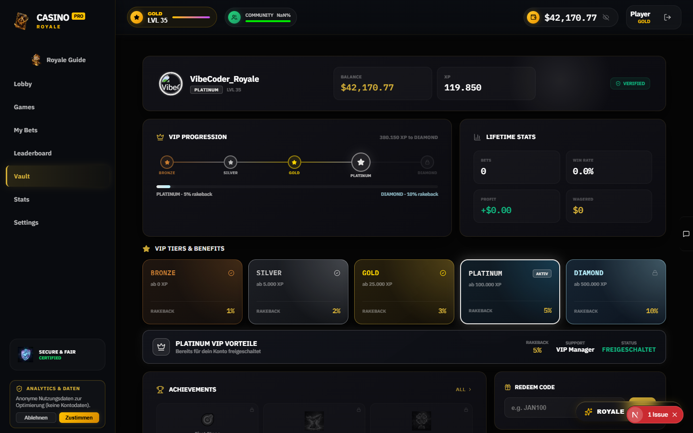

**Runtime-Inventar (Desktop):** 34 SVGs — Header-Chrome (7) + Custom-SVG (Voucher/Emblem), `Crown`, `Lock`, `ChartColumn`, `CircleCheck`, `Trophy`, `ChevronRight`, `Gift`, `Rocket`, `ArrowUpRight`, `Sparkles`, `MessageSquare`.

Crops:  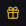   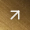

| Icon | Position/Placement | Code-Beleg | Größe/Farbe |
|---|---|---|---|
| Avatar-PNG | Profilbanner, 52px Kreis | `VaultProfileBanner.tsx:103` | `fill` |
| Custom-SVG-Fortschrittsring | Level-Progress-Ring um Avatar (2 `<circle>`) | `VaultProfileBanner.tsx:65-83` | Track rgba(255,255,255,0.04) |
| `ShieldCheck` (grün) | „VERIFIED"-Badge im Profilbanner | `VaultProfileBanner.tsx:249` | 11px, #10b981 |
| `Crown` | Sektionsheader „VIP Progression" | `VaultVipProgression.tsx:36` | 16px, #D4AF37 |
| `Star` (gefüllt) | Tier-Meilenstein (erreicht) in der Progression | `VaultVipProgression.tsx:97` | 16/11px, Tier-Farbe |
| `Lock` | Tier-Meilenstein (gesperrt) | `VaultVipProgression.tsx:99` | 10px, rgba(255,255,255,0.15) |
| `BarChart3` | Sektionsheader „Lifetime Stats" | `VaultLifetimeStats.tsx:15` | 16px, rgba(255,255,255,0.4) |
| `Star` | Sektionsheader „Tier Showcase" | `VaultTierShowcase.tsx:26` | 16px, #D4AF37 |
| `CheckCircle2` | Tier-Karte freigeschaltet | `VaultTierShowcase.tsx:147` | 13px, Tier-Farbe |
| `Lock` | Tier-Karte gesperrt | `VaultTierShowcase.tsx:149` | 12px, rgba(255,255,255,0.3) |
| `Crown` | Tier-Detail-Panel | `VaultTierShowcase.tsx:243` | 18px |
| `Trophy` | Sektionsheader „ACHIEVEMENTS" + Modal-Header | `VaultAchievements.tsx:158,228` | 16/20px, #D4AF37 |
| `Lock` | gesperrtes Achievement-Overlay | `VaultAchievements.tsx:117` | 9/10px |
| `CheckCircle2` | freigeschaltetes Achievement-Badge | `VaultAchievements.tsx:129` | 11/12px |
| `ChevronRight` | „ALL"-Filter-Button | `VaultAchievements.tsx:175` | 11px |
| `X` | Achievement-Modal close | `VaultAchievements.tsx:256` | 16px |
| Achievement-3D-PNGs (9 Stück) | Achievement-Icon-Kacheln, gesperrt = grayscale-Filter | `achievements-config.ts:60-168`, gerendert `VaultAchievements.tsx:50-56` | 40/44px |
| Unicode `🔒` (Emoji) | „MYSTERY ACHIEVEMENT" (secret, locked) — einziger Emoji-Fund im Nutzerbereich | `achievement-presentation.ts:13`, gerendert `VaultAchievements.tsx:57-59` | Text |
| `Gift` | Header „REDEEM CODE" (Voucher JAN100) | `VaultRedeemCard.tsx:25` | 14px, #D4AF37 |
| `Rocket` | „Play Now"-CTA Icon-Box | `VaultQuickPlayCta.tsx:47` | 18px, #D4AF37 |
| `ArrowUpRight` | „extern/forward"-Indikator rechts im CTA | `VaultQuickPlayCta.tsx:72` | 18px, rgba(255,255,255,0.85) |

Achievement-PNG-Liste: `/images/ach-target-3d.png`, `ach-whale-3d.png`, `ach-clover-3d.png`, `ach-jackpot-chest-3d.png`, `ach-star-3d.png`, `ach-crown-3d.png`, `ach-rocket-3d.png`, `ach-flame-3d.png`, `ach-dice-seven-3d.png` (`achievements-config.ts:60-168`).

---

## 15 — Auth-Seiten `/sign-in`, `/sign-up`, `/auth/reset-password`

Full-Page: 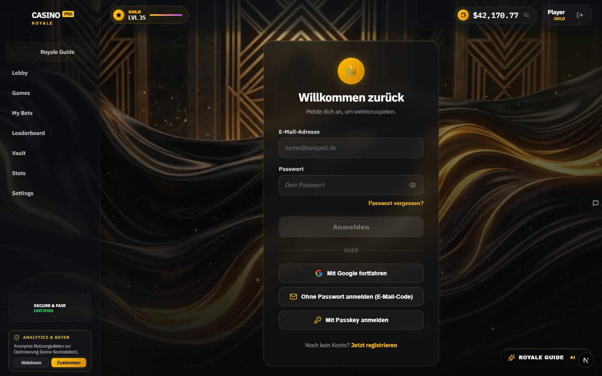 · 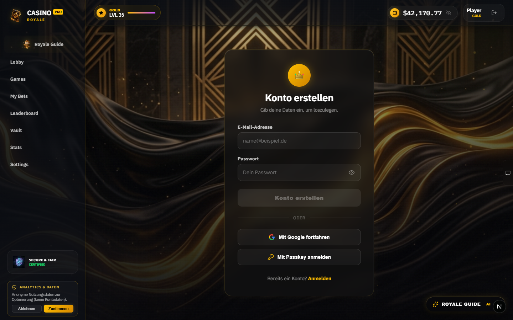

Hinweis: Die Shell (Sidebar/Header) rendert auch auf Auth-Seiten; deshalb erscheinen hier dieselben Chrome-Icons. Reset-Password leitet ohne gültige Recovery-Session auf `/sign-in` weiter (Screenshot `15_reset_password.png` zeigt daher Sign-in).

| Icon | Position/Placement | Code-Beleg | Crop |
|---|---|---|---|
| CrownEmblem (Inline-SVG, 34×34, Gold-Gradient + 3 Akzent-Kreise) | Auth-Card-Header-Badge (64×64 Gold-Badge mit Glow) über dem Formular | `AuthBrandMarks.tsx:33-71`, gerendert `AuthCardHeader.tsx:25`; Duplikat in `reset-password/page.tsx:14-52` |  |
| GoogleLogo (Inline-SVG, 18×18, offizielle 4 Farben) | Google-Button „SIGN UP WITH GOOGLE" | `AuthBrandMarks.tsx:2-29`, gerendert `StandardAuthView.tsx:212` | — |
| `Eye`/`EyeOff` | Password-Feld, rechts im Feld — Sichtbarkeits-Toggle | `AuthField.tsx:120`, 18px |  |
| `Mail` | Button „Magic Link senden" | `StandardAuthView.tsx:252`, 18px |  |
| `KeyRound` | Button „Mit Passkey anmelden" / „Passwort speichern & weiter" | `StandardAuthView.tsx:292` / `reset-password/page.tsx:412`, 18px |  |
| `ShieldCheck`/`ShieldAlert` | PasswordStrengthMeter-Indikator (Score ≥3 / <3) | `PasswordStrengthMeter.tsx:94`, 13px, Farbe = Stärke (#ff3366→#00e676) | — |
| `ShieldAlert` (gelb #ffc107) | Cooldown-Warnbanner (Brute-Force-Lockout) | `AuthStatusBanner.tsx:27`, 20px | — |
| `Loader2` | Submit-Button-Spinner (alle Formulare, `animate-spin`) | `StandardAuthView.tsx:148` u.a., 20px | — |
| `ArrowLeft` | „Zurück zur Anmeldung"-Links (Magic-Link/Reset-Flow) | `MagicLinkView.tsx:174`, `ForgotPasswordView.tsx:141`, 16px | — |
| `CheckCircle2` | Erfolgs-Alerts („E-Mail gesendet", „Passwort geändert") | `ForgotPasswordView.tsx:42` (32px #00e676), `reset-password/page.tsx:204` (36px) | — |
| `AlertCircle` | Fehler-Alert (ungültiger Recovery-Link) | `reset-password/page.tsx:224`, 32px, #ff3366 | — |

Bewusst ohne Icons: „Passwort vergessen?"-Link, ODER-Divider, OTP-Eingabefelder, Footer-Wechsel-Links. Submit-Buttons im Idle-Zustand haben (außer Reset) kein Icon.

---

## 16 — Querschnitt: Icon-Frequenz & Systeme

**Lucide-Icons nach Vorkommen über alle Seiten (Runtime + Code):**

| Frequenz | Icons |
|---|---|
| Überall (Chrome) | `ShieldCheck`, `Star`, `Users`, `Wallet`, `Eye`/`EyeOff`, `LogOut`, `MessageSquare`, `Sparkles` (Guide-Button) |
| Sehr häufig (≥5 Kontexte) | `Zap` (Buttons, HUD, Header-Badges), `Trophy` (Wins, Jackpot, Turnier), `Crown` (VIP, Jackpot, Ticker), `Flame` (Hot, Streak, Ticker), `TrendingUp` (Performance, RTP), `Play`, `ChevronRight` |
| Gelegentlich | `Trophy`, `Timer`, `Coins`, `Activity`, `RotateCcw`, `Layers`, `Rocket`, `Gamepad2`, `User`, `Sliders`, `Info`, `Trash2`, `Undo2`, `Percent`, `ArrowUpRight`, `ArrowDownRight`, `Gem` (nur Mobile-Lobby-Jackpot) |
| Selten (1-2 Kontexte) | `Radio`, `Bell`, `Gift`, `Lock`, `ChartColumn`, `CircleDollarSign`, `Funnel`, `Calendar`, `Award`, `BookOpen`, `Calculator`, `Gauge`, `Table`, `Copy`, `Compass`, `Spade`, `Dice6`, `Search`, `Mail`, `KeyRound`, `Mic`, `Send`, `Image`, `ThumbsUp/Down`, `History`, `CheckCheck`, `Info` |

**Nicht-Lucide-Icon-Systeme (für Ersatz relevant):**

| System | Beispiele | Ort |
|---|---|---|
| PNG-Embleme | `brand-medallion-3d.png`, `trust-shield-3d.png`, `system-bot-3d.png`, `vip-*-3d.png` (5 Tier), `royale-guide-thinking.png`, `crash/quantum-interceptor.png`, `crash-rocket.svg` | Sidebar, VIP-Roadmap, Crash-Canvas, Chat |
| Inline-SVG Custom | CrownEmblem (Auth, 2× dupliziert), GoogleLogo, Roulette-Rad | Auth, Roulette |
| Unicode-Text-Glyphen | `½`, `2×`, `∞` (Dice/Crash Quick-Chips), `✓` (Cashout), `×` (Milestone/Multiplikator), `♦` (Blackjack-Karten), `⚡` (Card-Counting), `••••••` (Balance-Maske), `ESC`/`↵`/`↑↓` (CommandPalette) | Spiele-Sidebars, Blackjack |
| CSS-Formen | Puls-Dots (LIVE), Toggle-Knobs, Ergebnis-Marker-Dreieck (Dice), Konfetti (BigWin), Status-Dots | Feed, Sidebars, Dice |

**Duplikat-Befund:** CrownEmblem existiert 2× im Code (`AuthBrandMarks.tsx:33` + `reset-password/page.tsx:14` mit identischer Geometrie) — bei einem Ersatz beide Stellen ziehen.

**Dead-Export-Befund:** `GlobalLeaderboard.tsx` (enthält `Medal`-Icon) wird von keiner Page/ Komponente importiert — vor Ersatz prüfen, ob löschen statt ersetzen.

**Nicht auditierter Lucide-Bedarf (bewusst out of Scope):** Admin-Bereich (`Edit`, `FlaskConical`, `Radar`, `Tag`, `Ticket`, `AlertTriangle`, `Plus`), Bare-Sandboxes `/v2` (`Cherry`, `Dice5`, `Disc3`, `MessageCircle` in `V2GameTabs.tsx`/`V2Header.tsx`) und `/testing` (`Code2`, `DollarSign`, `Monitor`, `Smartphone`, `SlidersHorizontal`). Bei einem globalen Icon-Restyle später mitziehen.

---

## 17 — Offene Punkte & Nächste Schritte

**Offene Punkte:**
1. Der Arbeitsbaum hat einen realen Build-Blocker: `GuideVoiceVisualizer.tsx:5-8` importiert nicht existierende Exporte aus `src/lib/casino/voice-audio.ts` (fremde unversionierte Änderung, gehört nicht zu diesem Plan). Vor jeder weiteren Frontend-Arbeit klären.
2. Bedingt sichtbare Zustände (BigWinOverlay, Toasts, Guide-Panel offen, CommandPalette, Onboarding) sind code-inventarisiert, aber nicht je gescreenshotet — bei der Ersatzplanung ggf. einzeln triggern.
3. Die 3D-PNG-Embleme (VIP-Tiere, Medallion, Trust-Shield) sind vom Lucide-Stil unabhängig — Separat-Entscheidung nötig, ob sie ebenfalls als „verspielt" gelten.
4. Mobile-Nav `User`-Icon: Desktop-Crop vorhanden, Mobile-Crop fehlte (Nav-Button nicht ansprechbar) — Icon selbst ist per Code belegt (`MobileNav.tsx:20`).

**Nächste Schritte (Vorschlag, noch nicht freigegeben):**
- Jan sichtet Screenshots/Crops und markiert die Icon-Klassen, die weg sollen/replacer werden.
- Danach: Entfernungs-/Ersatzplan (Ebene 2) mit Meilensteinen je Seiten-Cluster aus dieser Datei ableiten.

---

## Verifikation dieser Analyse

- Runtime: alle 16 Screenshots existieren unter `icon-audit/pages/`, 200 Crops unter `icon-audit/crops/` (Stand 2026-09-06).
- Code: 8 Explorer-Berichte mit `Datei:Zeile`-Belegen; keine Schreibzugriffe, keine Migrationen, kein Money-Pfad berührt.
- Self-Check 2026-09-06: alle 78 im Markdown eingebetteten Bildreferenzen gegen das Dateisystem verifiziert (keine toten Links; 2 Code-Span-Platzhalter in der Methodik-Tabelle sind keine Einbettungen).

---

## 18 — Konsolidierungs-Analyse: Ähnliche Icons, Doppelungen & Vereinheitlichungspotenzial

> **Status:** Analytischer Anhang (kein Code-Change) · **Ziel:** zeigen, wo dasselbe Symbol heute in mehreren Ausführungen existiert und wie man es zu einem einheitlichen Satz konsolidiert — zentral definiert, einmal erstellt, überall eingebunden.
> **Spalte „Mein Ersatz-Bild":** reserviert für Jans eigene Bildentwürfe — sobald ein Bild erstellt ist, wird es hier eingebettet; ohne Bild bleibt die Zelle leer. Direkter Vergleich: Ersatz-Entwurf ↔ Status Quo in derselben Zeile.
> **Spalte „Status":** Lebenszyklus-Stand der Planungsdatei nach `xx_sop/03_workflow_jan_planungsdateien.md` (`Geplant` → `Execution-Ready` → `In Execution` → `Executed`); „—" heißt: noch keine Planungsdatei vorhanden.
> **Spalte „Ergebnis":** Direkt eingebettetes, tatsächlich generiertes `gpt-image-2`-Asset (L0 der jeweiligen Planungsdatei) — zur direkten Sichtprüfung durch Jan, unabhängig vom Code-Integrationsstand; „—" heißt: noch kein Asset generiert.
> **Spalte „Planungsdatei":** Link auf die Umsetzungsplanung in `public/images/`, sobald für diese Zeile eine Konsolidierung angestoßen wurde (Option-Gate + Bild-/Migrationsplan); „—" heißt: noch nicht begonnen. Umgesetzt bislang: alle 6 Zeilen aus 18.3 (`Sparkles` bis `ShieldCheck`).

### 18.1 Methode

- Ergänzend zu §1–17: statische Zählung aller JSX-Render-Stellen (`<Icon …`) pro Icon über `src/**.tsx` (Stand 2026-09-06, `grep -c`), um die Analyse nicht nur auf die 16 audit Seiten, sondern auf den ganzen Arbeitsbaum zu stützen.
- Drei Blickrichtungen: **A)** gleiche Bedeutung → unterschiedliches Icon (Inkonsistenz), **B)** gleiches Icon → unterschiedliche Bedeutung (Überladung), **C)** Custom-SVG/PNG vs. Lucide-Doppelung.

### 18.2 Befund A — gleiche Bedeutung, unterschiedliche Ausführung (Konsolidierungskandidaten)

| Semantik | Heute verwendet (Icon → Stellen) | Inkonsistenz | Konsolidierungsvorschlag | Status | Ergebnis | Planungsdatei | Mein Ersatz-Bild (hier einfügen) | Status Quo (aktuelle Optik) | Vorher / Nachher (Optik) |
| --- | --- | --- | --- | --- | --- | --- | --- | --- | --- |
|  **Reset / Re-Roll / Retry** |  `RotateCcw` ×10 (Roulette-, Slots-, Blackjack-Sidebar, `/games`-Karten, CommandPalette) vs. `RefreshCw` ×12 (Dice-CenterStage V1+V2, ProvablyFairTool/Modal, GameErrorBoundary, Admin) |  Zwei konkurrierende Reset-Icons im selben Produkt; Roulette/Slots/Blackjack ≠ Dice |  EIN Icon für „Neu/Rollback" (z. B. `RotateCcw`), `RefreshCw` nur für Daten-Refresh — oder beide unter einem semantischen Namen abbilden | 🟢 **Executed** (2026-09-08) · [Plan](18_2_1_reset_retry_semantik_plan.md) | **Dice-Toggle nach Migration** (`DiceCenterStageV2.tsx:344`, live `/dice`): 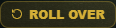 · `Disc3` in Wett-Historie: code-verifiziert (`HistoryTableStream.tsx:75`), bei 0 Wetten kein sichtbarer Render | [Ja](18_2_1_reset_retry_semantik_plan.md) |  `RotateCcw`:  · `RefreshCw`:  | **Vorher** (Dice-Toggle, `RefreshCw`):  · **Nachher** (live `/dice`):  |
|  **Einstellungen / Controls** |  `Sliders` ×10 (alle 5 Spiel-Sidebars, SettingsPopover/Modal, Guide) vs. `SlidersHorizontal` ×1 (nur `/testing`) |  Fast konsolidiert — `SlidersHorizontal` nur Sandbox-Rest |  `Sliders` als einziger Standard; `SlidersHorizontal` streichen | 🟢 **Executed** (2026-09-08) · [Plan](18_2_2_sliders_controls_plan.md) | **`/testing/7.2`-Sektionskopf nach Migration** (letzter `SlidersHorizontal`-Rest, jetzt `Sliders`):  — Grep `SlidersHorizontal` in `src/`: 0 Treffer | [Ja](18_2_2_sliders_controls_plan.md) |  `Sliders`:  · `SlidersHorizontal`: kein Crop (nur Sandbox) | **Vorher** (`Sliders`-Standard, unverändert):  · **Nachher** (live `/testing/7.2`):  |
|  **Guthaben / Geld** |  `Wallet` ×10 (Header, Chrome, Guide) vs. `Coins` ×3 (History, Hero, Admin) vs. `CircleDollarSign` ×1 (Stats) vs. `Gem` ×1 (Mobile-Lobby-Jackpot) |  4 verschiedene Geld-Symbole je nach Kontext |  `Wallet` = Kontext „Konto", `Coins` nur in Jackpot/Rewards-Kontext festlegen — 2 Bedeutungen statt 4 Icons | 🟢 **Executed** (2026-09-08) · [Plan](18_2_3_guthaben_geld_plan.md) | **`/stats`-Profit-Toggle nach Migration** (`FavoriteGameCard.tsx:150`, `CircleDollarSign`→`Coins`):  — `Gem` korrigiert: kein Live-Vorkommen (nur `/v2`+`/testing`); Neubefund: 2 `CircleDollarSign`-Feld-Präfixe in `WalletModal` (Jan-Entscheidung offen) | [Ja](18_2_3_guthaben_geld_plan.md) |  `Wallet`:  · `Coins`:  · `CircleDollarSign`:  · `Gem`:  | **Vorher** (`CircleDollarSign` in Stats):  · **Nachher** (live `/stats`):  |
|  **Bestätigt / Erfolgreich** |  `CheckCircle2` ×29 vs. `Check` ×11 vs. `CheckCheck` ×1 (NotificationCenter) vs. Unicode `✓` (Crash-Cashout) |  Vier Ausführungen derselben Aussage |  `CheckCircle2` = Status-Badge, `Check` = Inline/Liste, `CheckCheck` streichen oder nur „gelesen" | 🟢 **Executed** (2026-09-08) · [Plan](18_2_4_bestaetigt_erfolgreich_plan.md) | **Vault-Tier-Badge** (`CheckCircle2`, Regelbeispiel Badge):  — Vollinventur: 16 Badge- + 9 Inline-Stellen alle regelkonform, einziger Change: `CheckCheck`→`Check` (`NotificationCenter.tsx:195`, Button nur bei unread > 0 sichtbar, code-verifiziert) | [Ja](18_2_4_bestaetigt_erfolgreich_plan.md) |  `CheckCircle2`:  · `Check`/`CheckCheck`/`✓`: kein Crop (Overlays: Guide-Panel, NotificationCenter, Crash-Cashout) | **Vorher** (Badge-Konvention, unverändert):  · **Nachher** (live `/vault`):  |
|  **Info / Hilfe** |  `Info` ×10 (Blackjack-Rules, Guide, Sidebars) vs. `HelpCircle` ×2 (SlotsPaytable, GameCoPilotHud) |  Zwei Fragezeichen-Familien |  `Info` als Standard, `HelpCircle` nur wenn klickbarer Hilfe-Link | 🟢 **Executed** (2026-09-08, revidiert) · [Plan](18_2_5_info_hilfe_plan.md) | Plan revidiert (Option-A-Prämisse widerlegt): 3 Abweichungsstellen migriert — klickbare Tutorial-Buttons `CrashControlSidebar.tsx:122` + `CrashMultiplayerControlSidebar.tsx:120` → `HelpCircle`, statische Payline-Pill `SlotsPaytable.tsx:87` → `Info`. Code-verifiziert (Typecheck + Grep); `/crash`+`/slots` middleware-gated, ohne Demo-Credentials kein Screenshot | [Ja](18_2_5_info_hilfe_plan.md) |  `Info`:  · `HelpCircle`:  | **Vorher** (statische Pill, `Info`):  · **Nachher**: — (`/crash`+`/slots` auth-gated, code-verifiziert; Nachher-Optik = [Vorschlags-Crop](icon-audit/crops/07_slots/circle-question-mark.png)) |
|  **Zufall / Spiel-Symbolik** |  `Dice6` (CommandPalette) + `Dices` (Historie, Guide) + `RotateCcw` (Games-Lobby-Badge, Stats-Meta — fälschlich, ein Reset-Icon) + `Dice5`/`Disc3` (`/v2`, out of Scope) |  Bei Verifikation korrigiert: keine Dice5/Disc3-Kollision (reine Sandbox), sondern echte Games-Lobby/Stats-Inkonsistenz mit einem Reset-Icon als Dice-Badge |  `Dices` als alleinige Dice-Identität der Haupt-App (Mehrheit bereits korrekt) | 🟢 **Executed** (2026-09-08) · [Plan](18_2_6_zufall_spiel_symbolik_plan.md) | **CommandPalette „Play Dice" nach Migration** (`CommandPalette.tsx:34`, `Dice6`→`Dices`):  — zusätzlich migriert: `config.ts:43` + `gameMeta.ts:16` (`RotateCcw`→`Dices`); Dice-Karte `/games`:  | [Ja](18_2_6_zufall_spiel_symbolik_plan.md) |  `Dice6`/`Dice5`/`Disc3`: kein Crop (CommandPalette-Overlay + `/v2`-Sandbox) · `½`/`2×`: sichtbar in  (Quick-Chips, Sidebar) | **Vorher** (`RotateCcw`-Badge in `/games`-Karte):  · **Nachher** (live `/games` + CommandPalette):  ·  |
|  **Ton an/aus** |  `Volume2` ×14 / `VolumeX` ×9 |  Konsistent als Paar — aber an 20+ Stellen einzeln eingebunden |  Bereits korrekt, keine Änderung nötig (verifiziert 2026-09-07: 2 echte Toggle-Paare + 3 legitime Solo-Verwendungen ohne Kollision, siehe [18_2_7]) — Primitive-Migration (18.5) bleibt separates, hier nicht gestartetes Vorhaben | 🟢 **Executed** (2026-09-07) · [Plan](18_2_7_ton_an_aus_plan.md) | **Sound-Toggle im Settings-Popover** (`SettingsPopover.tsx:125,127`), beide Zustände live `/dice`: On (`Volume2`):  · Off (`VolumeX`):  | [Ja](18_2_7_ton_an_aus_plan.md) |  Kein Crop (Settings-Popover, nur geöffnet sichtbar) — Paar-Optik identisch zu `Eye`/`EyeOff` unten | **Vorher = Nachher** (bewusste Nicht-Änderung, live `/dice`): On:  · Off:  |
|  **Sichtbar/Verbergen** |  `Eye` ×9 / `EyeOff` ×8 (+ `••••••`-Maske als Text) |  Bei Verifikation korrigiert: kein reines Einbindungs-Problem, sondern 2 widersprüchliche Icon-Paradigmen (Aktions- vs. Zustands-Icon) für denselben `hideBalance`-State an 2 von 9 Stellen |  Alle Stellen auf Aktions-Icon-Paradigma (Mehrheitskonvention) vereinheitlichen | 🟢 **Executed** (2026-09-08) · [Plan](18_2_8_sichtbar_verbergen_plan.md) | **Hide-Balance-Toggle im Settings-Popover nach Ternary-Tausch** (`SettingsPopover.tsx:233-237`), beide Zustände live `/dice`: Off (`EyeOff` = Aktion „verbergen"):  · On (`Eye` = Aktion „zeigen"):  — zusätzlich `CardCountingPanel.tsx:69` dynamisiert (code-verifiziert, `/blackjack` middleware-gated) | [Ja](18_2_8_sichtbar_verbergen_plan.md) |  `Eye`:  · `EyeOff`:  · `••••••`-Maske: sichtbar in  (Header-Balance) | **Vorher** (invertierter Zustands-Ternary — Icon-Crops identisch, Zuordnung vertauscht): `Eye`:  · `EyeOff`:  · **Nachher** (live `/dice`, Popover): Off:  · On:  |

### 18.3 Befund B — gleiches Icon, unterschiedliche Bedeutung (Überladung → Eindeutigkeit gewinnen)

| Icon | Stellen | Bedeutungen heute | Risiko | Konsolidierungsvorschlag | Status | Ergebnis | Planungsdatei | Mein Ersatz-Bild (hier einfügen) | Status Quo (aktuelle Optik) | Vorher / Nachher (Optik) |
| --- | --- | --- | --- | --- | --- | --- | --- | --- | --- | --- |
|  `Sparkles` |  35 |  AI/Guide, Bonus, „NEU"-Badge, Premium, Sandbox-Heroes (Masse in `/testing`) |  Meaning-Creep; „KI" nicht mehr vom „Bonus" unterscheidbar |  Semantik festlegen: `Sparkles` = AI/Guide exklusiv; Bonus/NEU → anderes Token | 🟢 **Executed** (2026-09-08) · [Plan](../public/images/27_sparkles_icon_konsolidierung_plan.md) | **Live migriert** (12 Dateien, 17 Render-Stellen): Floating-Guide-Button:  · Jackpot-Karte:  · Ticker:  · Glücks-Index:  · Guide-Panel:  — Reassignments: Slots-History → `Cherry`, Prüfcode → `Copy`, LIVE STATUS → `Activity`; Rest nur `/testing` + Admin | [Ja](../public/images/27_sparkles_icon_konsolidierung_plan.md) |  Guide-Button:  · Dice-Sidebar-Variante:  | **Vorher** (generisches `Sparkles` im Guide-Button):  · **Nachher** (live `/`, AI-Guide-Emblem):  |
|  `Zap` |  32 |  Bet-Button, HUD-Badges, „INSTANT PAY", Card-Counting (`⚡`-Text daneben), Jackpot-Ticker |  Überladen wie `Sparkles` |  `Zap` = „Wette/Speed" reservieren; INSTANT-Claims über gemeinsames Primitive | 🟢 **Executed** (2026-09-08) · [Plan](../public/images/28_zap_icon_konsolidierung_plan.md) | **Live migriert** (19 Dateien, 25 Render-Stellen): Sidebar-Badge (5 Spiele, 6 Stellen):  ·  ·  ·  ·  · Hero-CTA „BONUS AKTIVIEREN":  — Entfernt: SPIN-Button, Blackjack-Win-Banner, INSTANT-Claims (`HeroHeadlineColumn`, `OnboardingFlow`, `WalletModal`); Reassignments: Auto Mode → `Repeat`, Sound → `Volume2`, Slots-Icon → `Cherry`, Stats → `TrendingUp`/`Timer`/`Coins`; Rest nur `/v2` + `/testing` + Admin | [Ja](../public/images/28_zap_icon_konsolidierung_plan.md) |  Bet-Button:  · Dice-Sidebar-Variante:  | **Vorher** (Dice-Sidebar-Badge, generisches `Zap`):  · **Nachher** (live `/games/dice`, HUD-Sidebar-Badge):  |
|  `Trophy` |  22 |  Win-Toast, Jackpot-Section, Turnier, Achievements, Leaderboard-Nav, Feed-High-Roller, Stats-Records |  Ein Symbol für 7 Kontexte — Jan's „kinderhaft"-Eindruck sammelt sich hier |  Kontext-Tokens: `trophy-win`, `trophy-tournament`, `trophy-record` (gleiche Glyph, zentrale Größe/Farbe) | 🟢 **Executed** (2026-09-08) · [Plan](../public/images/29_trophy_icon_konsolidierung_plan.md) | **Live migriert** (16 Dateien, 19 Render-Stellen): Win-Kontexte (Toast/Feed/BigWin/Paytable/Notification): `trophy-win` · Turnier-Header: `trophy-tournament` · Records/Mobile-Nav/Favorite/Rank: `trophy-record` — Screenshots: Stats-Records:  · Top-Spiel-Badge:  · Mobile-Nav 390px:  — Entdoppelt: `VaultAchievements`-Header ×2 entfernt; Ausnahme: `MainLayout`-Nav-Icon (Test-Vertrag `MainSidebar.test.ts`); Rest nur `/v2` + `/testing` | [Ja](../public/images/29_trophy_icon_konsolidierung_plan.md) |  Jackpot/Kontext-Header:  · Stats-Records:  · Mobile-Nav:  | **Vorher** (Mobile-Nav 390px, generisches `Trophy`):  · **Nachher** (live 390px, `trophy-record`):  · Stats-Records:  |
|  `Crown` |  14 |  VIP-Progression, Jackpot-Hero, Tier-Showcase, Guide-Quick-Action, Highroller-Ticker, Level |  Überschneidet sich mit `CrownEmblem`-Custom-SVG (§18.4) und `Medal` (Dead-Export) |  Crown = VIP exklusiv; Jackpot-Hero → eigener Token | 🟢 **Executed** (2026-09-08) · [Plan](../public/images/30_crown_icon_konsolidierung_plan.md) | **Live migriert** (14 Dateien, 20 Render-Stellen): VIP-Kontexte → `crown-vip` (Vault-Progression, Tier-Showcase, Teaser-Header, Guide-Quick-Action, Level ≥ 100):  · Jackpot-/Highroller-Kontexte → `crown-jackpot` (Jackpot-Pulse, Ticker whale, PLATZ 1, Podium, Blackjack-Sim):  — Scope-Notiz: `GuideMessageList`→`crown-vip` (Rank-Benefits-Semantik); Dead-Path `GlobalLeaderboard:118` trotzdem migriert; Rest nur `/v2` + `/testing` + Admin | [Ja](../public/images/30_crown_icon_konsolidierung_plan.md) |  VIP-Progression:  · Lobby-Header:  | **Vorher** (VIP-Progression, generisches `Crown`):  · **Nachher** (live `/vault`, `crown-vip`):  · Jackpot-Karte (live `/`, `crown-jackpot`):  |
|  `Star` |  13 |  Level-Badge (Header), Spiel-Rating (`/games`), Tier-Meilensteine, BigWin-Konfetti |  Rating vs. Level vs. Deko |  `Star` = Level/Rating-Tokens; Deko-Star im BigWinOverlay separat bewerten | 🟢 **Executed** (2026-09-08) · [Plan](../public/images/31_star_icon_konsolidierung_plan.md) | **Live migriert** (11 Dateien, 13 Render-Stellen): Level-/Rank-Kontexte → `star-level` (Header-Badge Desktop+Mobile, Vault-Tier-Meilensteine, Tier-Showcase-Header, LevelProgress, PlayerProfile-, RankBenefits-Modal — farbcodierte Stellen per CSS-Mask):  ·  · Rating-Kontexte → `star-rating` (ElevatedGameCard, HeroHeadlineColumn, games-2 Spotlight/BentoTile):  — Bewusst NICHT migriert: BigWin-Konfetti (Plan-Scope) + grüne Trustpilot-Sterne `HeroSection/V2` (Brand-Farbe, Dead-Path); §7-Asset-Regenerierung wartet weiter auf Jans Freigabe | [Ja](../public/images/31_star_icon_konsolidierung_plan.md) |  Level-Badge Header:  · Spiel-Rating `/games`:  · Mobile:  | **Vorher** (Level-Badge Header, generisches `Star`):  · **Nachher** (live `/dice`, `star-level` im Gold-Badge):  · Rating (live `/games`):  |
|  `ShieldCheck` |  37 |  VERIFIED-Badge, Provably Fair, Consent, Trust-Shield-Ersatz, Passwort-Stärke |  Häufigstes Icon der Seite; visuell der größte „Kinderhaft"-Treiber neben `Zap` |  EIN Security-Token mit fester Größe/Farbe; alle 37 Stellen über Primitive | 🟢 **Executed** (2026-09-08) · [Plan](../public/images/32_shieldcheck_icon_konsolidierung_plan.md) | **Live migriert** (18 Dateien, 20 Render-Stellen, Glyph vereinheitlicht): Sidebar-Footer (6 Spiele):  · Vault-VERIFIED:  · Passwort-Meter:  — Farblogik je Stelle erhalten (Gold-Asset direkt bzw. CSS-Mask bei Emerald/Score-Zuständen); `ShieldAlert` (Score <3) bleibt Lucide; Rest nur `/v2` + `/testing` + Admin + `trust-shield-3d.png` (Stil-Referenz) | [Ja](../public/images/32_shieldcheck_icon_konsolidierung_plan.md) |  `/games`-Karte:  · Vault VERIFIED:  · Dice-Sidebar:  | **Vorher** (Vault-VERIFIED, generisches `ShieldCheck`):  · **Nachher** (live `/vault`):  · Dice-Footer (live `/dice`):  |

### 18.4 Befund C — Custom-SVG / PNG vs. Lucide-Doppelung

| Custom-Element | Ort | Lucide-Pendant | Entscheidung nötig | Status | Ergebnis | Planungsdatei | Mein Ersatz-Bild (hier einfügen) | Status Quo (aktuelle Optik) | Vorher / Nachher (Optik) |
| --- | --- | --- | --- | --- | --- | --- | --- | --- | --- |
|  `CrownEmblem` (Inline-SVG, 2× dupliziert) |  `AuthBrandMarks.tsx:33`, `reset-password/page.tsx:14` |  `Crown` ×14 |  Entweder Emblem als EIN zentrales SVG-Komponent + Lucide-Crown für UI, oder ganz auf Lucide — nicht beide parallel ohne Regel | 🟢 **Executed** (2026-09-08) · Option D | **Live migriert** (3 Dateien): Beide Inline-SVG-Stellen (Sign-in/Sign-up-Header + Reset-Password-Duplikat) durch `SealEmblem` (next/image, Wiederverwertung `seal-casino-royale-quantum-gold.png`) ersetzt — Sign-in-Header:  — Reset-Password-Header redirectet ohne Recovery-Session fail-closed nach `/sign-in` (visuelle Verifikation über Code-Identität + Flow-Tests); Größe 56×56 (statt 34×34) damit das Siegel erkennbar bleibt — Einordnung im [Plan](18_4_1_crownemblem_auth_brand_reuse_plan.md) §3/L0 | [Ja](18_4_1_crownemblem_auth_brand_reuse_plan.md) |  Sign-in:  · Reset-Password:  | **Vorher** (Sign-in, Custom-Inline-SVG):  · **Nachher** (live `/sign-in`, Marken-Siegel im Glow-Badge):  |
|  Roulette-Rad (Inline-SVG) |  Roulette-CenterStage |  — |  behalten (funktional), aber als eigene Komponente kapseln | 🟢 Execution-Ready (Option D) | — | [Ja](../public/images/33_roulette_rad_hub_cap_plan.md) |  Kein Einzel-Crop — sichtbar in  (Bildmitte, Rad) | **Vorher** (Inline-SVG im CenterStage, live `/games/roulette`):  · **Nachher**: — (**zurückgestellt** auf Jan-Anweisung 2026-09-08, nicht execuriert) |
|  3D-PNG-Embleme (Medallion, Trust-Shield, VIP-Tiere, Achievements ×9) |  Sidebar, Vault, Chat |  `ShieldCheck`, `Trophy`, `Crown`, `Star`, `Lock` |  §17 Punkt 3 — gleiche Semantik existiert in PNG **und** Lucide auf denselben Seiten (z. B. Vault: 3D-Trophy-PNG + Lucide-`Trophy` im Header) | 🟢 **Executed** (2026-09-08) · Option D | **Bewusste Nicht-Änderung** (16 PNGs unverändert, Dokumentations-Plan): Die Duplikat-Ursache (Lucide-`Trophy` im Achievements-Header) wurde bereits durch [Trophy-Plan L3](../public/images/29_trophy_icon_konsolidierung_plan.md) behoben; eine Stil-Auffrischung würde eine andere, unbelegte Frage beantworten. Verifikation: `git status` für alle 16 Dateien leer. Eine spätere Stil-Auffrischung bleibt als separater Vorschlag möglich | [Ja](18_4_3_3d_png_embleme_unveraendert_plan.md) |  Kein Einzel-Crop — sichtbar in  (Achievements-Kacheln, gesperrt = grayscale) und  (Sidebar unten Trust-Shield) | **Vorher** (Vault-Achievements mit 3D-PNG-Emblemen):  · **Nachher**: unverändert (bewusste Entscheidung, [Plan 18_4_3](18_4_3_3d_png_embleme_unveraendert_plan.md)) |
|  Unicode-Glyphen `½ 2× ∞ ✓ × ♦ ⚡` |  Dice/Crash/Blackjack-Sidebars |  `Dice6`, `Check`, `X`, `Zap` |  In das Primitive als benannte Tokens aufnehmen (z. B. `glyph-halve`) — dann sind sie austauschbar und typografisch einheitlich | 🟢 Execution-Ready (Option D) | — | [Ja](../public/images/34_unicode_glyphen_token_system_plan.md) |  Kein Einzel-Crop — sichtbar in  (½/2×-Quick-Chips) und  (♦-Kartensymbole) | **Vorher** (½/2×-Quick-Chips, live `/dice`):  · **Nachher**: — (Plan 34 Execution-Ready, noch nicht execuriert) |

### 18.5 Zentrales Icon-Primitive (Vorschlag: einmal erstellen, überall einbinden)

Analog zu „ein Icon einmal anlegen und überall einfügen" — statt 184 verstreuter `lucide-react`-Imports mit je eigener Größe/Farbe (Quell der Inkonsistenzen in 18.2/18.3):

```tsx
// src/components/ui/icon.tsx  — Single Source of Truth
// Semantische Tokens mappen auf Glyph + feste Größe/Farbe je Kontext
export const casinoIcons = {
  'action.bet':        { glyph: Zap,        size: 14, tone: 'gold'   },
  'security.verified': { glyph: ShieldCheck,size: 11, tone: 'success'},
  'status.success':    { glyph: CheckCircle2,size: 20, tone: 'success'},
  'control.reset':     { glyph: RotateCcw,  size: 14, tone: 'gold'   },
  'money.wallet':      { glyph: Wallet,     size: 16, tone: 'gold'   },
  'trophy.win':        { glyph: Trophy,     size: 20, tone: 'gold'   },
  // …
} as const;

export function CasinoIcon({ name }: { name: keyof typeof casinoIcons }) { … }
```

- **Nutzen:** Ein neuer/ersetzer Icon-Stil wird an genau einer Stelle definiert und überall automatisch einheitlich (Größe, Ton, Stroke) ausgespielt — exakt das, was §18.2/18.3 an 100+ verstreuten Stellen heute verhindern.
- **Migration:** neue Seiten direkt über `CasinoIcon`; Bestand clusterweise umstellen (Reset-Cluster und Check-Cluster zuerst — kleinster Diff, größter Uniformitätsgewinn).
- **Voraussetzung:** Entscheidung über die Semantik-Tabelle in 18.2/18.3 durch Jan (welche Bedeutung bekommt welches Glyph) — dann ist das Primitive rein mechanisch.
- **Nicht-Goal:** kein eigenes SVG-Set zeichnen; Lucide bleibt Glyphen-Quelle, das Primitive regelt nur Kontext und Konsistenz.

### 18.6 Priorisierung (Vorschlag, noch nicht freigegeben)

| Prio | Cluster | Warum zuerst |
|---|---|---|
| P1 | Reset-Cluster (18.2, Zeile 1) | 22 Stellen, 2 Icons, gleiche Bedeutung — höchster Inkonsistenzgrad im Spiel-UI |
| P2 | Check-Cluster + Info/Help | 41 Lucide-Stellen (+1 Unicode-`✓`), reine Kosmetik, null Funktionsrisiko |
| P3 | Geld-Icons (Wallet/Coins/Dollar/Gem) | Sichtbarster Chrome-Kontext (Header/Wallet) |
| P4 | Trophy/Crown/Star/Zap/Sparkles-Überladung | Größte Wirkung gegen „kinderhaft", aber Design-Entscheidung je Kontext nötig |
| P5 | Unicode-Glyphen + Custom-SVG-Doppelung | Erst nach P1–P4 bewerten, da Teil des neuen Tokensatzes |
