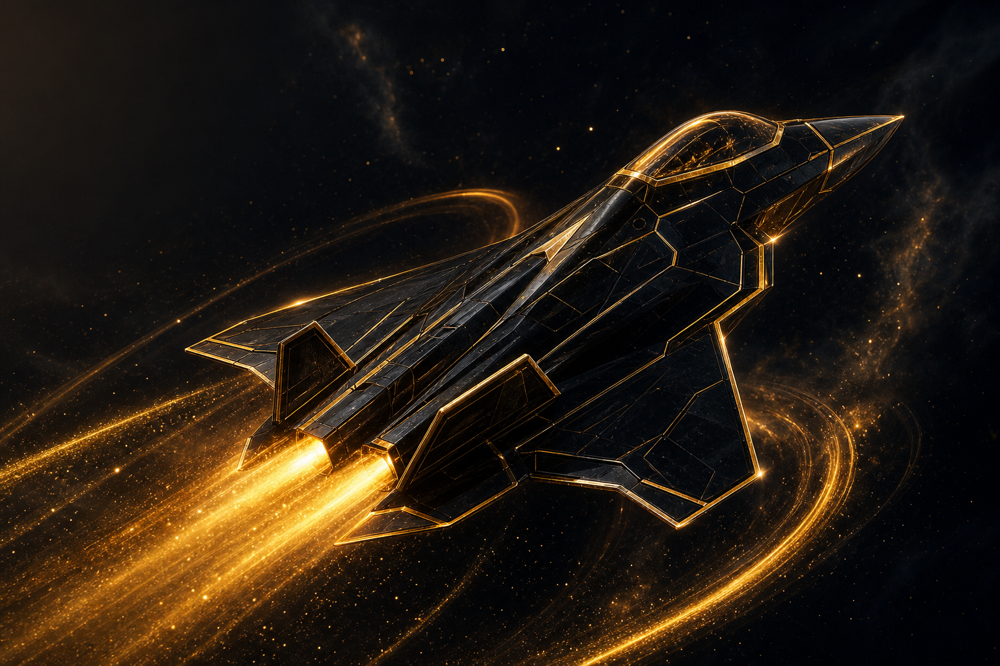
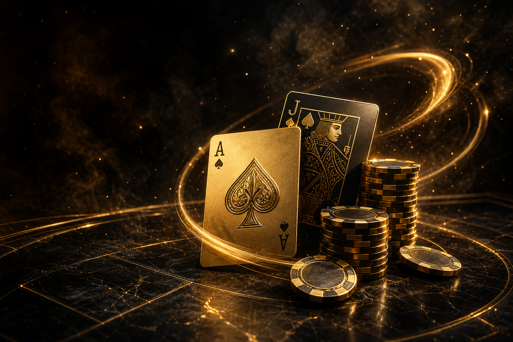

# Bildsprache — Casino Royale, Lobby und Royale Guide

> Stand: 2026-09-05 · Visuelle Referenz für die [Hierarchie](./01_bildgenerierung_top10_vorschlaege.md) und [Detailpläne](./02_bildgenerierung_top10_details.md) · [Zur Jan-Übersicht](./00_bildgenerierung_uebersicht_jan.md)

## 1. Jans gewählte Richtung

Der bereitgestellte Screenshot zeigt fünf Spielkarten mit Crash-Jet, Würfeln, Roulette-Rad, Slotmaschine und Blackjack-Karten. Jan gefällt dieser gemeinsame Stil ausdrücklich. Im aktuellen Katalogcode liegt zusätzlich ein sechstes Motiv für Multiplayer-Crash vor. „Lifejack“ im Auftrag wird im Kontext des Screenshots als Blackjack verstanden.

Die Crash- und Blackjack-Originale sowie Logo und Guide-Miniatur wurden in dieser Recherche geöffnet und visuell betrachtet. Die weiteren Katalogmotive sind im Screenshot sichtbar und ihre lokalen Verwendungen wurden im Katalog geprüft. Das ist eine konkrete Stilgrundlage; es ersetzt keine spätere Prüfung neuer Bilder im Zielbildschirm.

| Merkmal     | Was in den Referenzen überzeugt                      | Übertragung ins Spiel                                                             |
| ----------- | ---------------------------------------------------- | --------------------------------------------------------------------------------- |
| Material    | poliertes schwarzes Obsidian, schwere Goldkanten     | Hauptobjekt plastisch, Spielfläche eher matt                                      |
| Licht       | warmes Champagner-/Bernsteingold, klare Kontur       | Licht an Kanten; Ergebniszahlen mit ruhigem Umfeld                                |
| Komposition | ein klar erkennbares Objekt bzw. kleine Objektgruppe | Jet, Karte oder Rad als Hauptmotiv; keine zusätzlichen konkurrierenden Blickfänge |
| Tiefe       | Vordergrund, dunkler Raum, selektive Schärfe         | feste Basis, optional 1–2 bewegte Ebenen                                          |
| Dynamik     | diagonaler Jet und geschwungene Lichtspuren          | Bewegung im Code; keine fest eingebrannte Flugspur am beweglichen Sprite          |
| Details     | Gravur und Reflexion auf großen Motiven              | bei 28–64 px klare Silhouette wichtiger als Mikrogravur                           |

**Gestalterische Ableitung:** Die Lobbybilder sind dramatische Produktaufnahmen. Eine interaktive Spielbühne braucht mehr Ruhe, damit Kartenwerte, Kurven und Wettfelder lesbar bleiben. Dieselbe Materialfamilie bedeutet deshalb nicht dieselbe Goldstaubmenge auf jedem Bildschirm.

## 2. Referenzbestand zum Anklicken

| Referenz         | Original / aktuell genutztes Asset                                                                                                                                                     | Verwendung und Konsequenz                                                                         |
| ---------------- | -------------------------------------------------------------------------------------------------------------------------------------------------------------------------------------- | ------------------------------------------------------------------------------------------------- |
| Crash            | [Quantum-Gold-Jet](../public/images/games/hero-crash-quantum-gold.png)                                                                                                                 | Master für Kontur, Material und warmen Schub; freigestellte Spielfigur ist gesondert herzustellen |
| Blackjack        | [Ass, Bube und Chips](../public/images/games/hero-blackjack-quantum-gold.png)                                                                                                          | Material-/Lichtvorbild; ein atmosphärisches Hero ist kein spielbares Kartendeck                   |
| Dice             | [Quantum-Gold-Würfel](../public/images/games/hero-dice-quantum-gold.png)                                                                                                               | Gleiche Katalogfamilie                                                                            |
| Roulette         | [Quantum-Gold-Rad](../public/images/games/hero-roulette-quantum-gold.png)                                                                                                              | Metall-/Lichtreferenz, aktive Zahlengeometrie bleibt codegeführt                                  |
| Slots            | [Goldmaschine](../public/images/games/hero-slots-quantum-gold.png)                                                                                                                     | Katalogreferenz; aktuelles Zeus-Spielthema gesondert behandeln                                    |
| Multiplayer      | [Drei Jets](../public/images/games/hero-crash-multiplayer-quantum-gold.png)                                                                                                            | Eigenständige Motivvariation; keine Aussage über aktive Multiplayer-Spielbühne                    |
| Casino-Logo      | [Ass-Icon](../public/images/brand-ace-icon.png), [versionierter Master](../public/images/2026-09-04_brand-ace-quantum-gold_v001.png)                                                   | Aktiver Markenträger in MainSidebar; als Formensprache erhalten                                   |
| Royale Guide     | [aktive Miniatur](../public/images/royale-guide-mascot-icon.png), [heller Master](../public/images/royale-guide-mascot-white.png)                                                      | Helles Gesicht und kompakte Silhouette; unabhängige Identität neben dem Casino-Logo               |
| Guide-Personas   | [Math Strategist](../public/images/personas/math_strategist.jpg), [High Roller](../public/images/personas/high_roller.jpg), [Casual Buddy](../public/images/personas/casual_buddy.jpg) | Bereits im GuideHeader verwendet; keine fehlenden Spieler-Avatare                                 |
| Achievement-Stil | [Whale](../public/images/ach-whale-3d.png), [Clover](../public/images/ach-clover-3d.png), [Rocket](../public/images/ach-rocket-3d.png)                                                 | Referenzen für die sechs fehlenden Motive                                                         |
| Dice-Spielbühne  | [Quantum-Felt](../public/images/2026-09-04_backdrop-dice-quantum-felt_v001.png)                                                                                                        | In aktiver DiceCenterStageV2 bereits eingebunden                                                  |

### Referenzansichten

Crash — Leitbild für IMG-01:

Blackjack — Leitbild für Material und Kartenmotiv:

Logo und Guide sind zwei unterschiedliche Aufgaben: Das Ass identifiziert das Casino, die helle Figur den Assistenten. Beide Dateien lassen sich über die Referenztabelle einzeln öffnen.

## 3. Was aus der bisherigen Bildhistorie zu lernen ist

- Die [Crash-Dokumentation](../public/images/19_crash_lobby_widescreen_artwork.md) und die [Lobby-Serie](../public/images/21_lobby_complete_artworks_slots_blackjack_multiplayer.md) enthalten die Material-, Licht- und Motivprompts. Deren Status-/Preisangaben sind historische Angaben, keine aktuellen Garantien.
- 1536×1024 ergibt 3:2. Die Bezeichnung „16:9“ in älteren Generierungsnotizen ist damit nicht korrekt. Ein 16:10- oder anderer UI-Container braucht einen bewusst gewählten Crop.
- Die [Logo-Historie](../public/images/22_brand_mark_ace_of_spades.md) dokumentiert das Ass statt des früheren Medaillons. Der aktuelle MainSidebar-Code ist die Quelle für die tatsächliche Einbindung; widersprüchliche alte Statusabsätze nicht übernehmen.
- Die [Guide-Historie](../worldmap/15_1_royale_guide_sidebar_placement.md) zeigt, warum das detailreiche Emblem verworfen wurde: zu wenig erkennbare Form bei kleinen Größen. Der helle Charakter und der enge Miniatur-Crop lösen eine konkrete Lesbarkeitsfrage.
- Das vorhandene [jet_stealth_gold.jpg](../public/images/crash/jet_stealth_gold.jpg) wurde ebenfalls betrachtet: cyanfarbener Schub und Beschriftung passen nicht exakt zu Jans jetzt bevorzugter Quantum-Gold-Referenz. Ein JPG hat außerdem keinen Alpha-Kanal. Es ist kein sofort einsetzbarer transparenter Ersatz.
- Das [Observatory-JPG](../public/images/crash/observatory_backdrop.jpg) ist eine dunkle Raumkulisse mit Rahmen und Architektur. Es ist nicht automatisch der optimale ruhige Hintergrund für Kurve und Multiplier. Wiederverwendung erfordert zuerst einen Zielvergleich.

## 4. Statisch, 2.5D oder echtes 3D?

Diese drei Konzepte haben unterschiedliche Stärken. Die Empfehlung betrifft den ersten Pilot, nicht einen beschlossenen Renderer-Umbau.

Kriterien für den Crash-Pilot: Lerneffekt 30 %, Aufwand/Komplexität 25 %, Risiko 25 %, Wartbarkeit 20 %; je 1–5, höher ist besser.

| Option | Konzept                                               | Bester Einsatzkontext                                    | Aufwand                                                      |  Score |
| ------ | ----------------------------------------------------- | -------------------------------------------------------- | ------------------------------------------------------------ | -----: |
| A      | Statisch gerendertes 3D-Bild                          | Katalog, Textur, Portrait, Badge ohne Kamerabewegung     | ein Asset + Crop/Einbindung                                  | 3,90/5 |
| B      | Bildobjekt + getrennte Ebenen im vorhandenen Renderer | Crash mit festem Blickwinkel; kurze räumliche UI-Effekte | ein Asset + gezielte Anpassung vorhandener Canvas-/CSS-Layer | 4,30/5 |
| C      | Mesh, Materialien, Licht und echte Kamera             | Jet soll räumlich rollen, Kamera soll herumfahren        | zusätzlicher Modell-/Rendererpfad + Fallback                 | 2,85/5 |

Score-Begründung: A = 3/5/3/5: sehr wartbar, löst als alleiniger statischer Pilot aber nicht die bewegte Crash-Darstellung. B = 5/4/4/4: knüpft an useCrashGameLoop, useTiltGlare und die vorhandenen Bildassets an. C = 5/1/2/3: hoher Lerneffekt, aber in den geprüften Crash-/Katalogpfaden gibt es bislang keinen WebGL-Modellrenderer. Die gewichteten Summen ergeben die Werte oben.

**Empfehlung B für Crash; A für Stoff, Icons und Portraits.** A wäre besser, wenn Jan ausschließlich neue Bilddateien ohne Bewegungsänderung möchte. C wäre besser, wenn die freie Kamerafahrt das eigentliche Ziel ist; dafür wäre dann eine eigene Evaluation statt eines direkten Produktumbaus nötig. Pre-Mortem für B: sichtbare Schnittkanten und unpassende Schatten verraten die flachen Ebenen — mit festem Blickwinkel und kleinem Bewegungsradius beginnen.

**Ein 3D-gerendertes PNG ist weiterhin ein flaches Bild.** CSS-Perspektive kippt diese Ebene; 2.5D staffelt mehrere Ebenen. Echtes 3D erzeugt neue Ansichten aus Geometrie. Ein Sprite-Sheet ist eine sauber geordnete Bildfolge; ein einzelner Generierungsauftrag garantiert weder korrekte Frames noch flüssige Übergänge.

## 5. Technische Leitplanken aus Primärquellen

- Bewegungen bevorzugt über transform und opacity; andere Eigenschaften auf Layout-/Paint-Kosten prüfen. Bestehende Animationen sind dabei eine Ausgangsbasis, kein automatischer Performance-Nachweis. [web.dev: Animations Guide](https://web.dev/articles/animations-guide)
- Größenabhängige Bildausgaben und gezielte Ladepriorität verwenden; wichtige erste Bilder nicht pauschal lazy laden. [web.dev: Responsive Images](https://web.dev/learn/design/responsive-images)
- Reduzierte Bewegung als eigene verständliche Darstellung anbieten. Im Repository existieren [useSafeMotion](../src/hooks/useSafeMotion.ts) und [useTiltGlare](../src/hooks/useTiltGlare.ts), aber jeder neue Effekt muss deren Nutzung bzw. gleichwertiges Verhalten nachweisen. [web.dev: prefers-reduced-motion](https://web.dev/articles/prefers-reduced-motion)
- Bei echtem WebGL Ressourcenbudget, Texturgrößen und mögliche Context-Verluste berücksichtigen; eine statische Darstellung bleibt als Rückfall sinnvoll. [MDN: WebGL Best Practices](https://developer.mozilla.org/en-US/docs/Web/API/WebGL_API/WebGL_best_practices)

Die Quellen stützen die Technikwahl, nicht unsere Impact-Punktzahlen. Diese beruhen auf der lokalen Renderpfadprüfung und Jans visueller Präferenz.

## 6. Produktionsbrief für jedes neue Motiv

Vor einer späteren Generierung festhalten: IMG-ID, ausgewählte Referenzdatei, Objekt, Material, Licht, Perspektive, Zielgröße und ruhige Zonen. Dazu transparente Freistellung oder opaker Hintergrund explizit wählen.

**Beispielbrief für IMG-01:** Ein einzelner nach rechts fliegender Stealth-Jet aus dunklem Obsidian mit kräftiger Champagner-Gold-Kontur; klarer Rumpf und Flügel bei 64×32-Testgröße; gleicher Charakter wie die Crash-Lobbyreferenz; kein Hintergrund, kein fester Schweif, keine Beschriftung. Beweglicher Schub entsteht später im bestehenden Renderer.

**Pipeline-Grenze:** [GenerationRequest](../src/lib/design-assets/types.ts) enthält prompt, size und background, aber kein Feld für Referenzbilder. Der aktuelle [Client](../src/lib/design-assets/openai-image-client.ts) spricht images/generations an. Eine im Brief genannte Datei wird deshalb nicht automatisch visuell ans Modell übermittelt. Für echte bildgestützte Varianten müsste der gewählte Workflow Referenzbilder ausdrücklich unterstützen; eine Pipeline-Erweiterung wäre separat zu planen.

Die [Integrationsdokumentation](../public/images/07_frontend_integration_path.md) und [DesignAssetImage](../src/components/ui/DesignAssetImage.tsx) bieten einen Ausgangspunkt für Bildausgaben. Die konkrete Route kann aber direkte Pfade oder Canvas verwenden. Keine Einbindung allein aus dem Vorhandensein eines Indexeintrags ableiten.

Generierung bleibt ein nachfolgender, begrenzter Auftrag. Dieser Rechercheschritt verursacht keine Bild-API-Kosten.
