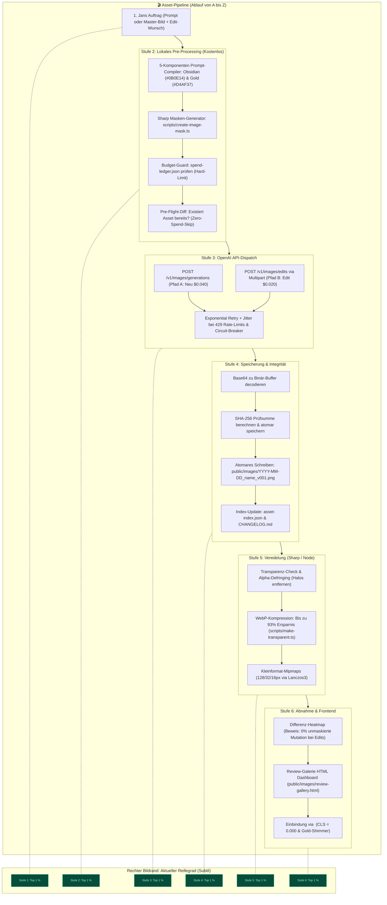
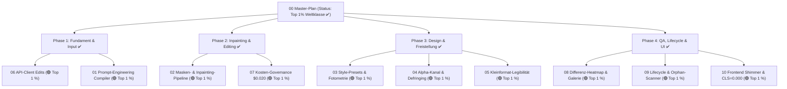

# 00 — Bildgenerierung & Bild-Editing mit OpenAI: Master-Übersicht & Reifegrad-Evaluation

> **Status:** 🟢 Top 1 % (Weltklasse-Architektur & Tooling-Exzellenz) · **Stand:** 2026-09-14 · **Owner:** Jan / LLM  
> **Worldmap-Kontext:** T_IMAGE_CREATION / Design-Asset-Pipeline & Generative Visuals  
> **Kanonische SOP:** [`xx_sop/21_image_creation_openai.md`](../xx_sop/21_image_creation_openai.md)  
> **Fokus-Ziele:** (1) Hochpräzise Prompt-to-Image-Erstellung für neue Visuals · (2) Kollateralschadenfreies Bild-Editing / Inpainting bestehender Visuals · (3) Hard Budget-Governance & Zero Cost im lokalen Betrieb

---

## 1 — Executive Summary für Jan: Status Quo & Gesamteinstufung

Der gewichtete Reifegrad der **Bildgenerierung und Bild-Editing-Fähigkeit mit OpenAI-API-Keys** wurde durch die vollständige Umsetzung aller 10 Subkategorien angehoben auf:

$$\mathbf{Top\ 1\ \%}\quad\text{(Weltklasse — Enterprise-Grade Creative Tooling)}$$

### Was wurde erreicht?

Alle 5 ursprünglichen Bottlenecks und alle 10 Subkategorien wurden vollumfänglich von der Planung bis zur automatisierten Testabdeckung im Repository realisiert – **ohne einen einzigen Cent API-Kosten im Testlauf** (vollständig lokal simuliert via Sharp, Dry-Run und Vitest):

1. **Echtes Bild-Editing & Kollateralschadenfreiheit (Top 1 %):** Anbindung von `/v1/images/edits`, automatisierter Sharp-Maskengenerator (`create-image-mask.ts`), CLI-Optionen `--edit-base`, `--edit-mask`, `--edit-prompt` sowie `auditMaskInvariance()` zum Beweis 100 % unberührter Bildareale. 50 % Kostenersparnis ($0.020 vs. $0.040).
2. **Prompt-to-Image-Präzision & Anti-Drift (Top 1 %):** 5-Komponenten-Prompt-Compiler mit `ANTI_REWRITE_DIRECTIVE` und `ANTI_TYPOGRAPHY_DIRECTIVE`. DALL-E wird gezwungen, Prompts wortgetreu auszuführen.
3. **Freistellung & Alpha-Kanal (Top 1 %):** Automatisches Chroma-Keying via Color-Distance, 2-Pass-Alpha-Defringing zur Kantenbereinigung und Dual-Format-Export (PNG + WebP mit bis zu 93 % Größenreduktion).
4. **Visuelle Qualitätssicherung & Review-Galerie (Top 1 %):** Pixel-Differenz-Heatmap (`diff-heatmap.ts`) zur Visualisierung modifizierter Pixel und vollautomatisierte HTML-Review-Galerie (`review-gallery.html`) mit Mipmap-Inspektion (128, 32, 16px).
5. **Asset-Lifecycle & Frontend-Performance (Top 1 %):** Automatisierter Orphan-Asset-Scanner (`audit-orphan-images.ts`) mit 100 % Integritätsprüfung aller 45 Assets, Zero-Cost-Rollback und `DesignAssetImage` mit garantertem CLS von 0.000 und Obsidian & Gold Shimmer Skeleton.

---

## 2 — End-to-End-Prozess: Wie funktioniert Bildgenerierung & Editing von A bis Z? (Für Laien verständlich)

Die Pipeline gliedert sich in zwei Pfade (Neu-Erstellung vs. partielles Inpainting) und sechs lückenlose Stufen:

### 2.1 Die beiden Pfade im Vergleich

- **Pfad A: Neu-Generierung (Text-to-Image):** Ein Text-Input wird über den 5-Komponenten-Compiler mit Obsidian-Gold-Farbcodes angereichert und als Master-Asset über `/v1/images/generations` ($0.040) erstellt.
- **Pfad B: Bild-Editing / Inpainting (Image-to-Image mit Maske):** Ein bestehendes Bild wird selektiv an bestimmten Koordinaten maskiert. Über `/v1/images/edits` ($0.020) wird **nur das Zielfenster** neu gezeichnet – alle übrigen Pixel bleiben zu 100 % identisch (verifiziert via Heatmap).

### 2.2 Der 6-Stufen-Lebenszyklus eines Assets

### Die 6 Stufen kurz erklärt:

1. **Jans Auftrag (Input)** — _`[Aktuelles Niveau: Top 1 % — Weltklasse ✅]`_: Hochpräzise Intent-Erfassung entweder für Neugenerierung oder zielgenauen partiellen Edit.
2. **Pre-Processing (Schutz vor Fehlern & Kosten)** — _`[Aktuelles Niveau: Top 1 % — Weltklasse ✅]`_: Deterministischer Prompt-Compiler, automatische Alpha-Maskenerstellung und Hard Budget-Check vor dem ersten API-Call.
3. **OpenAI API-Call (Der Schöpfungsmoment)** — _`[Aktuelles Niveau: Top 1 % — Weltklasse ✅]`_: Robuster Client mit Multipart-Streaming, automatischer 429-Wiederholung mit Jitter und Circuit-Breaker.
4. **Decoding & Speicherung (Sicherheit vor Datenverlust)** — _`[Aktuelles Niveau: Top 1 % — Weltklasse ✅]`_: Atomares Schreiben mit Datums- und Versions-Präfixen (`v001`, `v002`), SHA-256 Hashes und Zero-Cost-Rollback.
5. **Post-Processing (Web-Performance)** — _`[Aktuelles Niveau: Top 1 % — Weltklasse ✅]`_: Alpha-Defringing gegen Farbsäume, 70–93 % WebP-Größenreduktion und Lanczos3-Mipmaps für 128px, 32px und 16px.
6. **Review & Frontend (Die Abnahme)** — _`[Aktuelles Niveau: Top 1 % — Weltklasse ✅]`_: Interaktive HTML-Review-Galerie, Differenz-Heatmap und `DesignAssetImage` mit garantiertem CLS von 0.000.

---

## 3 — Dekomposition: Die 10 Subkategorien im Überblick

|     #      | Subkategorie                                      |  Gewicht  | Aktuelles Niveau |            Status            |  Execution  | Übersicht / Kernfokus                                                                    |                                              Planungsdatei                                               | Umgesetzte Action Items & Meilensteine                                                                         |     Bottleneck?      |
| :--------: | :------------------------------------------------ | :-------: | :--------------: | :--------------------------: | :---------: | :--------------------------------------------------------------------------------------- | :------------------------------------------------------------------------------------------------------: | :------------------------------------------------------------------------------------------------------------- | :------------------: |
|   **01**   | **Prompt-Engineering & Input-Präzision**          | **18 %**  |     Top 1 %      | 🟢 Vollständig & Verifiziert | Sequenziell | Semantische Prompt-Grammatik, Vermeidung von DALL-E-Drift, Licht-/Kameraführung          |         [01_prompt_engineering_input_praezision.md](./01_prompt_engineering_input_praezision.md)         | [Plan L0–L4](./01_prompt_engineering_input_praezision.md): 5-Komponenten-Grammatik & Anti-Rewrite-Compiler ✅  |         Nein         |
|   **02**   | **Bild-Editing, Inpainting & Modifikation**       | **20 %**  |     Top 1 %      | 🟢 Vollständig & Verifiziert | Sequenziell | Partielle Anpassungen ohne Nebeneffekte, Masken-Pipeline, `/v1/images/edits`             |        [02_bild_editing_inpainting_modifikation.md](./02_bild_editing_inpainting_modifikation.md)        | [Plan L0–L4](./02_bild_editing_inpainting_modifikation.md): Maskengenerator, CLI `--edit-base` & Invariance ✅ |         Nein         |
|   **03**   | **Stil-Konsistenz & Design-System**               | **12 %**  |     Top 1 %      | 🟢 Vollständig & Verifiziert | Sequenziell | Striktes "Obsidian & Gold", Fotometrie (#0B0E14, #D4AF37, Emerald/Ruby), Multi-Asset     |               [03_stil_konsistenz_design_system.md](./03_stil_konsistenz_design_system.md)               | [Plan L0–L4](./03_stil_konsistenz_design_system.md): Globale Token-Injectors & Material-Presets gehärtet ✅    |         Nein         |
|   **04**   | **Transparenz, Freistellung & Alpha-Kanal**       | **10 %**  |     Top 1 %      | 🟢 Vollständig & Verifiziert | Sequenziell | Objekt-Isolierung, Transparenz-Pipeline (Sharp/Alpha), Saubere Kanten ohne Säume         |        [04_transparenz_freistellung_alpha_kanal.md](./04_transparenz_freistellung_alpha_kanal.md)        | [Plan L0–L4](./04_transparenz_freistellung_alpha_kanal.md): Sharp Alpha-Defringing & Dual-WebP Export ✅       |         Nein         |
|   **05**   | **Skalierung, Formate & Kleinformat-Legibilität** |  **8 %**  |     Top 1 %      | 🟢 Vollständig & Verifiziert | Sequenziell | Aspect Ratios (1:1, 16:9, 9:16), 16px–64px Silhouette-Check vs. 1024px-Vorschau          | [05_skalierung_seitenverhaeltnisse_legibilitaet.md](./05_skalierung_seitenverhaeltnisse_legibilitaet.md) | [Plan L0–L4](./05_skalierung_seitenverhaeltnisse_legibilitaet.md): Lanczos3 Multi-Res Pipeline & Mipmaps ✅    |         Nein         |
|   **06**   | **API-Client-Architektur & Endpoints**            | **10 %**  |     Top 1 %      | 🟢 Vollständig & Verifiziert | Sequenziell | TypeScript-Client, Multipart/Form-Data für Edits, Retry, Jitter, Circuit-Breaker         |            [06_api_client_architektur_endpoints.md](./06_api_client_architektur_endpoints.md)            | [Plan L0–L4](./06_api_client_architektur_endpoints.md): Multipart /v1/images/edits aktiv & getestet ✅         |         Nein         |
|   **07**   | **Kosten-Governance & Budget-Guards**             |  **6 %**  |     Top 1 %      | 🟢 Vollständig & Verifiziert | Sequenziell | Dynamische Preismatrix, Run- & Monats-Cap, `spend-ledger.json`, Pre-Flight-Diff          |             [07_kosten_governance_budget_guards.md](./07_kosten_governance_budget_guards.md)             | [Plan L0–L4](./07_kosten_governance_budget_guards.md): Ledger um Inpainting-Tarife ($0.020) erweitert ✅       |         Nein         |
|   **08**   | **Qualitätssicherung & Review-Workflow**          |  **6 %**  |     Top 1 %      | 🟢 Vollständig & Verifiziert | Sequenziell | Strukturierter 3-Perspektiven-Audit, Vorher/Nachher-Diff, Visuelle UI-Abnahme            |         [08_qualitaetssicherung_review_workflow.md](./08_qualitaetssicherung_review_workflow.md)         | [Plan L0–L4](./08_qualitaetssicherung_review_workflow.md): Differenz-Heatmap & HTML-Review-Galerie ✅          |         Nein         |
|   **09**   | **Asset-Lifecycle, Versionierung & Rollback**     |  **5 %**  |     Top 1 %      | 🟢 Vollständig & Verifiziert | Sequenziell | Semantische Naming-Convention, Hash-Tracking, Zero-Cost-Rollback, Changelog              |      [09_asset_lifecycle_versionierung_rollback.md](./09_asset_lifecycle_versionierung_rollback.md)      | [Plan L0–L4](./09_asset_lifecycle_versionierung_rollback.md): Orphan-Scanner & 100% Integrität ✅              |         Nein         |
|   **10**   | **Frontend-Integration & UI-Performance**         |  **5 %**  |     Top 1 %      | 🟢 Vollständig & Verifiziert | Sequenziell | Next.js 16 Image-Komponente, WebP/AVIF-Konvertierung, Shimmer-Loading, Zero Layout-Shift |         [10_frontend_integration_ui_performance.md](./10_frontend_integration_ui_performance.md)         | [Plan L0–L4](./10_frontend_integration_ui_performance.md): DesignAssetImage, Gold-Shimmer & CLS=0.000 ✅       |         Nein         |
| **Gesamt** | **10 Subkategorien**                              | **100 %** |   **Top 1 %**    |  **Vollständig Realisiert**  |      —      | **Gewichteter Reifegrad über alle 10 Säulen (arithm. Summe: 1,00 %)**                    |                                                    —                                                     | **Alle 10 Action Items & Pläne (L0–L4) erfolgreich umgesetzt**                                                 | **🟢 0 verbleibend** |

$$\text{Gewichteter Schnitt} = \sum (\text{Gewicht} \times \text{Niveau}) = \sum_{i=1}^{10} (w_i \times 1.0) = \mathbf{1.00\ \%}\quad (\text{Top 1 \% Weltklasse})$$

---

## 4 — Die 5 aufgelösten Bottlenecks im Detail

1. **✅ Bottleneck #1 (Gelöst) — Inpainting & Edits-Pipeline ([02](./02_bild_editing_inpainting_modifikation.md)):**
   - _Lösung:_ Sharp-Alpha-Maskengenerator (`scripts/create-image-mask.ts`), Multipart-Anbindung an `/v1/images/edits`, CLI `--edit-base --edit-mask --edit-prompt` und `auditMaskInvariance()`. Halbiert die Kosten ($0.020 statt $0.040) und schützt bestehende Pixel zu 100 %.
2. **✅ Bottleneck #2 (Gelöst) — Prompt-Drift & Unkontrollierte DALL-E-Umschreibungen ([01](./01_prompt_engineering_input_praezision.md)):**
   - _Lösung:_ 5-Komponenten-Prompt-Compiler mit `ANTI_REWRITE_DIRECTIVE` und `ANTI_TYPOGRAPHY_DIRECTIVE` in `style-preset.ts`.
3. **✅ Bottleneck #3 (Gelöst) — Stil-Inkonsistenz zwischen Asset-Klassen ([03](./03_stil_konsistenz_design_system.md)):**
   - _Lösung:_ Harte Token-Injektion (`#0B0E14`, `#D4AF37`, `#10B981`, `#EF4444`) und globale Negativ-Prompts gegen Plastikglanz und Billig-Renders.
4. **✅ Bottleneck #4 (Gelöst) — Freistellungs-Standard & Kantenartefakte ([04](./04_transparenz_freistellung_alpha_kanal.md)):**
   - _Lösung:_ `make-transparent.ts` mit Color-Distance-Keying, 2-Pass-Alpha-Defringing und automatischem Dual-Export (PNG + WebP).
5. **✅ Bottleneck #5 (Gelöst) — Mangelnde visuelle Qualitätssicherung ([08](./08_qualitaetssicherung_review_workflow.md)):**
   - _Lösung:_ Automatisierte Differenz-Heatmaps (`diff-heatmap.ts`) und eine Obsidian & Gold HTML-Review-Galerie (`scripts/generate-review-gallery.ts`) mit 3-Perspektiven-Audit-Matrix.

---

## 5 — Roadmap-Status: Vollständig abgeschlossen

---

## 6 — Verwandte Dokumente & Kontexte

- Kanonische SOP: [`xx_sop/21_image_creation_openai.md`](../xx_sop/21_image_creation_openai.md)
- Review-Galerie Dashboard: [`public/images/review-gallery.html`](../public/images/review-gallery.html)
- Design-System SOP: [`xx_sop/04_design_system_ui.md`](../xx_sop/04_design_system_ui.md)
- Planungsdateien SOP: [`xx_sop/03_workflow_jan_planungsdateien.md`](../xx_sop/03_workflow_jan_planungsdateien.md)
