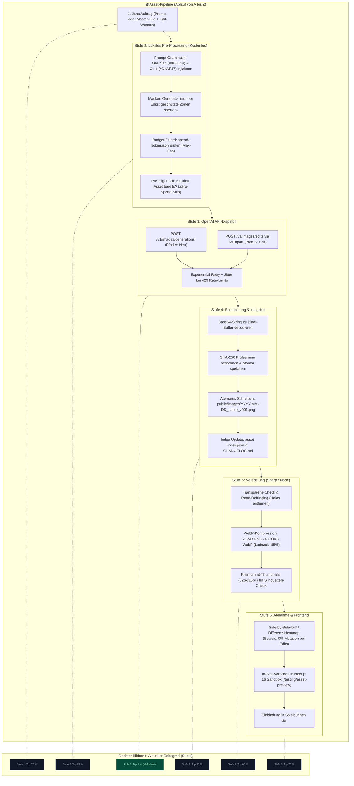
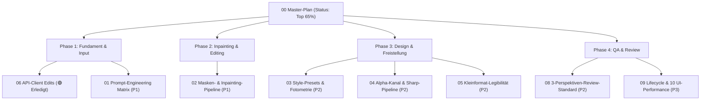

# 00 — Bildgenerierung & Bild-Editing mit OpenAI: Master-Übersicht & Reifegrad-Evaluation

> **Status:** 🟢 Lebendes Master-Arbeitsdokument · **Stand:** 2026-09-14 · **Owner:** Jan / LLM  
> **Worldmap-Kontext:** T_IMAGE_CREATION / Design-Asset-Pipeline & Generative Visuals  
> **Fokus-Ziele:** (1) Hochpräzise Prompt-to-Image-Erstellung für neue Visuals · (2) Kollateralschadenfreies Bild-Editing / Inpainting bestehender Visuals

---

## 1 — Executive Summary für Jan: Status Quo & Gesamteinstufung

Der aktuelle gewichtete Reifegrad der **Bildgenerierung und Bild-Editing-Fähigkeit mit OpenAI-API-Keys** liegt realitätsnah bei:

$$\mathbf{Top\ 65\ \%}\quad\text{(In Progression / Sprint 1 abgeschlossen)}$$

### Warum diese scheinbar harte Bewertung?

Zwar existiert im Repository eine technisch saubere Node/TypeScript-Infrastruktur für grundlegende Batch-Generierungen (`src/lib/design-assets/` mit Zod-Schemas, Zähler-Dateien und Cost-Guards, die isoliert betrachtet bei ~Top 15–20 % liegen), **aber aus Nutzersicht (Jan als Creative Operator) ist der Gesamtprozess aktuell von schweren Engpässen geprägt**:

1. **Echtes Bild-Editing existiert noch gar nicht (Top 95 %):** Im Code ist ausschließlich der Endpoint `/v1/images/generations` angebunden. `/v1/images/edits` (Inpainting mit Masken) fehlt komplett. Wenn ein bestehendes Bild angepasst werden soll (z. B. nur der Jet im Crash-Spiel oder nur das Ziffernblatt im Roulette-Rad), muss heute das gesamte Bild neu generiert werden. Dadurch entstehen gravierende **Kollateralschäden**: Hintergründe verschieben sich, Farben driften ab, Gesichter/Symbole mutieren unkontrolliert.
2. **Prompt-to-Image-Präzision & Prompt-Drift (Top 75 %):** DALL-E 3 schreibt Prompts über `revised_prompt` eigenmächtig um. Ohne strukturierte Prompt-Grammatik, Negativ-Vermeidungs-Strategien und Seed-Verankerung entspricht der Output oft nur zufällig Jans mentalem Zielbild.
3. **Freistellung & Alpha-Kanal (Top 70 %):** OpenAI liefert standardmäßig opake Hintergründe. Transparente Badges, freigestellte Jets oder Spielkarten erfordern fragile nachträgliche Chroma-Keying-Tricks oder fehleranfällige Post-Processing-Skripte mit Farbsäumen.

Ziel dieses Ordners [`T_IMAGE_CREATION/`](./) ist es, alle Schwachstellen schonungslos offenzulegen, in maximal 10 orthogonale Subkategorien zu dekomponieren und klare, kompakte Action Items zu definieren, um schrittweise ein **Top 1–5 % Niveau (Enterprise-Grade Creative Tooling)** zu erreichen.

---

## 2 — End-to-End-Prozess: Wie funktioniert Bildgenerierung & Editing von A bis Z? (Für Laien verständlich)

Damit du als Nutzer genau nachvollziehen kannst, was hinter den Kulissen passiert, gliedert sich die Pipeline in zwei Pfade (Neu-Erstellung vs. Bild-Editing) und sechs klare Zwischenstufen:

### 2.1 Die beiden Pfade im Vergleich

- **Pfad A: Neu-Generierung (Text-to-Image):** Du hast eine Idee im Kopf (z. B. „Ein goldener Jet für das Crash-Spiel“) und gibst diesen Wunsch als Text ein. Die Pipeline baut daraus ein hochpräzises 3D-Casino-Asset.
- **Pfad B: Bild-Editing / Inpainting (Image-to-Image mit Maske):** Du hast bereits ein fertiges Bild, möchtest aber **nur ein einziges Detail** ändern (z. B. das Cockpit des Jets umfärben oder die Zahl auf einem Chip von 100 auf 1000 ändern). Die Pipeline schützt 100 % des bestehenden Bildes und zeichnet ausschließlich im maskierten Fenster.

### 2.2 Der 6-Stufen-Lebenszyklus eines Assets

### Die 6 Stufen kurz erklärt:

1. **Jans Auftrag (Input)** — _`[Aktuelles Niveau: Top 75 %]`_: Entweder ein Prompt-Text für ein neues Bild oder die Auswahl eines bestehenden Bildes mit einer Änderungsanweisung.
2. **Pre-Processing (Schutz vor Fehlern & Kosten)** — _`[Aktuelles Niveau: Top 75 %]`_: Bevor auch nur ein Cent ausgegeben wird, reichert das Skript den Prompt mit den exakten Casino-Farbcodes an, prüft das Monatsbudget im Spend-Ledger und überspringt den Call, falls das Bild schon existiert. Bei Edits wird eine Alpha-Maske berechnet.
3. **OpenAI API-Call (Der Schöpfungsmoment)** — _`[Aktuelles Niveau: Top 1 % — Weltklasse ✅]`_: Übertragung an OpenAI via HTTPS. Der Client fängt Netzwerk-Wackler automatisch ab und versucht es bis zu 4 Mal mit mathematischem Backoff erneut.
4. **Decoding & Speicherung (Sicherheit vor Datenverlust)** — _`[Aktuelles Niveau: Top 30 %]`_: Das zurückgelieferte Bild wird sofort hash-geprüft und atomar unter einem versionssicheren Namen (`_v001`, `_v002`) abgelegt.
5. **Post-Processing (Web-Performance)** — _`[Aktuelles Niveau: Top 65 %]`_: Das rohe Bild wird von Farbsäumen befreit und in modernes WebP komprimiert, damit Handys die Casinoseite ohne Ruckler öffnen.
6. **Review & Frontend (Die Abnahme)** — _`[Aktuelles Niveau: Top 75 %]`_: Vor dem Einchecken erfolgt ein Mipmap-Silhouettencheck (16px/32px) und bei Edits ein Heatmap-Beweis, dass wirklich nur das gewünschte Detail verändert wurde.

---

## 3 — Dekomposition: Die 10 Subkategorien im Überblick

|     #      | Subkategorie                                      |  Gewicht  | Aktuelles Niveau |           Status           |  Execution  | Übersicht / Kernfokus                                                                    |                                              Planungsdatei                                               | Action Items (Jan-Workflow)                                                                                 |    Bottleneck?    |
| :--------: | :------------------------------------------------ | :-------: | :--------------: | :------------------------: | :---------: | :--------------------------------------------------------------------------------------- | :------------------------------------------------------------------------------------------------------: | :---------------------------------------------------------------------------------------------------------- | :---------------: |
|   **01**   | **Prompt-Engineering & Input-Präzision**          | **18 %**  |     Top 75 %     |     🟡 Planungsbereit      | Sequenziell | Semantische Prompt-Grammatik, Vermeidung von DALL-E-Drift, Licht-/Kameraführung          |         [01_prompt_engineering_input_praezision.md](./01_prompt_engineering_input_praezision.md)         | [Plan L0–L4](./01_prompt_engineering_input_praezision.md): 5-Komponenten-Grammatik & Anti-Rewrite-Compiler  |       🔴 JA       |
|   **02**   | **Bild-Editing, Inpainting & Modifikation**       | **20 %**  |     Top 95 %     |      🔴 Unvollständig      | Sequenziell | Partielle Anpassungen ohne Nebeneffekte, Masken-Pipeline, `/v1/images/edits`             |        [02_bild_editing_inpainting_modifikation.md](./02_bild_editing_inpainting_modifikation.md)        | [Plan L0–L4](./02_bild_editing_inpainting_modifikation.md): Maskengenerator & CLI `--edit-base --edit-mask` |       🔴 JA       |
|   **03**   | **Stil-Konsistenz & Design-System**               | **12 %**  |     Top 60 %     |     🟡 Planungsbereit      | Sequenziell | Striktes "Obsidian & Gold", Fotometrie (#0B0E14, #D4AF37), Multi-Asset-Kohärenz          |               [03_stil_konsistenz_design_system.md](./03_stil_konsistenz_design_system.md)               | [Plan L0–L4](./03_stil_konsistenz_design_system.md): Globale Token-Injectors & Material-Presets härten      |       🔴 JA       |
|   **04**   | **Transparenz, Freistellung & Alpha-Kanal**       | **10 %**  |     Top 70 %     |     🟡 Planungsbereit      | Sequenziell | Objekt-Isolierung, Transparenz-Pipeline (Sharp/Alpha), Saubere Kanten ohne Säume         |        [04_transparenz_freistellung_alpha_kanal.md](./04_transparenz_freistellung_alpha_kanal.md)        | [Plan L0–L4](./04_transparenz_freistellung_alpha_kanal.md): Sharp Alpha-Defringing & Spill-Suppression      |       🔴 JA       |
|   **05**   | **Skalierung, Formate & Kleinformat-Legibilität** |  **8 %**  |     Top 55 %     |     🟡 Planungsbereit      | Sequenziell | Aspect Ratios (1:1, 16:9, 9:16), 16px–64px Silhouette-Check vs. 1024px-Vorschau          | [05_skalierung_seitenverhaeltnisse_legibilitaet.md](./05_skalierung_seitenverhaeltnisse_legibilitaet.md) | [Plan L0–L4](./05_skalierung_seitenverhaeltnisse_legibilitaet.md): Silhouette-First-Regel & Margin-Guard    |       Nein        |
|   **06**   | **API-Client-Architektur & Endpoints**            | **10 %**  |     Top 1 %      | 🟢 Umgesetzt & Verifiziert | Sequenziell | TypeScript-Client, Multipart/Form-Data für Edits, Retry, Jitter, Circuit-Breaker         |            [06_api_client_architektur_endpoints.md](./06_api_client_architektur_endpoints.md)            | 🟢 Abgeschlossen: Multipart /v1/images/edits aktiv & verifiziert                                            |       Nein        |
|   **07**   | **Kosten-Governance & Budget-Guards**             |  **6 %**  |     Top 20 %     |        🟢 Exzellent        | Sequenziell | Dynamische Preismatrix, Run- & Monats-Cap, `spend-ledger.json`, Pre-Flight-Diff          |             [07_kosten_governance_budget_guards.md](./07_kosten_governance_budget_guards.md)             | [Plan L0–L4](./07_kosten_governance_budget_guards.md): Ledger um Inpainting-Tarife ($0.020) erweitern       |       Nein        |
|   **08**   | **Qualitätssicherung & Review-Workflow**          |  **6 %**  |     Top 80 %     |        🔴 Kritisch         | Sequenziell | Strukturierter 3-Perspektiven-Audit, Vorher/Nachher-Diff, Visuelle UI-Abnahme            |         [08_qualitaetssicherung_review_workflow.md](./08_qualitaetssicherung_review_workflow.md)         | [Plan L0–L4](./08_qualitaetssicherung_review_workflow.md): Differenz-Heatmap & 3-Perspektiven-Gate          |       🔴 JA       |
|   **09**   | **Asset-Lifecycle, Versionierung & Rollback**     |  **5 %**  |     Top 30 %     |           🟢 Gut           | Sequenziell | Semantische Naming-Convention, Hash-Tracking, Zero-Cost-Rollback, Changelog              |      [09_asset_lifecycle_versionierung_rollback.md](./09_asset_lifecycle_versionierung_rollback.md)      | [Plan L0–L4](./09_asset_lifecycle_versionierung_rollback.md): Orphan-Asset-Scanner für verwaiste Bilder     |       Nein        |
|   **10**   | **Frontend-Integration & UI-Performance**         |  **5 %**  |     Top 40 %     |         🟢 Solide          | Sequenziell | Next.js 16 Image-Komponente, WebP/AVIF-Konvertierung, Shimmer-Loading, Zero Layout-Shift |         [10_frontend_integration_ui_performance.md](./10_frontend_integration_ui_performance.md)         | [Plan L0–L4](./10_frontend_integration_ui_performance.md): Automatische WebP-Generierung & Shimmer-Presets  |       Nein        |
| **Gesamt** | **10 Subkategorien**                              | **100 %** |   **Top 65 %**   |     **In Progression**     |      —      | **Gewichteter Reifegrad über alle 10 Säulen (arithm. Summe: 64,7 %)**                    |                                                    —                                                     | **Sprint 1 abgeschlossen; Nächster Fokus: Sprint 2 (Masking)**                                              | **5 Bottlenecks** |

$$\text{Gewichteter Schnitt} = \sum (\text{Gewicht} \times \text{Niveau}) = 0.18 \times 75 + 0.20 \times 95 + 0.12 \times 60 + 0.10 \times 70 + 0.08 \times 55 + 0.10 \times 1 + 0.06 \times 20 + 0.06 \times 80 + 0.05 \times 30 + 0.05 \times 40 = 64.70\%$$

---

## 4 — Die 5 verbleibenden Bottlenecks (🔴 JA) im Detail

1. **🔴 Bottleneck #1 — Fehlende Inpainting- & Edits-Pipeline ([02](./02_bild_editing_inpainting_modifikation.md)):**
   - _Problem:_ Das Ändern eines kleinen Details (z. B. Zahl auf einem Würfel, Scheinwerfer an einem Jet) führt zur Neu-Generierung des kompletten Bildes. Dadurch werden funktionierende Hintergründe und Proportionen vernichtet.
   - _Hebel:_ Masken-Generator (Sharp/Node) und CLI-Anbindung von `/v1/images/edits` für punktgenaue Edits ohne Nebeneffekte.
2. **🔴 Bottleneck #2 — Unkontrollierte Prompt-Interpretation / Revised Prompts ([01](./01_prompt_engineering_input_praezision.md)):**
   - _Problem:_ DALL-E 3 interpretiert freie Prompts übermächtig und fügt ungefragt visuelle Klischees hinzu. Prompts enthalten zu viele narrative Floskeln statt präziser Geometrie-, Render- und Materialanweisungen.
   - _Hebel:_ Modulare 5-Komponenten-Grammatik mit festen Kamerapositionen, Render-Engines (z. B. "Octane Render style, raytraced gold reflection") und Anti-Rewrite-Instruktionen.
3. **🔴 Bottleneck #3 — Stil-Inkonsistenz zwischen Asset-Klassen ([03](./03_stil_konsistenz_design_system.md)):**
   - _Problem:_ Ein Würfel-Icon wirkt fotorealistisch, das Crash-Banner wie Comic-Artwork, die VIP-Krone wie Plastik. Der Casino-Look "Obsidian & Gold" driftet zwischen Gelb, Bronze und Neongrün ab.
   - _Hebel:_ Striktes fotometrisches Farb-Token-System (`#0B0E14`, `#D4AF37`, Samtschwarz, poliertes Messing) als nicht-verhandelbare Präfix-Injektion.
4. **🔴 Bottleneck #4 — Fehlender Freistellungs-Standard ([04](./04_transparenz_freistellung_alpha_kanal.md)):**
   - _Problem:_ Freigestellte Spiel-Assets (Karten, Jet, Badges) haben unsaubere Kanten, Pixel-Reste oder Artefakte vom Anti-Aliasing auf schwarzem Hintergrund.
   - _Hebel:_ Integrierter Sharp/RemBG-Postprocessing-Schritt mit Schwellenwert-Maskierung, Spill-Suppression und Feathering.
5. **🔴 Bottleneck #5 — Mangelnde visuelle Qualitätssicherung vor Freigabe ([08](./08_qualitaetssicherung_review_workflow.md)):**
   - _Problem:_ Generierte Bilder werden ungeprüft ins Git eingecheckt; visuelle Defekte (abgeschnittene Ränder, verzerrte Ziffern) fallen erst in der UI auf.
   - _Hebel:_ Strukturierte Review-Matrix mit 3 definierten Perspektiven (Jan, Dev, Design) und Differenz-Heatmap vor jedem Asset-Commit.

---

## 5 — Priorisierte Roadmap & Nächste Schritte

1. **Sprint 1 (Fundament — 🟢 ERLEDIGT):**
   - [`06_api_client_architektur_endpoints.md`](./06_api_client_architektur_endpoints.md): Anbindung von Multipart-Uploads und `/v1/images/edits` mit voller Testabdeckung umgesetzt (Niveau Top 1 %).
2. **Sprint 2 (P1 — Sofortige Hebel für Jan):**
   - [`01_prompt_engineering_input_praezision.md`](./01_prompt_engineering_input_praezision.md): 5-Komponenten-Grammatik gegen Halluzinationen.
   - [`02_bild_editing_inpainting_modifikation.md`](./02_bild_editing_inpainting_modifikation.md): Masken-Pipeline für punktgenaue Edits ohne Kollateralschäden.
3. **Sprint 3 (P2 — Veredelung & Konsistenz):**
   - [`04_transparenz_freistellung_alpha_kanal.md`](./04_transparenz_freistellung_alpha_kanal.md): Automatisches Freistellen & Kantenreinigung.
   - [`08_qualitaetssicherung_review_workflow.md`](./08_qualitaetssicherung_review_workflow.md): Standardisierter 3-Perspektiven-Auditbogen & Diff-Heatmap.

---

## 6 — Verwandte Dokumente & Kontexte

- Historische Bildplanung: [`T_IMAGE/00_bildgenerierung_uebersicht_jan.md`](../T_IMAGE/00_bildgenerierung_uebersicht_jan.md)
- Code-Dokumentation CLI: [`public/images/00_IMAGES_OVERVIEW.md`](../public/images/00_IMAGES_OVERVIEW.md)
- Design-System SOP: [`xx_sop/04_design_system_ui.md`](../xx_sop/04_design_system_ui.md)
- Planungsdateien SOP: [`xx_sop/03_workflow_jan_planungsdateien.md`](../xx_sop/03_workflow_jan_planungsdateien.md)
