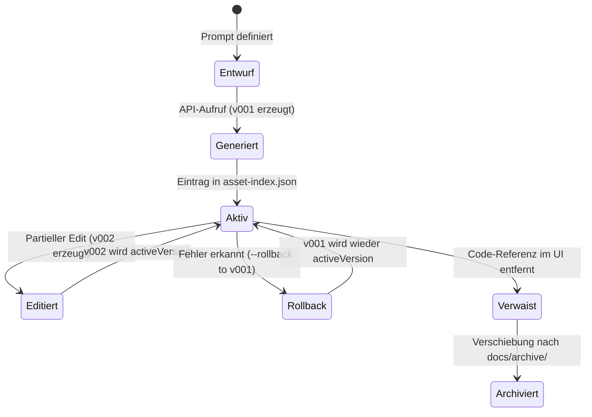

# 09 — Asset-Lifecycle, Versionierung & Rollback-Management

> **Status:** 🟢 Gut / Stabil · **Stand:** 2026-09-14 · **Owner:** Jan / LLM  
> **Worldmap-Kontext:** T_IMAGE_CREATION / Subkategorie 09  
> **Code-Referenzen:** [`src/lib/design-assets/lifecycle.ts`](../src/lib/design-assets/lifecycle.ts), [`src/lib/design-assets/naming.ts`](../src/lib/design-assets/naming.ts)  
> **Fokus:** Deterministische Benennung, lückenlose Versionierung (`v001` → `v002`), Zero-Cost-Rollbacks und Aufspüren verwaister Bilddateien.

---

## 1 — Executive Summary & Status Quo

Der aktuelle Reifegrad im Bereich **Asset-Lifecycle, Versionierung & Rollback-Management** liegt bei **Top 30 % (Gut / Solide Architektur)**.

Das Projekt verfügt über ein ausgereiftes Lifecycle-Management:

- **Deterministische Benennung:** `YYYY-MM-DD_<asset-name>_v<NNN>.<ext>`
- **Atomare Updates & Index:** `public/images/asset-index.json` verknüpft semantische Namen mit der jeweils aktiven Version.
- **Zero-Cost-Rollback:** Mit `npm run design:generate -- --rollback <name> --to-version <vNNN>` kann ohne API-Aufruf und ohne Kosten auf eine vorherige Version zurückgesprungen werden.
- **Audit-Trail:** Jede Neu-Generierung wird in `public/images/CHANGELOG.md` mit Prompt, Dimension und Hash dokumentiert.

**Verbesserungspotenzial:** Automatisierter Scan nach verwaisten („Orphan“) Bilddateien, die zwar Speicherplatz belegen, aber an keiner Stelle im Frontend-Code mehr importiert werden.

---

## 2 — Dekomposition in 7 Sub-Facetten

|   #    | Sub-Facette                                    | Gewicht  | Aktuelles Niveau | Status Quo & Schwachstelle                                                        | Bottleneck? | Action Item / Zielzustand                                                      |
| :----: | :--------------------------------------------- | :------: | :--------------: | :-------------------------------------------------------------------------------- | :---------: | :----------------------------------------------------------------------------- |
| **01** | **Semantische Dateibenennung**                 | **22 %** |     Top 10 %     | Datums- und Versions-Präfixe verhindern versehentliches Überschreiben             |    Nein     | Bestehendes Schema (`YYYY-MM-DD_<name>_v<NNN>`) konsequent fortführen          |
| **02** | **Zero-Cost-Rollback (`--rollback`)**          | **20 %** |     Top 15 %     | Ermöglicht sekundenschnelles Zurückspringen auf Vorgängerversionen ohne API-Spend |    Nein     | Rollback-Tests im CI regelmäßig gegen Regressionen absichern                   |
| **03** | **Zentraler Asset-Index (`asset-index.json`)** | **18 %** |     Top 20 %     | Mappt sprechende Aliase auf konkrete Dateipfade für das Frontend                  |    Nein     | Schemavalidierung beim Starten der Next.js App sicherstellen                   |
| **04** | **Orphan-Asset-Erkennung (Tote Dateien)**      | **15 %** |     Top 75 %     | Ausrangierte Alt-Bilder verbleiben im Repo und blähen das Git-Repository auf      |    Nein     | CLI-Tool `scripts/audit-orphan-images.ts` zur Erkennung toter Referenzen bauen |
| **05** | **Revisionssicheres Changelog**                | **10 %** |     Top 15 %     | `CHANGELOG.md` hält Generierungs-Historie und Parameter fest                      |    Nein     | Einträge um Versionsdifferenzen und Prompt-Tweaks ergänzen                     |
| **06** | **SHA-256 Integritätsprüfung**                 | **10 %** |     Top 20 %     | Hash schützt vor unbemerkter Dateibeschädigung oder Silent Corruption             |    Nein     | Automatische Hash-Verifikation vor atomarem Verschieben beibehalten            |
| **07** | **Sichere Archivierung statt Löschung**        | **5 %**  |     Top 25 %     | Ersetzte Assets werden nicht gelöscht, sondern bleiben historisch erhalten        |    Nein     | Bei Repo-Größenproblemen ältere Versionen in LFS oder Cold Storage auslagern   |

---

## 3 — Die Lifecycle-Zustandsmaschine

---

## 4 — 5-Stufen-DoD für Top 1–5 % Reifegrad

1. [ ] **Orphan-Check in CI:** `npm run vibe-check` warnt vor Bildern in `public/images/`, die weder im `asset-index.json` noch im Code referenziert werden.
2. [ ] **Integritäts-Audit:** Sämtliche im `asset-index.json` eingetragenen Dateien existieren physisch auf der Festplatte und matchen ihren SHA-256 Hash.
3. [ ] **Rollback-Verifikation:** CLI-Rollback auf frühere Versionen schlägt fehl, wenn die Zieldatei fehlt (Fail-Closed).

---

## 5 — Verwandte Dokumente

- Master-Übersicht: [`00_IMAGE_CREATION_UEBERSICHT.md`](./00_IMAGE_CREATION_UEBERSICHT.md)
- Asset-Index: [`public/images/asset-index.json`](../public/images/asset-index.json)
- Asset-Changelog: [`public/images/CHANGELOG.md`](../public/images/CHANGELOG.md)
