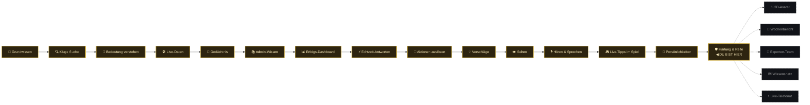

# 🪙 Royale Guide — Dein persönlicher Überblick

> **Nur für dich, Jan.** Keine Technik, keine Dateipfade, keine Testzahlen im Detail — nur: _wo stehen wir, was kann das Ding, und was kommt noch?_ Gedacht zum schnellen Reinschauen und Erinnern, nicht zum Nachschlagen von Details (dafür gibt's [`10_llm_erweiterung.md`](10_llm_erweiterung.md)).

---

## 🏆 Wo stehen wir gerade?

```
🥇 Top 1–10 %   ██████████████████████████████████████████████  Weltklasse, würde in einem echten Produkt nicht auffallen  ◀── GENAU HIER: Top 10 %
🥈 Top 11–30 %  ██████████████████████████████████████░░░░░░░░  Solide, kleine bekannte Lücken
🥉 Top 31–50 %  ████████████████████████░░░░░░░░░░░░░░░░░░░░░░  Läuft, aber mit sichtbaren Baustellen
🚧 Top 51–75 %  ██████████████░░░░░░░░░░░░░░░░░░░░░░░░░░░░░░░░  Nur mit Krücken / Fallback
🧊 Top 76–100 % ██░░░░░░░░░░░░░░░░░░░░░░░░░░░░░░░░░░░░░░░░░░░░  Sieht fertig aus, funktioniert aber nicht wirklich
```

> 🎯 **Exakter Wert: Top 10 %.** Am 2026-08-27 von Top 30 % hochgestuft — das ist die obere, "Weltklasse"-Kohorte. Nicht durch ein neues Feature, sondern durch die in Abschnitt "Warum jetzt Top 10 %?" unten beschriebene Nacharbeit.

> **In einem Satz:** Vor zwei Wochen gab es das Thema für dich noch gar nicht — jetzt hast du einen Chatbot gebaut, der Wissen abruft, sich erinnert, Screenshots versteht, spricht, dir live am Spieltisch Tipps gibt _und_ inzwischen auch durchgecheckt wurde, ob sich jemand böswillig reintricksen kann. Genau dieser Check war die letzte fehlende Hausaufgabe — jetzt erledigt.

---

## 🧠 Was kann dein Royale Guide heute schon?

Alles unten ist **fertig gebaut, getestet und läuft** — kein Wunschzettel, sondern Ist-Zustand. Die drei rechten Spalten sind keine reine Deko, sondern genau die Kriterien, an denen sich die Top-10-%-Bewertung oben aufhängt — mehr dazu direkt darunter.

|     | Fähigkeit                             | Was das für dich als Spieler bedeutet                                                                                     | 🛡️ Sicherheits-Check          | 🔁 Wie oft aktiv                 | 🕰️ Reifegrad      |
| --- | ------------------------------------- | ------------------------------------------------------------------------------------------------------------------------- | ----------------------------- | -------------------------------- | ----------------- |
| 🧠  | **Grundwissen**                       | Kennt alle Spielregeln, VIP-Ränge und Limits auswendig — wie ein Mitarbeiter, der das Handbuch gelesen hat.               | ⚠️ Offen                      | 🟢 Kern (jedes Gespräch)         | 🟢 Länger erprobt |
| 🔍  | **Kluge Suche**                       | Sucht sich aus dem Wissen automatisch den passenden Ausschnitt raus, statt bei jeder Frage alles auf einmal durchzulesen. | 🔍 Einmal geprüft*            | 🟢 Kern (jedes Gespräch)         | 🟢 Länger erprobt |
| 🧬  | **Bedeutung statt Wortlaut**          | Versteht auch umformulierte Fragen — du musst nicht die exakten Fachbegriffe treffen.                                     | ⚠️ Offen                      | 🟢 Kern (jedes Gespräch)         | 🟢 Länger erprobt |
| 🛠️  | **Live-Daten abrufen**                | Kann deinen aktuellen VIP-Fortschritt, Sessionstatistik und Limits live nachschauen, statt zu raten.                      | ✅ Geprüft (2 Lücken behoben) | 🟡 Nur bei passender Frage       | 🟢 Länger erprobt |
| 💬  | **Gedächtnis im Gespräch**            | Merkt sich die letzten paar Nachrichten — du musst dich nicht ständig wiederholen.                                        | ✅ Geprüft (1 Lücke behoben)  | 🟢 Kern (jedes Gespräch)         | 🟢 Länger erprobt |
| 📚  | **Admin-Wissen (für dich)**           | Du kannst im Admin-Bereich neues Wissen eintragen, ohne Code anzufassen — der Guide lernt es sofort.                      | ✅ Geprüft (2 Lücken behoben) | 👤 Nur du als Admin              | 🟢 Länger erprobt |
| 📊  | **Erfolgs-Kontrolle (für dich)**      | Ein Dashboard zeigt dir, wie oft der Guide gefragt wird, wie schnell er antwortet und was er kostet.                      | ✅ Geprüft (3 Lücken behoben) | 👤 Nur du als Admin              | 🟢 Länger erprobt |
| ⚡  | **Antwortet in Echtzeit**             | Tippt die Antwort live vor deinen Augen, statt dich auf eine fertige Antwort warten zu lassen.                            | ✅ Geprüft (1 Lücke behoben)  | 🟢 Kern (jedes Gespräch)         | 🟡 Mittel         |
| 🎯  | **Löst Aktionen aus**                 | Kann z. B. direkt einen Button zeigen, der dich zu einem Spiel oder deinem Vault bringt.                                  | ✅ Geprüft (1 Lücke behoben)  | 🟡 Nur bei bestimmten Antworten  | 🟡 Mittel         |
| 💡  | **Schlägt Folgefragen vor**           | Zeigt klickbare Vorschläge, was du als Nächstes fragen könntest.                                                          | ✅ Geprüft (1 Lücke behoben)  | 🟢 Meistens sichtbar             | 🟡 Mittel         |
| 👁️  | **Sieht Screenshots**                 | Du kannst ein Bild vom Spiel reinziehen oder einfügen — der Guide analysiert es.                                          | ✅ Geprüft (1 Lücke behoben)  | 🟡 Nur wenn du ein Bild schickst | 🟡 Mittel         |
| 🎙️  | **Hört und spricht**                  | Du kannst per Sprachnachricht fragen, er antwortet mit echter Stimme zurück.                                              | ✅ Geprüft (1 Lücke behoben)  | 🟡 Nur wenn du es aktivierst     | 🟡 Mittel         |
| 🎮  | **Live-Tipps direkt am Tisch**        | Ein kleines Hilfe-Fenster direkt im Spiel (z. B. Blackjack), das dir in Echtzeit den mathematisch besten Zug zeigt.       | ✅ Geprüft (sauber, 0 Funde)  | 🟡 Nur in unterstützten Spielen  | 🟢 Länger erprobt |
| 👑  | **Persönlichkeiten wählen (Stufe P)** | Wähle zwischen Math Strategist, High-Roller Host und Casual Buddy – mit eigenem Tonfall und Profil-Persistenz.            | ⚠️ Offen                      | 🟢 Kern (jedes Gespräch)         | 🆕 Ganz frisch    |

**Legende:**

- 🛡️ **Sicherheits-Check:** Wurde absichtlich versucht, die Fähigkeit auszutricksen/zu manipulieren (Prompt-Injection, Missbrauch)? `✅ Geprüft` = am 2026-08-27 gezielt durchleuchtet, jede gefundene Lücke noch am selben Tag geschlossen. `⚠️ Offen` = läuft stabil im Alltag, aber nie gezielt angegriffen. `🔍 Einmal geprüft*` = separate Altfunktion mit eigenem, früherem Check.
- 🔁 **Wie oft aktiv:** `🟢 Kern` = bei praktisch jeder Unterhaltung im Einsatz. `🟡` = nur wenn Situation/Frage dazu passt. `👤` = nur du siehst/nutzt das, keine Spieler.
- 🕰️ **Reifegrad:** `🟢 Länger erprobt` = seit dem Start im Einsatz. `🟡 Mittel` = in der Mitte der Reise dazugekommen. `🆕 Ganz frisch` = gerade erst fertig geworden.

_\* Bezieht sich auf die Live-Wissensabfrage innerhalb der "Kluge Suche" — eine verwandte, aber separate Altfunktion mit dokumentiertem Sicherheitscheck._

**Update 2026-08-27:** 10 von 14 Bausteinen haben jetzt einen eigenen dokumentierten Check — zusammen **13 gefundene Lücken behoben** (3 davon ernster eingestuft: z. B. "meldet Erfolg, obwohl die Datenbank die Änderung gar nicht gespeichert hat" oder "verwechselt bei sehr vielen gleichzeitigen Anfragen aus Versehen die Nutzer-Zähler"), 10 kleinere. Offen bleiben nur noch: Grundwissen, Kluge Suche, Bedeutung statt Wortlaut (alle drei aus der sehr frühen Bauphase) und die ganz neuen Persönlichkeiten.

---

## 🗺️ Die Reise bis hierhin



_(Goldene Kästen = fertig · graue gestrichelte Kästen = nur Idee, noch nicht gebaut)_

---

## 💭 Was ist als Nächstes angedacht?

Das ist deine eigene Ideensammlung aus der Roadmap — sortiert danach, **ob es wirklich nach vorne bringt oder eher eine coole Spielerei ist**:

| Idee                                       | Kinderleicht erklärt                                                                                                                           | Ehrliche Einschätzung                                                                                                     |
| ------------------------------------------ | ---------------------------------------------------------------------------------------------------------------------------------------------- | ------------------------------------------------------------------------------------------------------------------------- |
| ✅ **Härtung & Reife (Stufe R)**           | Sicherheitsprüfungen nachgeholt, Doku bereinigt und Lasttests gefahren.                                                                        | 🏆 **Erledigt (2026-08-27)** — hat das Niveau tatsächlich auf Top 10 % gehoben.                                           |
| ✨ **3D-Avatar mit Lippensynchronisation** | Die goldene Kugel wird zu einem sprechenden 3D-Gesicht, das lippensynchron zur Stimme passt.                                                   | 🎉 Reiner Wow-Effekt, technisch anspruchsvoll, aber ohne echten Nutzen fürs Niveau.                                       |
| 📆 **Wöchentlicher Bericht**               | Jeden Montag bekommst du eine kleine "Spotify-Jahresrückblick"-artige Zusammenfassung deiner Woche.                                            | 📈 Kleiner echter Fortschritt — nutzt echte Hintergrund-Automatisierung.                                                  |
| 🤖 **Experten-Team statt Einzelbot**       | Statt einem Bot arbeiten drei spezialisierte Helfer im Hintergrund zusammen (einer rechnet nur, einer kennt nur Regeln, einer fasst zusammen). | 📈 Löst ein echtes Problem (der Bot soll nicht selbst falsch rechnen), aber aufwendig.                                    |
| 🕸️ **Wissensnetz statt Textsuche**         | Der Bot merkt sich Regeln nicht als Text, sondern als Landkarte mit Verbindungen zwischen Begriffen.                                           | 🎉 Beeindruckend zu lernen, aber für dieses Projekt Overkill.                                                             |
| 📞 **Echtes Live-Telefonat**               | Du sprichst ganz ohne Pausen mit dem Bot, kannst ihn mitten im Satz unterbrechen.                                                              | 🎉 Sehr ambitioniert und riskant — bevor das kommt, sollte die schon vorhandene Sprachfunktion erst richtig geprüft sein. |

**Kurz gesagt:** Stufe R ist durch — Top 10 % erreicht. Keine der übrigen fünf Ideen hebt das Niveau weiter an, sie sind reine Breite/Portfolio. Für den nächsten echten Sprung (Top 5 %) siehe [`10_llm_erweiterung.md`](10_llm_erweiterung.md) Abschnitt 5.

---

## 🔧 Warum jetzt Top 10 % und nicht schon vorher?

Nicht weil vorher etwas kaputt war — **alles lief schon davor, alle Tests waren grün.** Es fehlten vier Hausaufgaben, die am 2026-08-27 alle nachgeholt wurden:

1. **✅ Sicherheits-Check nachgeholt.** 10 der 14 fertigen Bausteine wurden gezielt darauf geprüft, ob sich der Bot z. B. durch einen manipulierten Screenshot, eine trickreiche Sprachnachricht oder eine gefälschte Chat-Historie austricksen lässt. Ergebnis: 13 Lücken gefunden, alle noch am selben Tag geschlossen — 3 davon ernster (z. B. meldete das Admin-Wissenstool "gespeichert ✓", obwohl die Datenbank die Änderung gar nicht übernommen hatte).
2. **✅ Zwei alte Pläne aufgeräumt.** Das ältere Planungsdokument, das explizit "keine Embeddings/Vektorsuche bauen" sagte, obwohl genau das längst gebaut ist, trägt jetzt einen klaren "veraltet, ersetzt durch die aktuelle Roadmap"-Hinweis statt sich stillschweigend zu widersprechen.
3. **✅ Echte Nutzung neu gemessen.** Statt der 9 Tage alten Zahl (4 Anfragen/Woche) steht jetzt ein frischer Wert: 32 Anfragen/Woche — ein Anstieg, absolute Menge aber weiterhin überschaubar.
4. **✅ Echter Lasttest gefahren.** Statt nur zu behaupten "die Bremse bei 30 Anfragen/Minute funktioniert", wurde das mit einem echten Ansturm von 35 gleichzeitigen Anfragen tatsächlich ausprobiert — die Bremse hat gegriffen, teure Anfragen wurden zuverlässig abgewiesen, und nach einer Minute ging es wieder normal weiter.

---

## 🚀 Der Weg nach oben (falls du das als Nächstes angehen willst)

- **Top 10 % — ✅ erreicht (2026-08-27):** Sicherheits-Check nachgeholt, die zwei alten Pläne aufgeräumt, Nutzung neu gemessen, einmal echt unter Last getestet.
- **Richtung Top 5 % (nächster Schritt):** Automatische "Angriffstests" fest einbauen, ein Kostenlimit mit echter Notbremse, mindestens einen kompletten End-to-End-Test, und die ganz neuen Persönlichkeiten (Stufe P) noch nachträglich durch denselben Sicherheits-Check schicken.
- **Richtung Top 1 % (wie dein Login-System):** Alles Wissen in einem sauberen Gesamtdokument bündeln (aktuell über viele kleine Dateien verstreut), Datenbank-Zugriffsrechte extra geprüft.

> Vollständige, technische Version dieser Liste steht in [`10_llm_erweiterung.md`](10_llm_erweiterung.md) Abschnitt 5.

---

## 🎉 Kleiner Stolz-Moment

- **14 fertige Ausbaustufen** (inkl. Personas & In-Game Co-Pilot), alle mit automatischen Tests abgesichert.
- **1.147+ automatische Tests** laufen bei jeder Änderung im Hintergrund mit — dein persönliches Sicherheitsnetz gegen kaputte Änderungen.
- **10 gezielte Sicherheits-Checks, 13 gefundene und noch am selben Tag geschlossene Lücken, 1 echter Lasttest mit echtem Ansturm** — nicht nur "läuft im Alltag", sondern absichtlich angegriffen und geprüft.
- Der Guide kann heute: **lesen, zuhören, sprechen, sehen, sich erinnern, Persönlichkeiten annehmen, Wissen nachschlagen und dir live am Spieltisch helfen — und das alles jetzt auch durchgecheckt.** Das ist in zwei Wochen aus dem Nichts entstanden und steht jetzt bei **Top 10 %.**
