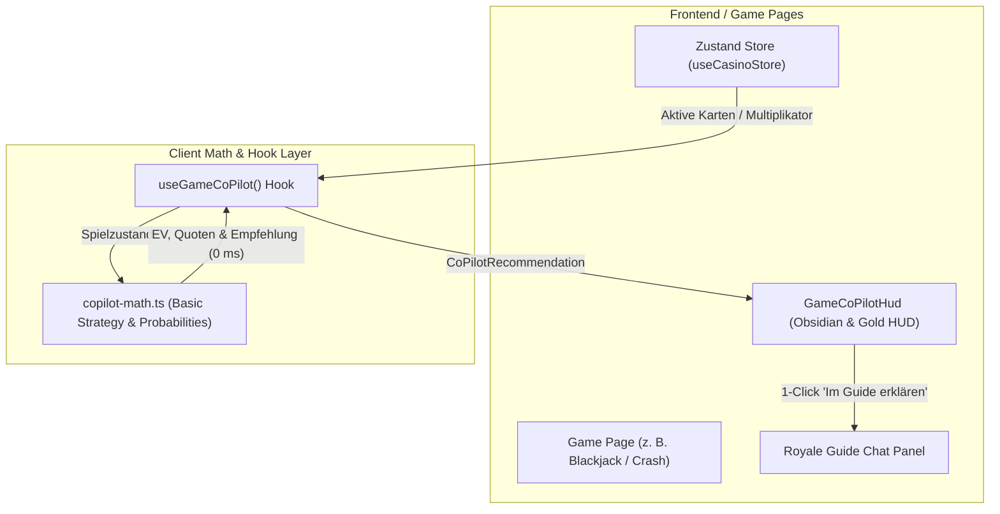

# 10.N1 — In-Game Live Co-Pilot & Smart-HUD

> **Status:** Execution-Ready · **Stand:** 2026-08-24 · **Owner:** LLM (Umsetzung) / Jan (Finale Abnahme) · **Scope:** Schwebender Smart-HUD mit deterministischer Math-Engine auf allen Spielseiten (`/games/blackjack`, `/games/crash`, `/games/roulette`, `/games/dice`, `/games/slots`).

---

## 1 — Übersicht für Jan

> **Verteilung der Zuständigkeiten:** Alle Code-, Mathematik-, UI-, Integrations- und Testaufgaben liegen zu 100% beim LLM. Jan führt am Ende ausschließlich die visuelle und funktionale Endabnahme im Browser durch.

| Schritt | Meilenstein | Status | Nächster Schritt | Zuständigkeit |
| :--- | :--- | :---: | :--- | :---: |
| **N1.1** | **Deterministische Math Engine (`copilot-math.ts`)** | 🔴 Geplant | Mathematische Berechnungen für Basic Strategy, Crash Odds, Roulette EV & Dice | **LLM** |
| **N1.2** | **Co-Pilot State-Hook (`useGameCoPilot.ts`)** | 🔴 Geplant | Reaktive Bindung an `useCasinoStore` und aktive Spielzustände | **LLM** |
| **N1.3** | **Obsidian-Gold Smart-HUD (`GameCoPilotHud.tsx`)** | 🔴 Geplant | Schwebendes Glassmorphism-HUD mit Odds-Meter, Minimierung & Quick-Explain | **LLM** |
| **N1.4** | **Game-Pages Integration** | 🔴 Geplant | Nahtloses Mounting auf Blackjack, Crash, Roulette, Dice & Slots | **LLM** |
| **N1.5** | **Automatisierte Tests (`copilot-math.test.ts`)** | 🔴 Geplant | Vollständige Test-Suite für alle mathematischen Tabellen und Quoten | **LLM** |
| **N1.6** | **Finale visuelle & funktionale Abnahme** | 🔴 Geplant | Testen der HUD-Live-Anzeige im Browser auf den Spielseiten | **Jan** |

---

## 2 — Detaillierte Meilenstein-Spezifikation

### Meilenstein N1.1: Deterministische Math Engine (`copilot-math.ts`)
- **Ziel:** Mathematisch 100% fehlerfreie, latenzfreie (0 ms) Quoten- und Strategieberechnungen ohne externe API-Aufrufe.
- **Scope:**
  - **Blackjack:** Vollständige *Basic Strategy Matrix* für 4–8 Decks (Dealer steht auf Soft 17): Hard Totals, Soft Totals, Pairs (Split/Double/Hit/Stand) mit prozentualer Gewinnwahrscheinlichkeit.
  - **Crash:** Multiplikator-Wahrscheinlichkeitskorridor ($P(\text{Crash} \ge x) = 0.99 / x$), Erwartungswert-Rechner und empfohlene Cashout-Zonen (Konservativ 1.2x–1.5x, Balanced 2.0x–3.5x, High-Risk > 5.0x).
  - **Roulette:** Erwartungswert- und Quotenberechnung für getätigte Wetten (z. B. Rot/Schwarz 48.65% vs. Straight-Up 2.70%, Hausvorteil 2.70%).
  - **Dice:** Mathematische Win-Chance ($100 - \text{Target}$) und Multiplikator-Faktor ($99 / \text{Target}$).
- **Nicht-Scope:** Keine LLM-Server-Anfragen für Mathematik; alles läuft deterministisch im TypeScript-Code.
- **Verifikation:** Vitest Unit-Tests mit exakten Tabellenabgleichen.

---

### Meilenstein N1.2: Co-Pilot State-Hook (`useGameCoPilot.ts`)
- **Ziel:** Ein reaktiver React-Hook, der kontinuierlich den aktuellen Spielzustand ausliest und passende Co-Pilot-Empfehlungen formuliert.
- **Scope:**
  - Erkennt das aktive Spiel (`gameType`), die Spielerhand/Einsätze, den aktuellen Multiplikator und den Spielstatus (`betting`, `dealing`, `player_turn`, `crashed`, `settled`).
  - Liefert ein typisiertes `CoPilotRecommendation`-Objekt:
    - `action`: Primäre Empfehlung (z. B. *"STAND"*, *"HIT"*, *"CASHOUT JETZT"*, *"SPLIT"*).
    - `winProbability`: Berechnete prozentuale Gewinnchance (z. B. `58.2%`).
    - `reasoning`: Kurze, prägnante 1-Satz-Begründung (z. B. *"Dealer zeigt eine 6 (hohe Überkauf-Wahrscheinlichkeit von 42%). Stand ist mathematisch optimal."*).
    - `riskLevel`: `'low'` (Grün), `'medium'` (Gold), `'high'` (Rot).
    - `suggestedPrompt`: Vorbelegter Text für das Royale Guide Chat-Modal bei Klick auf *"Warum?"*.
- **Verifikation:** State-Transitions-Tests im Vitest-Umfeld.

---

### Meilenstein N1.3: Obsidian-Gold Smart-HUD Komponente (`GameCoPilotHud.tsx`)
- **Ziel:** Ein optisch herausragendes, schwebendes HUD im Obsidian & Gold Design System (`xx_sop/04_design_system_ui.md`).
- **Scope:**
  - **Design & Layout:** Glassmorphism (`backdrop-filter: blur(12px)`), Obsidian-Hintergrund (`rgba(11, 14, 20, 0.88)`), Gold-Border (`#D4AF37/30`).
  - **Zustände:**
    1. *Kompakt / Pill-Modus:* Schwebendes Badge oben rechts am Spielfeldrand mit Live-Quote und Puls-Indikator.
    2. *Erweiterter HUD-Modus:* Aufklappbare Detailkarte mit Quotenbalken, Handlungsempfehlung und 1-Click Button *"Im Guide vertiefen"*.
    3. *Minimierbar:* Kann vom Spieler mit 1 Klick komplett ausgeblendet oder an die Seite geheftet werden.
  - **Animation:** Spring-Physik via Framer Motion (`bounce: 0.3`, smooth slide-in bei Statuswechseln).
- **Verifikation:** Visuelle Prüfung und barrierefreie Tastaturbedienung.

---

### Meilenstein N1.4: Game-Pages Integration
- **Ziel:** Nahtloses Einbetten in alle Page-Komponenten der Casino-Spiele.
- **Scope:**
  - `src/app/games/blackjack/page.tsx`
  - `src/app/games/crash/page.tsx`
  - `src/app/games/roulette/page.tsx`
  - `src/app/games/dice/page.tsx`
  - `src/app/games/slots/page.tsx`
- **Verifikation:** Rendering auf allen 5 Spielseiten ohne Layout-Shift oder Überlagerung von Spiel-Buttons.

---

### Meilenstein N1.5: Automatisierte Test-Suite
- **Ziel:** 100% Testabdeckung aller mathematischen Zweige und Edge-Cases.
- **Scope:** `src/lib/casino/__tests__/copilot-math.test.ts` mit Tests für:
  - Blackjack: Hard Totals (5 bis 20), Soft Totals (A,2 bis A,9), Pairs (2,2 bis A,A) gegen alle Dealer Upcards (2 bis A).
  - Crash: Korrekte Wahrscheinlichkeitsberechnung bei 1.0x, 2.0x, 10.0x, 100.0x.
  - Roulette & Dice: Quoten- und Erwartungswert-Integrität.
- **Verifikation:** `npm run test` (Vitest).

---

### Meilenstein N1.6: Finale Abnahme durch Jan
- **Ziel:** Letzter visueller und spielerischer Check.
- **Ablauf:**
  1. Jan öffnet `http://localhost:3015/games/blackjack` $\rightarrow$ gibt eine Runde ein $\rightarrow$ prüft, ob das HUD live die Basic Strategy anzeigt.
  2. Jan öffnet `http://localhost:3015/games/crash` $\rightarrow$ prüft, ob das Wahrscheinlichkeits-Radar dynamisch mitläuft.
  3. Klick auf *"Im Guide erklären"* $\rightarrow$ prüft, ob der Royale Guide Chat mit passender Vorbelegung öffnet.

---

## 3 — Architektur- & Datenfluss-Diagramm

---

## 4 — Sicherheits- & Compliance-Check

| Kriterium | Status | Begründung |
| :--- | :---: | :--- |
| **Money-Pfad (Schreibzugriff)** | ❌ **Nein (0%)** | Der Co-Pilot ist ein reines Read-Only Overlay und triggert niemals eigenständig Wetteinsätze oder Wallet-Transaktionen. |
| **Security-Review** | ✅ **Konform** | 100% Client-Side TypeScript Engine; keine PII, keine externen API-Payloads. |
| **Fail-Closed & Latenz** | ✅ **0 ms** | Lokale mathematische Berechnung ohne Netzwerkausfallrisiko. |
| **Design-Guardian** | ✅ **Konform** | Obsidian (`#0B0E14`), Cyber-Gold (`#D4AF37`), Smaragd (Win), Rubin (Risk). |

---

## 5 — Verifikations- & Testmatrix

| Test-Typ | Befehl / URL | Erwartetes Ergebnis |
| :--- | :--- | :--- |
| **Unit Tests** | `npm run test` | 100% grün für `copilot-math.test.ts` (> 30 Testfälle) |
| **TypeScript** | `npm run typecheck` | 0 Fehler (`tsc --noEmit`) |
| **Production Build** | `npm run build` | Erfolgreicher Turbopack-Build (47/47 Routen) |
| **Live UI Check** | `http://localhost:3015/games/blackjack` | Schwebender Smart-HUD reagiert live auf Kartenzüge |
