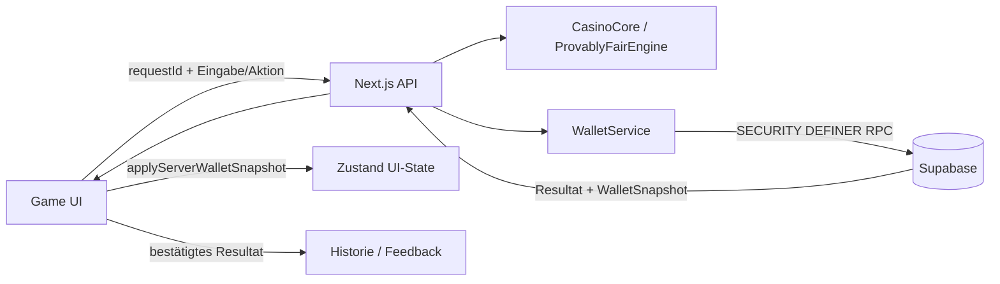

# Spielmechanik und Wallet-Architektur

Stand: 2026-08-05

## Autoritätsmodell

Supabase ist die einzige Autorität für `balance`, `xp`, `level` und `rank`. Der Browser darf diese Werte darstellen, aber weder berechnen noch persistieren. `processGameResult()` schreibt nur bestätigte Historie, Statistik, Challenges und Audio-/Win-Feedback.

## Wallet-Vertrag

`WalletSnapshot` enthält:

| Feld | Regel |
|---|---|
| `balance` | endlich, nicht negativ |
| `xp` | Integer, nicht negativ |
| `level` | Integer, mindestens 1 |
| `rank` | nicht leer |
| `transactionId` | UUID |

`applyServerWalletSnapshot()` ist der einzige Store-Einstieg. Walletfelder sind aus Zustand-Persistenz und Dev-State-Sync ausgeschlossen; Persist-Version 2 entfernt auch alte Walletfelder aus vorhandenen localStorage-Daten.

## Spielabläufe

### Dice, Roulette, Slots

1. Client erzeugt eine UUID `requestId`.
2. `/api/casino/bet` validiert Origin, Clerk-Identität, Rate-Limit und Zod-Schema.
3. Der Server berechnet das Resultat und ruft `settle_game_bet` auf.
4. Der RPC sperrt pro User, prüft Replay/Balance, schreibt `balance - bet + payout`, XP/Level/Rank und genau einen Audit-Eintrag atomar.
5. Replay derselben `(user_id, request_id)` liefert das gespeicherte Resultat.

### Crash

- `START_CRASH`: `start_game_round` belastet den Einsatz und speichert Crashpunkt/Seed serverseitig atomar.
- `CASHOUT_CRASH`: Server liest die aktive Runde, prüft den Cashout gegen den gespeicherten Crashpunkt und berechnet die Auszahlung.
- `RESOLVE_CRASH`: löst eine gecrashte Runde mit Auszahlung 0.
- Clientseitiges Debit/Credit, Rollback und Partial-Cashout sind deaktiviert.

### Blackjack und Blackjack V2

Beide Oberflächen nutzen `/api/casino/blackjack` mit `DEAL`, `HIT`, `STAND`, `DOUBLE`, `SPLIT`. Deck, Aktionen, Dealerzug und Settlement werden serverseitig berechnet. Jede Aktion trägt `roundId`, `version` und `requestId`; `advance_blackjack_round` prüft Version und Besitzer unter Lock. Double/Split belasten den Zusatzeinsatz in derselben Transaktion. Der Client erhält kein restliches Deck und sendet nie `win` oder `payout`.

## Datenbank

Migration `supabase/migrations/007_server_authority.sql` ergänzt:

- `wallet_transactions.request_id` und `result_id`;
- Unique `(user_id, request_id)`;
- `game_rounds` für Crash und Blackjack;
- `settle_game_bet`, `start_game_round`, `settle_game_round`, `advance_blackjack_round`;
- Advisory Locks, festes `search_path`, Input-Grenzen und Execute nur für `service_role`.

Die Migration ist additiv. Sie löscht keine Daten. Sie muss mit einem DDL-fähigen Zugang ausgerollt werden; der Service-Role-Key allein kann keine Migration installieren.

## Security

| Grenze | Verhalten |
|---|---|
| Admin | `/admin` nicht public; anonym → Sign-in, normal → 403, Adminrolle/Allowlist → Zugriff |
| Rate-Limit | Upstash in Production erforderlich; Development-In-Memory-Fallback |
| Provider-Ausfall | Production 503 (fail-closed) |
| CSRF | geparster Origin-Host muss exakt zum Forwarded-/Host-Header passen |
| Clerk-Webhook | Svix-Verifikation vor Rate-Limit; kein Browser-Origin erforderlich |
| Fairness-UI | Seite entfernt; `/fairness` ist 404 ohne Redirect; Engine bleibt intern |

## Retirierte Clientpfade

Folgende Funktionen erzeugen keine lokalen Walletwerte mehr und bleiben bis zu eigenen Server-RPCs fail-closed: Daily Reward, Challenge-Claim, Case Reward, Voucher, Rakeback, WalletModal-Credit/Debit sowie anonyme XP-/Walletmigration. Die alten Session-Endpunkte antworten mit 410.

## Environment

| Variable | Sichtbarkeit | Zweck |
|---|---|---|
| `NEXT_PUBLIC_SUPABASE_URL` | public | Supabase URL |
| `NEXT_PUBLIC_SUPABASE_ANON_KEY` | public | RLS-Clientzugriff |
| `SUPABASE_SERVICE_ROLE_KEY` | server-only | WalletService/RPC |
| `UPSTASH_REDIS_REST_URL`, `UPSTASH_REDIS_REST_TOKEN` | server-only | produktives Rate-Limit |
| `SUPABASE_ADMIN_EMAILS` | server-only | kommagetrennte Admin-E-Mails (Supabase Auth, ersetzt das frühere `CLERK_ADMIN_USER_IDS`) |
| `ALLOW_DEV_FALLBACK` | server-only, Development | lokaler Auth-Fallback (`dev_user_fallback`) |

`env.login` und `.env.login` existieren nicht und werden von Next.js nicht benötigt. Projektvariablen gehören in `.env.local`; dokumentierte Platzhalter gehören in `.env.example`.

## Aktuelle externe Voraussetzungen

- 3/3 Supabase-Variablen sind in `.env.local` befüllt.
- Der konfigurierte Supabase-Host war beim Read-only-Test am 2026-08-05 nicht per DNS auflösbar; Tabellen/RPC-Livestatus ist deshalb unbewiesen.
- Upstash, Admin-Allowlist und Clerk-Webhook-Secret sind lokal noch nicht konfiguriert.
- Migration 007 ist lokal implementiert, aber nicht als remote ausgerollt bestätigt.