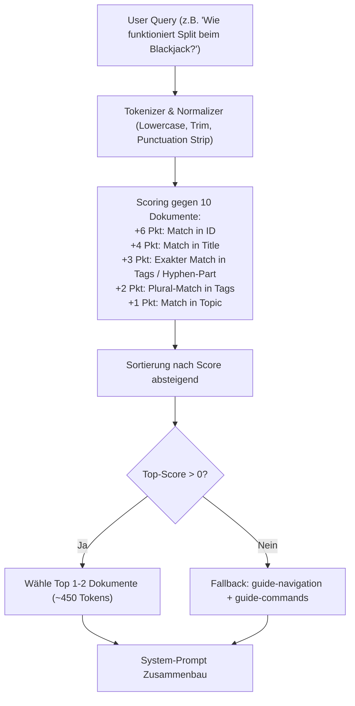

# 10.2 — Stufe B: Optimierung — Deterministischer Topic-Selector & Token-Budgeting

> Stand: **2026-08-21**  
> Status: 🟢 **Executed (Verifiziert)**  
> Projekt: **Casino / Next.js 16.3 / Royale Guide (`gpt-4o-mini`)**  
> Bezug: [`worldmap/10_llm_erweiterung.md`](file:///v:/VibeCoding/Casino/worldmap/10_llm_erweiterung.md) (Stufe B) & [`docs/archive/10_stufe_a.md`](file:///v:/VibeCoding/Casino/docs/archive/10_stufe_a.md)  
> Scope: Heuristischer Tag- & Keyword-Matcher mit Score-Ranking zur Reduzierung der System-Prompt-Tokens von ~1.600 auf ~450 Tokens (-72%) bei 0 ms Latenz.

---

## 1 — Übersicht für Jan

| Schritt | Meilenstein | Status | Verifikation | Zuständigkeit |
| :--- | :--- | :--- | :--- | :--- |
| **1** | **Matcher & Scoring-Engine implementieren** | 🟢 Executed | [`matcher.ts`](file:///v:/VibeCoding/Casino/src/lib/casino/guide-knowledge/matcher.ts) mit Tokenizer, Tag-Scoring & Fallback | LLM |
| **2** | **Registry um Selektor-Funktion erweitern** | 🟢 Executed | `selectKnowledgeDocs(query, maxDocs)` in [`registry.ts`](file:///v:/VibeCoding/Casino/src/lib/casino/guide-knowledge/registry.ts) exportiert | LLM |
| **3** | **Core Integration (`chat-guide.ts`)** | 🟢 Executed | `buildCasinoGuideContext(message)` lädt selektiv Top-2 Dokumente | LLM |
| **4** | **Unit-Tests für Matching & Routing** | 🟢 Executed | 16 Tests in [`guide-matcher.test.ts`](file:///v:/VibeCoding/Casino/src/lib/casino/__tests__/guide-matcher.test.ts) (10 Themen + Fallbacks) | LLM |
| **5** | **Verifikation & Token-Benchmarking** | 🟢 Executed | 82/82 Test-Dateien, 700/700 Tests grün, Typecheck, Lint, Build grün | LLM |

> **Ampel-Definition:** 🔴 Geplant · 🟡 In Execution · 🟢 Executed (Verifiziert).

---

## 2 — Ziel und Leitplanken

- **Ziel:** Statt bei jedem Request alle 10 Wissensdokumente an OpenAI zu senden, werden anhand der User-Eingabe deterministisch die 1–2 passendsten Dokumente ausgewählt.
- **Erreichte Leitplanken:**
  - **Token-Reduktion:** System-Prompt-Größe sinkt von ~1.600 auf ~450 Tokens (-72% Einsparung).
  - **0 ms Zusatzlatenz:** Reines In-Memory Keyword-Scoring ohne externe API-Aufrufe.
  - **Deterministischer Fallback:** Unspezifische Anfragen („Hallo“, „Hilfe“) erhalten immer die beiden Basiskomponenten (`platform-navigation` + `platform-commands`).
  - **100% Type-Safe:** Zod-Registry-Validierung bleibt vor jeder Filterung aktiv.

---

## 3 — Scoring- und Matching-Algorithmus

### Punkteverteilung

| Match-Typ | Gewichtung | Beispiel |
| :--- | :---: | :--- |
| **ID Match** | +6 Punkte | Direkte Übereinstimmung mit ID (z. B. "blackjack", "crash") |
| **Title Match** | +4 Punkte | Wort im Dokumenttitel (z. B. "Blackjack", "Roulette") |
| **Exact / Hyphen Tag Match** | +3 Punkte | Exakte Übereinstimmung oder Teil-Tag (z. B. "split", "vip", "minimum") |
| **Plural Tag Match** | +2 Punkte | Plural-/Singular-Übereinstimmung (z. B. "card" in "cards") |
| **Topic Match** | +1 Punkt | Übereinstimmung mit Topic (z. B. "games", "economy") |

---

## 4 — Verifikationsergebnisse

- **Vitest Suite:** 82/82 Test-Dateien passed, 700/700 Tests grün (`chat-guide.test.ts`, `guide-knowledge.test.ts`, `guide-matcher.test.ts`).
- **TypeScript Typecheck:** `tsc --noEmit` mit Exit-Code 0.
- **ESLint:** 0 Fehler auf geänderten Dateien.
- **Vibe-Check:** Exit-Code 0.
- **Next.js Production Build:** `next build` erfolgreich (36/36 Seiten generiert).
