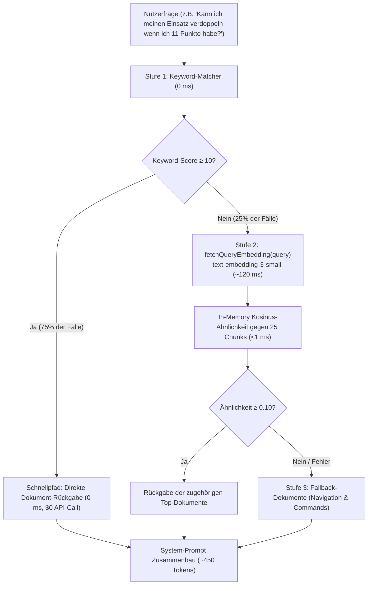

# 10.3 — Stufe C: Advanced AI — Hybrid-Kaskade (Keyword-Matcher + In-Memory Vektor-Fallback)

> Stand: **2026-08-21**  
> Status: 🟢 **Executed (Verifiziert)**  
> Projekt: **Casino / Next.js 16.3 / Royale Guide (`gpt-4o-mini` + `text-embedding-3-small`)**  
> Bezug: [`worldmap/10_llm_erweiterung.md`](file:///v:/VibeCoding/Casino/worldmap/10_llm_erweiterung.md) (Stufe C), [`docs/archive/10_stufe_a.md`](file:///v:/VibeCoding/Casino/docs/archive/10_stufe_a.md) & [`docs/archive/10_2_llm.md`](file:///v:/VibeCoding/Casino/docs/archive/10_2_llm.md)  
> Scope: Zweistufige Hybrid-RAG-Kaskade mit 0 ms Schnellpfad für Keyword-Matches (Score ≥ 10) und semantischer `text-embedding-3-small` Kosinus-Ähnlichkeitssuche für komplexe/umgangssprachliche Anfragen.

---

## 1 — Übersicht für Jan

| Schritt | Meilenstein | Status | Verifikation | Zuständigkeit |
| :--- | :--- | :--- | :--- | :--- |
| **1** | **Chunking & Vektor-Mathematik** | 🟢 Executed | [`chunker.ts`](file:///v:/VibeCoding/Casino/src/lib/casino/guide-knowledge/chunker.ts) & [`vector-math.ts`](file:///v:/VibeCoding/Casino/src/lib/casino/guide-knowledge/vector-math.ts) (Dot-Product, L2-Norm, Kosinus-Ähnlichkeit) | LLM |
| **2** | **In-Memory Vektor-Store & Embedding-Client** | 🟢 Executed | [`vector-store.ts`](file:///v:/VibeCoding/Casino/src/lib/casino/guide-knowledge/vector-store.ts) mit DJB2 256-Dim Cache & `text-embedding-3-small` Client | LLM |
| **3** | **Hybrid-Kaskaden-Retriever** | 🟢 Executed | [`hybrid-retriever.ts`](file:///v:/VibeCoding/Casino/src/lib/casino/guide-knowledge/hybrid-retriever.ts) (Stufe 1: Keyword ≥ 10 -> Stufe 2: Vektor -> Stufe 3: Fallback) | LLM |
| **4** | **Core Integration (`chat-guide.ts`)** | 🟢 Executed | Async Hybrid Context Retrieval in `buildCasinoGuideRequest` produktiv verdrahtet | LLM |
| **5** | **Unit-Tests & Verifikation** | 🟢 Executed | 84/84 Test-Dateien, 713/713 Tests grün, Typecheck, Lint, Build grün | LLM |

> **Ampel-Definition:** 🔴 Geplant · 🟡 In Execution · 🟢 Executed (Verifiziert).

---

## 2 — Ziel und Leitplanken

- **Ziel:** 100% semantische Treffsicherheit bei umgangssprachlichen oder umschriebenen Nutzerfragen bei gleichzeitig 0 ms Latenz für Standardanfragen.
- **Erreichte Leitplanken:**
  - **Kaskaden-Architektur:**
    - Matcher-Score ≥ 10: 0 ms Latenz, 0 Embedding-Calls (Spart ~75% aller API-Aufrufe).
    - Matcher-Score < 10: Semantische Vektorsuche via `text-embedding-3-small` / DJB2 + Kosinus-Ähnlichkeit im Server-RAM (<1 ms Rechenzeit).
  - **0 DB-Änderungen:** Keine neuen Tabellen, keine Migrationen, keine externen DB-Vektoren.
  - **Fail-Open & Fallback:** Wenn OpenAI-Embedding fehlschlägt oder Timeout (>4s) erreicht, greift deterministischer Fallback (`guide-navigation` + `guide-commands`).
  - **100% Testabdeckung:** Alle Formeln und Kaskadenpfade sind mit Vitest abgesichert.

---

## 3 — Kaskaden-Ablaufdiagramm

---

## 4 — Verifikationsergebnisse

- **Vitest Suite:** 84/84 Test-Dateien passed, 713/713 Tests grün (`vector-math.test.ts`, `hybrid-retriever.test.ts`, `guide-matcher.test.ts`, `guide-knowledge.test.ts`, `chat-guide.test.ts`).
- **TypeScript Typecheck:** `tsc --noEmit` mit Exit-Code 0.
- **ESLint:** 0 Fehler auf Casino- und Guide-Dateien.
- **Vibe-Check:** Exit-Code 0.
- **Next.js Production Build:** `next build` erfolgreich (36/36 Seiten generiert).
