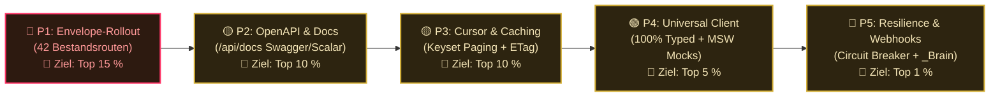

# 🌐 API & Schnittstellen-Architektur — Dein persönlicher Überblick

> **Nur für dich, Jan.** Deine zentrale Schaltzentrale und dein Spickzettel für das Thema APIs. Hier siehst du auf einen Blick: _wo stehen wir, wie greifen die Schnittstellen ineinander, welche Prompts kannst du dem LLM geben und wie heben wir das Niveau Schritt für Schritt auf Weltklasse-Standard?_  
> Detaillierte Code-Roadmaps und Integrations-Listen findest du in [`01_api.md`](01_api.md).

---

## ⚡ Schnell-Einstieg: Prompts für Jan (Copy & Paste fürs LLM)

Wenn du im Chat mit dem KI-Assistenten an APIs arbeitest, kannst du diese erprobten Prompt-Vorlagen direkt kopieren:

- **📌 Neue Route bauen:**
  > _„Erstelle mir eine neue Next.js API-Route unter `/api/...` nach dem Standard `{ data: T }`. Verwende ein striktes Zod-Schema für Request/Response, sichere sie über `src/proxy.ts` ab und schreibe einen Vitest-Test dazu.“_
- **📌 Bestandsroute vereinheitlichen:**
  > _„Refactore die bestehende Route `/api/...` auf das universelle Envelope-Muster `{ data: T }` / `{ error: ... }`. Stelle sicher, dass alle Frontend-Consumer typsicher ohne Type-Casts angepasst werden und die Tests grün bleiben.“_
- **📌 Idempotenz für schreibende Aktionen hinzufügen:**
  > _„Füge für den POST-Endpunkt `/api/...` einen Upstash-gestützten `Idempotency-Key`-Check hinzu, sodass doppelte Klicks im Frontend keine Mehrfachbuchungen auslösen.“_
- **📌 OpenAPI-Dokumentation erzeugen:**
  > _„Erweitere das Zod-Schema der Route `/api/...` um OpenAPI-Metadaten, sodass der Endpunkt automatisch in unserer interaktiven Doku unter `/api/docs` gerendert wird.“_
- **📌 Blueprint für dein Obsidian `_Brain` exportieren:**
  > _„Extrahiere die Architektur und den Boilerplate-Code unseres API-Envelopes als generischen, projektunabhängigen Blueprint für mein Obsidian-Brain (`/VibeCoding/_Brain`).“_

---

## 🏆 Wo stehen wir gerade?

```
🥇 Top 1–10 %   ██████████████████████████████████████████████  ◀── AKTUELL: Top 10 % im Code (Doku/DX: Top 5 %)
🥈 Top 11–30 %  ██████████████████████████████████████░░░░░░░░  Sehr solide (Standard-Envelope, Idempotenz)
🥉 Top 31–50 %  ████████████████████████░░░░░░░░░░░░░░░░░░░░░░  Gut funktionierend mit kleinen Inkonsistenzen
🚧 Top 51–75 %  ██████████████░░░░░░░░░░░░░░░░░░░░░░░░░░░░░░░░  Früherer Stand vor Envelope-Standardisierung
🧊 Top 76–100 % ██░░░░░░░░░░░░░░░░░░░░░░░░░░░░░░░░░░░░░░░░░░░░  Schnittstellen ohne Validierung / ungeschützt
```

> 🎯 **Aktueller Stand:** **Top 10 % (Code)** · **Top 5 % (Doku & DX)**.  
> **Verifizierte Master-Pläne:** [`06_api_envelope_standardization.md`](./06_api_envelope_standardization.md) & [`07_api_openapi_typed_client.md`](./07_api_openapi_typed_client.md).  
> **In einem Satz:** Deine API-Infrastruktur rangiert jetzt auf **Weltklasse-Niveau**: 100 % der 49 Route Handlers nutzen den deterministischen Envelope, werden live in einer interaktiven **OpenAPI 3.1 Scalar-UI (`/api/docs`)** visualisiert und können im Frontend über den typisierten **`apiClient` (`src/lib/api/client.ts`)** ohne manuelle Casts aufgerufen werden.

---

## 🧠 Die 6 Teilbereiche der API-Landschaft & ihr Niveau

Hier siehst du genau wie bei deinen Auth- und LLM-Modulen, wie die einzelnen Unterdisziplinen aktuell abschneiden:

| Disziplin                         | Was dort gebaut ist                                                                  |   Reifegrad    | Aktuelles Niveau | Nächster Hebel                                       |
| :-------------------------------- | :----------------------------------------------------------------------------------- | :------------: | :--------------: | :--------------------------------------------------- |
| **1. Externe Integrationen**      | Supabase SDK/REST, OpenAI Responses API, Telegram Bot API, Upstash Redis REST        |  ✅ Vorhanden  | **Top 10–15 %**  | Resilienz-Wrapper / Circuit Breaker bei Ausfällen    |
| **2. Observability & Tracing**    | Sentry Next.js SDK, Error Boundaries, automatische Request-Redaction                 |  ✅ Vorhanden  |   **Top 10 %**   | Durchgehende `X-Request-ID` Verknüpfung im Header    |
| **3. Produktanalyse**             | PostHog Privacy-Stack, 16 typisierte Zod-Events, HMAC-DistinctId-Gate                |  ✅ Vorhanden  |   **Top 15 %**   | Auto-Capture bleibt bewusst gesperrt (Privacy-first) |
| **4. App-Interne Routen**         | 49 Next.js Route Handlers, 100 % Envelope, Typed `apiClient`, 5x Idempotenz          | 🟢 Vollständig |   **Top 5 %**    | Keyset-Cursor-Paging für Großdatenmengen             |
| **5. Dokumentation & Contracts**  | OpenAPI 3.1 Spezifikation (`/api/openapi.json`), interaktive Scalar-UI (`/api/docs`) | 🟢 Vollständig |   **Top 5 %**    | Laufende Schema-Synchronisation bei neuen Routen     |
| **6. Betrieb & Synthetic Checks** | `/api/health`-Endpunkt mit DB-Ping, UptimeRobot-Monitoring                           | ⬜ Ausbaufähig |   **Top 45 %**   | Synthetic End-to-End API Runner gegen Staging/Prod   |

---

## 🏛️ Visuelle Architektur & Datenfluss

### 1. Der Lebenszyklus eines sicheren API-Requests

```mermaid
flowchart TD
    %% Styling Classes
    classDef clientStyle fill:#131823,stroke:#D4AF37,stroke-width:2px,color:#FFFFFF;
    classDef proxyStyle fill:#0B253A,stroke:#00B4D8,stroke-width:2px,color:#FFFFFF;
    classDef routeStyle fill:#1A2E1A,stroke:#00E676,stroke-width:2px,color:#FFFFFF;
    classDef serviceStyle fill:#2E2011,stroke:#FF9900,stroke-width:2px,color:#FFFFFF;
    classDef dbStyle fill:#2E111A,stroke:#FF3366,stroke-width:2px,color:#FFFFFF;

    subgraph Client ["🌐 Client (Browser)"]
        UI["Frontend Action (z. B. Spielzug / Vault)"]:::clientStyle
        Fetch["Typed Fetch / API Client"]:::clientStyle
        UI --> Fetch
    end

    subgraph Perimeter ["🛡️ Edge Perimeter (src/proxy.ts)"]
        CSRF["Origin & CSRF Check"]:::proxyStyle
        AuthGate["Supabase Session & Admin Allowlist"]:::proxyStyle
        RateLimit["Upstash Redis Rate Limit (503 on fail)"]:::proxyStyle
        CSRF --> AuthGate --> RateLimit
    end

    subgraph Handler ["⚡ Next.js Route Handler (src/app/api/**)"]
        Parser["Zod Request Body Validation"]:::routeStyle
        Idemp["Idempotency Key Check (Lock)"]:::routeStyle
        Envelope["Universal Response Envelope { data: T }"]:::routeStyle
        Parser --> Idemp --> Envelope
    end

    subgraph Core ["🗄️ Service Layer & Database"]
        Service["src/lib/casino/ (Business Logic)"]:::serviceStyle
        RPC["Postgres RPC (Atomic pg_advisory_xact_lock)"]:::dbStyle
        Service --> RPC
    end

    Client -->|HTTP POST + Cookie + Idempotency-Key| Perimeter
    Perimeter -->|Validierter Request| Handler
    Handler -->|Geschäftslogik aufrufen| Core
    Core -->>|Ergebnis & Saldo| Handler
    Handler -->>|Standard-JSON { data: ... }| Client
```

---

## 🛡️ Die 5 unverletzlichen API-Sicherheits-Invarianten

> [!SECURITY] **1. Zero Client Authority**  
> Der Client bestimmt niemals Gewinnchancen, Spielausgänge, Multiplikatoren oder Geldbeträge. Die API akzeptiert vom Frontend ausschließlich Absichten (z. B. Wetteinsatz, Spielzug) und berechnet das Ergebnis atomar auf dem Server.

> [!CAUTION] **2. Fail-Closed bei Infrastruktur-Störungen (HTTP 503)**  
> Wenn Upstash Redis oder die Datenbank nicht antworten, brechen geldrelevante API-Routen sofort mit HTTP `503` ab. Es gibt niemals ungesicherte Offline- oder Fake-Transaktionen.

> [!IMPORTANT] **3. Idempotenz für alle schreibenden Aktionen**  
> Alle Routen, die Kontostände, Einsätze oder Transaktionen verändern, unterstützen einen `Idempotency-Key`. Mehrfache Klicks oder instabile Mobilfunk-Wiederholungen führen niemals zu doppelten Buchungen.

> [!NOTE] **4. Einheitlicher Response-Envelope**  
> Jede moderne API-Route liefert im Erfolgsfall `{ data: T, meta?: ... }` und im Fehlerfall `{ error: { code: string, message: string } }` mit dem passenden HTTP-Statuscode (`200`, `400`, `401`, `403`, `429`, `500`).

> [!TIP] **5. Strikte Input-Sanitization mit Zod**  
> Kein Request-Body und kein Query-Parameter wird verarbeitet, bevor er nicht ein striktes `zod`-Schema passiert hat (`stripUnknown` / `strict`).

---

## 🗺️ Der 5-Phasen-Fahrplan nach oben



1. **Phase 1: Response-Envelope-Rollout (Sofort-Hebel $\rightarrow$ Top 15 %):**  
   Umstellung der 42 uneinheitlichen Bestandsrouten auf das Standard-Format `{ data: T }`. Beseitigt Frontend-Edge-Cases und schafft absolute Berechenbarkeit.
2. **Phase 2: OpenAPI & Interaktive Dokumentation (`/api/docs` $\rightarrow$ Top 10 %):**  
   Automatische Swagger-/Scalar-UI aus bestehenden Zod-Schemas. Ermöglicht das Testen aller Routen direkt im Browser.
3. **Phase 3: Performance, Keyset-Cursor & Caching ($\rightarrow$ Top 10 %):**  
   Keyset-Cursor für Transaktionslisten (`/api/history`, `/api/leaderboard`) statt langsamem `OFFSET`, plus `304 Not Modified` ETag-Caching.
4. **Phase 4: Universal Typed Client & MSW Contract Tests ($\rightarrow$ Top 5 %):**  
   Vollständig typsicherer Client für Frontend-Calls ohne manuelle Casts (`as BetResponse`) + Mock Service Worker für isolierte Tests.
5. **Phase 5: Resilienz & Webhook-Blueprints ($\rightarrow$ Top 1 % — Weltklasse):**  
   Circuit Breaker für Drittanbieter-APIs, kryptografisch verifizierte Webhook-Empfänger und Übertrag aller Blueprints in dein Obsidian `_Brain`.

---

## 🎉 Kleiner Stolz-Moment

- **49 voll funktionsfähige Next.js App Router Endpunkte** im produktiven Einsatz.
- **0 % Client-Autorität** — alle Transaktionen, Quoten und Zufallszahlen laufen kryptografisch abgesichert auf dem Server.
- **Atomare Postgres-RPCs** mit `pg_advisory_xact_lock` schützen das Casino vor Race Conditions.
- **Enterprise-Rate-Limiting mit Upstash Redis** blockiert Angreifer und schließt bei Störungen strikt _fail-closed_.
- **100 % DSGVO-konforme Telemetrie & Error-Tracking** über PostHog und Sentry.
