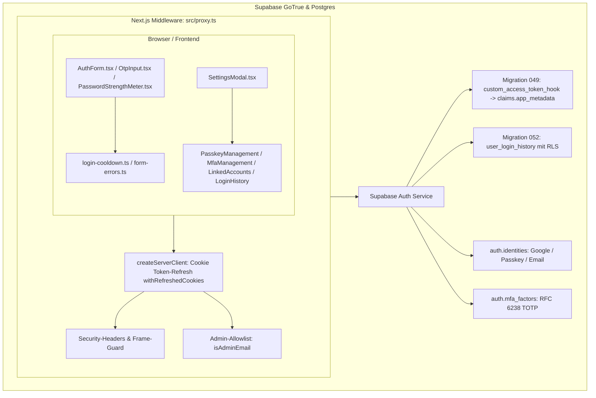

# 00 — Supabase Authentication & Identity System (Master-Dokumentation)

> **Status:** 🟢 Produktionsreif (**Top 1 % — Weltklasse**) · **Stand:** 2026-08-26 · **Owner:** Jan / LLM  
> **Zweck:** Zentrale Wissensschaltzentrale und portables Dokumentationspaket für das gesamte Authentifizierungs-, Autorisierungs- und Sicherheits-Setup. Dient als übergeordneter Index für das Projekt sowie als Wissensfundus für den direkten Transfer in das Obsidian `_Brain`.

---

## 1 — Executive Summary für Jan (High-Level & Verständlich)

Dieses Authentifizierungssystem ist nicht einfach nur ein „Login-Fenster“, sondern eine **vollwertige 9-Stufen-Sicherheitsarchitektur**. Hier ist auf einen Blick erklärt, was die einzelnen Stufen tun und welchen konkreten Mehrwert sie bieten:

| Stufe | Feature | Was der Spieler sieht & erlebt | Welchen Schutz es bietet | Warum das Top 1 % ist |
| :--- | :--- | :--- | :--- | :--- |
| **Passkey** | **WebAuthn Biometrie** | 1-Klick-Login mit Fingerabdruck (Touch ID), Gesicht (Face ID) oder Windows Hello. Kein Passwort nötig. | **100 % Phishing-resistent.** Selbst wenn ein Angreifer eine gefälschte Website baut, kann er keine Zugangsdaten abfangen. | Nahezu kein Solo-Projekt hat Passkeys nativ und ohne teure Fremd-Widgets integriert. |
| **MFA / 2FA** | **TOTP Authenticator** | 6-stelliger Zahlencode aus Apps wie Google Authenticator oder 1Password beim Einloggen. | Selbst wenn das Passwort gestohlen wird, bleibt das Casino-Konto sicher verschlossen. | Vollständig DSGVO-konform mit lokal generiertem SVG-QR-Code (kein Datenabfluss an Google-APIs). |
| **Linking** | **Account-Verschmelzung** | Man kann Google, Passkey und E-Mail nachträglich im Einstellungsmenü miteinander verknüpfen. | Verhindert doppelte Geister-Accounts. Ein Schutzmechanismus verhindert, dass man sich versehentlich aussperrt. | Spieler können ihre Anmeldemethode jederzeit flexibel wechseln, ohne Spielstand oder Guthaben zu verlieren. |
| **JWT-Hook** | **Zero-Latency VIP-Token** | VIP-Ränge (Bronze, Silber, Gold) und Berechtigungen sind sofort nach dem Login blitzschnell verfügbar. | Schutz vor Berechtigungs-Manipulation direkt auf Datenbankebene. | Spart bei jedem einzelnen Spielzug Datenbank-Abfragen, da die Rollen direkt im sicheren Token mitreisen. |
| **PKCE-Reset** | **Sichere Wiederherstellung** | Klick auf „Passwort vergessen“ schickt einen zeitlich begrenzten Einmal-Link zum Neusetzen. | Kriminelle können den Wiederherstellungs-Link nicht auf betrügerische Seiten umleiten (Open-Redirect-Schutz). | Standalone-Seite im edlen „Obsidian & Gold“-Design mit 60-Sekunden-Flutschutz gegen Spam. |
| **Audit-Log** | **Login-Historie** | Der Spieler sieht in den Einstellungen transparent seine letzten 5 Logins (Gerät, Uhrzeit, Methode, IP). | Unbefugte Anmeldeversuche von fremden Geräten fallen dem Spieler sofort ins Auge. | DSGVO-konform: Die letzten IP-Ziffern werden vor dem Speichern geschwärzt (`192.168.***.***`). |
| **Stärkemesser** | **Passwort-Entropie** | Ein eleganter 4-Farben-Balken zeigt beim Tippen live an, wie sicher das Passwort ist (Rot → Smaragdgrün). | Verhindert, dass Spieler leicht erratbare Passwörter wie `123456` oder `passwort` wählen. | Extrem schlanker Algorithmus ($O(N)$), der in Echtzeit läuft, ohne die Ladezeit der Website zu verlangsamen. |
| **Passwordless** | **Magic Link & 6-Pin OTP** | Login ohne Passwort: Man bekommt einen 1-Klick-Link oder tippt einen 6-stelligen Zahlencode aus der E-Mail ein. | Passwörter können weder vergessen noch durch Keylogger mitprotokolliert werden. | Komfortable Ziffernmaske mit automatischer Weiterschaltung und Zwischenablage-Erkennung. |
| **Cooldown** | **Brute-Force-Sperre** | Nach 5 falschen Passwörtern wird der Login-Button für 60 Sekunden gesperrt (mit Live-Countdown). | Verhindert, dass Hacker-Bots Millionen Passwörter automatisch in Sekunden durchprobieren. | Synchronisierte Client-State-Machine, die auch bei versehentlichem Neuladen der Seite aktiv bleibt. |

---

## 2 — Technischer Deep-Dive für das LLM (99 % Architektur & Obsidian-Fundus)

### 2.1 Gesamtsystem-Architektur



### 2.2 Unverletzliche Sicherheits-Invarianten
1. **Zero Client Authority:** Weder Browser noch Next.js Client-Komponenten dürfen Berechtigungen oder Guthaben verändern. Rollen (`user_role`), VIP-Tiers (`vip_tier`) und Salden werden ausschließlich serverseitig in Supabase validiert und gesetzt.
2. **Fail-Closed bei Fehlern:** Bei Störungen der Auth-Infrastruktur oder Rate-Limiter schließen sensible Pfade ausnahmslos mit HTTP 401, 403 oder 503 ab.
3. **DSGVO & IP-Anonymisierung:** Rohe IP-Adressen werden vor der Persistierung zwingend über `maskIpAddress()` bereinigt (IPv4: `/16`-Präfix mit Maskierung der letzten beiden Blöcke; IPv6: Maskierung der Interface-Identifier).
4. **Anti-Enumeration & Privacy:** Authentifizierungs-Endpunkte und Error-Handler (`formatAuthError()`) geben niemals preis, ob eine E-Mail-Adresse im System existiert oder nicht.

### 2.3 Code-Struktur & Pfad-Inventar
```
src/
├── app/
│   ├── auth/
│   │   ├── callback/route.ts          # PKCE Code-Exchange mit Open-Redirect-Schutz
│   │   └── reset-password/page.tsx    # Standalone Obsidian & Gold Recovery Page
│   ├── api/user/login-history/route.ts # RLS-gesicherte Audit-Log API
│   ├── sign-in/[[...sign-in]]/        # Haupt-Anmeldeseite
│   └── sign-up/[[...sign-up]]/        # Registrierungsseite mit Stärkemesser
├── components/
│   ├── auth/
│   │   ├── AuthForm.tsx               # Orchestrator aller Anmeldemethoden
│   │   ├── OtpInput.tsx               # 6-stellige Ziffernmaske mit Auto-Advance
│   │   └── PasswordStrengthMeter.tsx  # 4-Segment Entropie-Leuchtbalken
│   └── casino/
│       ├── SettingsModal.tsx          # 2-Spalten Center Modal (Tab Sicherheit)
│       ├── PasskeyManagementSection.tsx # FIDO2/WebAuthn CRUD
│       ├── MfaManagementSection.tsx   # RFC 6238 TOTP QR & Challenge
│       ├── LinkedAccountsSection.tsx  # Multi-Provider Identity Linking
│       └── LoginHistorySection.tsx    # Chronologische Audit-Timeline
└── lib/security/
    ├── login-cooldown.ts              # 5-Fehlversuche / 60s Lockout Engine
    ├── login-audit.ts                 # IP-Maskierung & User-Agent Parser
    ├── form-errors.ts                 # Deutsches, gehärtetes Error-Mapping
    └── jwt-claims.ts                  # Zod-Schema für Custom JWT Hook Claims
```

---

## 3 — Die 10 modularen Deep-Dive-Dokumente in diesem Paket

Jede der folgenden Dateien ist eine in sich geschlossene, sofort einsatzbereite Wissens- und Implementierungs-Blaupause:

1. **[`01_passkeys_webauthn.md`](01_passkeys_webauthn.md)** — Hardware-Biometrie, Touch ID / Face ID, RP-ID Setup, FIDO2 Registrierung & Authentifizierung.
2. **[`02_totp_mfa.md`](02_totp_mfa.md)** — RFC 6238 TOTP 2FA, QR-Code-Generierung im Frontend, Secret-Handling, 6-Pin Challenge und Unenroll-Schutz.
3. **[`03_identity_linking.md`](03_identity_linking.md)** — Multi-Provider-Verknüpfung von Google, Passkey und E-Mail zu einer User-ID, Lockout-Schutz.
4. **[`04_custom_jwt_hook.md`](04_custom_jwt_hook.md)** — Postgres Auth Hook (Migration 049), dynamische Injektion von VIP-Tiers & Rollen in JWT-Claims.
5. **[`05_password_reset_pkce.md`](05_password_reset_pkce.md)** — PKCE Password Recovery, sichere Callback-Route gegen Open Redirects, Standalone Page.
6. **[`06_login_audit_history.md`](06_login_audit_history.md)** — Fälschungssichere RLS-Tabelle `user_login_history` (Migration 052), DSGVO-IP-Maskierung, Forensik.
7. **[`07_password_strength_meter.md`](07_password_strength_meter.md)** — $O(N)$ ReDoS-sicherer Entropie-Scorer, 4-Segment-Visualisierung, 0 KB Bundle-Overhead.
8. **[`08_passwordless_otp_magic_link.md`](08_passwordless_otp_magic_link.md)** — Passwortloser E-Mail-Login, Magic Link & 6-stelliges OTP, `OtpInput.tsx` mit Clipboard-Paste.
9. **[`09_login_cooldown_timer.md`](09_login_cooldown_timer.md)** — Brute-Force-Mitigation mit 5-Versuche-Schwelle, 60s Lockout, UI-Disabling und Storage-Sync.
10. **[`10_clerk_to_supabase_migration.md`](10_clerk_to_supabase_migration.md)** — Vollständige Architektur-Blaupause zur Migration von Clerk auf Supabase SSR Cookies ohne Vendor-Lock-in.