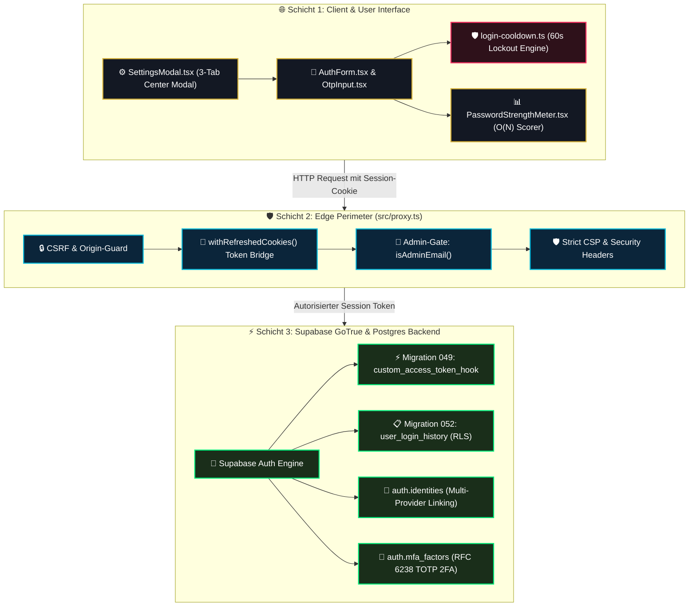
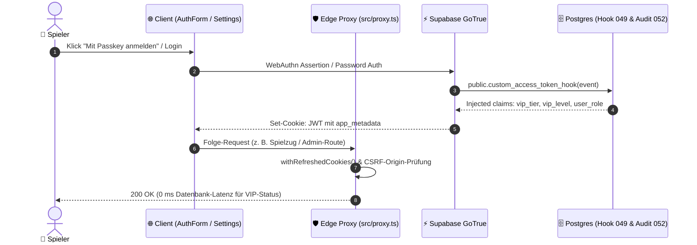

# 00 — Supabase Authentication & Identity System (Master-Dokumentation)

> **Status:** 🟢 Produktionsreif (**Top 1 % — Weltklasse**) · **Stand:** 2026-08-27 · **Owner:** Jan / LLM  
> **Zweck:** Zentrale Wissensschaltzentrale und portables Dokumentationspaket für das gesamte Authentifizierungs-, Autorisierungs- und Sicherheits-Setup. Dient als übergeordneter Index für das Projekt sowie als Wissensfundus für den direkten Transfer in das Obsidian `_Brain`.

---

## 1 — Executive Summary für Jan (High-Level & Verständlich)

Dieses Authentifizierungssystem ist nicht einfach nur ein „Login-Fenster“, sondern eine **vollwertige 9-Säulen-Sicherheitsarchitektur**. Hier ist auf einen Blick erklärt, was die einzelnen Säulen tun und welchen konkreten Schutz sie bieten:

| Stufe            | Feature                       | Was der Spieler sieht & erlebt                                                                                  | Welchen Schutz es bietet                                                                                                   | Warum das Top 1 % ist                                                                                        |
| :--------------- | :---------------------------- | :-------------------------------------------------------------------------------------------------------------- | :------------------------------------------------------------------------------------------------------------------------- | :----------------------------------------------------------------------------------------------------------- |
| **Passkey**      | **WebAuthn Biometrie**        | 1-Klick-Login mit Fingerabdruck (Touch ID), Gesicht (Face ID) oder Windows Hello. Kein Passwort nötig.          | **100 % Phishing-resistent.** Selbst wenn ein Angreifer eine gefälschte Website baut, kann er keine Zugangsdaten abfangen. | Nahezu kein Solo-Projekt hat Passkeys nativ und ohne teure Fremd-Widgets integriert.                         |
| **MFA / 2FA**    | **TOTP Authenticator**        | 6-stelliger Zahlencode aus Apps wie Google Authenticator oder 1Password beim Einloggen.                         | Selbst wenn das Passwort gestohlen wird, bleibt das Casino-Konto sicher verschlossen.                                      | Vollständig DSGVO-konform mit lokal generiertem SVG-QR-Code (kein Datenabfluss an Google-APIs).              |
| **Linking**      | **Account-Verschmelzung**     | Man kann Google, Passkey und E-Mail nachträglich im Einstellungsmenü miteinander verknüpfen.                    | Verhindert doppelte Geister-Accounts. Ein Schutzmechanismus verhindert, dass man sich versehentlich aussperrt.             | Spieler können ihre Anmeldemethode jederzeit flexibel wechseln, ohne Spielstand oder Guthaben zu verlieren.  |
| **JWT-Hook**     | **Zero-Latency VIP-Token**    | VIP-Ränge (Bronze, Silber, Gold) und Berechtigungen sind sofort nach dem Login blitzschnell verfügbar.          | Schutz vor Berechtigungs-Manipulation direkt auf Datenbankebene.                                                           | Spart bei jedem einzelnen Spielzug Datenbank-Abfragen, da die Rollen direkt im sicheren Token mitreisen.     |
| **PKCE-Reset**   | **Sichere Wiederherstellung** | Klick auf „Passwort vergessen“ schickt einen zeitlich begrenzten Einmal-Link zum Neusetzen.                     | Kriminelle können den Wiederherstellungs-Link nicht auf betrügerische Seiten umleiten (Open-Redirect-Schutz).              | Standalone-Seite im edlen „Obsidian & Gold“-Design mit 60-Sekunden-Flutschutz gegen Spam.                    |
| **Audit-Log**    | **Login-Historie**            | Der Spieler sieht in den Einstellungen transparent seine letzten 5 Logins (Gerät, Uhrzeit, Methode, IP).        | Unbefugte Anmeldeversuche von fremden Geräten fallen dem Spieler sofort ins Auge.                                          | DSGVO-konform: Die letzten IP-Ziffern werden vor dem Speichern geschwärzt (`192.168.***.***`).               |
| **Stärkemesser** | **Passwort-Entropie**         | Ein eleganter 4-Farben-Balken zeigt beim Tippen live an, wie sicher das Passwort ist (Rot → Smaragdgrün).       | Verhindert, dass Spieler leicht erratbare Passwörter wie `123456` oder `passwort` wählen.                                  | Extrem schlanker Algorithmus ($O(N)$), der in Echtzeit läuft, ohne die Ladezeit der Website zu verlangsamen. |
| **Passwordless** | **Magic Link & 6-Pin OTP**    | Login ohne Passwort: Man bekommt einen 1-Klick-Link oder tippt einen 6-stelligen Zahlencode aus der E-Mail ein. | Passwörter können weder vergessen noch durch Keylogger mitprotokolliert werden.                                            | Komfortable Ziffernmaske mit automatischer Weiterschaltung und Zwischenablage-Erkennung.                     |
| **Cooldown**     | **Brute-Force-Sperre**        | Nach 5 falschen Passwörtern wird der Login-Button für 60 Sekunden gesperrt (mit Live-Countdown).                | Verhindert, dass Hacker-Bots Millionen Passwörter automatisch in Sekunden durchprobieren.                                  | Synchronisierte Client-State-Machine, die auch bei versehentlichem Neuladen der Seite aktiv bleibt.          |

---

## 2 — Technischer Deep-Dive für das LLM (99 % Architektur & Obsidian-Fundus)

### 2.1 Gesamtsystem-Architektur & Datenfluss

#### System-Flussdiagramm („Obsidian & Gold“ Theme)

#### Sequenz-Diagramm: Authentifizierungs- & VIP-Claim-Lebenszyklus

---

### 2.2 Unverletzliche Sicherheits-Invarianten (Obsidian Callouts)

> [!SECURITY] **1. Zero Client Authority**  
> Weder Browser noch Next.js Client-Komponenten dürfen Berechtigungen oder Guthaben verändern. Rollen (`user_role`), VIP-Tiers (`vip_tier`) und Salden werden **ausschließlich serverseitig** in Supabase validiert und gesetzt.

> [!CAUTION] **2. Fail-Closed bei Fehlern**  
> Bei Störungen der Auth-Infrastruktur oder Rate-Limiter schließen sensible Pfade ausnahmslos mit HTTP `401`, `403` oder `503`. Es gibt **keine stillschweigenden Standardfreigaben**.

> [!NOTE] **3. DSGVO & IP-Anonymisierung**  
> Rohe IP-Adressen werden vor der Persistierung zwingend über `maskIpAddress()` bereinigt (IPv4: `/16`-Präfix `192.168.***.***`; IPv6: Interface-Identifier geschwärzt).

> [!TIP] **4. Anti-Enumeration & Privacy**  
> Authentifizierungs-Endpunkte und Error-Handler (`formatAuthError()`) geben niemals preis, ob eine E-Mail-Adresse im System existiert oder nicht.

---

### 2.3 Visuelle Komponenten-Matrix & Code-Pfade

| Schicht               | Datei / Komponente                                                                 | Rolle & Schutzmechanismus                                                | Z-Index / Kontext |
| :-------------------- | :--------------------------------------------------------------------------------- | :----------------------------------------------------------------------- | :---------------- |
| **🌐 Edge Perimeter** | [`src/proxy.ts`](../../src/proxy.ts)                                               | CSRF-Origin-Guard, `withRefreshedCookies()`, CSP-Header, Admin-Gate      | Middleware        |
| **🎨 Auth UI**        | [`AuthForm.tsx`](../../src/components/auth/authform.tsx)                           | Orchestrator aller Login-Methoden (Passkeys, Passwort, OTP, Google)      | `z-10`            |
| **⚡ PIN-Maske**      | [`OtpInput.tsx`](../../src/components/auth/otpinput.tsx)                           | 6-Ziffern PIN-Maske mit Auto-Advance & Clipboard-Paste                   | In-Form           |
| **📊 Stärke-Balken**  | [`PasswordStrengthMeter.tsx`](../../src/components/auth/passwordstrengthmeter.tsx) | $O(N)$ ReDoS-sicherer 4-Segment Entropie-Leuchtbalken                    | Live DOM          |
| **⚙️ Settings Hub**   | [`SettingsModal.tsx`](../../src/components/casino/settingsmodal.tsx)               | 2-Spalten Center-Modal (740×480px, Backdrop-Blur 12px)                   | `z-50`            |
| **🛡️ Security Libs**  | `src/lib/security/*`                                                               | `login-cooldown.ts`, `login-audit.ts`, `jwt-claims.ts`, `form-errors.ts` | Zero-Dep Libs     |
| **🗄️ Database**       | `supabase/migrations/*`                                                            | Migration 049 (JWT Hook) & 052 (DSGVO Login History RLS)                 | Postgres SQL      |

---

## 3 — Die 13 modularen Deep-Dive-Dokumente (Modul-Navigator)

Jede der folgenden Dateien ist eine in sich geschlossene, sofort einsatzbereite Wissens- und Implementierungs-Blaupause mit vollständigen TypeScript/SQL-Code-Snippets, Zod-Schemas, Fehler-Mappings, Checklisten und Pitfall-Warnungen:

### Fundament & Basis-Layer

| Modul                                              | Typ         | Primärer Fokus                                      | Kern-Datei     |
| :------------------------------------------------- | :---------- | :-------------------------------------------------- | :------------- |
| **[`00_baseline_auth.md`](./00_baseline_auth.md)** | `Fundament` | E-Mail/Passwort (Bcrypt) & Google OAuth (PKCE Flow) | `AuthForm.tsx` |

### Die 9 produktiven Sicherheits-Säulen

| Modul                                                                          | Typ       | Primärer Fokus                                           | Kern-Datei                  |
| :----------------------------------------------------------------------------- | :-------- | :------------------------------------------------------- | :-------------------------- |
| **[`01_passkeys_webauthn.md`](./01_passkeys_webauthn.md)**                     | `Säule 1` | Biometrie (Touch ID / Face ID), 100 % Phishing-resistent | `client.ts`                 |
| **[`02_totp_mfa.md`](./02_totp_mfa.md)**                                       | `Säule 2` | RFC 6238 TOTP 2FA mit Offline-SVG QR (0 KB Leak)         | `MfaManagementSection.tsx`  |
| **[`03_identity_linking.md`](./03_identity_linking.md)**                       | `Säule 3` | Multi-Provider Konto-Verknüpfung + Anti-Lockout          | `LinkedAccountsSection.tsx` |
| **[`04_custom_jwt_hook.md`](./04_custom_jwt_hook.md)**                         | `Säule 4` | Postgres Auth Hook (049) für VIP-Claims (0 ms Latenz)    | `jwt-claims.ts`             |
| **[`05_password_reset_pkce.md`](./05_password_reset_pkce.md)**                 | `Säule 5` | PKCE Reset Flow mit Open-Redirect-Schutz (`//evil.com`)  | `reset-password/page.tsx`   |
| **[`06_login_audit_history.md`](./06_login_audit_history.md)**                 | `Säule 6` | Fälschungssichere RLS-Tabelle (052) mit DSGVO-IP-Masking | `login-audit.ts`            |
| **[`07_password_strength_meter.md`](./07_password_strength_meter.md)**         | `Säule 7` | $O(N)$ ReDoS-sicherer Entropie-Scorer (0 KB npm)         | `password-strength.ts`      |
| **[`08_passwordless_otp_magic_link.md`](./08_passwordless_otp_magic_link.md)** | `Säule 8` | Magic Link & 6-Pin OTP mit Auto-Advance PIN-Maske        | `OtpInput.tsx`              |
| **[`09_login_cooldown_timer.md`](./09_login_cooldown_timer.md)**               | `Säule 9` | Brute-Force-Mitigation (5 Versuche → 60s Lockout)        | `login-cooldown.ts`         |

### Architektur-Blaupausen, UI-System & Security-Perimeter

| Modul                                                                          | Typ         | Primärer Fokus                                      | Kern-Datei          |
| :----------------------------------------------------------------------------- | :---------- | :-------------------------------------------------- | :------------------ |
| **[`10_clerk_to_supabase_migration.md`](./10_clerk_to_supabase_migration.md)** | `Blueprint` | 10-Schritte Migration Clerk → Supabase SSR Cookies  | `src/proxy.ts`      |
| **[`11_settings_modal_architecture.md`](./11_settings_modal_architecture.md)** | `UI Hub`    | Dual-Mode Quick Popover vs. 3-Tab Center Modal      | `SettingsModal.tsx` |
| **[`12_middleware_proxy_csp.md`](./12_middleware_proxy_csp.md)**               | `Perimeter` | Next.js Edge Middleware, CSP-Header, Cookie-Refresh | `src/proxy.ts`      |
