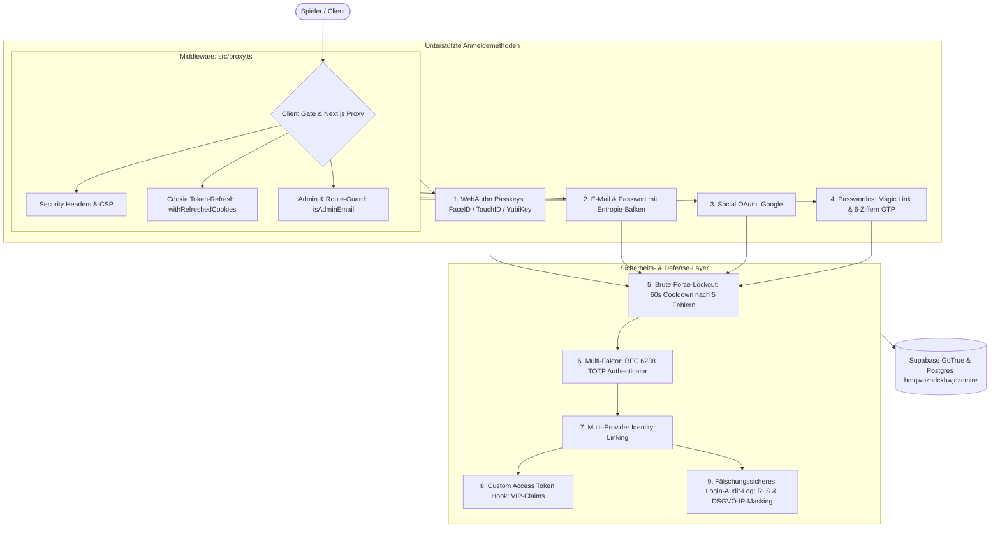

# 20 — Supabase Authentication & Identity System (Kanonische Dokumentation)

> **Status:** 🟢 Executed / Produktionsreif (**Top 1 % — Weltklasse**) · **Stand:** 2026-08-26 · **Owner:** Jan / LLM  
> **Geltungsbereich:** Lokale Spezifikation der Authentifizierungsarchitektur. Das kanonische, git-versionierte Wissens-Paket für Obsidian `_Brain` liegt in [`00_AUTH_OVERVIEW.md`](./00_auth_overview.md). Alle 9 Ausbaustufen sind umgesetzt, automatisiert getestet, durch dedizierte Security-Audits mit **PASS** freigegeben und in Produktion verifiziert.

---

## 1 — Architektur-Übersicht

Das Authentifizierungssystem basiert auf nativem **Supabase GoTrue** mit strikter Cookie-basierter Session-Verwaltung über `@supabase/ssr`, Next.js 16.3 App Router Middleware (`src/proxy.ts`) und einem gehärteten Service-Layer.



---

## 2 — Die 9 produktiven Authentifizierungs-Säulen

| Säule | Feature                             | Technische Implementierung                                                                           | Sicherheit & Schutzwirkung                                                                                                                                      | Status      | Detail-Nachweis                                                                      |
| ----- | ----------------------------------- | ---------------------------------------------------------------------------------------------------- | --------------------------------------------------------------------------------------------------------------------------------------------------------------- | ----------- | ------------------------------------------------------------------------------------ |
| **1** | **WebAuthn Passkeys**               | `signInWithPasskey()`, `registerPasskey()` in `AuthForm.tsx` & `PasskeyManagementSection.tsx`        | Phishing-resistent, Hardware-Biometrie (Touch ID / Face ID), Zero-Credential-Exposure auf Server.                                                               | 🟢 Executed | [`docs/auth/01_passkeys_webauthn.md`](./01_passkeys_webauthn.md)                     |
| **2** | **TOTP Multi-Faktor (MFA / 2FA)**   | `supabase.auth.mfa.*` in `MfaManagementSection.tsx` (`SettingsModal.tsx`)                            | RFC 6238 Standard, Inline-SVG QR-Code, 6-stellige PIN-Challenge, Unlink-/Unenroll-Schutz.                                                                       | 🟢 Executed | [`docs/auth/02_totp_mfa.md`](./02_totp_mfa.md)                                       |
| **3** | **Multi-Provider Identity Linking** | `linkIdentity()`, `unlinkIdentity()` in `LinkedAccountsSection.tsx`                                  | Verknüpft Google, Passkey und E-Mail zu einer `user_id`. Atomarer Account-Lockout-Schutz (`identities.length <= 1` Guard).                                      | 🟢 Executed | [`docs/auth/03_identity_linking.md`](./03_identity_linking.md)                       |
| **4** | **Custom JWT Access Token Hook**    | Migration `049_custom_access_token_hook.sql`, `src/lib/security/jwt-claims.ts`                       | Postgres-Hook injiziert `vip_tier`, `vip_level`, `user_role` direkt in JWT `claims.app_metadata`. Spart DB-Roundtrips, fail-safe mit Exception-Handler.         | 🟢 Executed | [`docs/auth/04_custom_jwt_hook.md`](./04_custom_jwt_hook.md)                         |
| **5** | **Passwort-Reset (PKCE)**           | `resetPasswordForEmail()` / `/auth/reset-password`, `/auth/callback`                                 | Standalone Obsidian & Gold UI, PKCE-Code Exchange, strikte Relative-Redirects gegen Open-Redirect-Phishing, 60s Request-Cooldown.                               | 🟢 Executed | [`docs/auth/05_password_reset_pkce.md`](./05_password_reset_pkce.md)                 |
| **6** | **Auth Audit-Log & Login-Historie** | Migration `052_user_login_history.sql`, `src/lib/security/login-audit.ts`, `LoginHistorySection.tsx` | Fälschungssichere Postgres-Tabelle mit RLS, DSGVO-konforme IP-Maskierung (`192.168.***.***`), sicheres User-Agent-Parsing, Erfassung aller 4 Methoden.          | 🟢 Executed | [`docs/auth/06_login_audit_history.md`](./06_login_audit_history.md)                 |
| **7** | **Passwort-Stärke-Messung**         | `src/lib/security/password-strength.ts`, `PasswordStrengthMeter.tsx`                                 | Zero-Dependency Entropie-Scorer ($O(N)$ ReDoS-sicher), 4-Segment Leuchtbalken (Rot → Gelb → Gold → Smaragd), 0 KB Bundle-Overhead.                              | 🟢 Executed | [`docs/auth/07_password_strength_meter.md`](./07_password_strength_meter.md)         |
| **8** | **Passwortloser E-Mail-Login**      | `signInWithOtp()`, `verifyOtp()` in `AuthForm.tsx`, `OtpInput.tsx`                                   | 1-Klick Magic Link oder 6-stelliger Einmal-Code. Ziffernmaske mit Auto-Advance & Clipboard-Paste, Zod-Events, 60s Resend-Cooldown.                              | 🟢 Executed | [`docs/auth/08_passwordless_otp_magic_link.md`](./08_passwordless_otp_magic_link.md) |
| **9** | **Login-Abkühlpause (Cooldown)**    | `src/lib/security/login-cooldown.ts`, `AuthForm.tsx`                                                 | 5 Fehlversuche → 60 Sekunden Lockout. Deaktiviertes Passwortfeld & Button (`Sperre aktiv (XXs)`), persistenter Browser-Storage, automatischer Reset bei Erfolg. | 🟢 Executed | [`docs/auth/09_login_cooldown_timer.md`](./09_login_cooldown_timer.md)               |

---

## 3 — Sicherheits-Invarianten & Richtlinien

1. **Zero Client Authority:**  
   Browser-Clients besitzen 0 % Berechtigung für Wallet-Guthaben oder Rollenvergabe. Alle Transaktionen und VIP-Status-Updates laufen server-authoritativ über Supabase-RPCs oder den Service-Role-Client.
2. **Fail-Closed Policy:**  
   Bei Datenbankfehlern, Netzwerkabbrüchen oder Rate-Limit-Überschreitungen schließen API-Routen strikt mit HTTP 401/403/503. Es gibt keine stillschweigenden Standardfreigaben.
3. **DSGVO & PII-Schutz:**
   - IP-Adressen werden vor dem Speichern in `public.user_login_history` zwingend maskiert (letzte 2 Oktette bei IPv4: `192.168.***.***`, Interface-ID bei IPv6).
   - Analytics-Payloads (`src/lib/analytics/events.ts`) enthalten niemals Klartext-Passwörter, E-Mails oder Salden.
4. **Anti-Enumeration:**  
   Fehlermeldungen bei Login, Passwort-Reset und OTP unterscheiden nicht zwischen existierenden und nicht-existierenden E-Mail-Adressen (`formatAuthError` / `form-errors.ts`).

---

## 4 — Zentrale Code-Pfade & Komponenten

```
src/
├── app/
│   ├── auth/
│   │   ├── callback/route.ts       # PKCE-Exchange & Open-Redirect-Schutz
│   │   └── reset-password/page.tsx # Standalone Password Recovery
│   ├── api/user/login-history/     # GET/POST History mit RLS & Zod
│   ├── sign-in/[[...sign-in]]/     # Obsidian & Gold Login-Page
│   └── sign-up/[[...sign-up]]/     # Registrierungsseite mit Stärkemesser
├── components/
│   ├── auth/
│   │   ├── AuthForm.tsx            # Multi-Method Login & Signup (Passkeys, OTP, PW)
│   │   ├── OtpInput.tsx            # 6-stellige Ziffern-Eingabemaske
│   │   └── PasswordStrengthMeter.tsx # 4-Segment Entropie-Balken
│   └── casino/
│       ├── SettingsModal.tsx       # 2-Spalten Center Modal (Tab Sicherheit)
│       ├── PasskeyManagementSection.tsx # WebAuthn CRUD
│       ├── MfaManagementSection.tsx     # TOTP QR-Code & Challenge
│       ├── LinkedAccountsSection.tsx    # Multi-Provider Identity Linking
│       └── LoginHistorySection.tsx      # Login-Audit-Timeline
└── lib/security/
    ├── login-cooldown.ts           # 5-Versuche / 60s Lockout State Engine
    ├── login-audit.ts              # IP-Maskierung & User-Agent Parsing
    ├── form-errors.ts              # Deutsches, gehärtetes Error-Mapping
    └── jwt-claims.ts               # Zod-Validation für Custom JWT Hook
```

---

## 5 — Testabdeckung & Verifikation

- **Full Vitest Suite:** 147 von 147 Testdateien grün (**1153 von 1153 Tests bestanden**).
- **TypeScript:** `npm run typecheck` fehlerfrei (0 Typfehler).
- **Linter:** `npm run lint` fehlerfrei (0 Fehler).
- **Next.js Production Build:** `npm run build` erfolgreich (55 von 55 statische Seiten generiert).
- **Security Reviews:** 8/8 Audits durch autonome Security-Reviewer-Subagenten mit einstimmigem Urteil **PASS (0 Schwachstellen)** freigegeben.
