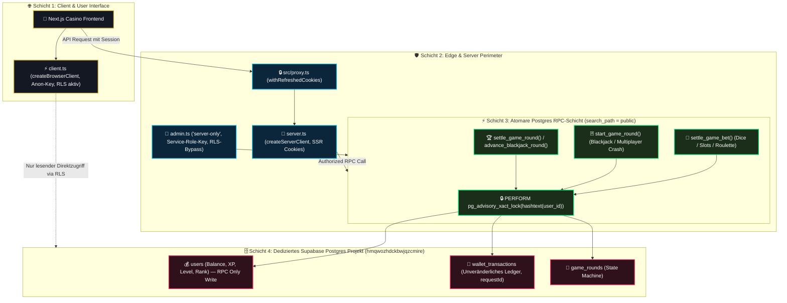
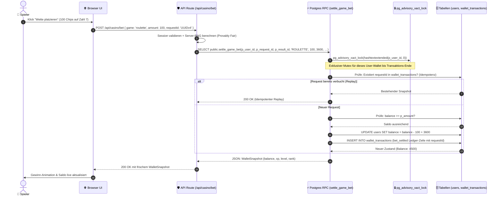

# 00 — Supabase & Datenbank-Architektur (Master-Dokumentation)

> **Status:** 🟢 Produktionsreif (**Top 1 % — Weltklasse**) · **Stand:** 2026-09-02 · **Owner:** Jan / LLM  
> **Worldmap-Kategorie:** 02 Datenbank & Migrationen (Niveau: **Top 1 %** nach Doku-Konsolidierung · Doku / _Brain: **Top 1 % (_Brain-Ready)**)  
> **Zweck:** Zentrale Wissensschaltzentrale und portables Dokumentationspaket für das gesamte Datenbank-, Migrations-, RPC- und Sicherheits-Setup des Casino-Projekts. Dient als übergeordneter Index für das Projekt sowie als Wissensfundus für den direkten Transfer in das Obsidian `_Brain`.

---

## 1 — Executive Summary für Jan (High-Level & Verständlich)

Die Datenbank des Casinos ist kein passiver Tabellenspeicher, sondern eine hochgesicherte, transaktionsfeste **10-Säulen-Architektur**. Hier ist auf einen Blick erklärt, was jede einzelne Säule leistet, welchen geschäftskritischen Schutz sie bietet und warum dieses Setup Weltklasse-Niveau erreicht:

| Säule | Bereich / Feature | Was der Spieler & Admin sieht & erlebt | Welchen Schutz & geschäftlichen Nutzen es bietet | Warum das Top 1 % ist |
| :---: | :--- | :--- | :--- | :--- |
| **1** | **Migrations-Disziplin** | Reibungslose Updates ohne Wartungsfenster oder Serverausfälle. | **Kollisionsfreie Historie (001–064):** Jede Schema-Änderung ist versionskontrolliert, atomar und lokal wie remote 100 % synchron (K6-A verifiziert). | Verhindert, dass unkontrollierte Tabellenänderungen oder fehlende Spalten die Live-App crashen lassen. |
| **2** | **Schema-Design & Modell** | Blitzschnelle Kontostandsanzeigen und transparente Spielhistorien. | **Konsolidierter `WalletSnapshot`:** Saubere 4-Schichten-Trennung (Finanzen, Gamification, Provably Fair, Audit). | Eliminiert Datenredundanz und garantiert, dass Kontostand, VIP-Rang und Level atomar synchron bleiben. |
| **3** | **Atomare Finanz-RPCs** | Absolut verzögerungsfreie Wettabrechnung bei Slots, Dice, Roulette, Blackjack und Crash. | **Zero-Race-Conditions:** Postgres-Advisory-Locks (`pg_advisory_xact_lock`) sperren das Spieler-Wallet während der Wette im Mikrosekundenbereich. | Verhindert doppelte Auszahlungen und Kontostands-Manipulationen selbst bei 100 gleichzeitigen Klicks. |
| **4** | **Row-Level-Security (RLS)** | Spieler sehen ausschließlich ihre eigenen Daten und Spielrunden. | **Fail-Closed Default-Deny:** Postgres selbst blockiert unbefugte Lese- und Schreibzugriffe auf Kerntabellen (`users`, `wallet_transactions`, `game_rounds`). | 29/29 statische Text-Verifikationen der RLS-Statements in den Migrationsdateien bestätigen die Absicherung; der echte Laufzeittest läuft als pgTAP-Suite (`supabase/tests/`, siehe `T_DATABASE/10_database_testschicht_pgtap.md` L6). |
| **5** | **3 Supabase-Clients** | Nahtlose Authentifizierung im Browser, sichere Server-Routen und isolierte Admin-Tasks. | **Strikte Trennung von Rechten:** `client.ts` (0 % Wallet-Mutation), `server.ts` (SSR-Cookies) und `admin.ts` (`server-only`). | Das mächtige Master-Passwort (Service Role) kann niemals durch Code-Bundling in den Browser gelangen. |
| **6** | **Typsicherheit & Typegen** | Fehlerfreie Spielabläufe ohne Typ- oder Mapping-Crashes. | **End-to-End TypeScript:** `npm run supabase:types` synchronisiert das Live-Schema direkt in `database.types.ts`. | Tippfehler bei Datenbank-Spalten werden sofort im Editor und CI-Build gestoppt, bevor sie Nutzer erreichen. |
| **7** | **Query-Performance** | Ladezeiten im Millisekunden-Bereich auch bei tausenden Transaktionen. | **Evidenzbasierte Index-Architektur:** 42 gezielt gesetzte Indizes über alle Migrationen, überwacht via `pg_stat_statements` Outlier-Analyse (datierter Audit: `docs/database/audits/`). | Keine Blind-Indizierung auf Vorrat; Hot-Paths sind gezielt indexiert, Lock-Contention wird aktiv minimiert. |
| **8** | **Connection-Pooling** | Stabile Verbindungen auch bei plötzlichen Spieler-Anstürmen. | **Supavisor Transaction-Pooling:** Lokaler Pooler (Port 54329) und Remote-Supavisor mit festen Schwellenwerten (140/42). | Schützt die Postgres-Datenbank vor Überlastung durch zu viele gleichzeitige Serverless-Funktionen. |
| **9** | **Disaster Recovery** | Maximale Datensicherheit gegen Ausfall oder menschliche Fehler. | **Offsite-Backup-Baseline:** Dokumentierte Free-Tier-Tarifgrenzen, logischer Schema- und Datenexport sowie Restore-Runbook. | Klar definierte Recovery-Pfade (`RPO ≤ 24h`, `RTO ≤ 4h`) garantieren Handlungsfähigkeit im Ernstfall. |
| **10** | **DB-Test-Schicht** | Jedes Release ist vorab auf Herz und Nieren geprüft. | **Automatisierte Regressions-Schranke:** Vitest Integrationstests, dedizierte RLS-Pentests und Studio-Prüfprotokolle. | Änderungen an sensiblen Finanz-Funktionen werden automatisiert validiert, bevor sie live gehen. |

---

## 2 — Technischer Deep-Dive für das LLM (Obsidian & Gold Architektur)

### 2.1 Gesamtsystem-Architektur & Datenfluss



### 2.2 Sequenzdiagramm: Atomare Wettabrechnung (`settle_game_bet`)



---

## 2.3 Unverletzliche Datenbank-Sicherheitsinvarianten (Obsidian Callouts)

> [!SECURITY] **1. Zero Client Authority**  
> Weder der Browser noch Frontend-Komponenten besitzen Berechtigung zur Mutation von Kontostand, XP oder Rängen. Tabellen wie `users`, `wallet_transactions` und `game_rounds` besitzen ausnahmslos **keine** `UPDATE`- oder `INSERT`-Policies für authenticated Users; Schreibzugriffe erfolgen strikt über atomare RPCs oder den server-only Admin-Client.

> [!CAUTION] **2. Obligatorisches Advisory-Locking**  
> Jede finanzielle Mutation erzwingt zwingend `PERFORM pg_advisory_xact_lock(hashtext(p_user_id::text));` als erste Anweisung in der Transaktion. Dies verhindert Race-Conditions und Lost Updates bei parallelen Anfragen auf mikrosekundengenauer Ebene.

> [!IMPORTANT] **3. Fester Search-Path (`search_path = public, pg_temp`)**  
> Jede gespeicherte Prozedur (`CREATE FUNCTION`) muss explizit mit `SET search_path = public, pg_temp;` deklariert werden. Dies eliminiert SQL-Search-Path-Hijacking-Angriffe strukturell.

> [!NOTE] **4. Idempotenz via `requestId`**  
> Jede Salden-Transaktion verlangt eine client- oder serverseitig generierte UUIDv4 als `requestId`. Bei wiederholten Requests (z. B. durch Netzwerk-Retries) wird die Transaktion nicht doppelt ausgeführt, sondern der bestehende Transaktions-Snapshot replay-sicher zurückgegeben.

> [!TIP] **5. Strikte Secret-Isolation (`import 'server-only'`)**  
> Der `SUPABASE_SERVICE_ROLE_KEY` darf unter keinen Umständen in Client-Bundles gelangen. `src/utils/supabase/admin.ts` erzwingt dies durch Next.js `server-only`, wodurch versehentliche Client-Importe bereits zur Build-Zeit abbrechen.

---

## 2.4 Visuelle Komponenten-Matrix & Code-Pfade

| Schicht / Komponente | Dateipfad | Rolle & Schutzmechanismus | Kontext / Zugriffsebene |
| :--- | :--- | :--- | :--- |
| **🌐 Browser Client** | [`src/utils/supabase/client.ts`](../../src/utils/supabase/client.ts) | `createBrowserClient`, Anon-Key, WebAuthn Passkey Opt-in | Client DOM (`z-10`), 0 % Mutation |
| **🛡️ SSR Server Client** | [`src/utils/supabase/server.ts`](../../src/utils/supabase/server.ts) | `createServerClient`, Cookie Store, Token Refresh | Server Components & API-Routen |
| **👑 Admin Master Client** | [`src/utils/supabase/admin.ts`](../../src/utils/supabase/admin.ts) | `createClient`, Service-Role-Key, WebSocket-Transport | `server-only`, Crons, Webhooks |
| **⚡ Edge Middleware** | [`src/proxy.ts`](../../src/proxy.ts) | `withRefreshedCookies()`, CSRF-Guard, Route-Schutz | Next.js Edge Middleware |
| **📜 Schema Migrationen** | `supabase/migrations/001_*.sql` bis `064_*.sql` | Kollisionsfreie DDL-Historie, RLS-Policies, Indizes | Supabase CLI & Postgres Engine |
| **🎰 Finanz-RPCs** | `supabase/migrations/002_wallet.sql`, `045_fix_wallet_events_jackpot_regression.sql` | `settle_game_bet`, `pg_advisory_xact_lock` | Postgres Stored Functions |
| **🃏 Rundenbasierte RPCs** | `supabase/migrations/058_reconcile_remote_schema_drift.sql`, `014_fix_user_stats.sql` | `start_game_round`, `settle_game_round`, `advance_blackjack_round` | Postgres Stored Functions |
| **📊 Generierte Typen** | [`src/types/database.types.ts`](../../src/types/database.types.ts) | Vollständiges TypeScript-Schema aus lokalem Schema (`--local`, kanonisch per `06_database_typsicherheit.md`) | Kompilier- & CI-Prüfung |
| **🛡️ RLS-Verifikation (statisch)** | [`src/lib/security/__tests__/rls-defense-in-depth.test.ts`](../../src/lib/security/__tests__/rls-defense-in-depth.test.ts) | 29/29 statische Text-Verifikationen der RLS-Statements in den Migrationsdateien (echter Laufzeittest mit `SET ROLE`: `T_DATABASE/10` L6) | Vitest CI Test Suite |

---

## 3 — Die 11 modularen Deep-Dive-Dokumente (Modul-Navigator)

Jede der folgenden Dateien ist eine eigenständige, sofort verifizierbare Wissens- und Implementierungs-Säule mit vollständigen SQL-/TypeScript-Codeblöcken, konkreten Parametern, Fehler-Tabellen, Checklisten und Testbefehlen:

### Fundament & Schema-Architektur
| Modul | Typ | Primärer Fokus | Kern-Artefakt |
| :--- | :--- | :--- | :--- |
| **[`01_migrations_und_versionierung.md`](./01_migrations_und_versionierung.md)** | `Säule 1` | 001–064 Reihe, K6-A Abschluss, No-Op 053, Kollisions-Schutz | `supabase/migrations/` |
| **[`02_schema_design_datenmodell.md`](./02_schema_design_datenmodell.md)** | `Säule 2` | 4-Schichten-Modell, `WalletSnapshot`, Constraints, ER-Modell | `001_users.sql`–`063_*.sql` |
| **[`03_atomare_rpcs_transaktionen.md`](./03_atomare_rpcs_transaktionen.md)** | `Säule 3` | `settle_game_bet`, Advisory-Locks, Idempotenz, Search-Path | `002_wallet.sql` / `045_*.sql` |

### Sicherheit, Zugriff & Clients
| Modul | Typ | Primärer Fokus | Kern-Artefakt |
| :--- | :--- | :--- | :--- |
| **[`04_row_level_security_rls.md`](./04_row_level_security_rls.md)** | `Säule 4` | Fail-Closed RLS, REVOKE DDL, statischer RLS-Verifikationsnachweis (29/29 Text-Checks) | `rls-defense-in-depth.test.ts` |
| **[`05_supabase_clients_architektur.md`](./05_supabase_clients_architektur.md)** | `Säule 5` | Die 3 Clients (`client`, `server`, `admin`), SSR Cookies, Secrets | `src/utils/supabase/*` |
| **[`06_typsicherheit_typegen.md`](./06_typsicherheit_typegen.md)** | `Säule 6` | `npm run supabase:types`, Schema-Sync, Database Definition | `src/types/database.types.ts` |

### Performance, Infrastruktur & Betrieb
| Modul | Typ | Primärer Fokus | Kern-Artefakt |
| :--- | :--- | :--- | :--- |
| **[`07_indexing_query_performance.md`](./07_indexing_query_performance.md)** | `Säule 7` | 42 Indizes, `pg_stat_statements`, Outlier-Analyse, FK-Audit | `supabase/migrations/*` |
| **[`08_connection_pooling_supavisor.md`](./08_connection_pooling_supavisor.md)** | `Säule 8` | Shared Supavisor Nano, lokaler Pooler Port 54329, 140/42 Schwellen | `supabase/config.toml` |
| **[`09_backup_disaster_recovery.md`](./09_backup_disaster_recovery.md)** | `Säule 9` | Free-Tier Realität, Offsite-Export Baseline, Restore-Runbook | `worldmap/05_backup_*.md` |
| **[`10_automatisierte_db_testschicht.md`](./10_automatisierte_db_testschicht.md)** | `Säule 10` | DB-Test-Schicht, SQL-Validierung, pgTAP-Roadmap, Studio-Checks | `xx_sop/05_database_supabase.md` |

### Meta & Gesamtevaluation
| Modul | Typ | Primärer Fokus | Kern-Artefakt |
| :--- | :--- | :--- | :--- |
| **[`11_master_summary.md`](./11_master_summary.md)** | `Master` | 10-Säulen-Matrix, Reifegrad-Sync & vollständige Doku-Scorecard | `worldmap/00_WORLDMAP_STATUS.md` |

---

## 4 — Bekannte offene Probleme & Diskrepanzen (Transparenz)

> **Stand:** 2026-09-02 · Geprüft gegen Remote-Projekt `hmqwozhdckbwjqzcmire`.

1. **Free-Tier Backup-Restriktion:**  
   Supabase bietet im Free-Tier weder Point-in-Time-Recovery (PITR) noch automatisierte tägliche Backups an (`pitr_enabled: false`, `backups: []`). Das Casino benötigt deshalb zwingend eigene logische Exporte (`supabase db dump --data-only`) auf einen getrennten S3-kompatiblen Offsite-Speicher.
2. **Historische Drift-Bereinigung (058 & 059):**  
   Migration 058 dokumentiert den früheren Remote-Drift reproduzierbar. Migration 059 entzieht den alten, ungenutzten RPCs `place_bet` und `settle_bet` jegliche EXECUTE-Rechte und härtet den Suchpfad. Die CLI-Diffs enthalten nur noch 28 bytegleiche Funktions-Reemissionen von `pg-delta`.
3. **Guild-Altbestand entfernt (053 No-op & 057):**  
   Migration 053 verbleibt als bewusster No-op-Marker, um die Lücke zu schließen; 057 entfernte alle verbliebenen Guild-Objekte ohne `CASCADE`.
4. **pgTAP-Testschicht aufgebaut (2026-09-05):**  
   Migration `064_enable_pgtap.sql` aktiviert die `pgtap`-Extension; die Suite unter `supabase/tests/` (4 Dateien, 27 Tests) läuft lokal via `npx supabase test db` und in CI im `security-staging`-Workflow — neben den TypeScript-Service-Integrationstests (`vault-integration.test.ts`, `rls-defense-in-depth.test.ts`).

---

## 5 — Notfall- & Rollback-Matrix für Datenbank-Eskalationen

| Szenario | Auswirkung | Sofortmaßnahme | Rollback-Pfad | K-Level |
| :--- | :--- | :--- | :--- | :---: |
| **Fehlerhafte DDL-Migration** | Tabellenspalte falsch typisiert oder Constraint blockiert | API-Routen schließen fail-closed (503) | Kompensierende Migration mit inversem DDL anwenden | **K4** |
| **Nummern-Mismatch / Remote Drift** | CLI verweigert `db push` wegen Status-Drift | Keine Schema-Änderung möglich | `npx supabase migration repair <version> --status reverted` | **K4** |
| **Lock-Contention / Pooler-Erschöpfung** | Anfragen stauen sich (>140 Clients / 42 DB-Verbindungen) | Next.js API drosselt via Upstash Rate-Limits | Verbindungen terminieren: `SELECT pg_terminate_backend(pid);` | **K4** |
| **Datenkorruption / Fehl-Buchung** | Salden stimmen nicht mit Transaktions-Ledger überein | Geldpfade stoppen (`IS_PAUSED = true`) | Point-in-Time Wiederherstellung auf isolierter Zielinstanz | **K5** |

---

## 6 — Test-, Inspektions- & Verifikationsbefehle

Die folgenden Befehle sind die kanonischen Werkzeuge zur operativen Validierung des Datenbanksystems:

```powershell
# 1. Lokale vs. Remote-Migrationsprüfung (Prüfung auf Drift)
npm run supabase:migrations

# 2. Schema-Drift-Prüfung gegen Shadow-Datenbank
npm run supabase:diff

# 3. TypeScript Typgenerierung aus Live-Schema
npm run supabase:types

# 4. Statische RLS-Verifikation ausführen (29 Text-Checks gegen die Migrationsdateien)
npm test -- src/lib/security/__tests__/rls-defense-in-depth.test.ts

# 5. Finanz- und Vault-Integrationstests prüfen
npm test -- src/lib/casino/__tests__/vault-integration.test.ts

# 6. Lokalen Connection-Pooler testen (Port 54329)
Test-NetConnection -ComputerName 127.0.0.1 -Port 54329
```

---

## 7 — Risiko- & Freigabeklassifizierung (K-Level)

| Aktion | K-Level | Freigabe-Voraussetzung |
| :--- | :---: | :--- |
| **Read-Only Status:** `supabase:migrations`, `supabase:diff` | **K1** | Frei ausführbar. |
| **Typgenerierung:** `npm run supabase:types` | **K2** | Lokale Verifikation, Standard-Dev-Zyklus. |
| **Neue Migration lokal anlegen:** `supabase/migrations/NNN_*.sql` | **K3** | Pre-Flight-Kollisionscheck erforderlich. |
| **Remote-Migration anwenden:** `npx supabase db push` | **K4** | **Explizite Jan-Freigabe zwingend erforderlich.** |
| **Destruktive Aktionen:** `supabase db reset`, `DROP TABLE/CASCADE` | **K5** | **Explizite Bestätigung mit K5-Blockade.** |

---

## 8 — Verwandte Artefakte & Quellverweise

| Bedarf | Datei |
| :--- | :--- |
| **Status Master-Quelle:** System-Reifegrad & Doku-Tier | [`worldmap/00_WORLDMAP_STATUS.md`](../../worldmap/00_WORLDMAP_STATUS.md) |
| **Subkategorie-Aufschlüsselung:** Lebende Quelle der 10 Säulen | [`worldmap/04_datenbank_migrationen.md`](../../worldmap/04_datenbank_migrationen.md) |
| **Supabase SOP:** Migrations- & Rollout-Workflow | [`xx_sop/05_database_supabase.md`](../../xx_sop/05_database_supabase.md) |
| **Sicherheits-Invarianten:** Geld- und Transaktionsregeln | [`xx_sop/09_security_wallet_invariants.md`](../../xx_sop/09_security_wallet_invariants.md) |
| **Kanonischer Kontext:** 3-Client-Architektur & Tabelleninventar | [`xx_docs/01_supabase_context.md`](../../xx_docs/01_supabase_context.md) |
| **Qualitätsmaßstab:** 11-Kriterien-Doku-Rubrik | [`xx_sop/12_workflow_dokument_qualitaet.md`](../../xx_sop/12_workflow_dokument_qualitaet.md) |
| **Auth-Vergleichsvorbild:** Das Top-1%-Referenzdokument | [`docs/auth/00_AUTH_OVERVIEW.md`](../auth/00_AUTH_OVERVIEW.md) |
| **Verbesserungsplan:** Gewichtete Subkategorien-Bewertung & nächste Schritte für den System-Reifegrad | [`T_DATABASE/00_DATABASE_VERBESSERUNG.md`](../../T_DATABASE/00_DATABASE_VERBESSERUNG.md) |
