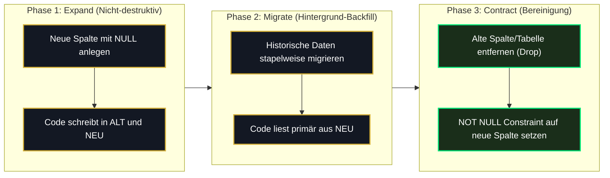

# 01 — Migrations-Disziplin, Versionierung & Drift-Schutz

> **Säule:** 1 von 10 · **Status:** 🟢 Produktionsreif (**Top 1 % — Weltklasse**) · **Stand:** 2026-09-05 · **Owner:** Jan / LLM  
> **Worldmap-Zuordnung:** Kategorie 02 (Unterkategorie 1: Migrations-Disziplin & Versionierung — Niveau: **Top 15 %**, nach K6-A live verifiziert)  
> **Referenz-SOP:** [`xx_sop/05_database_supabase.md`](../../xx_sop/05_database_supabase.md) · **Back:** [`00_DATABASE_OVERVIEW.md`](./00_DATABASE_OVERVIEW.md)

---

## 1 — High-Level: Was ist das & warum ist Migrations-Disziplin geschäftskritisch?

In einem Online-Casino mit echten Kontoständen und atomaren Einsätzen ist die Datenbank das Herzstück der Anwendungslogik. **Migrations-Disziplin** stellt sicher, dass jede Änderung an Tabellen, Spalten, Indizes und gespeicherten Prozeduren (RPCs) als unveränderliche, nummerierte SQL-Datei versioniert wird.

### Die 3 Sicherheitsbarrieren für Jan auf einen Blick:
| Barriere | Wie sie funktioniert | Was sie verhindert |
| :--- | :--- | :--- |
| **1. Kollisions-Schutz** | Jede Datei erhält eine fest vergebene dreistellige Nummer (z. B. `059_...`). | Verhindert, dass zwei Änderungen zeitgleich denselben Dateinamen beanspruchen und die Ausführungsreihenfolge durcheinanderbringen. |
| **2. Drift-Prüfung** | Vor jedem Release gleicht die Pipeline den Code mit der Live-Datenbank ab. | Verhindert böse Überraschungen durch manuell zusammengeklickte Tabellenänderungen im Admin-Dashboard. |
| **3. Zero-Downtime** | Tabellen werden in drei sanften Schritten erweitert (Expand & Contract). | Verhindert, dass aktive Spieler während eines Systemupdates aus dem laufenden Spiel geworfen werden. |

---

## 2 — Neue Migration in 4 Schritten (Produktionsrezept)

Vor dem Anlegen oder Anwenden einer neuen Migration muss dieser standardisierte 4-Schritte-Ablauf befolgt werden:

```
[ ] Schritt 1: Pre-Flight Checks ausführen (Stand, Kollision, Projekt-ID)
[ ] Schritt 2: Migration via Schema-Diff generieren (automatisch kollisionsfreie Benennung)
[ ] Schritt 3: Lokale Verifikation im isolierten Stack + Security Guard Check
[ ] Schritt 4: TypeScript-Typen aktualisieren (npm run supabase:types)
```

### Die konkreten Pre-Flight Befehle (Terminal):
```powershell
# 1. Migrationsstand abgleichen (Lokale vs. Remote-Reihe)
npm run supabase:migrations

# 2. Pre-Flight Kollisions-Check ausführen (Muss zwingend LEER sein!)
Get-ChildItem supabase/migrations | ForEach-Object { $_.Name.Substring(0, 3) } | Group-Object | Where-Object { $_.Count -gt 1 }

# 3. Projekt-Bindung verifizieren (Muss exakt 'hmqwozhdckbwjqzcmire' sein!)
Get-Content supabase/.temp/project-ref
```

> [!CAUTION] **Stopp-Kriterium:**  
> Gibt Prüfung 2 einen Treffer aus, liegt eine Nummern-Kollision vor. Es darf **unter keinen Umständen** eine Migration mit `supabase db push` ausgerollt werden, bis die Nummerierung eindeutig korrigiert ist.

---

## 3 — Die kanonische Migrations-Historie (aktuell bis Migration 064)

Der Stand des Casino-Schemas wird durch fortlaufend nummerierte Migrationsdateien definiert — **aktuell 64, bis Migration `064_enable_pgtap.sql`** (die konkrete Zahl veraltet bei jeder neuen Migration; der verbindliche Live-Stand ist immer `npm run supabase:migrations` bzw. `ls supabase/migrations | sort | tail -1`). Durch den Abschluss von K6-A (2026-08-29) ist die Reihe vollständig kollisionsfrei und synchron:

| Bereich / Meilenstein | Migrationen | Inhalt & Technische Relevanz |
| :--- | :--- | :--- |
| **Nutzer- & Auth-Fundament** | `001`–`003` | Basistabellen `users`, initiale RLS-Aktivierung, Identitätsverknüpfung. |
| **Gamification & VIP** | `004`–`006` | VIP-Tiers (`bronze` bis `diamond`), Spielstatistiken, Session-Management. |
| **Atomares Wallet-System** | `002`, `007`, `045` | **Herzstück:** `users.balance` (Single Source of Truth), `wallet_transactions` (unveränderliches Ledger), atomare RPCs mit `pg_advisory_xact_lock` — `settle_game_bet` final in `045_fix_wallet_events_jackpot_regression.sql`. |
| **Rundenbasierte Spiele** | `007`, `014`, `037`, `050`, `058` | `game_rounds` (`007_server_authority.sql`), atomare State-Transitions, Multiplayer-Crash-Runden (`037`), RPCs `settle_game_round`/`advance_blackjack_round` (`014`), `start_game_round` (`058`). |
| **Provably Fair Engine** | `003` | `seeds`-Tabelle für kryptografische SHA-256 Server-Seeds und Nonces. |
| **Auth-Erweiterungen** | `052`, `055` | `055_custom_access_token_hook.sql` (VIP-Claims) & `052_user_login_history.sql` (DSGVO IP-Masking). |
| **Feature-Bereinigung** | `053`, `057` | `053_guild_feature_intentionally_removed.sql` (bewusstes Schließen der Versionslücke) & `057_remove_legacy_guild_schema.sql` (sauberes Entfernen alter Guild-Tabellen ohne `CASCADE`). |
| **Drift-Replikation & Lockdown** | `058`, `059` | `058_reconcile_remote_schema_drift.sql` (reproduzierbarer Drift-Stand) & `059_harden_legacy_definer_search_path.sql` (Rechte-Entzug und fester `search_path` für Legacy-RPCs). |
| **Job-Retry-Härtung** | `060` | `060_pg_cron_retry_failure_handling.sql` (bounded Retry-State für tägliche pg_cron-Wrapper, deduplizierte Terminal-Alerts; rein additiv). |
| **History-Cursor-Pagination** | `061` | `061_wallet_transactions_history_cursor_index.sql` (Composite-Index + Keyset-Read-RPC für `/api/user/history`; `CREATE INDEX IF NOT EXISTS`). |
| **Bot-Signal-Erkennung** | `062` | `062_bot_signal_types.sql` (erweitert `risk_events` um Bot-Signal-Typen für Login-Guard, Chat-Cost-Cap und Honeypot; NOT VALID/VALIDATE-Pattern wie 030/040). |
| **Responsible Gambling** | `063` | `063_user_wellbeing_limits.sql` (persistenter Wellbeing-State: Self-Exclusion + tägliches Loss-Limit; Service-Role-only-Tabelle, kein Browser-Zugriff). |
| **DB-Testschicht** | `064` | `064_enable_pgtap.sql` (aktiviert die `pgtap`-Extension für `supabase test db`; Suite unter `supabase/tests/`, 4 Dateien / 27 Tests). |

---

## 4 — Zero-Downtime Migration Pattern (Expand & Contract)

Jede Schema-Änderung in Produktion folgt dem **Expand & Contract Pattern** (`xx_sop/18_postgres_patterns_migrations.md`), um Ausfallzeiten und Client-Crashes auszuschließen:



### Konkrete Postgres-Regeln für Zero-Downtime:
1. **Kein `DEFAULT` auf Spalten ohne Prüfung:** In Postgres 11+ ist `ALTER TABLE tbl ADD COLUMN col text DEFAULT 'val'` schnell, da es rein als Metadatum gespeichert wird. Tabellen-Rewrites werden vermieden.
2. **Kein blockierendes `ADD CONSTRAINT ... NOT NULL`:** Immer zuerst `ALTER TABLE tbl ADD CONSTRAINT chk CHECK (col IS NOT NULL) NOT VALID;` gefolgt von `ALTER TABLE tbl VALIDATE CONSTRAINT chk;` im separaten Schritt.
3. **Index-Erstellung ohne Sperre:** In Produktionsmigrationen immer `CREATE INDEX CONCURRENTLY` verwenden, um Lese- und Schreibzugriffe während des Indexaufbaus nicht zu blockieren.

---

## 5 — Migration Security Guard (Pilot-Review-Gate)

Gemäß `xx_sop/05_database_supabase.md` §2.1 unterliegen alle neuen SQL-Migrationen einer standardisierten Sicherheitsprüfung durch den `@migration-security-guard`:

| Kriterium | Soll-Zustand | Gefährlicher Ist-Fehler (führt zu BLOCKED) |
| :--- | :--- | :--- |
| **Search-Path-Hardening** | `SET search_path = public, pg_temp;` | Fehlender Search-Path (Gefahr von Path-Hijacking) |
| **Security Definer Rechte** | Explizites `REVOKE ALL ON FUNCTION ... FROM PUBLIC;` | Unbeabsichtigte Ausführungsrechte für Unauthenticated / Anon |
| **Advisory Locks auf Geldpfaden** | `PERFORM pg_advisory_xact_lock(hashtext(...))` | Saldenänderung ohne Mutex-Lock (Race-Condition Risiko) |
| **RLS-Präsenz** | `ALTER TABLE tbl ENABLE ROW LEVEL SECURITY;` | Neue Tabelle ohne RLS im öffentlichen Schema |

---

## 6 — Drift-Erkennung & Shadow-Datenbank-Diff

Um unbemerkten Schema-Drift zwischen dem lokalen Git-Repository und der Remote-Supabase-Instanz aufzudecken, nutzt das Projekt die standardisierte Diff-Pipeline:

```bash
# Erzeugt ein klares DDL-Diff zwischen lokalen Migrationen und der Remote-Instanz
npx supabase db diff --linked
```

### Das `pg-delta` Phänomen (Dokumentierte Ausnahme):
Bei Ausführung von `npm run supabase:diff` gibt das Postgres-Diff-Tool `pg-delta` gelegentlich bytegleiche `CREATE OR REPLACE FUNCTION`-Blöcke für unveränderte Prozeduren aus.  
**Kanonische Prüfvorschrift:**
- Ein Diff gilt als **grün/sauber**, wenn ausschließlich identische Funktionsdefinitionen ohne Berechtigungsänderungen, ohne Tabellenänderungen und ohne Datenverlust ausgegeben werden.
- Treten Spaltenunterschiede, RLS-Policy-Abweichungen oder Rollen-Änderungen auf, muss die Migration gestoppt und Ursachenforschung betrieben werden.

---

## 7 — Rollback- & Reparatur-Strategien

Im Casino-Projekt existieren bewusst **keine automatischen Down-Migrationen** (da `DROP COLUMN` oder unvollständige Rollbacks zu unwiederbringlichem Datenverlust führen können). Bei Fehlern greifen zwei definierte Verfahren:

| Szenario | Lösungsansatz | Ausführbarer Befehl / Vorgehen | Freigabe-Level |
| :--- | :--- | :--- | :---: |
| **Schema-Fehler mit Datenbestand** | **Kompensierende Migration:** Schreiben einer neuen Migration `060_revert_*.sql`, die die Änderungen invers korrigiert. | `npx supabase db diff --linked -f revert_feature` gefolgt von `npx supabase db push` | **K4** |
| **Reiner Tracking-Mismatch** | **Migration Repair:** Bereinigung des Eintrags in der Tabelle `supabase_migrations.schema_migrations`. | `npx supabase migration repair 059 --status reverted` (entfernt fehlerhaften Remote-Marker) | **K4** |
| **Katastrophaler Schemaschaden** | **Isolierter Restore:** Wiederherstellung der Datenbank aus dem jüngsten logischen Backup auf isolierter Staging-Instanz. | Siehe [`09_backup_disaster_recovery.md`](./09_backup_disaster_recovery.md) | **K5** |

---

## 8 — Operative Befehlsreferenz

```powershell
# 1. Lokale Migrationen gegen Remote prüfen
npm run supabase:migrations

# 2. Kollisionsfreie neue Migration aus Schema-Diff generieren
npx supabase db diff --linked -f mein_neues_feature

# 3. TypeScript-Typen synchronisieren (Pflicht nach jeder Migration)
npm run supabase:types

# 4. Lokalen Stack zurücksetzen und alle Migrationen durchspielen (aktuell 63)
npm run supabase:reset
```

---

## 9 — Verwandte Dokumente & SOP-Referenzen

| Bedarf | Dateipfad |
| :--- | :--- |
| **Supabase SOP (Rollout & Guard):** | [`xx_sop/05_database_supabase.md`](../../xx_sop/05_database_supabase.md) |
| **Postgres Patterns & Zero-Downtime:** | [`xx_sop/18_postgres_patterns_migrations.md`](../../xx_sop/18_postgres_patterns_migrations.md) |
| **Historischer K6-A Abschlussbericht:** | [`docs/archive/05_datenbank_haertung.md`](../archive/05_datenbank_haertung.md) |
| **Master-Übersicht:** | [`00_DATABASE_OVERVIEW.md`](./00_DATABASE_OVERVIEW.md) |
