# 02 — Schema-Design, Datenmodell & Snapshot-Architektur

> **Säule:** 2 von 10 · **Status:** 🟢 Doku-Qualität Produktionsreif (**Top 1 % — Weltklasse**) — das beschreibt die Doku-Qualität, nicht den System-Reifegrad: Worldmap misst die Säule 2 (System) auf **Top 20 %** (seit 2026-09-05 gegen echtes Schema verifiziert) · **Stand:** 2026-09-05 · **Owner:** Jan / LLM  
> **Worldmap-Zuordnung:** Kategorie 02 (Unterkategorie 2: Schema-Design & Datenmodell — Niveau: **Top 20 %**)  
> **Kontext-Referenz:** [`xx_docs/01_supabase_context.md`](../../xx_docs/01_supabase_context.md) §3 · **Back:** [`00_DATABASE_OVERVIEW.md`](./00_DATABASE_OVERVIEW.md)

---

## 1 — High-Level: Was ist das & wie ist das Casino-Datenmodell aufgebaut?

Das Datenmodell des Casinos trennt strikt zwischen Benutzerstammdaten, unveränderlichen Buchungsbelegen und flüchtigen Spielzuständen. Statt eines monolithischen Tabellenmonsters arbeitet das System mit einer sauberen **4-Schichten-Architektur**:

### Die 4 Schichten für Jan auf einen Blick:
| Schicht | Was darin gespeichert wird (echte Tabellen) | Warum diese Trennung geschäftskritisch ist |
| :--- | :--- | :--- |
| **1. Finanzen & Ledger** | `users` (Balance direkt auf der Row), `wallet_transactions` (unveränderliches Audit-Log), `wallet_events`, `wallet_invariant_events`, `wallet_ledger_baselines` | **Single Source of Truth:** Der Kontostand liegt direkt in `users.balance`; `wallet_transactions` ist ausschließlich Nachweis — niemals eine Balance-Quelle (Beleg: `supabase/migrations/002_wallet.sql:2-3`). |
| **2. Benutzer & Identität** | `users`, `user_identities`, `user_login_history`, `anonymous_sessions`, `telegram_links`, `telegram_link_tokens`, `identity_link_quarantine`, `admin_roles` | **Kein Profil-Wirrwarr:** Alle Nutzerkerndaten (Avatar, Guide-Persona, Level, Rank) liegen direkt an der User-ID. |
| **3. Gamification & Bonus** | `vip_tiers`, `ranks`, `promo_codes`, `promo_code_redemptions`, `daily_races`, `daily_race_winners`, `user_achievements`, `achievement_configs`, `user_notifications` | **Marketing-Sicherheit:** Gutscheincodes haben harte Limits gegen Mehrfacheinlösungen, unabhängig von den Kernfinanzen. |
| **4. Provably Fair & KI** | `seeds`, `seed_history`, `seed_consumptions`, `guide_documents` (pgvector-Embeddings) | **Beweisbare Fairness:** Zufalls-Seeds sind kryptografisch fixiert; KI-Wissen ist durch Vektor-Embeddings isoliert. |

Es gibt **keine** Tabellen `wallets`, `transactions` oder `bets` — ein früheres Diagramm in dieser Datei beschrieb sie fiktiv (korrigiert 2026-09-05, siehe Historie unten).

---

## 2 — Technischer Deep-Dive: Entity-Relationship-Diagramm (Kern-Domänen)

```mermaid
erDiagram
    %% Entities & Primary Keys — jede Entity hat eine 1:1-Entsprechung
    %% in src/types/database.types.ts (38 Tabellen im Schema public, Stand 2026-09-05)
    AUTH_USERS ||--|| USERS : "1:1 id = auth.uid()"
    USERS ||--o{ WALLET_TRANSACTIONS : "1:N audit log (CASCADE)"
    USERS ||--o{ GAME_SESSIONS : "1:N session stats (CASCADE)"
    USERS ||--o{ GAME_ROUNDS : "1:N state machine (CASCADE)"
    CRASH_ROUNDS ||--o{ GAME_ROUNDS : "1:N crash_round_id (NO ACTION)"
    USERS ||--|| SEEDS : "1:1 provably fair (CASCADE)"
    USERS ||--o{ SEED_HISTORY : "1:N rotated seeds (CASCADE)"
    USERS ||--o{ SEED_CONSUMPTIONS : "1:N idempotency ledger (CASCADE)"
    USERS ||--o{ USER_LOGIN_HISTORY : "1:N audit (CASCADE)"
    DAILY_RACES ||--o{ DAILY_RACE_WINNERS : "1:N race_date (CASCADE)"
    USERS ||--o{ DAILY_RACE_WINNERS : "1:N winners (NO ACTION)"
    PROMO_CODES ||--o{ PROMO_CODE_REDEMPTIONS : "1:N code (RESTRICT)"
    WALLET_TRANSACTIONS ||--o{ PROMO_CODE_REDEMPTIONS : "1:N transaction_id (RESTRICT)"

    USERS {
        text id PK "auth.users.id (TEXT, Clerk-/User-ID)"
        text username "UNIQUE Anzeigename"
        text email
        numeric balance "Single Source of Truth"
        bigint xp "Erfahrungspunkte"
        integer level "Level-Stufe"
        text rank "Rank-String (kein separater FK)"
        text guide_persona "KI Assistenten-Persona"
        timestamp created_at
    }

    WALLET_TRANSACTIONS {
        uuid id PK "UUIDv4 Ledger ID"
        text user_id FK "users.id ON DELETE CASCADE"
        text game "slots / roulette / crash / dice / purchase / bonus"
        text type "bet / win / crash_pending / purchase / bonus"
        numeric amount "+ Gutschrift / - Einsatz"
        numeric balance_after "Saldo nach Buchung (Audit)"
        jsonb metadata "Spieldetails (Multiplikator, Result, Seed-Hash)"
    }

    GAME_SESSIONS {
        uuid id PK
        text user_id FK "users.id ON DELETE CASCADE"
        text game
        numeric total_bet "Session-Aggregat"
        numeric total_won "Session-Aggregat"
        integer hands_played
    }

    GAME_ROUNDS {
        uuid id PK
        text user_id FK "users.id ON DELETE CASCADE"
        text game_type "BLACKJACK / CRASH"
        text state "aktuelle State-Machine-Phase"
        jsonb game_state
        uuid crash_round_id FK "crash_rounds.id, kein explizites ON DELETE (NO ACTION)"
    }

    SEEDS {
        text user_id PK, FK "users.id ON DELETE CASCADE"
        text server_seed "nur Service-Role lesbar"
        text server_seed_hash "SHA-256 Hash"
        text client_seed "vom Spieler wählbar"
        integer nonce "fortlaufender Counter"
        boolean is_active
    }

    SEED_HISTORY {
        uuid id PK
        text user_id FK "users.id ON DELETE CASCADE"
        text server_seed_hash
        integer nonce_at_rotation
    }

    SEED_CONSUMPTIONS {
        text user_id PK, FK "users.id ON DELETE CASCADE"
        uuid request_id PK "Idempotenz-Schlüssel (Composite PK)"
        integer nonce
    }

    USER_LOGIN_HISTORY {
        uuid id PK
        text user_id FK "users.id ON DELETE CASCADE"
        text ip_masked "DSGVO-maskiert"
        text method
        timestamp created_at
    }
```



> **Nicht im Diagramm (aber real):** Die übrigen Tabellen der Domänen aus Abschnitt 1 (`wallet_events`, `wallet_invariant_events`, `wallet_ledger_baselines`, `vip_tiers`, `ranks`, `promo_codes`, `promo_code_redemptions`, `daily_races`, `daily_race_winners`, `user_achievements`, `achievement_configs`, `user_notifications`, `risk_events`, `bet_network_fingerprints`, `chat_messages`, `guide_*`, `admin_*`, `telegram_*`, `jackpot_pool`, `fraud_scan_lock`, `background_job_runs`, `anonymous_sessions`, `user_identities`, `identity_link_quarantine`, `crash_rounds`) — das Diagramm zeigt die Kern-Domänen; die vollständige Inventarliste ist in `src/types/database.types.ts` (Quelle der Wahrheit).

---

## 3 — Kanonisches Tabellen-Inventar & FK-Verhalten

### 3.1 Kern-Finanzen & Spielzustand
| Tabelle | Primärschlüssel | Fremdschlüssel | Integritäts-Constraints |
| :--- | :--- | :--- | :--- |
| `users` | `id` (TEXT, `auth.users.id`) | — | `username UNIQUE`; `balance`/`xp`/`level`/`rank` direkt auf der Row |
| `wallet_transactions` | `id` (UUID) | `users.id ON DELETE CASCADE` | Audit-Log-Only (siehe Abschnitt 7), `amount`/`balance_after NOT NULL` |
| `game_sessions` | `id` (UUID) | `users.id ON DELETE CASCADE` | Session-Aggregate, RLS nur SELECT-own |
| `game_rounds` | `id` (UUID) | `users.id ON DELETE CASCADE`; `crash_rounds.id` ohne explizites `ON DELETE` | State-Machine via RPC, kein direkter Client-Schreibpfad |
| `seeds` | `user_id` (TEXT) | `users.id ON DELETE CASCADE` | `server_seed` nie client-lesbar (REVOKE seit 019) |
| `seed_history` / `seed_consumptions` | `id` (UUID) / `(user_id, request_id)` | `users.id ON DELETE CASCADE` | Idempotenz-Ledger für Seed-Konsum |

### 3.2 Echte FK-Verteilung (grep über `supabase/migrations/**`, 2026-09-05, 30 FKs)
| Verhalten | Anzahl | Belege |
| :--- | :---: | :--- |
| `ON DELETE CASCADE` | 22 | z. B. `wallet_transactions.user_id` (`002_wallet.sql:10`), `game_sessions.user_id` (`002_wallet.sql:22`), `seeds.user_id` (`003_provably_fair.sql:7`) |
| `ON DELETE RESTRICT` | 2 | `promo_code_redemptions.code` & `.transaction_id` (`023_promo_redemption_ledger.sql:9,12`) |
| `ON DELETE SET NULL` | 3 | `anonymous_sessions.migrated_to_user_id` (`005_anonymous_sessions.sql:15`), `anonymous_sessions.resolved_user_id` & `admin_roles.granted_by` (`009_meta_features.sql:23,34`) |
| ohne explizite Angabe (Default `NO ACTION`) | 3 | `jackpot_pool.last_winner_id` (`032_progressive_jackpot_pool.sql:12`), `game_rounds.crash_round_id` (`037_multiplayer_crash_rounds.sql:44`), `daily_race_winners.user_id` (`041_daily_race.sql:28`) |

> [!IMPORTANT] **Bewertung der 3 `NO ACTION`-FKs (Audit 2026-09-05):** Die App hat aktuell **keinen** Account-Deletion-Pfad (`src/lib/analytics/posthog-erasure.ts:9`: „this app has no existing account-deletion feature"). Solange keine Nutzer gelöscht werden, sind alle drei latent unkritisch. **Bei Einführung eines DSGVO-Deletion-Features** müssen sie explizit gesetzt werden (SET NULL für die nullable Spalten `last_winner_id`/`crash_round_id`; für `daily_race_winners.user_id NOT NULL` eine bewusste CASCADE/RESTRICT-Entscheidung), da sonst die CASCADE-Kette beim User-Löschen an diesen FKs blockieren kann.

---

## 4 — Das `WalletSnapshot`-Paradigma (Single Source of Truth)

Das Casino synchronisiert Salden und Level niemals über separate REST-Abfragen, sondern über ein atomares **WalletSnapshot-Modell**.

### Das echte Zod-Schema (`src/lib/casino/wallet-contract.ts:3-9`):
```typescript
export const walletSnapshotSchema = z.object({
  balance: z.number().finite().nonnegative(),
  xp: z.number().int().nonnegative(),
  level: z.number().int().min(1),
  rank: z.string().min(1).max(64),
  transactionId: z.string().uuid(),
});

export type WalletSnapshot = z.infer<typeof walletSnapshotSchema>;
```

### Zod-Validierung im Client-Store (`src/store/useCasinoStore.ts`):
Der Store importiert dasselbe Schema aus `wallet-contract.ts` und validiert jeden Server-Snapshot (`walletSnapshotSchema.parse(raw)`, `useCasinoStore.ts:109`) — keine doppelte, abweichende Definition im Client.

**Vorteile:**
1. **Kein Zwischenzustand:** Gewinnbetrag, XP-Gutschrift und Level-Up werden in einer einzigen Postgres-Transaktion berechnet und als einheitlicher Snapshot zurückgegeben.
2. **Client-Sicherheit:** Der Zustand im Frontend wird ausschließlich über `applyServerWalletSnapshot()` aktualisiert. Manipulationen im lokalen Speicher (Local Storage) werden beim nächsten API-Call überschrieben.

---

## 5 — Produktionsrezept: Neue Tabelle nach Casino-Standard

Wenn eine neue Tabelle hinzugefügt wird, muss sie zwingend dieser gehärteten DDL-Schablone folgen (FK-Verhalten je nach fachlicher Anforderung — CASCADE für Owned Data, RESTRICT für Ledger-Referenzen, bewusst wählen, nicht defaulten):

```sql
-- 1. Tabelle mit UUID PK und bewusst gewähltem FK-Verhalten anlegen
CREATE TABLE IF NOT EXISTS public.casino_feature (
    id UUID PRIMARY KEY DEFAULT gen_random_uuid(),
    user_id TEXT NOT NULL REFERENCES public.users(id) ON DELETE CASCADE,
    payload JSONB NOT NULL DEFAULT '{}'::jsonb,
    created_at TIMESTAMPTZ NOT NULL DEFAULT timezone('utc'::text, now()),
    updated_at TIMESTAMPTZ NOT NULL DEFAULT timezone('utc'::text, now())
);

-- 2. RLS zwingend aktivieren (Fail-Closed Default Deny)
ALTER TABLE public.casino_feature ENABLE ROW LEVEL SECURITY;

-- 3. Strikte Lese-Policy auf eigene Daten
CREATE POLICY "Users can only read own feature data"
    ON public.casino_feature
    FOR SELECT
    USING (auth.uid() = user_id);

-- 4. Schreibrechte für Clients entziehen (Nur Service-Role / RPCs)
REVOKE INSERT, UPDATE, DELETE ON public.casino_feature FROM anon, authenticated;
```

---

## 6 — Bekannte Schema-Besonderheiten & historische Artefakte

1. **`users` vs. `profiles`:** Historisch gab es in einigen unfertigen Code-Pfaden Verweise auf eine Tabelle `profiles`. Es existiert ausschließlich `public.users` mit der Spalte `guide_persona`.
2. **Guild-Altbestand entfernt (057):** Sämtliche Guild-Tabellen (`guilds`, `guild_members`, `guild_invites`) wurden durch Migration 057 rückstandslos und ohne `CASCADE` entfernt.
3. **pgvector in `guide_documents` (nicht „guide_knowledge"):** Die Tabelle `guide_documents` nutzt die Postgres-Extension `vector` mit HNSW-Index (`039_guide_knowledge_pgvector.sql:4,20`). Sie ist strikt für Service-Role reserviert.
4. **`users.balance` ist nullable in den generierten Types:** `balance: number | null` — die Nicht-Negativität und Saldenführung laufen über die RPCs (`xx_sop/09_security_wallet_invariants.md`), nicht über einen Client-sichtbaren `CHECK` auf der Spalte. Direkte Client-Updates von `users.balance` sind durch RLS/REVOKE ausgeschlossen.

---

## 7 — Integritäts-Invarianten & Konsistenzprüfung

1. **Ledger-Architektur (echte Architektur, Beleg `supabase/migrations/002_wallet.sql:2-3`):**
   `user balance lives in users.balance (single source of truth). wallet_transactions is an immutable audit log only — never a balance source.`
   Es gibt **keine** mathematische Ledger-Parität als Invariante — die Saldenführung ist absichtlich nicht aus der Summe der Transaktionen abgeleitet. Eine frühere Version dieser Datei beschrieb eine solche „Ledger-Parität"-Formel (`balance = Σ amount_t`); das war architektonisch falsch und ist seit 2026-09-05 korrigiert. Künftige Reconciliation-Tools müssen sich an `wallet_invariant_events` (Migration 028) orientieren, nicht an eine Transaktions-Summen-Formel.
2. **Wallet-Invarianten-Ledger:** Migration `028_wallet_ledger_invariants.sql` führt `wallet_invariant_events` und `wallet_ledger_baselines` als verifizierbare Konsistenz-Schicht — das ist die echte Reconciliation-Grundlage.
3. **Idempotenz-Schranke:** Jeder Schreibpfad läuft über RPCs mit `requestId`-Idempotenz (`xx_sop/09_security_wallet_invariants.md`); der Seed-Konsum hat ein eigenes Idempotenz-Ledger (`seed_consumptions`, Composite-PK `(user_id, request_id)`).

---

## 8 — Risiko- & Freigabeklassifizierung für Schema-Änderungen

| Schema-Operation | K-Level | Freigabe & Vorsichtsmaßnahme |
| :--- | :---: | :--- |
| **Neue Tabelle mit RLS anlegen** | **K3** | Standard-Review im Task-Scope, `@migration-security-guard` Pflicht. |
| **Spalte hinzufügen (Nullable / Default)** | **K3** | Muss Expand-Contract Pattern folgen. |
| **Foreign Key oder Unique Constraint ändern** | **K4** | Lock-Risiko; erfordert explizite Jan-Freigabe vor `db push`. |
| **Spalte oder Tabelle löschen (DROP)** | **K5** | **Explizite Bestätigung mit K5-Blockade; nur nach Vorab-Backup.** |

---

## 9 — Operative Validierungsbefehle

```powershell
# 1. Tabellen- und Schema-Typen mit dem Schema synchronisieren
npm run supabase:types

# 2. ER-Diagramm-Drift prüfen (Diagramm vs. echte Tabellen)
npx tsx scripts/check-er-diagram-drift.ts
```

---

## 10 — Verwandte Dokumente & SOP-Referenzen

| Bedarf | Dateipfad |
| :--- | :--- |
| **Kanonischer Supabase-Kontext:** | [`xx_docs/01_supabase_context.md`](../../xx_docs/01_supabase_context.md) |
| **Sicherheits- & Wallet-Invarianten:** | [`xx_sop/09_security_wallet_invariants.md`](../../xx_sop/09_security_wallet_invariants.md) |
| **Atomare Finanz-RPCs (Säule 3):** | [`03_atomare_rpcs_transaktionen.md`](./03_atomare_rpcs_transaktionen.md) |
| **Master-Übersicht:** | [`00_DATABASE_OVERVIEW.md`](./00_DATABASE_OVERVIEW.md) |