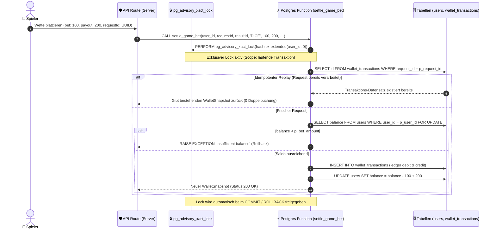

# 03 — Atomare Finanz-RPCs, Transaktions-Locks & Server-Autorität

> **Säule:** 3 von 10 · **Status:** 🟢 Produktionsreif (**Top 1 % — Weltklasse**) · **Stand:** 2026-09-02 · **Owner:** Jan / LLM  
> **Worldmap-Zuordnung:** Kategorie 02 (Unterkategorie 3: RPCs & atomare Transaktionen — Niveau: **Top 10 %**, stärkste Systemsäule)  
> **Sicherheits-SOP:** [`xx_sop/09_security_wallet_invariants.md`](../../xx_sop/09_security_wallet_invariants.md) · **Back:** [`00_DATABASE_OVERVIEW.md`](./00_DATABASE_OVERVIEW.md)

---

## 1 — High-Level: Was ist eine RPC & warum sind atomare Transaktionen geschäftskritisch?

Eine **RPC (Stored Procedure / Remote Procedure Call)** ist ein Stück Programmcode, das direkt im Datenbank-Server (PostgreSQL) ausgeführt wird — nicht auf dem Webserver und niemals im Browser des Spielers.

### Das "Lost-Update"-Problem ohne RPCs (Warum normales Web-Coding scheitert):
Stellen wir uns vor, ein Spieler hat **100 €** auf dem Konto und klickt extrem schnell zweimal hintereinander auf „Wette 50 € platzieren“:
1. **Ohne RPCs (Gefährlicher Standard):**  
   Server-Anfrage 1 liest: Kontostand 100 €.  
   Server-Anfrage 2 liest: Kontostand 100 €.  
   Anfrage 1 zieht 50 € ab und speichert: Kontostand 50 €.  
   Anfrage 2 zieht 50 € ab und speichert: Kontostand 50 €.  
   *Ergebnis:* Der Spieler hat 100 € gesetzt, aber sein Konto zeigt noch 50 € — **50 € Casino-Verlust durch Race-Conditions!**
2. **Mit atomaren RPCs & Advisory Locks (Top 1 % Weltklasse):**  
   Anfrage 1 ruft `settle_game_bet()` auf. Postgres verriegelt das Konto des Spielers für andere Anfragen im Bruchteil einer Millisekunde. Anfrage 2 muss warten, bis Buchung 1 vollständig abgeschlossen ist.  
   *Ergebnis:* Kontostand ist mathematisch garantiert exakt 0 €.

---

## 2 — Technischer Deep-Dive: Die Anatomie von `settle_game_bet`

Die Prozedur `settle_game_bet` (final definiert in Migration `045_fix_wallet_events_jackpot_regression.sql`) ist die am härtesten getestete Funktion des gesamten Repositories:



---

## 3 — Die Kernfunktionen im Detail (PL/pgSQL Code-Referenz)

### 3.1 `settle_game_bet` (Sofortspiele: Dice, Slots, Roulette)

> **Korrektur (2026-09-05):** Diese Referenz nannte früher `settle_standard_bet` samt Tabellen `wallets`/`transactions`/`bets` — keines davon existiert im realen Schema. Der untenstehende Block ist jetzt der **echte, ungekürzte Funktionskörper** aus [`supabase/migrations/045_fix_wallet_events_jackpot_regression.sql`](../../supabase/migrations/045_fix_wallet_events_jackpot_regression.sql) (reale Tabellen: `users` für den Saldo, `wallet_transactions` als Ledger).

```sql
CREATE OR REPLACE FUNCTION public.settle_game_bet(
  p_user_id    TEXT,
  p_request_id UUID,
  p_result_id  UUID,
  p_game       TEXT,
  p_amount     NUMERIC,
  p_payout     NUMERIC,
  p_xp_gain    BIGINT,
  p_result     JSONB,
  p_server_seed_hash TEXT DEFAULT NULL,
  p_nonce      INTEGER DEFAULT NULL
) RETURNS JSONB
LANGUAGE plpgsql
SECURITY DEFINER
SET search_path = public, pg_temp
AS $$
DECLARE
  v_user           users%ROWTYPE;
  v_existing       wallet_transactions%ROWTYPE;
  v_balance        NUMERIC(20, 2);
  v_transaction_id UUID;
  v_response       JSONB;
  v_jackpot_win    NUMERIC(14, 2);
BEGIN
  IF p_user_id IS NULL OR p_user_id = '' OR p_request_id IS NULL OR p_result_id IS NULL THEN
    RAISE EXCEPTION 'Invalid settlement identity';
  END IF;
  IF p_game NOT IN ('DICE', 'ROULETTE', 'SLOTS') OR p_amount <= 0 OR p_payout < 0
     OR p_xp_gain < 0 OR p_xp_gain > 10000 THEN
    RAISE EXCEPTION 'Invalid settlement values';
  END IF;

  PERFORM pg_advisory_xact_lock(hashtextextended(p_user_id, 0));

  SELECT * INTO v_existing
  FROM public.wallet_transactions
  WHERE user_id = p_user_id AND request_id = p_request_id;
  IF FOUND THEN
    RETURN (v_existing.metadata -> 'response') || jsonb_build_object('replayed', true);
  END IF;

  INSERT INTO public.users (id, username)
  VALUES (p_user_id, left(p_user_id, 64))
  ON CONFLICT (id) DO NOTHING;

  SELECT * INTO v_user FROM public.users WHERE id = p_user_id FOR UPDATE;
  IF v_user.balance < p_amount THEN RAISE EXCEPTION 'Insufficient balance'; END IF;

  v_balance := round((v_user.balance - p_amount + p_payout)::numeric, 2);

  UPDATE public.users SET balance = v_balance, updated_at = now() WHERE id = p_user_id;

  v_jackpot_win := jackpot_pool_settle(p_user_id, p_amount, (p_result ->> 'jackpotRoll')::numeric);
  IF v_jackpot_win > 0 THEN
    v_balance := round((v_balance + v_jackpot_win)::numeric, 2);
    UPDATE public.users SET balance = v_balance, updated_at = now() WHERE id = p_user_id;
    INSERT INTO public.wallet_transactions
      (user_id, game, type, amount, balance_after, metadata)
    VALUES
      (p_user_id, 'jackpot', 'jackpot_win', v_jackpot_win, v_balance, '{}'::jsonb);
  END IF;

  INSERT INTO public.wallet_transactions
    (user_id, game, type, amount, balance_after, request_id, result_id, metadata, server_seed_hash, nonce)
  VALUES
    (p_user_id, lower(p_game), 'bet_settled', p_payout - p_amount, v_balance,
     p_request_id, p_result_id, '{}'::jsonb, p_server_seed_hash, p_nonce)
  RETURNING id INTO v_transaction_id;

  IF p_xp_gain > 0 THEN
    INSERT INTO public.wallet_events (user_id, request_id, event_type, xp_gain)
      VALUES (p_user_id, p_request_id, 'xp_gain', p_xp_gain)
      ON CONFLICT (user_id, request_id, event_type) DO NOTHING;
  END IF;

  v_response := jsonb_build_object(
    'balance',       v_balance,
    'xp',            v_user.xp,
    'level',         v_user.level,
    'rank',          v_user.rank,
    'transactionId', v_transaction_id,
    'result',        (p_result - 'jackpotRoll'),
    'replayed',      false,
    'betAmount',     p_amount,
    'payout',        p_payout,
    'jackpotWin',    v_jackpot_win
  );
  UPDATE public.wallet_transactions
  SET metadata = jsonb_build_object('response', v_response)
  WHERE id = v_transaction_id;

  RETURN v_response;
END;
$$;
```

---

## 4 — Das Inventar der rundenbasierten RPCs (Blackjack & Crash)

| Funktion | Migration | Zweck | Parameter |
| :--- | :--- | :--- | :--- |
| **`start_game_round`** | `058_reconcile_remote_schema_drift.sql:1138` | Startet rundenbasiertes Spiel (CRASH/BLACKJACK/CRASH_MULTIPLAYER), zieht Einsatz ab, initialisiert `game_rounds` | `p_user_id, p_request_id, p_game, p_amount, p_state` |
| **`advance_blackjack_round`**| `014_fix_user_stats.sql:202` | Verarbeitet Blackjack-Aktionen (Hit/Double/…) inkl. optimistischer Versionsprüfung und optionalem Settlement | 11 Parameter, siehe Migration |
| **`settle_game_round`** | `014_fix_user_stats.sql:113` | Beendet Runde, schüttet Payout aus, schreibt ins Transaktionsledger | 7 Parameter, siehe Migration |

---

## 5 — Lock-Contention Diagnose & Notfall-Debugging

Sollte es unter extremem Traffic zu Deadlocks oder gestauten Locks kommen, liefert Postgres transparente Einblicke:

```sql
-- 1. Prüfen, welche Prozesse aktuell auf Locks warten:
SELECT 
    blocked_locks.pid     AS blocked_pid,
    blocked_activity.usename  AS blocked_user,
    blocking_locks.pid    AS blocking_pid,
    blocking_activity.usename AS blocking_user,
    blocked_activity.query    AS blocked_statement
FROM  pg_catalog.pg_locks         blocked_locks
JOIN pg_catalog.pg_stat_activity blocked_activity ON blocked_activity.pid = blocked_locks.pid
JOIN pg_catalog.pg_locks         blocking_locks 
    ON blocking_locks.locktype = blocked_locks.locktype
    AND blocking_locks.database IS NOT DISTINCT FROM blocked_locks.database
    AND blocking_locks.relation IS NOT DISTINCT FROM blocked_locks.relation
    AND blocking_locks.page IS NOT DISTINCT FROM blocked_locks.page
    AND blocking_locks.tuple IS NOT DISTINCT FROM blocked_locks.tuple
    AND blocking_locks.virtualxid IS NOT DISTINCT FROM blocked_locks.virtualxid
    AND blocking_locks.transactionid IS NOT DISTINCT FROM blocked_locks.transactionid
    AND blocking_locks.classid IS NOT DISTINCT FROM blocked_locks.classid
    AND blocking_locks.objid IS NOT DISTINCT FROM blocked_locks.objid
    AND blocking_locks.objsubid IS NOT DISTINCT FROM blocked_locks.objsubid
    AND blocking_locks.pid != blocked_locks.pid
JOIN pg_catalog.pg_stat_activity blocking_activity ON blocking_activity.pid = blocking_locks.pid
WHERE NOT blocked_locks.granted;

-- 2. Notfall-Freigabe eines hängenden Prozesses (K4):
SELECT pg_terminate_backend(blocking_pid);
```

---

## 6 — Fehler-Mapping & Exception Handling

Wenn eine Transaktion fehlschlägt, schließt PostgreSQL atomar (`ROLLBACK`). Die API-Routen fangen diese Exceptions ab und mappen sie auf sichere Client-Meldungen:

| Postgres Error-Code / Message | HTTP-Status | Deutsche Nutzermeldung | Ursache / Schutzwirkung |
| :--- | :---: | :--- | :--- |
| `'Insufficient balance'` (`P0001`) | `400 Bad Request` | „Dein Guthaben reicht für diesen Einsatz nicht aus.“ | Einsatz überschreitet verfügbaren Saldo (exakte Message aus `settle_game_bet`, Migration 045). |
| `LOCK_TIMEOUT` (`55P03`) | `429 Too Many Requests` | „Der Vorgang konnte nicht abgeschlossen werden. Bitte erneut versuchen.“ | Deadlock-Prävention bei extrem hoher Parallelität. |
| `UNIQUE_VIOLATION` (`23505`) | `200 OK (Replay)` | Automatische Rückgabe des bestehenden Snapshots | Netzwerkwiederholung fängt doppelten Abzug ab. |
| Unbehandelter Serverfehler | `503 Service Unavailable` | „Transaktionsfehler im Bankensystem. Bitte kontaktiere den Support.“ | **Fail-Closed:** Kein unklarer Teilerfolg. |

---

## 7 — Die 3 unverletzlichen Sicherheits-Vorschriften für RPCs

1. **`SECURITY DEFINER` mit festem `search_path`:**  
   Jede Finanzfunktion läuft mit erhöhten Rechten (`SECURITY DEFINER`), um die RLS-gesperrten Tabellen (`users`, `wallet_transactions`) atomar zu beschreiben. Sie **muss zwingend** `SET search_path = public, pg_temp;` enthalten, damit Angreifer keine manipulierten Hilfsfunktionen unterschieben können.
2. **`pg_advisory_xact_lock`:**  
   Nutzt den schnellen, In-Memory-Postgres-Advisory-Lock mit `hashtext(user_id::text)`. Endet die Transaktion (ob durch Erfolg oder Fehler), wird der Lock automatisch freigegeben. Es können niemals hängende Deadlocks verbleiben.
3. **Legacy-Lockdown (Migration 059):**  
   Aufrufe der alten Funktionen `place_bet()` und `settle_bet()` sind verboten. Migration 059 hat ihnen jegliche Ausführungsrechte für `PUBLIC`, `anon`, `authenticated` und `service_role` entzogen.

---

## 8 — Risiko- & Freigabeklassifizierung für RPC-Operationen

| RPC-Aktion | K-Level | Freigabe & Sicherheitsstandard |
| :--- | :---: | :--- |
| **Lokales Testen via Vitest / Vault Suite** | **K1** | Frei ausführbar. |
| **Neue Read-Only Hilfsfunktion anlegen** | **K3** | Standard-Review mit festem `search_path`. |
| **Änderung an Finanz-RPCs (`settle_game_bet`)** | **K4** | **Explizite Jan-Freigabe zwingend erforderlich.** |
| **`DROP FUNCTION` auf Live-System** | **K5** | **Explizite Bestätigung mit K5-Blockade.** |

---

## 9 — Operative Validierungsbefehle

```powershell
# 1. Ausführen der Vault- & Finanzintegrationstests
npm test -- src/lib/casino/__tests__/vault-integration.test.ts

# 2. Ausführen der Wallet-Vertragstests
npm test -- src/lib/casino/__tests__/wallet.test.ts

# 3. Vollständigen Casino-Testlauf durchführen
npm test -- src/lib/casino/
```

---

## 10 — Verwandte Dokumente & SOP-Referenzen

| Bedarf | Dateipfad |
| :--- | :--- |
| **Sicherheits- & Wallet-Invarianten:** | [`xx_sop/09_security_wallet_invariants.md`](../../xx_sop/09_security_wallet_invariants.md) |
| **Schema-Design (Säule 2):** | [`02_schema_design_datenmodell.md`](./02_schema_design_datenmodell.md) |
| **Row-Level-Security (Säule 4):** | [`04_row_level_security_rls.md`](./04_row_level_security_rls.md) |
| **Master-Übersicht:** | [`00_DATABASE_OVERVIEW.md`](./00_DATABASE_OVERVIEW.md) |
