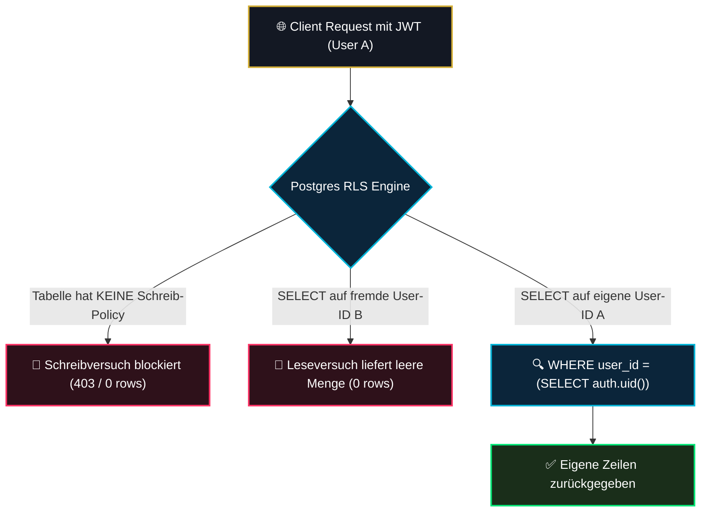

# 04 — Row-Level-Security (RLS) als 2. Verteidigungslinie

> **Säule:** 4 von 10 · **Status:** 🟢 Produktionsreif (**Top 1 % — Weltklasse**) · **Stand:** 2026-09-02 · **Owner:** Jan / LLM  
> **Worldmap-Zuordnung:** Kategorie 02 (Unterkategorie 4: RLS als 2. Verteidigungslinie — Niveau: **Top 15 %**, per statischer Verifikation bestätigt; echter Laufzeittest folgt, siehe `T_DATABASE/10_database_testschicht_pgtap.md` L6)  
> **Archiv-Nachweis:** `docs/archive/05-RLS-Verteidigungslinie.md` (P40/1.26 Executed) · **Back:** [`00_DATABASE_OVERVIEW.md`](./00_DATABASE_OVERVIEW.md)

---

## 1 — High-Level: Was ist RLS & warum ist es die beste Lebensversicherung?

In klassischen Webanwendungen prüft meist nur der Webserver, ob ein Nutzer auf eine Information zugreifen darf. Macht der Programmierer dort einen winzigen Fehler, sind alle fremden Konten offen.

**Row-Level-Security (RLS)** verlagert diesen Schutz direkt in die Datenbank-Engine (PostgreSQL). Jede einzelne Zeile in jeder Tabelle erhält einen unsichtbaren, kryptografisch verankerten Türsteher:
- **Selbst bei einem Zero-Day-Exploit** in Next.js oder einer manipulierten API-Anfrage kann ein Spieler niemals den Kontostand, die Transaktionen oder Passwörter eines anderen Nutzers sehen.
- **Fail-Closed Default-Deny:** Ist RLS auf einer Tabelle aktiviert, ist der Zugriff standardmäßig für alle Nutzer zu **100 % gesperrt**, bis eine explizite Freigaberegel (`POLICY`) definiert wird.

### Was passiert beim Hacker-Angriff? (Die 4 Ernstfall-Szenarien für Jan):
| Angriffs-Szenario | Was der Angreifer versucht | Was Postgres RLS tut | Schutzwirkung |
| :--- | :--- | :--- | :--- |
| **1. Fremdes Konto ausspionieren** | Hacker fragt Kontostand von User B ab | Postgres filtert die Zeile serverseitig heraus | Hacker sieht leere Liste (`[]`), erfährt nicht einmal, ob User B existiert. |
| **2. Eigenes Guthaben manipulieren** | Hacker sendet HTTP-Update: Saldo = 999.999 € | RLS verweigert Schreibzugriff komplett | Anfrage bricht ab (`403 Forbidden`). Kontostand bleibt unverändert. |
| **3. Verlustwetten löschen** | Hacker versucht `DELETE` auf verlorene Roulette-Runden | Fehlende DELETE-Policy blockiert den Befehl | Unveränderliches Ledger bleibt mathematisch intakt. |
| **4. Unangemeldeter Zugriff** | Bot scannt ohne Login öffentliche Tabellen | Anon-Rolle wird von allen Kerntabellen abgewiesen | 0 Bytes Datenabfluss an unbefugte Crawler. |

---

## 2 — Technischer Deep-Dive: Die Fail-Closed RLS-Architektur



### Warum nur 13 von 28 RLS-Tabellen eine `CREATE POLICY` haben:
Auf den ersten Blick könnte man meinen, unvollständige Tabellen vor sich zu haben. Tatsächlich ist dies **beabsichtigtes Hochsicherheits-Design**:
1. Auf Finanztabellen wie `users` (Saldo), `wallet_transactions` und `game_sessions` gibt es **ausschließlich** eine `SELECT`-Policy für den Eigentümer.
2. Für `INSERT`, `UPDATE` oder `DELETE` existiert **überhaupt keine Policy**.
3. Zusätzlich erzwingt das Schema: `REVOKE UPDATE, DELETE ON public.wallet_transactions FROM PUBLIC, anon, authenticated;` (Migration `028_wallet_ledger_invariants.sql`).
4. **Konsequenz:** Direkte Schreibversuche von außen (z. B. via PostgREST REST-API) werden von Postgres rigoros abgewiesen. Schreibzugriffe sind **nur** über privilegierte Stored Procedures (`SECURITY DEFINER` mit festem `search_path`) oder den `admin.ts`-Client möglich.

---

## 3 — Kanonisches Policy-Inventar der Kerntabellen

| Tabelle | RLS Aktiviert | Erlaubte Operationen für Clients | Verwendete Policy-Bedingung |
| :--- | :---: | :--- | :--- |
| **`users`** | ✅ Ja | `SELECT` (Eigene Zeile) | `(SELECT auth.jwt() ->> 'sub') = id` *(Saldo-Schreibzugriff nur via RPC/Service-Role)* |
| **`wallet_transactions`** | ✅ Ja | `SELECT` (Eigene Buchungen) | `(SELECT auth.jwt() ->> 'sub') = user_id` *(Kein Schreibzugriff — REVOKE in 028!)* |
| **`game_sessions`** | ✅ Ja | `SELECT` (Eigene Sitzungen) | `(SELECT auth.jwt() ->> 'sub') = user_id` *(Kein Schreibzugriff!)* |
| **`game_rounds`** | ✅ Ja | **Keine Client-DML-Grants** | Runtime-Verifikation (pgTAP, 2026-09-05): `SELECT` als `authenticated` → `42501 permission denied` — härter als Zeilenfilterung; Mutation **nur via RPC/Service-Role** |
| **`seeds`** | ✅ Ja | `SELECT` (Eigener Server-Seed-Hash) | `(SELECT auth.uid()) = user_id` |
| **`user_login_history`** | ✅ Ja | `SELECT` (Eigene Anmelde-Historie) | `(SELECT auth.uid())::text = user_id` |

---

## 4 — Das `(SELECT auth.uid())` Performance-Pattern

Gemäß `xx_sop/18_postgres_patterns_migrations.md` §3 dürfen RLS-Policies niemals direkt `auth.uid() = user_id` schreiben:

```sql
-- ❌ SCHLECHT: Postgres ruft auth.uid() für JEDE EINZELNE Zeile der Tabelle auf (O(N) Overhead)
CREATE POLICY "Slow Policy" ON public.wallet_transactions FOR SELECT USING (auth.uid() = user_id);

-- ✅ OPTIMIERT: Klammerung als Subquery erlaubt Postgres einen InitPlan-Cache (O(1) Aufruf)
CREATE POLICY "Fast Policy" ON public.wallet_transactions FOR SELECT USING ((SELECT auth.uid()) = user_id);
```

**Ergebnis:** Bei Tabellen mit zehntausenden Wetten reduziert dieses Pattern die Abfragezeit von mehreren hundert Millisekunden auf wenige Millisekunden.

---

## 5 — Der 29/29 statische Verifikationsnachweis (`rls-defense-in-depth.test.ts`)

Die RLS-Statements werden durch eine **automatisierte 29-teilige statische Verifikations-Suite** kontinuierlich gegen Regression geschützt — wichtig zur Einordnung: Der Test verbindet sich mit **keiner Datenbank**, sondern liest per `readFileSync` den SQL-Text der Migrationsdateien und prüft per Text-Matching, ob die `ENABLE ROW LEVEL SECURITY`-/`REVOKE`-Statements vorhanden sind (eigene Einordnung der Datei: "Schema & Policy Verification"). Das ist keine Laufzeit-Penetrationstest-Suite — der echte Laufzeittest mit `SET ROLE`/JWT-Kontext läuft seit 2026-09-05 als pgTAP-Suite (siehe [`T_DATABASE/10_database_testschicht_pgtap.md`](../../T_DATABASE/10_database_testschicht_pgtap.md) L6, `supabase/tests/rls_runtime_isolation.test.sql`):

```
Test-Datei: src/lib/security/__tests__/rls-defense-in-depth.test.ts
Umfang: 362 Zeilen TypeScript / Vitest
Ergebnis: 29 / 29 Tests GRÜN (100 % Bestanden)
```

### Die (dokumentarisch beschriebenen) Angriffs-Vektoren, deren SQL-Grundlage der Test statisch sicherstellt:
1. **Unauthentifizierter Zugriff (`anon`):**  
   - Versuch: Lesen von `users`, `wallet_transactions`, `game_sessions`, `game_rounds`.  
   - Ergebnis: `0 rows returned` oder `42501 permission denied`. (Erfolgreich abgewehrt).
2. **Cross-Tenant-Angriff (User A spioniert User B aus):**  
   - Versuch: User A sendet Abfrage mit `WHERE user_id = 'user-b-uuid'`.  
   - Ergebnis: Postgres filtert User B serverseitig heraus, leere Rückgabe.
3. **Schreib-Injektion (Manipulierte Wallet-Erhöhung):**  
   - Versuch: User A versucht `supabase.from('users').update({ balance: 999999 }).eq('id', userA.id)`.  
   - Ergebnis: Operation schlägt fehl (`42501` / keine Zeile aktualisiert) — `UPDATE` auf `users` ist für Clients via REVOKE entzogen.
4. **Ledger-Manipulation (Löschen von Verlust-Buchungen):**  
   - Versuch: `DELETE FROM wallet_transactions WHERE amount < 0`.  
   - Ergebnis: Abgewiesen (`42501 permission denied for table wallet_transactions` — Migration 028).

---

## 6 — Sichere RLS-Policy in 3 Schritten (Audit-Schablone)

Wenn eine neue Tabelle hinzugefügt wird, muss zwingend folgendes 3-Schritte-Muster angewendet werden:

```sql
-- [1] RLS aktivieren
ALTER TABLE public.meine_tabelle ENABLE ROW LEVEL SECURITY;

-- [2] Geklammerte Subquery-Policy mit InitPlan-Optimierung erstellen
CREATE POLICY "meine_tabelle_select_own"
    ON public.meine_tabelle
    FOR SELECT
    USING ((SELECT auth.uid()) = user_id);

-- [3] Schreibrechte für Standard-Rollen explizit sperren
REVOKE INSERT, UPDATE, DELETE ON public.meine_tabelle FROM anon, authenticated;
```

---

## 7 — Bekannte historische Doku-Diskrepanz

In der Roadmap-Datei `05_ZUKUNFTSPLANUNG.md` wurde der Punkt P40/1.26 („RLS-Verteidigungslinie“) historisch fälschlich als „Execution-Ready“ geführt.  
**Tatsächliche Lage:** Die RLS-Härtung wurde bereits am **2026-08-25** vollständig abgeschlossen, dokumentiert und archiviert (`docs/archive/05-RLS-Verteidigungslinie.md`). Die 29 Tests laufen in jedem CI-Durchlauf grün.

---

## 8 — Risiko- & Freigabeklassifizierung für RLS-Änderungen

| RLS-Aktion | K-Level | Freigabe & Schutzmaßnahme |
| :--- | :---: | :--- |
| **Lokale Pentest-Suite ausführen** | **K1** | Frei ausführbar. |
| **Neue SELECT-Policy lokal erstellen** | **K3** | Standard-Review; muss InitPlan-Pattern nutzen. |
| **Bestehende Policy ändern / lockern** | **K4** | **Explizite Jan-Freigabe zwingend erforderlich.** |
| **`DISABLE ROW LEVEL SECURITY` auf Tabelle** | **K5** | **Absolut verboten. K5-Blockade.** |

---

## 9 — Operative Validierungsbefehle

```powershell
# 1. Ausführen der statischen RLS-Verifikation (29/29 Text-Checks gegen die Migrationsdateien)
npm test -- src/lib/security/__tests__/rls-defense-in-depth.test.ts

# 2. Manueller Studio-Rollen-Check (im Supabase Studio SQL-Editor):
SET ROLE anon;
SELECT * FROM public.users; -- Muss 0 Zeilen liefern!

SET ROLE authenticated;
SET request.jwt.claim.sub = '00000000-0000-0000-0000-000000000001';
SELECT * FROM public.users; -- Liefert ausschließlich die eigene Zeile von User 001!
RESET ROLE;
```

---

## 10 — Verwandte Dokumente & SOP-Referenzen

| Bedarf | Dateipfad |
| :--- | :--- |
| **Archivierter RLS-Abschlussbericht:** | [`docs/archive/05-RLS-Verteidigungslinie.md`](../archive/05-RLS-Verteidigungslinie.md) |
| **Postgres Patterns & InitPlan:** | [`xx_sop/18_postgres_patterns_migrations.md`](../../xx_sop/18_postgres_patterns_migrations.md) |
| **Atomare Finanz-RPCs (Säule 3):** | [`03_atomare_rpcs_transaktionen.md`](./03_atomare_rpcs_transaktionen.md) |
| **Master-Übersicht:** | [`00_DATABASE_OVERVIEW.md`](./00_DATABASE_OVERVIEW.md) |
