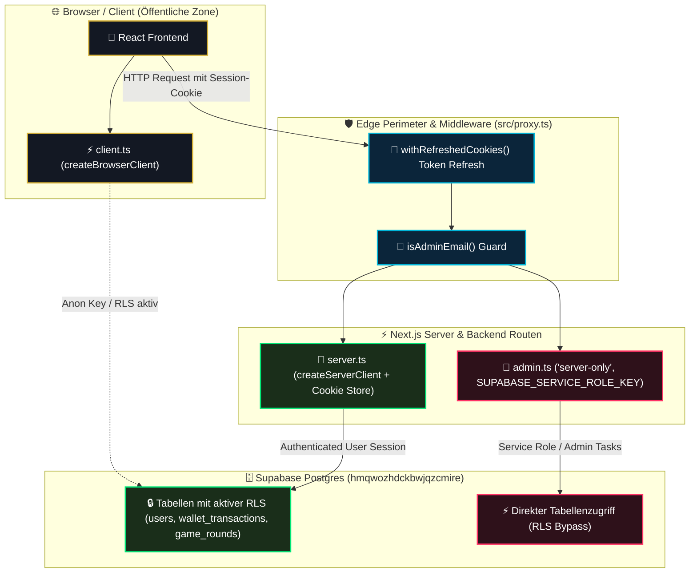

# 05 — Die 3 Supabase-Clients, SSR Cookie-Bridge & Service-Role-Isolation

> **Säule:** 5 von 10 · **Status:** 🟢 Produktionsreif (**Top 1 % — Weltklasse**) · **Stand:** 2026-09-02 · **Owner:** Jan / LLM  
> **Worldmap-Zuordnung:** Kategorie 02 (Unterkategorie 9: Secrets & Service-Role-Isolation — Niveau: **Top 15 %**)  
> **Kontext-Referenz:** [`xx_docs/01_supabase_context.md`](../../xx_docs/01_supabase_context.md) §2 · **Back:** [`00_DATABASE_OVERVIEW.md`](./00_DATABASE_OVERVIEW.md)

---

## 1 — High-Level: Die 3 Schlüssel zum Casino (Für Jan erklärt)

Um maximale Sicherheit zu garantieren, verwendet die Anwendung nicht einen einzigen Datenbankzugang, sondern **drei strikt getrennte Client-Instanzen** mit völlig unterschiedlichen Berechtigungen:

| Client | Metapher | Wo er läuft | Was er darf | Was er NIEMALS darf |
| :--- | :--- | :--- | :--- | :--- |
| **`client.ts`** | **Der Gast-Ausweis** | Direkt im Browser des Spielers | Eigene Profildaten lesen, Passkey-Biometrie initialisieren. | **0 % Kontostands-Änderung.** Kann kein Guthaben verändern oder fremde Daten einsehen. |
| **`server.ts`** | **Der Croupier am Tisch** | Auf dem Next.js-Server (API-Routen) | Wetten im Auftrag des Spielers per Session-Cookie annehmen. | Kann nicht ohne ein gültiges Spieler-Cookie agieren. RLS bleibt aktiv. |
| **`admin.ts`** | **Der Tresor-Hauptschlüssel** | Rein serverseitig (`server-only`) | System-Crons ausführen, Webhooks verarbeiten, Bypasst RLS. | **Darf niemals den Server verlassen.** Ein Schutzmechanismus verhindert, dass er in den Browser gelangt. |

---

## 2 — Technischer Deep-Dive: Architektur & Datenfluss



---

## 3 — Die 3 Client-Dateien im Code-Detail

### 3.1 Browser-Client (`src/utils/supabase/client.ts`)
```typescript
import { createBrowserClient } from '@supabase/ssr';
import type { Database } from '@/types/database.types';

export function createClient() {
  const url = process.env.NEXT_PUBLIC_SUPABASE_URL;
  const anonKey = process.env.NEXT_PUBLIC_SUPABASE_ANON_KEY;

  if (!url || !anonKey) {
    if (typeof window !== 'undefined' && process.env.NODE_ENV !== 'production') {
      console.warn('[Supabase Client] Missing env variables.');
    }
  }

  return createBrowserClient<Database>(url || '', anonKey || '', {
    auth: {
      experimental: {
        passkey: true, // Biometrie-Opt-in im Browser
      },
    },
  });
}
```

### 3.2 SSR Server-Client (`src/utils/supabase/server.ts`)
```typescript
import { createServerClient } from '@supabase/ssr';
import { cookies } from 'next/headers';
import type { Database } from '@/types/database.types';

export async function createClient() {
  const cookieStore = await cookies();

  return createServerClient<Database>(
    process.env.NEXT_PUBLIC_SUPABASE_URL!,
    process.env.NEXT_PUBLIC_SUPABASE_ANON_KEY!,
    {
      cookies: {
        getAll() {
          return cookieStore.getAll();
        },
        setAll(cookiesToSet) {
          try {
            cookiesToSet.forEach(({ name, value, options }) =>
              cookieStore.set(name, value, options)
            );
          } catch {
            // Server Component kann keine Cookies setzen; Middleware übernimmt Token-Refresh
          }
        },
      },
    }
  );
}
```

### 3.3 Admin Master-Client (`src/utils/supabase/admin.ts`)
```typescript
import 'server-only'; // Verhindert versehentliches Client-Bundling strukturell
import { createClient } from '@supabase/supabase-js';
import type { Database } from '@/types/database.types';
import ws from 'ws';

export const supabaseAdmin = createClient<Database>(
  process.env.NEXT_PUBLIC_SUPABASE_URL!,
  process.env.SUPABASE_SERVICE_ROLE_KEY!,
  {
    auth: {
      autoRefreshToken: false,
      persistSession: false,
    },
    realtime: {
      transport: ws, // Node.js WebSocket-Transport für Hintergrund-Tasks
    },
  }
);
```

---

## 4 — Die `withRefreshedCookies()` Bridge in `src/proxy.ts`

Ein klassisches Problem bei Next.js App Router ist das Ablaufen von JWT-Tokens während des Server-Renderings:
- **Die Next.js-Einschränkung:** Server Components dürfen Cookies nur lesen, aber keine neuen Header setzen (`Set-Cookie`).
- **Die Lösung via Edge Middleware:** Jeder eingehende Request läuft durch `src/proxy.ts`. Wenn Supabase feststellt, dass das Token abläuft, erneuert die Middleware es direkt im HTTP-Request und Response-Stream via `withRefreshedCookies()`.
- **Ergebnis:** Weder die Server-Routen noch der Spieler im Browser verlieren während einer Spielsession jemals ihre Verbindung.

---

## 5 — Environment-Variablen & Secret-Matrix

| Variable | Wo definiert | Wo sichtbar | Kritikalität | Schutzmechanismus |
| :--- | :--- | :--- | :---: | :--- |
| **`NEXT_PUBLIC_SUPABASE_URL`** | `.env.local` / Vercel | Browser & Server | Öffentlich | Domain-Bindung, CORS |
| **`NEXT_PUBLIC_SUPABASE_ANON_KEY`** | `.env.local` / Vercel | Browser & Server | Öffentlich | **RLS zwingend aktiv** |
| **`SUPABASE_SERVICE_ROLE_KEY`** | Server-Secrets | **Nur Server** | **MAXIMAL** | `import 'server-only'` |
| **`SUPABASE_ADMIN_EMAILS`** | Server-Secrets | Nur Server | Hoch | Exakte E-Mail-Allowlist |

---

## 6 — Build-Time Secret-Enforcement (`server-only`)

> [!SECURITY] **Der `import 'server-only'` Schutzwall:**  
> Würde ein Entwickler versehentlich `supabaseAdmin` in eine React-Client-Komponente (`'use client'`) importieren, bricht der Next.js-Compiler den Build sofort mit einem fatalen Fehler ab:
> `Error: You're importing a component that needs "server-only". That only works in a Server Component.`  
> Dadurch ist es physikalisch unmöglich, dass der geheime `SUPABASE_SERVICE_ROLE_KEY` in den Browser gelangt.

---

## 7 — Entscheidungs-Schablone: Welchen Client verwende ich wo?

```
[ ] Brauche ich Daten im Browser für UI-Rendering?
    └──> Verwende `src/utils/supabase/client.ts` (RLS aktiv, sicher)

[ ] Baue ich eine API-Route oder Server Action mit angemeldetem Nutzer?
    └──> Verwende `src/utils/supabase/server.ts` (Cookie Session, RLS aktiv)

[ ] Baue ich einen Hintergrund-Cron, Webhook oder System-Job ohne User-Context?
    └──> Verwende `src/utils/supabase/admin.ts` (Service Role, RLS Bypass)
```

---

## 8 — Risiko- & Freigabeklassifizierung

| Client-Aktion | K-Level | Freigabe & Sicherheitsstandard |
| :--- | :---: | :--- |
| **`client.ts` Abfragen (Lesen von Daten)** | **K1** | Frei ausführbar. |
| **`server.ts` API-Aufrufe mit Auth-Prüfung** | **K2** | Lokale Verifikation. |
| **`admin.ts` Nutzung für Background-Crons** | **K3** | Standard-Review im Task-Scope. |
| **Änderung an `SUPABASE_SERVICE_ROLE_KEY`** | **K4** | Secret-Rotation SOP (`xx_sop/14_secret_rotation.md`). |

---

## 9 — Operative Validierungsbefehle

```powershell
# 1. Typecheck & Build-Prüfung (Verifiziert 'server-only' Isolation)
npm run typecheck
npm run build

# 2. Proxy- & Middleware-Tests ausführen
npm test -- src/__tests__/proxy.test.ts
```

---

## 10 — Verwandte Dokumente & SOP-Referenzen

| Bedarf | Dateipfad |
| :--- | :--- |
| **Kanonischer Supabase-Kontext:** | [`xx_docs/01_supabase_context.md`](../../xx_docs/01_supabase_context.md) |
| **API Backend Routen & Middleware:** | [`xx_sop/07_api_backend_routes.md`](../../xx_sop/07_api_backend_routes.md) |
| **Secret-Rotation SOP:** | [`xx_sop/14_secret_rotation.md`](../../xx_sop/14_secret_rotation.md) |
| **Master-Übersicht:** | [`00_DATABASE_OVERVIEW.md`](./00_DATABASE_OVERVIEW.md) |
