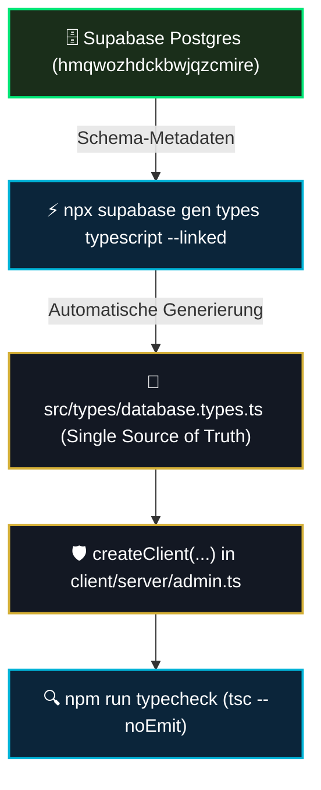

# 06 — Typsicherheit, Typegen & Schema-Typisierung

> **Säule:** 6 von 10 · **Status:** 🟢 verifiziert gegen echten Code (2026-09-05) · **Stand:** 2026-09-05 · **Owner:** Jan / LLM  
> **Worldmap-Zuordnung:** Kategorie 02 (Unterkategorie 5: Typsicherheit / generierte Types — Niveau: **Top 20 %**)  
> **Referenz-SOP:** [`xx_sop/05_database_supabase.md`](../../xx_sop/05_database_supabase.md) §5 · **Back:** [`00_DATABASE_OVERVIEW.md`](./00_DATABASE_OVERVIEW.md)  
> **Hinweis:** Dieser Status beschreibt die Doku-Qualität, nicht den System-Reifegrad — die verifizierte System-Bewertung je Subkategorie steht in [`T_DATABASE/06_database_typsicherheit.md`](../../T_DATABASE/06_database_typsicherheit.md).

---

## 1 — High-Level: Was ist Typsicherheit & warum schützt sie das Casino? (Für Jan erklärt)

In einer modernen Webanwendung arbeiten zwei völlig unterschiedliche Welten zusammen:
1. Die **PostgreSQL-Datenbank**, in der Tabellen, Spalten und Geldwerte liegen.
2. Der **Next.js TypeScript-Code**, der das Frontend anzeigt und Spielzüge berechnet.

### Praxis-Vergleich: Mit vs. Ohne Typegen auf einen Blick:
| Kriterium | Ohne Typegen (Riskant) | Mit Typegen (Top 1 % Weltklasse) |
| :--- | :--- | :--- |
| **Tippfehler bei Spalten** | `user.walet_balance` fällt erst live beim Spielen auf. | Editor zeigt roten Fehler; Build bricht sofort ab. |
| **Geänderte Spaltennamen** | Entwickler vergisst eine Stelle im Code -> Absturz (`500`). | TypeScript listet alle betroffenen Stellen sekundenschnell auf. |
| **RPC-Funktionsparameter** | Falscher Datentyp (Text statt Zahl) erzeugt Datenbankfehler. | IDE erzwingt exakt die richtigen Parameter und Typen. |
| **Entwicklungs-Speed** | Man muss ständig in Supabase nachsehen, wie Spalten heißen. | Automatische Autovervollständigung (IntelliSense) beim Tippen. |

---

## 2 — Technischer Deep-Dive: Die Typegen-Pipeline



---

## 3 — Die Struktur von `Database` (`src/types/database.types.ts`)

Die generierte Datei unterteilt jede Tabelle in drei essenzielle Lebenszyklus-Zustände:
1. **`Row`:** Exakter Zustand einer gelesenen Zeile (alle Pflichtfelder belegt).
2. **`Insert`:** Pflicht- vs. optionale Felder beim Anlegen (z. B. `id` und `created_at` haben Defaults).
3. **`Update`:** Alle Felder optional (Teilaktualisierung einzelner Spalten).

Vereinfachtes Beispiel anhand der realen `users`-Tabelle (Wallet-Status liegt als Spalten auf der User-Row, es gibt **keine** separate `wallets`-Tabelle):

```typescript
export type Json = string | number | boolean | null | { [key: string]: Json | undefined } | Json[];

export type Database = {
  public: {
    Tables: {
      users: {
        Row: {
          id: string;
          balance: number;
          xp: number;
          level: number;
          rank: string;
          created_at: string;
          // ... weitere Spalten laut Migration 001/014
        };
        Insert: { /* Pflichtfelder + optionale Defaults-Felder */ };
        Update: { /* alle Felder optional */ };
      };
    };
    Functions: {
      settle_game_bet: {
        Args: { p_user_id: string; p_request_id: string; /* ... */ };
        Returns: Json;
      };
    };
  };
};
```

---

## 4 — Typisierte Client-Nutzung in der Praxis

**Seit dem 2026-09-05 verifiziert wahr** (vorher eine unzutreffende Doku-Behauptung): Alle drei Supabase-Clients übergeben den generischen `Database`-Parameter — [`src/utils/supabase/server.ts`](../../src/utils/supabase/server.ts) (`createServerClient<Database>`), [`src/utils/supabase/client.ts`](../../src/utils/supabase/client.ts) (`createBrowserClient<Database>`) und [`src/utils/supabase/admin.ts`](../../src/utils/supabase/admin.ts) (`createClient<Database>`). Damit sind Abfragen und RPC-Aufrufe an diesen Clients voll typisiert:

```typescript
import { createClient } from '@/utils/supabase/server';

export async function placeBetAction(amount: number, requestId: string) {
  const supabase = await createClient();

  // ✅ RPC-Aufruf ist typgeprüft: falsche Parameternamen erzeugen TypeScript-Fehler!
  const { data, error } = await supabase.rpc('settle_game_bet', {
    p_user_id: 'user-uuid',
    p_request_id: requestId,
    // ... weitere typgeprüfte Parameter
  });

  if (error) throw new Error(error.message);
  return data;
}
```

---

## 5 — Drift-Schranken gegen veraltete Typen (real, nicht fiktiv)

Es gibt zwei **real existierende** Schranken; die frühere Beschreibung eines `.github/workflows/ci.yml`-Gates war fiktiv (diese Datei existierte nie):

1. **CI-Drift-Gate:** [`schema-drift-check.yml`](../..//.github/workflows/schema-drift-check.yml) (real gebaut, siehe `T_DATABASE/02_database_schema_design.md` L3) vergleicht bei jedem Push/PR auf `main` die frisch aus der lokalen Migration-Kette generierten Types (`npx supabase gen types typescript --local`) gegen die committete Datei und schlägt fehl bei Drift. Kanonischer Regenerier-Befehl ist daher `--local`, nicht `--linked`.
2. **Pre-Commit-Hook:** [`.husky/pre-commit`](../../.husky/pre-commit) → `lint-staged` → [`scripts/typecheck-staged.mjs`](../../scripts/typecheck-staged.mjs) führt `tsc --noEmit` isoliert auf den staged Dateien aus — typgebrochener Code erreicht den Commit gar nicht erst.

---

## 6 — Risiko- & Freigabeklassifizierung

| Typegen-Aktion | K-Level | Freigabe & Sicherheitsstandard |
| :--- | :---: | :--- |
| **Lokale Typgenerierung ausführen** | **K2** | Lokale Verifikation, Standard-Dev-Zyklus. |
| **Typ-Prüfung ausführen (`npm run typecheck`)** | **K1** | Frei ausführbar. |
| **Manuelle Modifikation von `database.types.ts`** | **K3** | **Verboten:** Datei wird generiert, niemals von Hand editieren. |

---

## 7 — Operative Validierungsbefehle

```powershell
# 1. Typen aus der lokalen Migration-Kette neu generieren (kanonisch, CI-kompatibel)
npx supabase start
npx supabase gen types typescript --local > src/types/database.types.ts

# 2. TypeScript-Kompilierung ohne Code-Ausgabe prüfen
npm run typecheck

# 3. Vollständigen Production-Build validieren
npm run build
```

---

## 8 — Verwandte Dokumente & SOP-Referenzen

| Bedarf | Dateipfad |
| :--- | :--- |
| **Supabase SOP (Typgenerierung):** | [`xx_sop/05_database_supabase.md`](../../xx_sop/05_database_supabase.md) |
| **Schema-Design (Säule 2):** | [`02_schema_design_datenmodell.md`](./02_schema_design_datenmodell.md) |
| **Die 3 Supabase-Clients (Säule 5):** | [`05_supabase_clients_architektur.md`](./05_supabase_clients_architektur.md) |
| **Master-Übersicht:** | [`00_DATABASE_OVERVIEW.md`](./00_DATABASE_OVERVIEW.md) |
