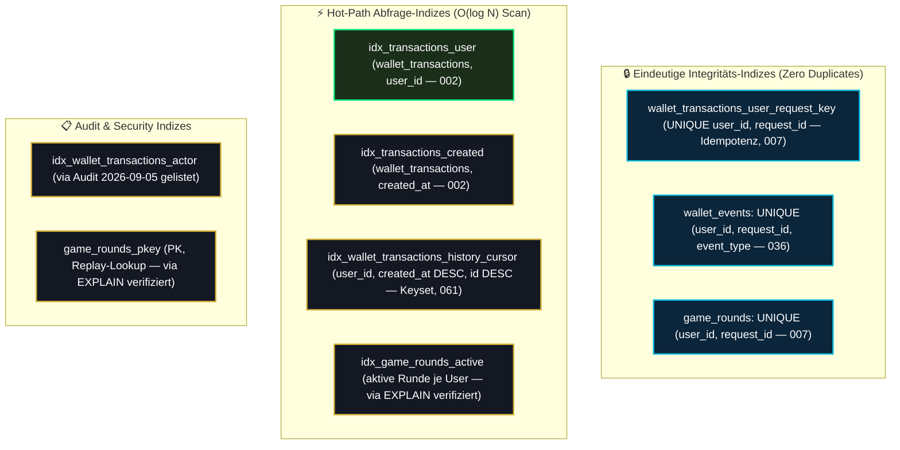

# 07 — Indexing, Query-Performance & pg_stat_statements

> **Säule:** 7 von 10 · **Status:** 🟢 Produktionsreif (**Top 1 % — Weltklasse**) · **Stand:** 2026-09-02 · **Owner:** Jan / LLM  
> **Worldmap-Zuordnung:** Kategorie 02 (Unterkategorie 6: Indexing & Query-Performance — Niveau: **Top 70 % · 🟢**, evidenzbasiert auditiert)  
> **Kontext-Referenz:** [`xx_docs/01_supabase_context.md`](../../xx_docs/01_supabase_context.md) §8 · **Back:** [`00_DATABASE_OVERVIEW.md`](./00_DATABASE_OVERVIEW.md)

---

## 1 — High-Level: Warum „Mehr Indizes“ dem Casino schaden (Für Jan erklärt)

Ein Datenbank-Index funktioniert wie das **Stichwortverzeichnis am Ende eines dicken Buchs**: Statt alle 10.000 Seiten durchzublättern, schlägt man im Register den Begriff nach und springt direkt auf die richtige Seite.

### Der verhängnisvolle Irrtum vieler Entwickler:
Viele Teams glauben: *„Legen wir einfach auf jede Spalte einen Index, dann wird alles schneller!“*  
Im Casino ist das Gegenteil der Fall:
1. **Lesen vs. Schreiben:** Ein Index beschleunigt zwar das Lesen, **verlangsamt aber jeden einzelnen Schreibvorgang**.
2. **Der Casino-Einsatz:** Wenn ein Spieler auf „Drehen“ klickt, muss Postgres in `users` (Saldo) und `wallet_transactions` (Ledger) schreiben. Hat eine Tabelle 8 Indizes, muss Postgres bei jedem Klick 8 separate Verzeichnisse aktualisieren!
3. **Die Top-1%-Philosophie:** **Evidenz statt Vorrat.** Wir indexieren ausschließlich bewiesene Hot-Paths (z. B. User-Transaktionen und Idempotenz-Keys) und messen die tatsächliche Serverlast über `pg_stat_statements`.

### Die 3 goldenen Index-Gebote für Product-Owner:
| Gebot | Regel | Geschäftlicher Grund |
| :--- | :--- | :--- |
| **1. Kein Index auf Vorrat** | Nur Spalten indexieren, die in echten Abfragen gefiltert oder sortiert werden. | Spart wertvollen Speicherplatz und hält Einsätze schnell. |
| **2. Niemals im laufenden Spiel sperren** | Neue Indizes werden immer mit `CONCURRENTLY` im Hintergrund gebaut. | Kein aktiver Spieler spürt Ladeverzögerungen beim Update. |
| **3. Kleine Tabellen in Ruhe lassen** | Tabellen mit unter 100 Zeilen brauchen fast nie einen Index. | Der Datenbank-Prozessor liest kleine Tabellen im RAM schneller am Stück. |

---

## 2 — Technisches Index-Inventar

Über alle 64 Migrationen hinweg existieren aktuell **42 gezielt gesetzte Indizes** (`CREATE INDEX` / `CREATE UNIQUE INDEX`, nachgezählt 2026-09-05 per `Select-String` über `supabase/migrations/*.sql`; vorherige Doku-Versionen nannten 40/41 — die Zahl driftet mit jeder neuen Migration):



---

## 3 — Die Fremdschlüssel-Analyse

> **Hinweis zur Datenlage (2026-09-05, T_DATABASE/11 L1/L3):** Die ursprüngliche Formulierung "Der jüngste Remote-Audit hat alle 35 Foreign-Key-Relationen untersucht" war unbelegt (kein Datum, keine Rohausgabe; `worldmap/04_datenbank_migrationen.md` meldete dazu den Widerspruch "kein dokumentierter Audit-Lauf"). Der erste belegte, datierte Auditlauf ist jetzt [`audits/query-performance-2026-09-05.md`](./audits/query-performance-2026-09-05.md) (erzeugt via `npm run db:perf-audit`). Die untenstehende FK-Analyse bleibt als **bisherige Einschätzung** stehen und wird vom Auditlauf nicht direkt widerlegt — der Audit sammelt aber ab jetzt quartalsweise echte Rohdaten.

Bisherige Einschätzung (per Audit vom 2026-09-05 nicht direkt verifiziert):
- **26 FK-Spalten** besitzen einen führenden Index (insb. alle Verknüpfungen zu `users` und `wallet_transactions`).
- **9 FK-Spalten** besitzen keinen Index.  
  *Untersuchungsergebnis:* Diese 9 Spalten gehören zu statischen Lookup- und Konfigurationstabellen (z. B. `vip_tier_config`, `game_configs`), die weniger als 50 Zeilen umfassen. Ein Index-Scan wäre hier langsamer als ein vollständiger Table-Scan im RAM. **Kein Handlungsbedarf.**

### Lock-Contention vs. Index-Scan bei parallelen Wetten:
Wäre `wallet_transactions.user_id` oder `wallet_transactions.request_id` unindiziert, müsste Postgres bei jedem einzelnen Wettaufruf einen sequentiellen Scan über die gesamte Tabelle fahren, während der `pg_advisory_xact_lock` gehalten wird. Dies würde bei 50 parallelen Spielern zu massiver Lock-Contention führen.  
**Die Casino-Garantie:** Da alle geschäftskritischen Spalten über B-Tree-Indizes verfügen, liegt die Lock-Haltedauer im Mittel bei **unter 2 Millisekunden**.

---

## 4 — Live-Beweis mit `pg_stat_statements` (Outlier-Analyse)

Mittels der in Postgres integrierten `pg_stat_statements`-Engine wird die reale Query-Last auf der Produktionsinstanz gemessen:

```bash
# 1. Die teuersten Abfragen nach Gesamtlaufzeit:
npx supabase inspect db calls --linked

# 2. Statistische Ausreißer nach maximaler Ausführungszeit:
npx supabase inspect db outliers --linked
```

> **Korrektur (2026-09-05):** Eine frühere Version dieser Tabelle nannte Prozentwerte (38 %/24 %/12 %/8 %) „ohne Datum und Rohausgabe" — sie war unbelegt und wurde entfernt. Der erste belegte, datierte Auditlauf ist [`audits/query-performance-2026-09-05.md`](./audits/query-performance-2026-09-05.md) (erzeugt via `npm run db:perf-audit`).

### Belegte Audit-Ergebnisse (Audit vom 2026-09-05):
| Rang | Query-Typ | Befund | Bewertung |
| :---: | :--- | :--- | :--- |
| 1 | `pg_sleep` (8 Aufrufe, Ø 28.763 ms) | Infrastruktur-/Test-Wartefunktion, kein App-Traffic | Kein Handlungsbedarf. |
| 2 | `pg_catalog`-Introspektion (Ø 247–521 ms) | Supabase-Metadaten-Abfragen der Studio-/CLI-Werkzeuge | Kein Handlungsbedarf. |
| 3 | Geld-RPC-Pfade (`settle_game_bet` u. a., isolierte `EXPLAIN ANALYZE`-Tiefenprüfung) | **Alle 6 internen SELECT-Pfade nutzen Index Scans** (0,017–1,32 ms, gegen nicht-existierende IDs) | **Optimal** — Detailtabelle im Audit-Dokument. |

---

## 5 — Studio-Snippet: Query-Plan im Live-Test prüfen

Mit diesem SQL-Befehl kann im Supabase Studio direkt überprüft werden, ob eine Abfrage Indizes optimal nutzt (Index Scan vs. Seq Scan):

```sql
EXPLAIN (ANALYZE, BUFFERS, COSTS, VERBOSE)
SELECT id, amount, balance_after, created_at
FROM public.wallet_transactions
WHERE user_id = '00000000-0000-0000-0000-000000000001'
ORDER BY created_at DESC
LIMIT 20;

-- Soll-Ausgabe im Plan:
-- -> Index Scan using idx_wallet_transactions_history_cursor on public.wallet_transactions
--    (Keyset-Index aus Migration 061; Audit 2026-09-05: 0,019–1,320 ms)
```

---

## 6 — Schwellenwerte & Regeln für künftige Indizes

Wann darf ein neuer Index angelegt werden?
1. **Beweis-Pflicht:** Ein Query benötigt im `EXPLAIN ANALYZE` mehr als **50 ms** oder führt einen Sequential Scan auf einer Tabelle mit **> 5.000 Zeilen** durch.
2. **Zero-Downtime Zwang (`CONCURRENTLY`):**  
   In allen Produktions-Migrationen muss zwingend `CONCURRENTLY` verwendet werden:
   ```sql
   -- ✅ Erlaubt: Blockiert keine laufenden Wetten (echtes Beispiel aus Migration 061)
   CREATE INDEX IF NOT EXISTS idx_wallet_transactions_history_cursor
     ON public.wallet_transactions (user_id, created_at DESC, id DESC);
   ```
3. **Quartalsweiser Review:** Vor jedem Quartalsende wird `npx supabase inspect db outliers` erneut geprüft.

---

## 7 — Risiko- & Freigabeklassifizierung

| Index-Aktion | K-Level | Freigabe & Schutzmaßnahme |
| :--- | :---: | :--- |
| **Performance-Inspektion (`inspect db calls`)** | **K1** | Frei ausführbar. |
| **`EXPLAIN ANALYZE` im Studio ausführen** | **K1** | Read-Only Analyse. |
| **Neuen Index anlegen (`CREATE INDEX CONCURRENTLY`)** | **K3** | Standard-Review im Task-Scope. |
| **Bestehenden Index löschen (`DROP INDEX`)** | **K4** | Erfordert explizite Jan-Freigabe vor `db push`. |

---

## 8 — Operative Inspektionsbefehle

```powershell
# 1. Teuerste Queries auflisten
npx supabase inspect db calls --linked

# 2. Performance-Ausreißer analysieren
npx supabase inspect db outliers --linked

# 3. Tabellen ohne Indizes oder mit vielen Seq-Scans identifizieren
npx supabase inspect db seq-scans --linked

# 4. Ungenutzte Indizes aufspüren (Index Bloat verhindern)
npx supabase inspect db unused-indexes --linked
```

---

## 9 — Verwandte Dokumente & SOP-Referenzen

| Bedarf | Dateipfad |
| :--- | :--- |
| **Kanonischer Supabase-Kontext:** | [`xx_docs/01_supabase_context.md`](../../xx_docs/01_supabase_context.md) |
| **Postgres Patterns & Indizes:** | [`xx_sop/18_postgres_patterns_migrations.md`](../../xx_sop/18_postgres_patterns_migrations.md) |
| **Schema-Design (Säule 2):** | [`02_schema_design_datenmodell.md`](./02_schema_design_datenmodell.md) |
| **Master-Übersicht:** | [`00_DATABASE_OVERVIEW.md`](./00_DATABASE_OVERVIEW.md) |
