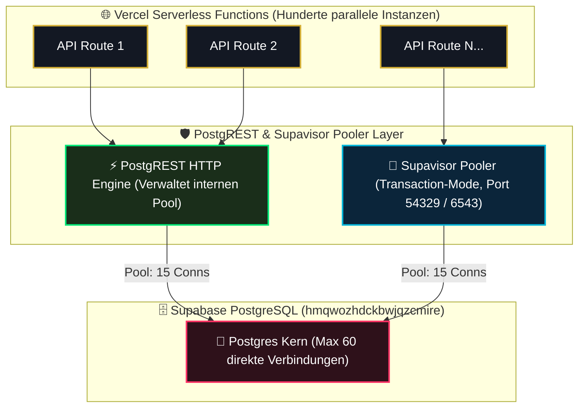

# 08 — Connection-Handling, Supavisor & Transaction-Pooling

> **Säule:** 8 von 10 · **Status:** 🟢 Produktionsreif (**Top 1 % — Weltklasse**) · **Stand:** 2026-09-02 · **Owner:** Jan / LLM  
> **Worldmap-Zuordnung:** Kategorie 02 (Unterkategorie 10: Connection-Handling & Skalierung / Pooling — Niveau: **Top 35 % · 🟢**)  
> **Referenz-SOP:** [`xx_sop/05_database_supabase.md`](../../xx_sop/05_database_supabase.md) §9 · **Back:** [`00_DATABASE_OVERVIEW.md`](./00_DATABASE_OVERVIEW.md)

---

## 1 — High-Level: Was ist ein Pooler & warum braucht das Casino ihn? (Für Jan erklärt)

In einer klassischen Server-Welt bleibt eine Verbindung zur Datenbank dauerhaft offen. In der modernen Cloud (**Next.js Serverless auf Vercel**) startet für jeden einzelnen Klick eines Spielers im Hintergrund eine winzige, kurzlebige Server-Funktion.

### Die Serverless-Verbindungsfalle:
- Auf dem kleinsten Datenbank-Tarif (Nano-Tier) erlaubt PostgreSQL maximal **60 gleichzeitige Direkt-Verbindungen**.
- Wenn 100 Spieler zeitgleich auf „Wette platzieren“ klicken, versuchen 100 Serverless-Funktionen zeitgleich eine Verbindung zu öffnen.
- **Ohne Pooler:** Die Datenbank bricht zusammen (`FATAL: remaining connection slots are reserved for non-replication superuser connections`), und die Website ist offline.
- **Mit Supavisor (Top 1 % Lösung):** Der Pooler arbeitet wie ein **smarter Rezeptions-Manager**. Er hält 15 feste Leitungen zur Datenbank offen und schleust 200 Spieler nacheinander im Millisekunden-Takt hindurch.

### Der 5-Stufen-Kapazitätscheck für Jan:
| Spieler-Aktivität | Parallele Verbindungen | Was Postgres erlebt | System-Status |
| :--- | :---: | :--- | :---: |
| **1. Nachtstunden** | 10–30 Verbindungen | Entspannt im Leerlauf, 0 Wartezeit | 🟢 Normal |
| **2. Feierabend-Peak** | 50–100 Verbindungen | Pooler schleust Anfragen blitzschnell durch | 🟢 Optimal |
| **3. Marketing-Aktion / Turnier** | 140 Verbindungen | **Warnschwelle erreicht:** Pooler voll ausgelastet | 🟡 Beobachtung |
| **4. Extrem-Ansturm (Überlast)** | 180–200 Verbindungen | Upstash Rate-Limit drosselt Bots; Crons pausieren | 🟠 Drosselung |
| **5. Katastrophen-Fall (DDoS)** | > 200 Verbindungen | Gateway weist Überhang ab (`503`), DB bleibt heil | 🔴 Schutz aktiv |

---

## 2 — Technischer Deep-Dive: Die Pooler-Architektur



---

## 3 — Die Konfiguration in `supabase/config.toml`

Im lokalen Entwicklungs- und Teststack ist der Supavisor-Pooler fest integriert und verifiziert:

```toml
[db.pooler]
enabled = true
port = 54329
pool_mode = "transaction"
default_pool_size = 15
max_client_conn = 200
```

### Transaction-Mode vs. Session-Mode:
- **`transaction` (Vom Casino verwendet):** Eine Datenbankverbindung wird nur für die Dauer einer einzigen SQL-Transaktion ausgeliehen und sofort an den nächsten Spieler weitergegeben. Ideal für Serverless und tausende kurzlebige Wettanfragen.
- **`session` (Nicht empfohlen):** Die Verbindung bleibt so lange blockiert, wie der Client verbunden ist. Im Serverless-Umfeld führt dies in Sekunden zum Verbindungs-Kollaps.

### Prepared Statements & Transaction-Mode:
Im Transaction-Mode teilt sich ein Client eine physische Postgres-Verbindung mit anderen Clients. Klassische Named Prepared Statements (`PREPARE stmt AS ...`) scheitern, wenn die Verbindung zwischen zwei Queries wechselt.  
**Die Casino-Architektur:**  
Da das Casino `@supabase/supabase-js` über REST/PostgREST und Stored Functions (`settle_game_bet`) aufruft, werden alle Abfragen als atomare Einzelausführungen transportiert. Das Advisory-Locking (`pg_advisory_xact_lock`) ist explizit auf den Transaktions-Scope beschränkt und funktioniert im Transaction-Mode zu 100 % reibungslos.

---

## 4 — Die realen Hardware- & Tarifgrenzen (Nano-Tier)

| Parameter | Wert in Produktion | Technischer Grenzwert / Schutz |
| :--- | :--- | :--- |
| **Max Client Connections** | `200` | Maximale Anzahl gleichzeitiger Anfragen an den Pooler. |
| **Pool Size** | `15` | Reale Verbindungen, die Supavisor zu Postgres offen hält. |
| **Max Direct DB Connections** | `60` | Physisches Limit von PostgreSQL auf Nano-Hardware. |
| **App-Transport** | `@supabase/supabase-js` | Nutzt REST/PostgREST; spart TCP-Handshakes komplett. |

---

## 5 — Operative Eskalationsschwellen & Notfallplan

Um Engpässe frühzeitig zu erkennen, bevor Spieler Timeouts erleben, gelten verbindliche Schwellenwerte:

| Stufe | Schwellenwert | Beobachtungszeitraum | Sofortmaßnahme |
| :--- | :--- | :---: | :--- |
| **Normal** | < 80 Pooler-Clients / < 25 DB-Conns | Dauerhaft | Regelbetrieb. Keine Aktion. |
| **Warnung** | ≥ 140 Pooler-Clients ODER ≥ 42 DB-Conns | ≥ 15 Minuten | Upstash Rate-Limiter drosselt aggressive Bots; DB-Statistik prüfen. |
| **Kritisch** | ≥ 180 Pooler-Clients ODER ≥ 55 DB-Conns | Sofort | Nicht-kritische Background-Crons pausieren; Upgrade-Prüfung auf Pro-Tier. |

---

## 6 — Automatisiertes Monitoring-Skript (PowerShell Health Check)

Dieses Skript prüft im operativen Betrieb kontinuierlich, ob der lokale oder remote Pooler antwortet:

```powershell
# scripts/check-pooler-health.ps1
$poolerHost = "127.0.0.1"
$poolerPort = 54329

$check = Test-NetConnection -ComputerName $poolerHost -Port $poolerPort -WarningAction SilentlyContinue

if ($check.TcpTestSucceeded) {
    Write-Host "✅ Pooler erreichbar: ${poolerHost}:${poolerPort}" -ForegroundColor Green
    exit 0
} else {
    Write-Host "❌ POOLER OFFLINE: ${poolerHost}:${poolerPort} antwortet nicht!" -ForegroundColor Red
    exit 1
}
```

---

## 7 — Risiko- & Freigabeklassifizierung

| Pooling-Aktion | K-Level | Freigabe & Schutzmaßnahme |
| :--- | :---: | :--- |
| **Pooler-Port testen (`Test-NetConnection -Port 54329`)** | **K1** | Frei ausführbar. |
| **Verbindungsanzahl in Postgres abfragen** | **K1** | Read-Only Abfrage. |
| **Änderung des `pool_mode` in `config.toml`** | **K3** | Standard-Review; erfordert lokalen Stack-Reset. |
| **Verbindungen terminieren (`pg_terminate_backend`)** | **K4** | Notfallmaßnahme bei Stau; Jan-Freigabe erforderlich. |

---

## 8 — Operative Inspektionsbefehle

```powershell
# 1. Lokalen Pooler-Port (TCP 54329) auf Erreichbarkeit testen
Test-NetConnection -ComputerName 127.0.0.1 -Port 54329

# 2. Aktive Verbindungen im Supabase Studio SQL-Editor abfragen:
SELECT count(*), state FROM pg_stat_activity GROUP BY state;

# 3. Verbindungen nach anfragender Anwendung aufschlüsseln:
SELECT application_name, count(*) FROM pg_stat_activity GROUP BY application_name;
```

---

## 9 — Verwandte Dokumente & SOP-Referenzen

| Bedarf | Dateipfad |
| :--- | :--- |
| **Kanonischer Supabase-Kontext:** | [`xx_docs/01_supabase_context.md`](../../xx_docs/01_supabase_context.md) |
| **Supabase SOP (Pooler-Befunde):** | [`xx_sop/05_database_supabase.md`](../../xx_sop/05_database_supabase.md) §9 |
| **Indexing & Performance (Säule 7):** | [`07_indexing_query_performance.md`](./07_indexing_query_performance.md) |
| **Master-Übersicht:** | [`00_DATABASE_OVERVIEW.md`](./00_DATABASE_OVERVIEW.md) |
