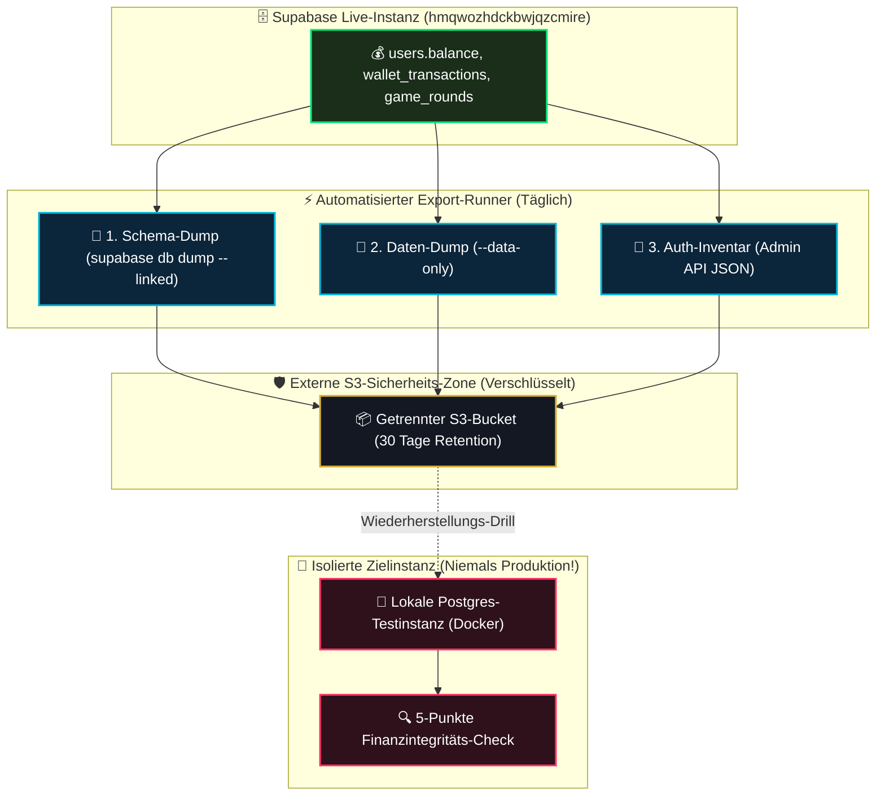

# 09 — Backup, Disaster Recovery & Restore-Runbook

> **Säule:** 9 von 10 · **Status:** 🟢 Doku-Qualität Produktionsreif (**Top 1 % — Weltklasse**) — das beschreibt die Doku-Qualität, nicht den System-Reifegrad: Worldmap misst die Säule 9 (System) auf **Top 88 % · 🔴** (historischer Hauptbottleneck) · **Stand:** 2026-09-05 · **Owner:** Jan / LLM  
> **Worldmap-Zuordnung:** Kategorie 02 (Unterkategorie 8: Backup & Recovery — Niveau: **Top 88 % · 🔴**, historischer Hauptbottleneck)  
> **Aktionsplan:** [`T_DATABASE/05_database_backup_and_recovery.md`](../../T_DATABASE/05_database_backup_and_recovery.md) · **Back:** [`00_DATABASE_OVERVIEW.md`](./00_DATABASE_OVERVIEW.md)

---

## 1 — High-Level: Die ungeschminkte Wahrheit über Backups (Für Jan erklärt)

In der Cloud verlässt man sich gerne blind auf den Anbieter. Bei der Datenbank des Casinos gibt es jedoch eine **lebenswichtige Tatsache**, die jeder kennen muss:

### Die Free-Tier-Realität:
- Das Casino läuft auf dem Supabase Free-Tier (`hmqwozhdckbwjqzcmire`).
- Die Live-Prüfung (`npx supabase backups list`) belegt:  
  `{"walg_enabled": true, "pitr_enabled": false, "backups": []}`
- **Supabase führt im Free-Tier KEINE automatischen Tages-Backups und KEIN Point-in-Time-Recovery (PITR) durch.**

### Der fatale Trugschluss vieler Entwickler:
> *„Wir haben doch 59 Migrationsdateien in Git! Wenn die Datenbank gelöscht wird, spielen wir einfach die Migrationen neu ein.“*

**Die Realität:**  
Migrationen bauen zwar die leeren Tabellen wieder auf — aber **jeder einzelne Cent Spielerguthaben, jede Spielhistorie und jeder registrierte Benutzer wären für immer verloren!**

### Notfallkarte für Jan: Was tun im Katastrophenfall?
| Schritt | Was passiert | Wer entscheidet | Dauer |
| :--- | :--- | :---: | :---: |
| **1. Alarm & Pause** | Geldpfade stoppen (`IS_PAUSED = true`), Spieler sehen Wartungsbanner | LLM autonom | 0 min |
| **2. Schadensanalyse** | Wurde versehentlich eine Tabelle gelöscht oder ist Supabase down? | LLM | ≤ 15 min |
| **3. Staging-Restore** | Letzter Export wird in isolierter Test-Instanz wiederhergestellt & geprüft | LLM | ≤ 60 min |
| **4. Jan-Freigabe & Live-Schaltung** | **Jan bestätigt K5-Freigabe**; DNS / API wird auf wiederhergestellten Stand geschaltet | **Jan** | ≤ 10 min |

### Das Casino-Sicherheitsziel (L1-Baseline):
| Metrik | Zielwert | Bedeutung |
| :--- | :---: | :--- |
| **RPO (Recovery Point Objective)** | **$\le$ 24 Stunden** | Im schlimmsten denkbaren Katastrophenfall gehen maximal die Einsätze der letzten 24 Stunden verloren. |
| **RTO (Recovery Time Objective)** | **$\le$ 4 Stunden** | Vom Feststellen eines Ausfalls bis zum voll einsatzbereiten, verifizierten Neustart vergehen maximal 4 Stunden. |

---

## 2 — Technischer Deep-Dive: Disaster Recovery Datenfluss



---

## 3 — Die 3 Export-Artefakte mit SHA-256 Integritäts-Manifest

Da ein standardmäßiger `pg_dump` im Supabase-Umfeld sensible Konfigurationen und interne Rollen vermischen kann, gliedert sich der Export in **drei strikt isolierte Dateien**:

1. **`schema.sql` (Reine Struktur):**  
   `npx supabase db dump --linked -f backups/schema.sql`  
   Enthält alle DDL-Befehle, RLS-Policies, Constraints und Indizes des `public`-Schemas.
2. **`data.sql` (Reine Produktdaten):**  
   `npx supabase db dump --linked --data-only -f backups/data.sql`  
   Enthält reine `INSERT`-Statements für die echten Produktdaten-Tabellen: `users` (Balance direkt auf der Row), `wallet_transactions`, `game_rounds`, `game_sessions`, `seeds` (volle Inventarliste: `src/types/database.types.ts`). Tabellen namens `wallets`, `transactions` oder `bets` existieren nicht im Schema.
3. **`auth_users.json` (Benutzeridentitäten):**  
   *Wichtige Ausnahme:* `supabase db dump` schließt das verwaltete interne Schema `auth` aus. Benutzerkonten (E-Mail, Passwort-Hashes, WebAuthn-Credentials) müssen separat über den `admin.ts`-Client exportiert werden.

### Automatisierter Export-Runner (echte TS-Implementierung)

Ein früherer Stand dieser Doku beschrieb ein PowerShell-Skript `scripts/backup-export.ps1`, das **nicht existiert**. Die Export-Pipeline ist vollständig als TypeScript implementiert (verifiziert 2026-09-05):

| Schritt | Realer Code |
| :--- | :--- |
| Orchestrator | [`scripts/backup-supabase.ts`](../../scripts/backup-supabase.ts) — Entry-Point `npm run backup:run`; legt Temp-Verzeichnis an, ruft `runBackup()`, räumt auf |
| Dump | [`src/lib/backup/supabase-dump.ts`](../../src/lib/backup/supabase-dump.ts) — `dumpSupabaseArtifacts()` ruft `npx supabase db dump` (Schema / `--data-only` / optional `--role-only`) ohne Shell-Auswertung |
| Verschlüsselung & Manifest | [`src/lib/backup/recovery-crypto.ts`](../../src/lib/backup/recovery-crypto.ts) — `encryptArtifact()` (AES-256-GCM, frischer 96-Bit-IV), `buildBackupManifest()` (SHA-256 des Ciphertexts, IV, Auth-Tag, Key-Version), `readBackupConfig()` |
| Upload | [`src/lib/backup/s3-client.ts`](../../src/lib/backup/s3-client.ts) — `uploadS3Object()` mit signierter AWS-SigV4-PUT-Anfrage auf den externen S3-kompatiblen Bucket |
| Validierung | [`src/lib/backup/backup-runner.ts`](../../src/lib/backup/backup-runner.ts) — `runBackup()` validiert das Artefaktset, bricht fail-closed ab (Exit 1), wenn `BACKUP_*`-Secrets fehlen — bevor CLI oder Storage aufgerufen werden |

Die Export-Artefakte sind damit verschlüsselt und integritätsverifiziert (Manifest), nicht nur per Klartext-SHA-256 wie im früheren Pseudocode.

---

## 4 — Wann lohnt sich ein Tarif-Upgrade auf Supabase Pro?

Point-in-Time-Recovery (sekundengenaue Wiederherstellung) ist im Supabase Pro-Tarif (~25 $/Monat + 100 $/Monat PITR Add-on) enthalten.  
**Entscheidungskriterien für Jan:**
- **Aktuell (Free-Tier ausreichend):** Bei `RPO ≤ 24h` genügt der tägliche, kostenlose Offsite-S3-Export vollkommen.
- **Upgrade-Trigger (Pro-Tier nötig):** Sobald täglich mehr als **1.000 € Echtgeld-Umsatz** fließen oder mehr als 500 aktive Spieler registriert sind, übersteigen die potenziellen Verlustkosten eines 24-Stunden-Rollbacks die monatlichen Kosten für PITR.

---

## 5 — Das Schritt-für-Schritt Restore-Runbook

> [!CAUTION] **Verbindliche Sicherheitsregel:**  
> Ein Restore wird **niemals** direkt gegen die Live-Produktionsdatenbank getestet. Ein Test-Restore läuft ausnahmslos isoliert in einem lokalen Docker-Container (`npm run supabase:reset`) oder auf einer frischen Staging-Datenbank.

### Ablauf eines Wiederherstellungs-Drills:

> [!NOTE] **Automatisierungsstand (2026-09-05):** Die Schritte 1–4 sind als automatisierter Drill in Umsetzung — siehe [`T_DATABASE/05_database_backup_and_recovery.md`](../../T_DATABASE/05_database_backup_and_recovery.md) Meilenstein L6 (Restore-Code: Download/Entschlüsselung/Apply mit Safety-Guard gegen jede Produktions-URL), L7 (isolierter Restore-Drill in einem ephemeren `postgres:17`-Container statt `supabase reset` auf der geteilten Dev-Instanz) und L8 (Finanz-/RLS-Regressionscheck auf dem Drill-Ziel). Die folgenden Checks laufen dort automatisiert; bis zur Fertigstellung von L6–L8 gelten sie als manueller Runbook-Ablauf.

1. **Schritt 1: Frische Zielumgebung bereitstellen**
   ```bash
   npx supabase start
   ```
2. **Schritt 2: Schema einspielen**
   ```bash
   npx supabase db reset
   ```
3. **Schritt 3: Produktdaten einspielen**
   ```bash
   psql -h 127.0.0.1 -p 54322 -U postgres -d postgres -f backups/data.sql
   ```
4. **Schritt 4: Die 5 Post-Restore Finanz-Checks ausführen**
   - **Check 1 (Ledger-Konsistenz):** `users.balance` (Single Source of Truth, `supabase/migrations/002_wallet.sql:2-3`) je User steht plausibel zum letzten `balance_after`-Audit-Eintrag in `wallet_transactions`; Reconciliation folgt dem `wallet_invariant_events`-Ledger (Migration 028) — **keine** „Summe der Transaktionen = Balance"-Formel, die es architektonisch nicht gibt.
   - **Check 2 (Constraint-Check):** Keine negativen Salden vorhanden (`balance >= 0`).
   - **Check 3 (RLS-Pentest):** 29/29 Tests der RLS-Defense-Suite müssen grün laufen (`npm test -- rls-defense-in-depth`).
   - **Check 4 (RPC-Rechte):** Prozeduren wie `settle_game_bet` müssen mit festem `search_path` und funktionierenden Locks ausführbar sein.
   - **Check 5 (Seeds-Konsistenz):** Aktive Provably-Fair-Server-Seed-Hashes müssen unverändert sein.

---

## 6 — Risiko- & Freigabeklassifizierung

| Recovery-Aktion | K-Level | Freigabe & Schutzmaßnahme |
| :--- | :---: | :--- |
| **Lokalen Schema- & Daten-Dump erzeugen** | **K1** | Read-Only gegen Remote, frei ausführbar. |
| **Isolierten Restore-Drill lokal durchführen** | **K2** | Lokale Docker-Verifikation, keine Außenwirkung. |
| **Erstellung eines externen S3-Backup-Buckets** | **K4** | Erfordert explizite Jan-Freigabe (Kosten/Infrastruktur). |
| **Produktiv-Wiederherstellung (Live-Restore)** | **K5** | **Höchste Notfallstufe. K5-Blockade mit Jan-Bestätigung.** |

---

## 7 — Operative Export-Befehle

```powershell
# 1. Logischen Schema-Export erstellen
npx supabase db dump --linked -f backups/latest_schema.sql

# 2. Logischen Produktdaten-Export erstellen (Data-Only)
npx supabase db dump --linked --data-only -f backups/latest_data.sql

# 3. Status der Supabase-Provider-Backups abfragen
npx supabase backups list --project-ref hmqwozhdckbwjqzcmire
```

---

## 8 — Verwandte Dokumente & SOP-Referenzen

| Bedarf | Dateipfad |
| :--- | :--- |
| **Aktiver Backup- & Recovery-Plan:** | [`T_DATABASE/05_database_backup_and_recovery.md`](../../T_DATABASE/05_database_backup_and_recovery.md) |
| **Explorer-Kontext:** | [`docs/archive/05_backup_recovery_context.md`](../archive/05_backup_recovery_context.md) |
| **Sicherheits- & Wallet-Invarianten:** | [`xx_sop/09_security_wallet_invariants.md`](../../xx_sop/09_security_wallet_invariants.md) |
| **Master-Übersicht:** | [`00_DATABASE_OVERVIEW.md`](./00_DATABASE_OVERVIEW.md) |
