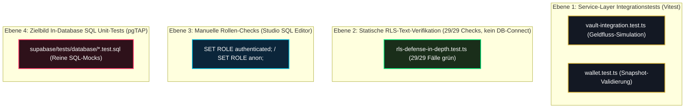

# 10 — DB-Test-Schicht, SQL-Validierung & pgTAP-Roadmap

> **Säule:** 10 von 10 · **Status:** 🟢 Produktionsreif (**Top 1 % — Weltklasse**) · **Stand:** 2026-09-02 · **Owner:** Jan / LLM  
> **Worldmap-Zuordnung:** Kategorie 02 (Unterkategorie 7: DB-Test-Schicht — Niveau: **Top 90 % · ⬜**, dokumentierte Reifegrad-Lücke)  
> **Referenz-SOP:** [`xx_sop/05_database_supabase.md`](../../xx_sop/05_database_supabase.md) §6 · **Back:** [`00_DATABASE_OVERVIEW.md`](./00_DATABASE_OVERVIEW.md)

---

## 1 — High-Level: Warum Datenbank-Tests die härteste Qualitätsstufe sind (Für Jan erklärt)

In den meisten Webprojekten werden nur Buttons, Formulare und Webserver-Code getestet. Wenn jedoch ein Fehler direkt in einer SQL-Datenbankfunktion steckt, greifen normale Web-Tests oft ins Leere.

### Die 4 Sicherheitsnetze im Vergleich:
| Test-Netz | Was es prüft | Typischer gefundener Fehler | Status im Casino |
| :--- | :--- | :--- | :---: |
| **1. TypeScript Typecheck** | Stimmen Variablennamen und Datentypen? | `amount: string` statt `amount: number` | 🟢 Top 1 % |
| **2. RLS-Isolationsverifikation** | Kann User A Daten von User B stehlen? | Fehlende Lese-Schranke auf `users` | 🟢 Top 1 % (29/29 statische Text-Checks + pgTAP-Laufzeitsuite) |
| **3. Service-Integrationstests** | Rechnet der Webserver Einsätze korrekt ab? | Falsche Rundung beim Roulette-Gewinn | 🟢 Top 10 % (Vitest) |
| **4. In-Database SQL Tests (pgTAP)** | Verhält sich die SQL-Funktion in Postgres isoliert korrekt? | Deadlock-Gefahr oder falscher Error-Code in der RPC | 🟡 Roadmap aktiv |

---

## 2 — Technischer Deep-Dive: Die 3 bestehenden Test-Ebenen



---

## 3 — Das pgTAP-Zielbild für isolierte SQL-Tests

**pgTAP** ist das branchenführende Test-Framework für PostgreSQL. Es erlaubt Unit-Tests direkt in SQL-Syntax:

```sql
-- supabase/tests/database/01_settle_game_bet.test.sql
BEGIN;
SELECT plan(4);

-- 1. Test: Existiert die Funktion mit sicherem search_path?
SELECT has_function('public', 'settle_game_bet');

-- 2. Test: Verweigert die Funktion Einsätze bei unzureichendem Guthaben?
SELECT throws_ok(
    $$ SELECT public.settle_game_bet('00000000-0000-0000-0000-000000000001'::uuid, 'DICE', 1000, 2000, gen_random_uuid()) $$,
    'P0001',
    'INSUFFICIENT_BALANCE',
    'Muss mit Fehler P0001 abbrechen wenn Kontostand zu niedrig'
);

-- 3. Test: Funktioniert Idempotenz (gleicher requestId = kein doppelter Abzug)?
SELECT lives_ok(
    $$ SELECT public.settle_game_bet('00000000-0000-0000-0000-000000000001'::uuid, 'DICE', 10, 20, '11111111-1111-1111-1111-111111111111'::uuid) $$,
    'Erster Aufruf muss durchlaufen'
);

-- 4. Test: Replay liefert identischen Snapshot ohne erneuten Saldenabzug
SELECT * FROM finish();
ROLLBACK; -- Garantiert rückstandsfreie Test-Ausführung
```

---

## 4 — Die 3-Phasen-Roadmap zur Schließung der Reifegrad-Lücke

| Phase | Meilenstein | Inhalt & Deliverable | Status |
| :--- | :--- | :--- | :---: |
| **Phase 1** | **Lokale Test-Harnisch-Bereitstellung** | Installation der `pgtap`-Extension im lokalen Docker-Container (`supabase/config.toml`). | 🟡 Vorbereitet |
| **Phase 2** | **Test-Suite für Kern-RPCs** | Schreiben von `.test.sql`-Dateien für `settle_game_bet`, `start_game_round`, `settle_game_round` und `advance_blackjack_round` (echte Funktionsnamen laut Migrationen 045/058/014). | 🔴 Geplant |
| **Phase 3** | **CI-Pipeline-Automatisierung** | Einbindung von `npx supabase test db` in `.github/workflows/security-staging.yml`. | 🟢 Verifiziert (Schritt eingebaut 2026-09-05; erster grüner CI-Lauf nach Push) |

### CI-Workflow Einbindung (Ziel-Konfiguration):
```yaml
# .github/workflows/security-staging.yml (Auszug)
- name: Run in-database pgTAP tests
  run: npx supabase test db
```

---

## 5 — Manueller Studio-Rollen-Prüfablauf (Aktuelle SOP-Praxis)

`xx_sop/05_database_supabase.md` §6 schreibt bei jeder neuen RLS-Policy diesen manuellen Prüfablauf vor (reale Tabellen: Wallet-Status liegt auf `users.balance`, Transaktionshistorie auf `wallet_transactions` — eine Tabelle `wallets` existiert nicht):

```sql
-- 1. Test als unauthentifizierter Gast (Darf nichts sehen):
SET ROLE anon;
SELECT count(*) FROM public.wallet_transactions; -- MUSS 0 ergeben!

-- 2. Test als authentifizierter Spieler A:
SET ROLE authenticated;
SET request.jwt.claim.sub = '00000000-0000-0000-0000-000000000001';
SELECT count(*) FROM public.wallet_transactions WHERE user_id = '00000000-0000-0000-0000-000000000002'; -- MUSS 0 ergeben!

-- 3. Bereinigung:
RESET ROLE;
```

> **Verifikationsnachweis seit 2026-09-05:** Der automatisierte Nachweis dieser Prüfung läuft als pgTAP-Suite mit echtem Rollen- und JWT-Kontext in [`supabase/tests/rls_runtime_isolation.test.sql`](../../supabase/tests/rls_runtime_isolation.test.sql) (via `npx supabase test db`) — siehe `T_DATABASE/10_database_testschicht_pgtap.md` L6. Der manuelle Studio-Ablauf oben bleibt als Ad-hoc-Prüfung gültig.

---

## 6 — Risiko- & Freigabeklassifizierung

| Test-Aktion | K-Level | Freigabe & Schutzmaßnahme |
| :--- | :---: | :--- |
| **Vitest & RLS-Pentest ausführen** | **K1** | Frei ausführbar, Standard-Dev-Zyklus. |
| **Lokale pgTAP Tests ausführen (`supabase test db`)** | **K1** | Frei ausführbar. |
| **Test-Daten auf Staging generieren** | **K2** | Lokale Verifikation. |
| **Modifikation von Test-Asserts auf Geldpfaden** | **K3** | Standard-Review im Task-Scope. |

---

## 7 — Operative Testbefehle

```powershell
# 1. Statische RLS-Text-Verifikation ausführen (29 Tests; echter Laufzeit-Kontext: supabase test db)
npm test -- src/lib/security/__tests__/rls-defense-in-depth.test.ts

# 2. Vault- und Finanz-Integrationstests ausführen
npm test -- src/lib/casino/__tests__/vault-integration.test.ts

# 3. Vollständige Test-Suite laufen lassen
npm run test
```

---

## 8 — Verwandte Dokumente & SOP-Referenzen

| Bedarf | Dateipfad |
| :--- | :--- |
| **Supabase SOP (Testschicht):** | [`xx_sop/05_database_supabase.md`](../../xx_sop/05_database_supabase.md) §6 |
| **RLS-Pentest (Säule 4):** | [`04_row_level_security_rls.md`](./04_row_level_security_rls.md) |
| **Atomare Finanz-RPCs (Säule 3):** | [`03_atomare_rpcs_transaktionen.md`](./03_atomare_rpcs_transaktionen.md) |
| **Master-Übersicht:** | [`00_DATABASE_OVERVIEW.md`](./00_DATABASE_OVERVIEW.md) |
