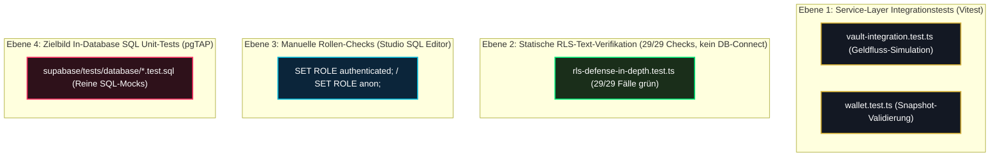

# 10 — DB-Test-Schicht, SQL-Validierung & pgTAP (Ist-Stand)

> **Säule:** 10 von 10 · **Status:** 🟢 Verifiziert (P0-RPCs + RLS + Konkurrenz abgedeckt; pgTAP-Läufe lokal, CI-Step eingebaut) · **Stand:** 2026-09-13 · **Owner:** Jan / LLM  
> **Worldmap-Zuordnung:** Kategorie 02 (Unterkategorie 7: DB-Test-Schicht — Reifegrad-Lücke geschlossen durch T_DATABASE-Säule 10, N1–N7)  
> **Referenz-SOP:** [`xx_sop/05_database_supabase.md`](../../xx_sop/05_database_supabase.md) §6 · **Back:** [`00_DATABASE_OVERVIEW.md`](./00_DATABASE_OVERVIEW.md)

---

## 1 — High-Level: Warum Datenbank-Tests die härteste Qualitätsstufe sind (Für Jan erklärt)

In den meisten Webprojekten werden nur Buttons, Formulare und Webserver-Code getestet. Wenn jedoch ein Fehler direkt in einer SQL-Datenbankfunktion steckt, greifen normale Web-Tests oft ins Leere.

### Die 5 Sicherheitsnetze im Vergleich:

| Test-Netz                            | Was es prüft                                                   | Typischer gefundener Fehler                         |                            Status im Casino                            |
| :----------------------------------- | :------------------------------------------------------------- | :-------------------------------------------------- | :--------------------------------------------------------------------: |
| **1. TypeScript Typecheck**          | Stimmen Variablennamen und Datentypen?                         | `amount: string` statt `amount: number`             |                               🟢 Top 1 %                               |
| **2. RLS-Isolationsverifikation**    | Kann User A Daten von User B stehlen?                          | Fehlende Lese-Schranke auf `users`                  | 🟢 29/29 statische Text-Checks + pgTAP-Laufzeit (alle 39 RLS-Tabellen) |
| **3. Service-Integrationstests**     | Rechnet der Webserver Einsätze korrekt ab?                     | Falsche Rundung beim Roulette-Gewinn                |                          🟢 Top 10 % (Vitest)                          |
| **4. In-Database SQL Tests (pgTAP)** | Verhält sich die SQL-Funktion in Postgres isoliert korrekt?    | Deadlock-Gefahr oder falscher Error-Code in der RPC |           🟢 13 Testdateien / 207 Assertions, P0-Quote unten           |
| **5. Echter Konkurrenztest (N5)**    | Serialisiert der Advisory-Lock parallele Settlements wirklich? | Doppelter Kontostands-Effekt bei Race               |          🟢 `test:concurrency` (2 gleichzeitige Calls je RPC)          |

---

## 1a — P0-Abdeckungsquote (Messzahl, Stand 2026-09-13)

Inventar: `docs/database/pgtap-coverage-inventory.json` — 75 deduplizierte Funktionen aus den Migrationen, klassifiziert nach Geld-Nähe: **13 P0**, 17 P1, 40 P2, 5 legacy (revoket).

| Kennzahl                                                                                                                                  | Wert                        |
| :---------------------------------------------------------------------------------------------------------------------------------------- | :-------------------------- |
| P0-Funktionen gesamt                                                                                                                      | 13                          |
| P0 mit direct pgTAP-Test                                                                                                                  | **11**                      |
| P0 zusätzlich indirect (Jackpot-Kette: `jackpot_pool_contribute`/`jackpot_pool_settle` laufen innerhalb des getesteten `settle_game_bet`) | 2 → **13/13 kumulativ**     |
| pgTAP-Testdateien / geplante Assertions                                                                                                   | 13 Dateien / 207 Assertions |

Bewertung: Der Geldpfad ist vollständig abgedeckt — 11 direct + 2 über die getestete Settlement-Kette. Die 2 Jackpot-RPCs sind die einzigen P0-Funktionen ohne eigene Testdatei; ein dedizierter Test ist als Option dokumentiert (N1-Inventar, `priorityDefinitions`).

---

## 2 — Technischer Deep-Dive: Die 5 Test-Ebenen



---

## 3 — Das pgTAP-Muster für isolierte SQL-Tests (real im Einsatz)

**pgTAP** ist das branchenführende Test-Framework für PostgreSQL. Es erlaubt Unit-Tests direkt in SQL-Syntax. Die realen Tests folgen dem Muster unten und liegen in [`supabase/tests/`](../../supabase/tests/) (13 Dateien, 207 Assertions, Rollback-Isolation je Lauf):

```sql
-- supabase/tests/database/01_settle_game_bet.test.sql
BEGIN;
SELECT plan(4);

-- 1. Test: Existiert die Funktion mit sicherem search_path?
SELECT has_function('public', 'settle_game_bet');

-- 2. Test: Verweigert die Funktion Einsätze bei unzureichendem Guthaben?
SELECT throws_ok(
    $$ SELECT public.settle_game_bet('00000000-0000-0000-0000-000000000001'::uuid, 'DICE', 1000, 2000, gen_random_uuid()) $$,
    'P0001',
    'INSUFFICIENT_BALANCE',
    'Muss mit Fehler P0001 abbrechen wenn Kontostand zu niedrig'
);

-- 3. Test: Funktioniert Idempotenz (gleicher requestId = kein doppelter Abzug)?
SELECT lives_ok(
    $$ SELECT public.settle_game_bet('00000000-0000-0000-0000-000000000001'::uuid, 'DICE', 10, 20, '11111111-1111-1111-1111-111111111111'::uuid) $$,
    'Erster Aufruf muss durchlaufen'
);

-- 4. Test: Replay liefert identischen Snapshot ohne erneuten Saldenabzug
SELECT * FROM finish();
ROLLBACK; -- Garantiert rückstandsfreie Test-Ausführung
```

---

## 4 — Regelbetrieb: CI-Verankerung der Testschicht (Stand 2026-09-13)

`security-staging.yml` führt gegen die ephemere lokale Supabase-Instanz drei DB-Prüfungen aus — Reihenfolge:

1. **Coverage-Check** (`scripts/check-pgtap-coverage.ts`, informativ `continue-on-error`): vergleicht das N1-Inventar mit `supabase/tests/*.test.sql`; eine neue P0-Funktion ohne Testdatei fällt als roter Step auf, ohne den PR hart zu blockieren (Migration und Test dürfen in unterschiedlichen PRs landen). Der Contract-Test `staging-regression-contract.test.ts` pinnt genau diesen einen Soft-Fail.
2. **pgTAP-Suite** (`npx supabase test db`, blockierend): 13 Dateien / 207 Assertions — Geld-RPCs (Fehlerpfade, Idempotenz-Replay, Ledger-Invarianten), Wallet-Immutability, Promo-Einlösung, Race-Settlement, RLS-Laufzeit-Isolation (Kern-5 + erweitert: alle 39 RLS-Tabellen, 2 Fail-Closed-Modi).
3. **Konkurrenztest** (`npx tsx scripts/test-concurrent-settlement.ts`, blockierend): zwei gleichzeitige service_role-Calls mit derselben `request_id` auf `settle_game_bet` und `start_game_round` — beweist, dass der `pg_advisory_xact_lock`-Serialisierungspfad genau einen Settlement-Effekt erzeugt und die zweite Antwort der gecachte Replay ist; lokal auch als `npm run test:concurrency` ausführbar.

Offen bis zur Merge-Phase: erster realer Lauf der Suite (`supabase test db` braucht die lokale Instanz; Verifikationsplan siehe §9 der Planungsdatei).

---

## 5 — Manueller Studio-Rollen-Prüfablauf (Aktuelle SOP-Praxis)

`xx_sop/05_database_supabase.md` §6 schreibt bei jeder neuen RLS-Policy diesen manuellen Prüfablauf vor (reale Tabellen: Wallet-Status liegt auf `users.balance`, Transaktionshistorie auf `wallet_transactions` — eine Tabelle `wallets` existiert nicht):

```sql
-- 1. Test als unauthentifizierter Gast (Darf nichts sehen):
SET ROLE anon;
SELECT count(*) FROM public.wallet_transactions; -- MUSS 0 ergeben!

-- 2. Test als authentifizierter Spieler A:
SET ROLE authenticated;
SET request.jwt.claim.sub = '00000000-0000-0000-0000-000000000001';
SELECT count(*) FROM public.wallet_transactions WHERE user_id = '00000000-0000-0000-0000-000000000002'; -- MUSS 0 ergeben!

-- 3. Bereinigung:
RESET ROLE;
```

> **Verifikationsnachweis seit 2026-09-05:** Der automatisierte Nachweis dieser Prüfung läuft als pgTAP-Suite mit echtem Rollen- und JWT-Kontext in [`supabase/tests/rls_runtime_isolation.test.sql`](../../supabase/tests/rls_runtime_isolation.test.sql) (via `npx supabase test db`) — siehe `T_DATABASE/10_database_testschicht_pgtap.md` L6. Der manuelle Studio-Ablauf oben bleibt als Ad-hoc-Prüfung gültig.

---

## 6 — Risiko- & Freigabeklassifizierung

| Test-Aktion                                           | K-Level | Freigabe & Schutzmaßnahme             |
| :---------------------------------------------------- | :-----: | :------------------------------------ |
| **Vitest & RLS-Pentest ausführen**                    | **K1**  | Frei ausführbar, Standard-Dev-Zyklus. |
| **Lokale pgTAP Tests ausführen (`supabase test db`)** | **K1**  | Frei ausführbar.                      |
| **Test-Daten auf Staging generieren**                 | **K2**  | Lokale Verifikation.                  |
| **Modifikation von Test-Asserts auf Geldpfaden**      | **K3**  | Standard-Review im Task-Scope.        |

---

## 7 — Operative Testbefehle

```powershell
# 1. Statische RLS-Text-Verifikation ausführen (29 Tests; echter Laufzeit-Kontext: supabase test db)
npm test -- src/lib/security/__tests__/rls-defense-in-depth.test.ts

# 2. Vault- und Finanz-Integrationstests ausführen
npm test -- src/lib/casino/__tests__/vault-integration.test.ts

# 3. Vollständige Test-Suite laufen lassen
npm run test

# 4. pgTAP-Suite + Coverage-Check (braucht laufende lokale Instanz: supabase start)
npx supabase test db
npx tsx scripts/check-pgtap-coverage.ts

# 5. Echter Konkurrenztest der Advisory-Lock-Pfade (braucht lokale Instanz + PHASE1_*-Env)
npm run test:concurrency
```

---

## 8 — Verwandte Dokumente & SOP-Referenzen

| Bedarf                             | Dateipfad                                                                   |
| :--------------------------------- | :-------------------------------------------------------------------------- |
| **Supabase SOP (Testschicht):**    | [`xx_sop/05_database_supabase.md`](../../xx_sop/05_database_supabase.md) §6 |
| **RLS-Pentest (Säule 4):**         | [`04_row_level_security_rls.md`](./04_row_level_security_rls.md)            |
| **Atomare Finanz-RPCs (Säule 3):** | [`03_atomare_rpcs_transaktionen.md`](./03_atomare_rpcs_transaktionen.md)    |
| **Master-Übersicht:**              | [`00_DATABASE_OVERVIEW.md`](./00_DATABASE_OVERVIEW.md)                      |
