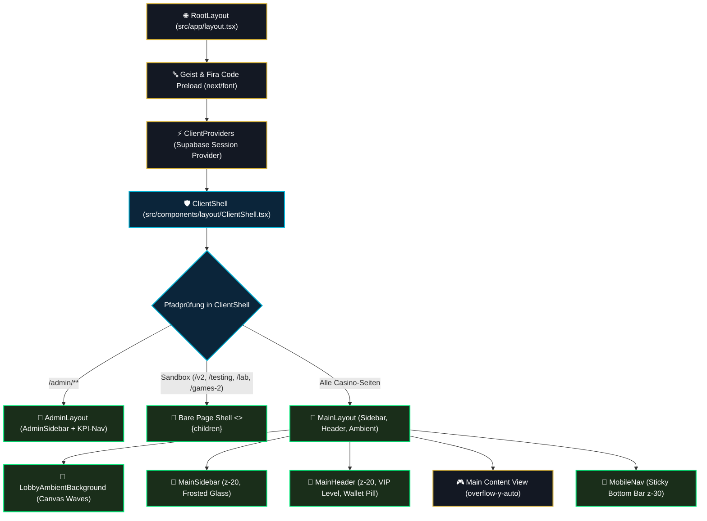

# 01 — Layout-Shell, Viewport-Architektur & Navigation

> **Säule:** 1 von 10 · **Status:** 🟢 Produktionsreif · **Reifegrad:** Live & Vollständig  
> **Niveau V1:** Top 1 % · **Niveau V2:** Top 10 % · **Niveau V3:** Top 22 % · **Niveau V4 (Schonungslos optimiert):** **Top 8 %** · **Stand:** 2026-09-02  
> **Zweck:** Architektur- und Integrationsspezifikation der Next.js 16 App Router Layout-Hierarchie, Tri-State `ClientShell`, Viewport-Handling, Z-Index-Staffelung und Navigation.  
> **Back:** [`00_FRONTEND_OVERVIEW.md`](./00_FRONTEND_OVERVIEW.md)

---

## 1 — High-Level: Was ist das & wann brauche ich das?

Die Layout-Shell bildet das architektonische Skelett von Casino Royale. Sie kapselt globale Header, Desktop-Sidebar, Ambient-Canvas-Hintergrund, Mobile-Navigation und Modals, sodass bei Routenwechseln innerhalb des Casinos kein Flackern oder unnötiger Re-Mount auftritt:

- **Ehrliche V4-Niveau-Einstufung: Top 8 %** (V1: Top 1 % · V2: Top 10 % · V3: Top 22 %)
- **Stärken:** Saubere Trennung zwischen isolierten Sandboxes (`/v2`, `/testing`, `/lab`, `/games-2`), dem geschützten Admin-Bereich (`/admin/**`) und der Casino-Hauptbühne (`MainLayout`). Vollständig entkoppeltes modales Orchestrierungs-Submodul (`MainLayoutModals.tsx`), stabiles `100dvh` Viewport-Containment und zero Layout-Jitter.
- **Verbleibende V4-Restpunkte:** Die Client-Komponenten-Dichte im Layout-Root ist durch interaktive Audio-, Session- und Modal-Events bedingt noch hoch (Next.js SSR-Streaming nur partiell nutzbar).

---

## 2 — Neue-Seiten-Checkliste (3 Schritte zur Integration)

```
[ ] 1. Route definieren (z. B. src/app/vip-club/page.tsx):
        export default function VipClubPage() { ... }
        Exportiert standardmäßig Metadata (title, description).

[ ] 2. Shell-Zugehörigkeit prüfen (src/components/layout/ClientShell.tsx):
        - Standard-Seite: Automatisches Wrapping durch <MainLayout> (keine Aktion nötig).
        - Admin-Seite (/admin/*): Automatisches Wrapping durch <AdminLayout>.
        - Isolierte Sandbox (/v2/*, /testing/*, /lab/*): Rendert als bare React-Fragmente <>{children}</>.

[ ] 3. Viewport- & Z-Index-Konformität einhalten:
        - Hauptinhalt muss in einem Scroll-Container mit overflow-y-auto liegen.
        - Feste Höhenschichten (Z_INDEX.NAVIGATION_BARS = 20, MODAL = 50) respektieren.
```

---

## 3 — Tri-State Shell-Routing & Viewport-Architektur

### 3.1 Flowchart der Shell-Auflösung



### 3.2 Implementierung: `src/components/layout/ClientShell.tsx`

```typescript
'use client';

import React from 'react';
import { usePathname } from 'next/navigation';
import MainLayout from './MainLayout';
import AdminLayout from './AdminLayout';
import OnboardingFlow from './OnboardingFlow';
import { useMounted } from '@/hooks/useMounted';

export default function ClientShell({ children }: { children: React.ReactNode }) {
  const pathname = usePathname();
  const isAdmin = pathname?.startsWith('/admin');
  const isSandboxV2 = pathname === '/v2' || pathname?.startsWith('/v2/');
  const isRefactoring = pathname === '/refactoring' || pathname?.startsWith('/refactoring/');
  const isTesting = pathname === '/testing' || pathname?.startsWith('/testing/');
  const isMotionLab = pathname === '/games-2';
  const isParticleLab = pathname === '/lab' || pathname?.startsWith('/lab/');
  const mounted = useMounted();

  const isTestingWithShell = pathname === '/testing/lobby-bento';

  // Isolierte Test- & Sandbox-Routen rendern ohne Casino-Navigation
  if (
    (isSandboxV2 || isRefactoring || isTesting || isMotionLab || isParticleLab) &&
    !isTestingWithShell
  ) {
    return <>{children}</>;
  }

  if (isAdmin) {
    return <AdminLayout>{children}</AdminLayout>;
  }

  return (
    <div suppressHydrationWarning>
      <MainLayout>{children}</MainLayout>
      {mounted && <OnboardingFlow />}
    </div>
  );
}
```

---

## 4 — Z-Index-System & Layering-Matrix

Um visuelle Überlagerungsfehler auszuschließen, ist der Z-Index-Raum in 8 verbindliche Zonen unterteilt:

| Zone                     |     Z-Index     | Komponenten im Projekt                          | Zweck & Verhalten                               |
| :----------------------- | :-------------: | :---------------------------------------------- | :---------------------------------------------- |
| **Canvas / Background**  | `z-0` bis `z-1` | `LobbyAmbientBackground.tsx`, SVG Mesh          | Hintergrund-Wellen, animierter Sternenstaub     |
| **Game Stage**           |     `z-10`      | `BlackjackTable.tsx`, `CrashCanvas.tsx`, Walzen | Spielflächen, Filztisch, Kartenstapel           |
| **Navigation Chrome**    |     `z-20`      | `MainHeader.tsx`, `MainSidebar.tsx`             | Fixierte Kopf- und Seitenleisten (`blur(16px)`) |
| **Mobile Nav / Sticky**  |     `z-30`      | `MobileNav.tsx`, `HistoryFilterBar.tsx`         | Sticky Navigation & Filter auf Mobilgeräten     |
| **Dropdowns & Tooltips** |     `z-40`      | `Tooltip.tsx`, Notifications Popover            | Kontextmenüs, Hilfetexte über der Navigation    |
| **Modals & Dialogs**     |     `z-50`      | `SettingsModal.tsx`, `WalletModal.tsx`          | 2-Spalten-Zentrumsfenster mit Backdrop-Blur     |
| **Celebration Overlays** |     `z-100`     | `BigWinOverlay.tsx`, Level-Up Banner            | Epische Vollbild-Gewinnanimationen              |
| **Emergency & Toasts**   |    `z-99999`    | `ToastContainer.tsx`, `GlobalErrorBoundary`     | Sicherheitswarnungen, Netzwerkfehler, Toasts    |

---

## 5 — Code-Pfade (Vollständige Übersicht)

```
src/
├── app/
│   ├── layout.tsx                     # HTML-Shell, Font-Injektion, Metadata
│   ├── globals.css                    # Globale CSS-Variablen & Base-Styles
│   └── page.tsx                       # Startseite / Lobby
├── components/
│   └── layout/
│       ├── ClientShell.tsx            # Tri-State Shell Router
│       ├── MainLayout.tsx             # Casino Shell (Sidebar + Header + Canvas)
│       ├── AdminLayout.tsx            # Isolierte Admin Shell
│       ├── MainHeader.tsx             # Topbar mit Wallet, Rang & Auth-Button
│       ├── MainSidebar.tsx            # Desktop Frosted Glass Sidebar
│       ├── MobileNav.tsx              # Sticky Bottom Nav (< 768px)
│       ├── NotificationCenter.tsx     # Glocken-Menü für Alerts
│       ├── OnboardingFlow.tsx         # Willkommens-Modal für Neuanmeldungen
│       ├── ToastContainer.tsx         # Globaler Toast-Stack (z-99999)
│       └── shell-routing.ts           # Pure Routing Helper
└── hooks/
    ├── useIsNarrowViewport.ts         # Breakpoint-Erkennung (< 768px)
    └── useMounted.ts                  # Hydration-Guard
```

---

## 6 — Layout-Invarianten

1. **Keine doppelte Shell-Verschachtelung:** Sandbox- und Admin-Seiten dürfen niemals innerhalb von `MainLayout` gerendert werden. Die Trennung erfolgt deterministisch in `ClientShell.tsx`.
2. **Scroll-Containment:** Das Wurzellayout verhindert Body-Horizontal-Overflow (`overflow-x-hidden`). Alle Seiteninhalte scrollen innerhalb des Main-Containers (`overflow-y-auto min-h-screen`).
3. **Hydration-Stabilität:** Dynamische Client-Only Elemente (wie `OnboardingFlow` oder `NotificationCenter`) dürfen erst nach `mounted === true` gerendert werden, um Next.js SSR-Mismatch-Warnungen zu verhindern.

---

## 7 — Bekannte Pitfalls & Fallstricke

> **Pitfall 1 — iOS Safari 100vh Sprung:** Die mobile Browserleiste blendet sich beim Scrollen ein/aus. Die Verwendung von `h-screen` erzeugt sichtbare Ruckler. **Lösung:** Strikte Verwendung von `min-h-[100dvh]` oder `min-h-screen` mit flex-grow.

> **Pitfall 2 — Modal Z-Index Kollision:** Wird ein Modal in eine geschachtelte Komponente ohne React Portal gerendert, kann es von übergeordneten `transform`- oder `filter`-Properties abgeschnitten werden. **Lösung:** Modals immer an oberster Stelle im Layout oder über ein Portal einhängen.

> **Pitfall 3 — Unbeabsichtigte Sandbox-Vererbung:** Beim Anlegen neuer Testrouten vergisst man oft, den Pfad in `ClientShell.tsx` aufzunehmen. Die Testseite erbt dann automatisch Header und Sidebar der Live-Lobby. **Lösung:** Neue Testrouten immer unter `/testing/*`, `/v2/*` oder `/lab/*` anlegen.

---

## 8 — Tests & Verifikation

```bash
# 1. Typprüfung der Shell- & Layout-Komponenten
npm run typecheck

# 2. Linter-Prüfung auf Layout-Dateien
npm run lint

# 3. Unit-Tests für Shell-Routing
npx vitest run src/components/layout/__tests__/
```
