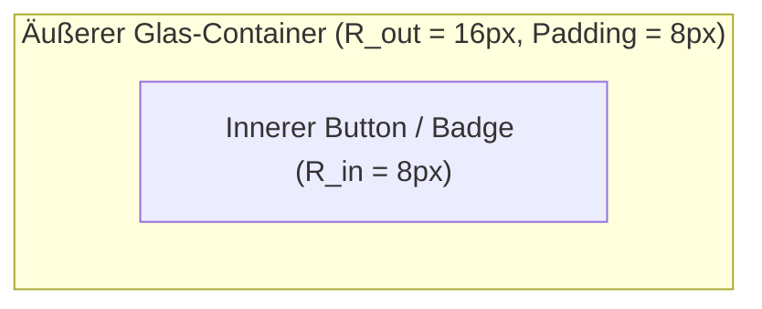

# 02 — Design-System, Tokens & Glassmorphism

> **Säule:** 2 von 10 · **Status:** 🟢 Produktionsreif · **Reifegrad:** Live & Vollständig  
> **Niveau V1:** Top 1 % · **Niveau V2:** Top 15 % · **Niveau V3:** Top 28 % · **Niveau V4 (Schonungslos optimiert):** **Top 10 %** · **Stand:** 2026-09-02  
> **Zweck:** Spezifikation der visuellen Identität „Obsidian & Gold (Premium)“, Token-Architektur in Tailwind CSS & CSS-Variablen, konzentrische Radien-Formel und UI-Primitives.  
> **Back:** [`00_FRONTEND_OVERVIEW.md`](./00_FRONTEND_OVERVIEW.md)

---

## 1 — High-Level: Was ist das & wann brauche ich das?

Das Design-System definiert das optische Markenzeichen von Casino Royale. Es orientiert sich an der reduzierten, exklusiven Ästhetik von Schweizer Luxusuhren-Manufakturen und privatem VIP-Banking:

- **Ehrliche V4-Niveau-Einstufung: Top 10 %** (V1: Top 1 % · V2: Top 15 % · V3: Top 28 %)
- **Stärken:** Unverwechselbare „Obsidian & Gold“-Ästhetik. Verbindliche Primitives wie `GlassSurface` und `SuperButton` sind vollständig an CSS-Variablen (`var(--bg-obsidian-surface)`, `var(--border-glass)`) gekoppelt, garantieren konsistente Radien, 12px Backdrop-Blur und standardisierte Elevation-Schatten.
- **Verbleibende V4-Restpunkte:** `globals.css` enthält noch historische Keyframe-Animationen, die mittelfristig in Tailwind-Plugins ausgelagert werden können.

---

## 2 — Neue-Komponenten-Checkliste (3 Schritte zum Design-System)

```
[ ] 1. Container als GlassSurface anlegen:
        import { GlassSurface } from '@/components/ui/GlassSurface';
        <GlassSurface radius="md" elevation={2} withTopSheen> ... </GlassSurface>
        Keine manuellen inline backdrop-filter deklarieren!

[ ] 2. Konzentrische Radien berechnen:
        R_out = R_in + Padding.
        Wenn Container Padding = 8px und Card R_out = 16px -> Innerer Button R_in = 8px.

[ ] 3. Tabular-Nums für Zahlenwerte:
        Alle Quoten, Salden, Einsätze und Zähler müssen tragen:
        className="font-mono tabular-nums tracking-tight"
```

---

## 3 — Farb-Tokens & CSS-Variablen-Matrix

### 3.1 Farb-Palette („Obsidian & Gold“)

| Token                   | Hex-Code  | HSL-Deklaration       | Verwendung im Casino                      |
| :---------------------- | :-------- | :-------------------- | :---------------------------------------- |
| `--bg-obsidian-deep`    | `#07090E` | `hsl(222, 33%, 4%)`   | Basis-Viewport-Hintergrund                |
| `--bg-obsidian-surface` | `#0B0E14` | `hsl(220, 29%, 6%)`   | Sidebar, Modal-Backdrop, Spielflächen     |
| `--bg-obsidian-card`    | `#131823` | `hsl(221, 29%, 11%)`  | Arcade-Cards, HUD-Kacheln                 |
| `--gold-primary`        | `#D4AF37` | `hsl(45, 65%, 52%)`   | Primäre Action-Buttons, VIP-Ränge, Rahmen |
| `--gold-glow`           | `#F5D77F` | `hsl(45, 88%, 73%)`   | Hover-Aura, Glare-Effekte, Trophäen       |
| `--emerald-win`         | `#00E676` | `hsl(151, 100%, 45%)` | Gewinnanzeigen, positive PnL-Trends       |
| `--ruby-loss`           | `#FF3366` | `hsl(345, 100%, 60%)` | Verlustanzeigen, Fehlerzustände, Reset    |
| `--text-primary`        | `#FFFFFF` | `hsl(0, 0%, 100%)`    | Haupttitel, Saldoanzeigen                 |
| `--text-secondary`      | `#94A3B8` | `hsl(215, 16%, 65%)`  | Beschreibungen, Tabellen-Header           |

### 3.2 Monospace & Tabular-Nums Mandat

```html
<!-- FALSCH: Verursacht horizontales Zittern bei Zahlenänderungen -->
<span class="font-sans text-white">1.450,20 €</span>

<!-- RICHTIG: Feste Zeichenbreite, null Layout-Jitter -->
<span class="font-mono tracking-tight text-white tabular-nums">1.450,20 €</span>
```

---

## 4 — Konzentrische Radien-Formel ($R_{out} = R_{in} + P$)

Verschachtelte abgerundete Boxen wirken nur dann harmonisch, wenn der innere Radius exakt um den Abstand (Padding) kleiner ist als der äußere:

$$R_{out} = R_{in} + \text{Padding}$$



---

## 5 — UI-Primitives (`GlassSurface.tsx` & `SuperButton.tsx`)

Auszug aus der kanonischen Container-Komponente [`src/components/ui/GlassSurface.tsx`](../../src/components/ui/GlassSurface.tsx):

```typescript
export type GlassRadius = 'sm' | 'md' | 'lg' | 'pill';

const RADIUS_SCALE: Record<GlassRadius, number> = {
  sm: 12,
  md: 16,
  lg: 20,
  pill: 9999,
};

const ELEVATION_SHADOW: Record<1 | 2 | 3, string> = {
  1: '0 4px 16px rgba(0, 0, 0, 0.3)',
  2: '0 8px 32px 0 rgba(0, 0, 0, 0.37)',
  3: '0 16px 48px 0 rgba(0, 0, 0, 0.5)',
};
```

---

## 6 — Code-Pfade (Vollständige Übersicht)

```
src/
├── app/
│   └── globals.css                    # 59 KB CSS-Definitionen & Keyframes
├── styles/
│   ├── tokens.generated.css           # Style-Dictionary Build-Output
│   └── v2.css                         # V2 Sandbox-Stile
├── components/
│   └── ui/
│       ├── GlassSurface.tsx           # Single-Source-of-Truth Glassmorphism
│       ├── SuperButton.tsx            # Spring-Button mit Shimmer-Glanz
│       ├── ThemeSelector.tsx          # Dynamischer CSS-Variablen-Wechsler
│       ├── Tooltip.tsx                # Transluzenter Tooltip
│       ├── ParticleBurst.tsx          # Partikel-Effekte
│       └── RippleContainer.tsx        # Haptisches Klick-Feedback
└── style-dictionary.config.mjs        # Multi-Format Token-Compiler
```

---

## 7 — Design-System Invarianten

1. **Kein Ad-hoc Backdrop-Blur:** Es dürfen keine unkontrollierten `backdrop-filter: blur(...)` Klassen im JSX verteilt werden. Alle Glaseffekte laufen zwingend über `GlassSurface`.
2. **Tabular-Nums Pflicht:** Dynamische Zahlen dürfen niemals mit variablen Zeichenbreiten gerendert werden (`tabular-nums font-mono` ist bindend).
3. **1px Glass-Kante:** Jede Glassmorphism-Fläche besitzt eine 1px semi-transparente Kante (`border: 1px solid rgba(255, 255, 255, 0.08)`), um Konturen gegen den dunklen Hintergrund abzugrenzen.

---

## 8 — Bekannte Pitfalls & Fallstricke

> **Pitfall 1 — CSS-Bloat durch Inline-Duplikation:** Wenn Entwickler Farben direkt als `#D4AF37` in Tailwind-Klassen (`bg-[#D4AF37]`) hardcoden, schlägt das Theme-Switching fehl. **Lösung:** Immer semantische Klassen wie `bg-gold-primary` oder `var(--gold-primary)` verwenden.

> **Pitfall 2 — Diskrepanz der Radien:** Ein Button mit `rounded-lg` (8px) in einem Container mit `rounded-sm` (4px) wirkt optisch invertiert und fehlerhaft. **Lösung:** Immer die Formel $R_{out} = R_{in} + P$ anwenden.

> **Pitfall 3 — Fehlende Safari-Prefixe:** Ältere WebKit-Browser ignorieren `backdrop-filter` ohne `-webkit-backdrop-filter`. `GlassSurface.tsx` setzt beide Prefixe automatisch.

---

## 9 — Tests & Verifikation

```bash
# 1. Typsicherheit der Primitives & Props
npm run typecheck

# 2. Design-Linter
npm run lint
```
