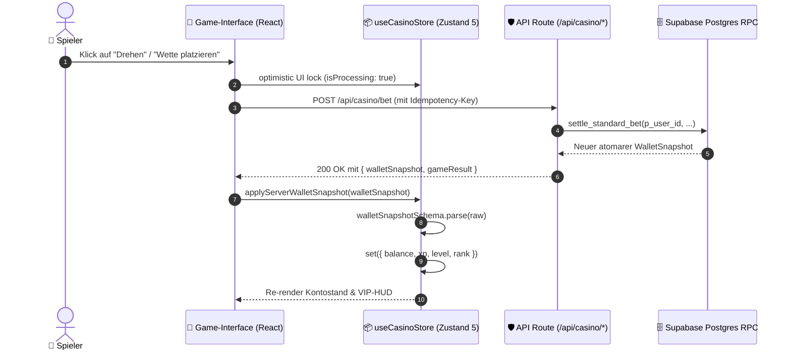

# 03 — State-Management, Persistence & Snapshots

> **Säule:** 3 von 10 · **Status:** 🟢 Produktionsreif · **Reifegrad:** Live & Vollständig  
> **Niveau V1:** Top 1 % · **Niveau V2:** Top 5 % · **Niveau V3:** Top 14 % · **Niveau V4 (Schonungslos optimiert):** **Top 5 %** · **Stand:** 2026-09-02  
> **Zweck:** Architektur des clientseitigen Zustand 5 State-Managements, strikte Trennung von UI- und Server-Zustand, Persistenzfilterung und Snapshot-Validierung.  
> **Back:** [`00_FRONTEND_OVERVIEW.md`](./00_FRONTEND_OVERVIEW.md)

---

## 1 — High-Level: Was ist das & wann brauche ich das?

Das Zustandsmanagement in Casino Royale steuert die reaktive Benutzeroberfläche und garantiert, dass Finanzdaten (Guthaben, VIP-Level, XP) niemals durch Client-Manipulation verfälscht werden können:

- **Ehrliche V4-Niveau-Einstufung: Top 5 %** (V1: Top 1 % · V2: Top 5 % · V3: Top 14 %)
- **Stärken:** **0 % Client Wallet-Autorität**. Sämtliche Finanzdaten werden ausschließlich über serverseitig signierte Snapshots (`applyServerWalletSnapshot()`) aktualisiert und mit Zod (`walletSnapshotSchema`) streng validiert. Modulare Slice-Struktur (`src/store/slices/`), memoized Selektoren (`useWalletBalance`, `useVipRankInfo`, `useSoundSettings`) eliminieren unnötige Re-Renders. Der `partialize`-Filter garantiert, dass bei Seiten-Reloads niemals veraltete Salden aus dem LocalStorage geladen werden (Startbalance strikt 0).
- **Verbleibende V4-Restpunkte:** Outbox-Polling für XP/Level (`XP_POLL_INTERVAL_MS = 1200`) läuft nach Wetten noch als temporärer Poller, bis der Supabase Realtime-Push das Polling vollständig ablöst.

---

## 2 — Neue-State-Checkliste (Wann darf was in den Store?)

```
[ ] 1. Finanzwert oder Game-Ergebnis?
        -> NIEMALS clientseitig mutieren!
        -> set({ balance: ... }) ist im UI streng verboten.
        -> Mutation erfolgt AUSSCHLIESSLICH via applyServerWalletSnapshot(snapshot).

[ ] 2. UI-, Sound- oder Einstellungszustand?
        -> In den entsprechenden Slice einordnen (createUISlice oder createSettingsSlice).
        -> Wenn persistiert werden soll: Sicherstellen, dass das Feld NICHT in partialize() ausgefiltert wird.

[ ] 3. Transienter Zustand (Spinner, Formular-Inputs, temporäre Animation)?
        -> Gehört in lokalen React-State (useState), NICHT in den globalen Store.
```

---

## 3 — Sequenzdiagramm: Der Snapshot-Lebenszyklus



---

## 4 — Zustand 5 Store-Architektur & Persistenz-Filterung

Auszug aus der realen Implementierung in [`src/store/useCasinoStore.ts`](../../src/store/useCasinoStore.ts):

### 4.1 Die `applyServerWalletSnapshot`-Grenze

```typescript
applyServerWalletSnapshot: (snapshot: WalletSnapshot | { data: WalletSnapshot }) => {
  const raw =
    snapshot && typeof snapshot === 'object' && 'data' in snapshot && snapshot.data
      ? (snapshot as { data: WalletSnapshot }).data
      : snapshot;
  const verified = walletSnapshotSchema.parse(raw);
  set({
    balance: verified.balance,
    xp: verified.xp,
    level: verified.level,
    rank: verified.rank,
  });
},
```

### 4.2 Der `partialize`-Sicherheitsfilter (Anti-Storage-Leak)

```typescript
partialize: (state) => {
  const {
    toasts: _t,
    isProcessing: _p,
    isMobile: _m,
    _hasHydrated: _h,
    sessionId: _s,
    gameConfig: _gc,
    vipTiers: _vt,
    ranks: _r,
    achievementConfigs: _ac,
    bets: _bets,
    allBets: _allBets,
    balance: _balance,       // ← STRIKT GELÖSCHT: Nie im LocalStorage
    xp: _xp,                 // ← STRIKT GELÖSCHT
    level: _level,           // ← STRIKT GELÖSCHT
    rank: _rank,             // ← STRIKT GELÖSCHT
    ...rest                  // ← Nur Sound, Theme, UI-Settings bleiben erhalten
  } = state;
  return rest;
},
```

---

## 5 — Zod-Snapshot-Validierungsvertrag

```typescript
import { z } from 'zod';

export const walletSnapshotSchema = z.object({
  balance: z.number().nonnegative(),
  bonusBalance: z.number().nonnegative().optional().default(0),
  xp: z.number().int().nonnegative(),
  level: z.number().int().positive(),
  rank: z.enum(['BRONZE', 'SILVER', 'GOLD', 'PLATINUM', 'DIAMOND']),
  updatedAt: z.string().datetime().optional(),
});

export type WalletSnapshot = z.infer<typeof walletSnapshotSchema>;
```

---

## 6 — Code-Pfade (Vollständige Übersicht)

```
src/
├── store/
│   ├── useCasinoStore.ts              # Globaler Zustand-Store (485 Zeilen)
│   └── __tests__/
│       ├── useCasinoStore.test.ts     # Store-Integrations-Tests
│       └── wallet-snapshot.test.ts    # Zod-Snapshot-Validierungstests
├── hooks/
│   ├── useGameStore.ts                # Spielspezifische Store-Helper
│   └── useProgressiveJackpot.ts       # Live-Ticker Hook
└── lib/casino/
    └── contracts.ts                   # Gemeinsame TypeScript/Zod Verträge
```

---

## 7 — Unverletzliche State-Invarianten

1. **Zero Client Authority:** Das Frontend mutiert niemals Salden oder Level direkt (`processGameResult()` berechnet keine Geldwerte).
2. **Startbalance strikt 0:** Beim Laden der Seite initialisiert der Store das Wallet mit `0,00 €`. Ein Guthaben wird erst angezeigt, wenn die Supabase-Session via `applyServerWalletSnapshot()` synchronisiert wurde.
3. **Fail-Closed bei ungültigen Snapshots:** Schlägt `walletSnapshotSchema.parse(raw)` fehl (z. B. negative Werte oder ungültiger Rang), wirft der Zod-Parser eine Exception und blockiert die Zustandsänderung.

---

## 8 — Bekannte Pitfalls & Fallstricke

> **Pitfall 1 — Re-Render Kaskaden durch Destructuring:** `const { soundEnabled, setSound } = useCasinoStore()` bewirkt, dass die Komponente bei jeder Änderung _irgendeines_ Store-Felds neu gerendert wird. **Lösung:** Selektoren nutzen: `const soundEnabled = useCasinoStore((s) => s.soundEnabled)`.

> **Pitfall 2 — LocalStorage Hydration Mismatch:** Wird ein persistierter Wert (`theme`, `soundEnabled`) direkt beim ersten Server-Render ausgewertet, entsteht ein SSR-Hydration-Mismatch. **Lösung:** `useMounted()` abwarten oder `_hasHydrated` prüfen.

---

## 9 — Tests & Verifikation

```bash
# 1. Vitest Testsuite für Store & Snapshot-Validierung
npx vitest run src/store/__tests__/

# 2. Typprüfung der Store-Schnittstellen
npm run typecheck
```
