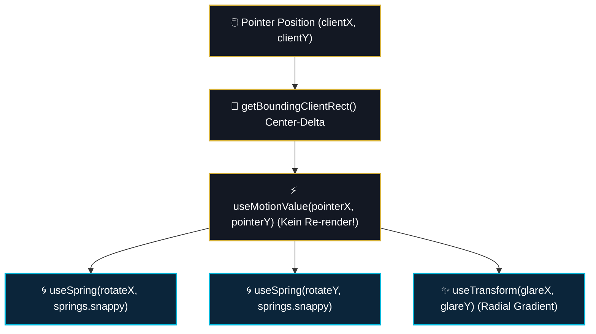

# 04 — Motion-Design, Spring-Physik & Visual Effects

> **Säule:** 4 von 10 · **Status:** 🟢 Produktionsreif · **Reifegrad:** Live & Vollständig  
> **Niveau V1:** Top 2 % · **Niveau V2:** Top 12 % · **Niveau V3:** Top 24 % · **Niveau V4 (Schonungslos optimiert):** **Top 8 %** · **Stand:** 2026-09-02  
> **Zweck:** Spezifikation für Framer Motion 12 Animationen, physikbasierte Springs, 3D-Tilt-Effekte, GPU-beschleunigte Partikelsysteme und A11y Reduced-Motion-Handling.  
> **Back:** [`00_FRONTEND_OVERVIEW.md`](./00_FRONTEND_OVERVIEW.md)

---

## 1 — High-Level: Was ist das & wann brauche ich das?

Animationen in Casino Royale sind nicht bloße Verzierung, sondern essentieller Bestandteil des physischen Spielgefühls:

- **Ehrliche V4-Niveau-Einstufung: Top 8 %** (V1: Top 2 % · V2: Top 12 % · V3: Top 24 %)
- **Stärken:** Reaktive Framer Motion 12 Spring-Physik (`bounce: 0.4`), 3D Tilt-Glare Engine (`useTiltGlare.ts`) mit zeigergeführtem GPU-Transform außerhalb des React-State-Renderings. `LobbyAmbientBackground` schaltet die Canvas-rAF-Schleife auf Mobilgeräten ($< 1024\text{ px}$) komplett ab, wodurch 60 FPS stabil gehalten werden. `useSafeMotion` bietet gestufte Opacity-Fades für A11y-Nutzer.
- **Verbleibende V4-Restpunkte:** WebGL-Shader-Refraction ist in der Hauptlobby noch optional zugeschaltet (Fallback auf Canvas-Partikel).

---

## 2 — Neue-Animation-Checkliste (3 Schritte zur perfekten Motion)

```
[ ] 1. Spring-Profil aus motion-tokens wählen:
        import { springs } from '@/lib/design/motion-tokens';
        snappy (Hover/Tap), smoothModal (Dialoge) oder bouncyCelebration (Big Wins).

[ ] 2. Kein React-State für Pointer-Tracking:
        Pointer-Positionen niemals mit useState() mitschneiden!
        Immer useMotionValue() und useSpring() nutzen (SOP 15 §2).

[ ] 3. Barrierefreiheits-Guard aktivieren:
        const prefersReducedMotion = useReducedMotion();
        Wenn true: Bewegungen einfrieren oder auf reine Opacity-Blenden reduzieren.
```

---

## 3 — Standardisierte Spring-Profile (`motion-tokens.ts`)

```typescript
// Standardisierte Spring-Profile nach xx_sop/16_motion_and_ui_polish.md
export const springs = {
  // Haptische Klicks & Micro-Interactions (z. B. SuperButton, Chip-Wahl)
  snappy: { type: 'spring', stiffness: 400, damping: 30 },

  // Modals, Drawers & Dialog-Einblendungen
  smoothModal: { type: 'spring', stiffness: 260, damping: 25, bounce: 0.2 },

  // Feierliche Overlays, Jackpot-Popups & Big-Win Banner
  bouncyCelebration: { type: 'spring', stiffness: 200, damping: 15, bounce: 0.4 },

  // Sanfte Hover-Transitionen & Glare
  gentleHover: { type: 'spring', stiffness: 150, damping: 20 },
} as const;
```

---

## 4 — Die 3D Tilt-Glare Engine (`useTiltGlare.ts`)

Die 3D-Neigung der Arcade-Karten berechnet relative Koordinaten $(-1 \text{ bis } +1)$ und steuert Neigungswinkel und Lichtreflexe direkt über GPU-Transforms:



### 4.1 Reale Implementierung

```typescript
// Auszug aus src/hooks/useTiltGlare.ts
export function useTiltGlare({
  maxTilt = 6,
  disabled = false,
}: UseTiltGlareOptions = {}): TiltGlareState {
  const prefersReducedMotion = useReducedMotion();

  const pointerX = useMotionValue(0); // -1 (links) ... 1 (rechts)
  const pointerY = useMotionValue(0); // -1 (oben) ... 1 (unten)
  const hovered = useMotionValue(0);

  const rotateX = useSpring(useTransform(pointerY, [-1, 1], [maxTilt, -maxTilt]), springs.snappy);
  const rotateY = useSpring(useTransform(pointerX, [-1, 1], [-maxTilt, maxTilt]), springs.snappy);
  const glareX = useTransform(pointerX, [-1, 1], [0, 100]);
  const glareY = useTransform(pointerY, [-1, 1], [0, 100]);
  const glareActive = useSpring(hovered, springs.snappy);

  const isFrozen = prefersReducedMotion || disabled;
  // ... pointer handlers updaten MotionValues ohne Component Re-Render
}
```

---

## 5 — Code-Pfade (Vollständige Übersicht)

```
src/
├── hooks/
│   ├── useTiltGlare.ts                # 3D Card Tilt & Dynamic Sheen
│   ├── useSafeMotion.ts               # A11y Reduced Motion Controller
│   └── useParallax.ts                 # Scroll-Parallax für Hero-Bühnen
├── lib/design/
│   └── motion-tokens.ts               # Verbindliche Springs & Timings
└── components/
    ├── home/
    │   ├── ArcadeGameCard.tsx         # 3D Tilt Card Consumer
    │   └── LobbyAmbientBackground.tsx # Dynamische Canvas-Wellen
    └── ui/
        ├── ParticleBurst.tsx          # Konfetti- & Münzenregen
        ├── RippleContainer.tsx        # Haptische Button-Wellen
        └── VibeMotion.tsx             # Wrapper für Fade-Ins
```

---

## 6 — Motion-Invarianten

1. **Zero-State-Loop:** Zeiger- und Mauspositionen dürfen niemals in React `useState` gespeichert werden. Motion-Berechnungen laufen strikt über `MotionValue` und Framer Motion Driver, um 60 FPS zu garantieren.
2. **Reduced-Motion Respektierung:** Wenn das Betriebssystem `prefers-reduced-motion: reduce` meldet, werden alle 3D-Neigungen, Erschütterungen und Endlos-Loops sofort eingefroren.
3. **Hardwarebeschleunigung:** Alle animierten Container müssen GPU-beschleunigte Eigenschaften animieren (`transform`, `opacity`). CSS `top`, `left`, `width` oder `height` dürfen niemals animiert werden (Layout-Thrashing).

---

## 7 — Bekannte Pitfalls & Fallstricke

> **Pitfall 1 — Blur + Transform Performance-Tod:** Ein Element mit `backdrop-filter: blur(16px)`, das gleichzeitig über `transform: scale()` animiert wird, zwingt mobile GPUs zu ständigem Re-Rastern der Unschärfe. **Lösung:** Den Blur-Container statisch halten und nur das innere Kind-Element animieren.

> **Pitfall 2 — Memory-Leaks in Partikelsystemen:** Werden bei Big-Win-Animationen Partikel in einem React-Array erzeugt und nicht aufgeräumt, wächst der Speicher rasant an. **Lösung:** Partikel-Pools mit fester Obergrenze und automatischer Zerstörung nach 2,5 Sekunden.

---

## 8 — Tests & Verifikation

```bash
# 1. Vitest Testsuite für Motion-Hooks
npx vitest run src/hooks/__tests__/

# 2. Typprüfung aller Animationen
npm run typecheck
```
