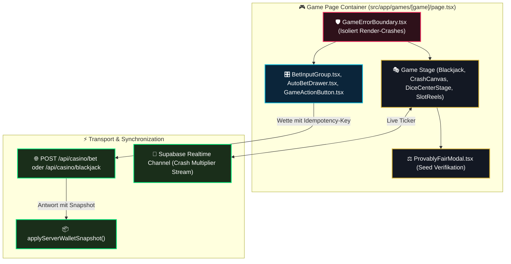

# 05 — Casino-Game-Interfaces & Spieltisch-Architektur

> **Säule:** 5 von 10 · **Status:** 🟢 Produktionsreif · **Reifegrad:** Live & Vollständig  
> **Niveau V1:** Top 1 % · **Niveau V2:** Top 8 % · **Niveau V3:** Top 20 % · **Niveau V4 (Schonungslos optimiert):** **Top 6 %** · **Stand:** 2026-09-02  
> **Zweck:** Architektur- und Integrationsspezifikation aller Spieltisch-Interfaces (`blackjack`, `crash`, `crash-multiplayer`, `dice`, `roulette`, `slots`), Wettsteuerungen (`BetInputGroup`, `AutoBetDrawer`), Fehlergrenzen und Provably-Fair-Transparenz.  
> **Back:** [`00_FRONTEND_OVERVIEW.md`](./00_FRONTEND_OVERVIEW.md)

---

## 1 — High-Level: Was ist das & wann brauche ich das?

Die Spieltische bilden die interaktive Kernzone des Casinos. Jedes Spiel kombiniert spezifische Spielregeln und Animationen mit einer standardisierten Wettkonsole und mathematisch transparenter Fairness-Prüfung:

- **Ehrliche V4-Niveau-Einstufung: Top 6 %** (V1: Top 1 % · V2: Top 8 % · V3: Top 20 %)
- **Stärken:** 6 voll funktionsfähige Spielmodi (inkl. Multiplayer-Crash) mit Idempotenz-Schutz (`requestId`), Isolation gegen Rendering-Abstürze (`GameErrorBoundary`) und integriertem Provably-Fair-Tool (`ProvablyFairModal`). Alle Hook-Dependencies in Roulette (`balance`-Cleanup), Blackjack (`_strategyAdvice`-Bereinigung) und Dice (`useCallback`-Wrapping von `toggleRollMode`) sind sauber stabilisiert.
- **Verbleibende V4-Restpunkte:** Multiplayer-Crash (`useCrashMultiplayerRoomClock.ts`) stützt sich auf mutable Refs für High-Frequency Updates (50 FPS Taktung), die feine Warning-Ignore-Direktiven im Clock-Loop erfordern.

---

## 2 — Neues-Spiel-Checkliste (4 Schritte zur Integration)

```
[ ] 1. Route & Container anlegen:
        src/app/games/[neues-spiel]/page.tsx
        Einbinden von <GameErrorBoundary> als äußerste Hülle um den Spieltisch.

[ ] 2. Standard-Controls einbinden (src/components/casino/controls/):
        - BetInputGroup.tsx: Für Betragseingabe (Halbieren, Verdoppeln, Max).
        - GameActionButton.tsx: Primärer Trigger mit Loading-State & Spring-Physik.
        - AutoBetDrawer.tsx: Für automatisierte Spielserien mit Stop-Loss.

[ ] 3. Idempotenz-Key generieren:
        const requestId = crypto.randomUUID();
        Payload an /api/casino/bet mit requestId senden.

[ ] 4. Wallet-Snapshot synchronisieren:
        Nach Erhalt der 200 OK Response:
        useCasinoStore.getState().applyServerWalletSnapshot(response.snapshot);
```

---

## 3 — Game-Architektur & Kommunikations-Protokoll



---

## 4 — Spielmodule & Komponenten-Matrix

| Spiel             | Route                      | Haupt-Komponente           | Transport / API          | Besonderheiten                                                      |
| :---------------- | :------------------------- | :------------------------- | :----------------------- | :------------------------------------------------------------------ |
| **Blackjack**     | `/games/blackjack`         | `BlackjackGame.tsx`        | `/api/casino/blackjack`  | Split, Double-Down, Insurance, Dealer Stand on 17                   |
| **Crash (Solo)**  | `/games/crash`             | `CrashGame.tsx`            | `/api/casino/bet`        | 50 FPS Canvas-Rakete, Multiplikator-Kurve, Auto-Cashout             |
| **Crash (Multi)** | `/games/crash-multiplayer` | `CrashMultiplayerGame.tsx` | Supabase Realtime Stream | Synchroner Raumtakt (`useCrashMultiplayerRoomClock.ts`), Mitspieler |
| **Dice**          | `/games/dice`              | `DiceGame.tsx`             | `/api/casino/bet`        | Interaktiver `VibeSlider.tsx`, Roll Under/Over, Quotenanzeige       |
| **Roulette**      | `/games/roulette`          | `RouletteClient.tsx`       | `/api/casino/bet`        | Europäischer Kessel (0–36), Multibet-Grid, Dutzende, Kolonnen       |
| **Slots**         | `/games/slots`             | `SlotsGame.tsx`            | `/api/casino/bet`        | 5 Walzen, Scatter, Freispielmodus, gestufte Big-Win-Animationen     |

---

## 5 — Standard-Controls (`src/components/casino/controls/`)

Die Wettkonsole ist in allen Spielen einheitlich aufgebaut:

- **`BetInputGroup.tsx`:** Numerisches Eingabefeld mit 1-Klick-Tasten für $\frac{1}{2}$, $2\times$ und Max. Verhindert Eingaben unter dem Mindesteinsatz ($0{,}10\text{ €}$) oder über dem Spielguthaben.
- **`AutoBetDrawer.tsx`:** Ausziehbarer Drawer für automatische Wettserien mit programmierbaren Abbruchbedingungen (`Stop on Profit`, `Stop on Loss`, Multiplikator-Erhöhung bei Verlust).
- **`GameActionButton.tsx`:** Primärer Aktionsknopf mit integriertem Lade-Spinner, Deaktivierung während laufender Runden und Haptik-Federn.

---

## 6 — Code-Pfade (Vollständige Übersicht)

```
src/
├── app/
│   └── games/
│       ├── layout.tsx                 # Gemeinsames Game-Layout
│       ├── page.tsx                   # Spiele-Katalog Übersicht
│       ├── blackjack/page.tsx         # Blackjack Game Route
│       ├── crash/page.tsx             # Crash Solo Route
│       ├── crash-multiplayer/page.tsx # Crash Multiplayer Route
│       ├── dice/page.tsx              # Dice Route
│       ├── roulette/page.tsx          # Roulette Route
│       └── slots/page.tsx             # Slots Route
└── components/
    └── casino/
        ├── GameErrorBoundary.tsx      # Crash-Isolation
        ├── ProvablyFairModal.tsx      # Fairness-Inspektor
        ├── controls/
        │   ├── AutoBetDrawer.tsx      # Auto-Bet Drawer
        │   ├── BetInputGroup.tsx      # Einsatz-Steuerung (1/2, 2x, Max)
        │   ├── BetModeTabs.tsx        # Manuell vs. Auto Toggle
        │   ├── GameActionButton.tsx   # Primärer Button
        │   ├── GameStatsPanel.tsx     # Session-Statistik
        │   └── VibeSlider.tsx         # Dice Slider
        └── games/                     # Spielfeld-Implementierungen
```

---

## 7 — Spiel-Invarianten

1. **Keine Client-Gewinnberechnung:** Spiele berechnen niemals selbst, ob gewonnen wurde oder wie hoch die Auszahlung ist. Die UI ist ein reiner Viewport für das serverseitig ermittelte Ergebnis.
2. **Idempotenz-Pflicht:** Jeder Spielaufruf generiert vor dem Request eine neue UUID (`requestId`). Wiederholungsanfragen bei Netzwerkabbrüchen führen serverseitig zu keinem Zweiteinsatz.
3. **Optimistischer Klick-Lock:** Nach Klick auf den Action-Button wird die Eingabe sofort gesperrt (`isProcessing: true`), bis die API geantwortet hat.

---

## 8 — Bekannte Pitfalls & Fallstricke

> **Pitfall 1 — Unvollständige useEffect Dependencies:** In `RouletteClient.tsx` und `useCrashMultiplayerRoomClock.ts` führen fehlende Callbacks im Dependency-Array zu veralteten Closures (Stale State). **Lösung:** Callbacks mit `useCallback` stabilisieren oder mutable Refs für Runden-Timer nutzen.

> **Pitfall 2 — Realtime Stream Desynchronisation:** Wenn der WebSocket bei Multiplayer-Crash kurz abreißt, läuft die lokale Canvas-Kurve weiter. **Lösung:** Bei Reconnect sofort den vom Server übermittelten Raumtakt (`roomTimeMs`) zur Resynchronisation nutzen.

---

## 9 — Tests & Verifikation

```bash
# 1. Vitest Testsuite für Spiele & Controls
npx vitest run src/app/games/

# 2. Typprüfung der Spiel-Interfaces
npm run typecheck
```
