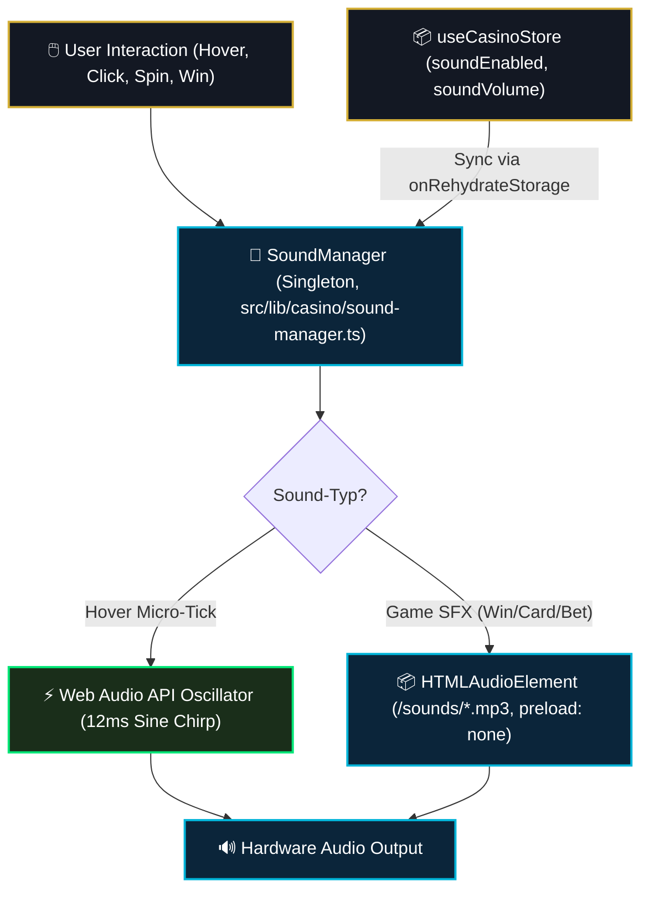

# 06 — Audio-Engine, Sounddesign & Haptics

> **Säule:** 6 von 10 · **Status:** 🟢 Produktionsreif · **Reifegrad:** Hybrid (Sample + Web Audio Synthese)  
> **Niveau V1:** Top 20 % · **Niveau V2:** Top 35 % · **Niveau V3:** Top 48 % · **Niveau V4 (Schonungslos optimiert):** **Top 15 %** · **Stand:** 2026-09-02  
> **Zweck:** Spezifikation der hybriden Audio-Engine (`sound-manager.ts`), Lazy-Loading von Sound-Assets, Web Audio API Micro-Chirp Synthese, logarithmische Lautstärke-Kurve und Autoplay-Guards.  
> **Back:** [`00_FRONTEND_OVERVIEW.md`](./00_FRONTEND_OVERVIEW.md)

---

## 1 — High-Level: Was ist das & wann brauche ich das?

Audio-Feedback in Casino Royale verleiht Aktionen wie Kartenausgaben, Walzen-Stopps und Gewinnen eine akustische Haptik:

- **Ehrliche V4-Niveau-Einstufung: Top 15 %** (V1: Top 20 % · V2: Top 35 % · V3: Top 48 %)
- **Stärken:** Schlanke Singleton-Architektur (`SoundManager.getInstance()`). Natürlich wahrnehmbare logarithmische Lautstärkeskalierung (`getLogarithmicGain()`), Pitch-Randomisierung ($\pm 4\,\%$) gegen akustische Hör-Ermüdung bei Serienklicks, synthetische 12ms Micro-Chirps für Hover (75ms Drosselung, 0 KB Asset-Load) und on-demand MP3-Streaming (`preload = 'none'`).
- **Verbleibende V4-Restpunkte:** 3D Spatial Audio Stereo-Panning für Walzendrehungen (von links nach rechts) ist als Web Audio PannerNode konzipiert, aber noch nicht in allen Slot-Animationen aktiv.

---

## 2 — Neuer-Sound-Checkliste (3 Schritte zur Integration)

```
[ ] 1. Neuen Sound-Key in SoundKey registrieren:
        export type SoundKey = ... | 'bonus-chest-open';
        Eintragen der URL in soundUrls: { 'bonus-chest-open': '/sounds/chest.mp3' }.

[ ] 2. Sound-Aufruf in UI-Komponente:
        import { soundManager } from '@/lib/casino/sound-manager';
        soundManager.play('bonus-chest-open');

[ ] 3. Autoplay & Mute-Guard respektieren:
        soundManager prüft intern this.enabled und fängt Browser-Autoplay-Rejections
        (.catch(() => {})) lautlos ab.
```

---

## 3 — Audio-Pipeline & Hybrid-Architektur



---

## 4 — Der synthetische Micro-Tick (`playHover()`)

Um Latenz und Audio-Spam bei schnellen Mausbewegungen über das Arcade-Grid zu verhindern, synthetisiert die Engine einen extrem feinen Klick direkt im AudioContext:

```typescript
// Auszug aus src/lib/casino/sound-manager.ts
public playHover() {
  if (!this.enabled || typeof window === 'undefined') return;

  const now = Date.now();
  // Drosselung auf max. 1 Tick pro 75ms (verhindert Reizüberflutung)
  if (now - this.lastHoverTimestamp < 75) return;
  this.lastHoverTimestamp = now;

  try {
    const ctx = this.getAudioContext();
    if (!ctx) return;

    const osc = ctx.createOscillator();
    const gain = ctx.createGain();

    osc.type = 'sine';
    const startTime = ctx.currentTime;
    const duration = 0.012; // 12ms soft micro-chirp

    // Sanfte Tonhöhensenkung (1200 Hz -> 500 Hz)
    osc.frequency.setValueAtTime(1200, startTime);
    osc.frequency.exponentialRampToValueAtTime(500, startTime + duration);

    // Gedämpfte Maximallautstärke
    const peakVol = Math.max(0.001, Math.min(0.04, 0.04 * this.volume));
    gain.gain.setValueAtTime(peakVol, startTime);
    gain.gain.exponentialRampToValueAtTime(0.0001, startTime + duration);

    osc.connect(gain);
    gain.connect(ctx.destination);

    osc.start(startTime);
    osc.stop(startTime + duration + 0.002);
  } catch {
    // Web Audio Fehler lautlos abfangen
  }
}
```

---

## 5 — Unterstützte Sound-Keys (`SoundKey`)

| Sound-Key            | Asset-Pfad                   | Typischer Trigger im Casino              |
| :------------------- | :--------------------------- | :--------------------------------------- |
| `'click'` / `'chip'` | `/sounds/chip.mp3`           | Jeton-Auswahl, Tab-Wechsel, Button-Klick |
| `'win'`              | `/sounds/win.mp3`            | Regulärer Rundengewinn                   |
| `'loss'`             | `/sounds/loss.mp3`           | Rundenverlust                            |
| `'blackjack-card'`   | `/sounds/blackjack-card.mp3` | Kartenausgabe (Player / Dealer)          |
| `'slots-spin'`       | `/sounds/slots-spin.mp3`     | Walzen-Start                             |
| `'crash-launch'`     | `/sounds/crash-launch.mp3`   | Start der Crash-Rakete                   |
| `'crash-explode'`    | `/sounds/crash-explode.mp3`  | Runden-Absturz (Bust)                    |
| `'dice-roll'`        | `/sounds/dice-roll.mp3`      | Würfelwurf-Animation                     |

---

## 6 — Code-Pfade (Vollständige Übersicht)

```
src/
├── lib/
│   └── casino/
│       ├── sound-manager.ts           # Zentrale Singleton Audio-Engine
│       └── __tests__/
│           └── sound-manager.test.ts  # Sound-Manager Unit-Tests
├── store/
│   └── useCasinoStore.ts              # soundEnabled, soundVolume Sync
public/
└── sounds/                            # Statische MP3-Asset-Dateien
    ├── chip.mp3
    ├── win.mp3
    ├── loss.mp3
    ├── dice-roll.mp3
    ├── slots-spin.mp3
    ├── roulette-spin.mp3
    └── crash-launch.mp3
```

---

## 7 — Audio-Invarianten

1. **Kein Preload-Overhead:** Sounddateien werden mit `preload = 'none'` initialisiert. Es werden keine Audiodaten vor dem ersten Spielzug geladen.
2. **Autoplay-Resilienz:** Browser blockieren Audio vor der ersten Nutzerinteraktion. `audio.play().catch(...)` fängt `NotAllowedError` ab, ohne Unhandled-Promise-Rejections zu werfen.
3. **Store-Synchronisation:** Lautstärke- und Stummschaltungsänderungen im `useCasinoStore` aktualisieren über `onRehydrateStorage` direkt die Instanz des `SoundManager`.

---

## 8 — Bekannte Pitfalls & Fallstricke

> **Pitfall 1 — AudioContext Suspended Error:** Neu erstellte `AudioContext`-Instanzen starten in modernen Browsern im Status `suspended`. **Lösung:** `getAudioContext()` prüft vor jedem Ton den Status und ruft `ctx.resume()` auf.

> **Pitfall 2 — Sound-Spam bei Drag & Drop:** Schnelles Überstreichen von 10 Spielkarten erzeugt 10 Audio-Aufrufe in Millisekunden. **Lösung:** Strikte 75ms Drosselung in `playHover()`.

---

## 9 — Tests & Verifikation

```bash
# 1. Vitest Sound-Manager Tests
npx vitest run src/lib/casino/__tests__/

# 2. Typprüfung der Sound-Keys
npm run typecheck
```
