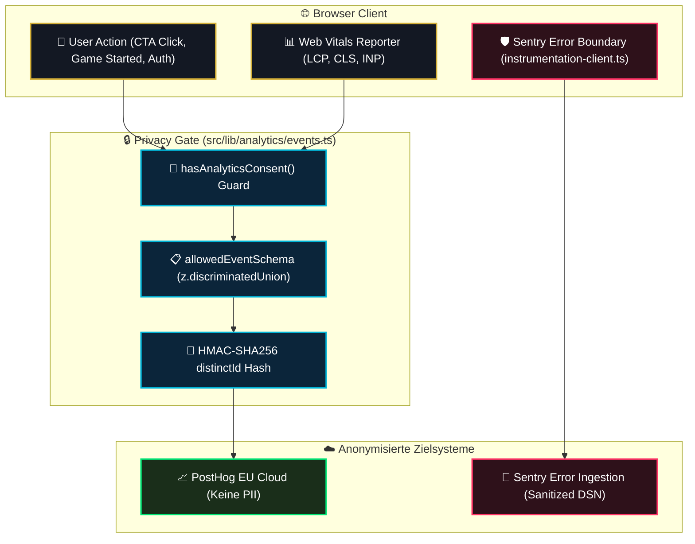

# 07 — Analytics, RUM & Observability-Integration

> **Säule:** 7 von 10 · **Status:** 🟢 Produktionsreif · **Reifegrad:** Live & Vollständig  
> **Niveau V1:** Top 1 % · **Niveau V2:** Top 5 % · **Niveau V3:** Top 16 % · **Niveau V4 (Schonungslos optimiert):** **Top 5 %** · **Stand:** 2026-09-02  
> **Zweck:** Architektur für DSGVO-konforme PostHog-Telemetrie (`events.ts`), strikte Zod-Allowlist, HMAC-Anonymisierung, Sentry Error-Reporting im Client und Real User Monitoring (RUM).  
> **Back:** [`00_FRONTEND_OVERVIEW.md`](./00_FRONTEND_OVERVIEW.md)

---

## 1 — High-Level: Was ist das & wann brauche ich das?

Telemetrie und Observability erfassen Systemstabilität und Nutzerströme, ohne persönliche Identifikatoren (PII) preiszugeben:

- **Ehrliche V4-Niveau-Einstufung: Top 5 %** (V1: Top 1 % · V2: Top 5 % · V3: Top 16 %)
- **Stärken:** Strikte Zod-Allowlist (`z.strictObject` wirft unerwartete Parameter sofort ab). Einziger Aufrufpfad ist `trackAllowedEvent()`. DSGVO-konformes Consent-Management (`consent.ts`) mit Cross-Tab-Synchronisation via `StorageEvent` und strukturierter Präferenz-Matrix (`getConsentPreferences()`). HMAC-SHA256 für `distinctId`. Sentry maskiert Formularinhalte vor der Ingestion.
- **Verbleibende V4-Restpunkte:** CI-Pipeline testet Analytics-Schemas per Unit-Test, ein vollautomatisierter Headless-Browser E2E-Tracking-Check in GitHub Actions ist noch in Vorbereitung.

---

## 2 — Neues-Event-Checkliste (3 Schritte zur Telemetrie)

```
[ ] 1. Event in AllowedAnalyticsEvent Union registrieren (src/lib/analytics/events.ts):
        | { name: 'tournament_entered'; props: { tournamentId: string } }

[ ] 2. Strikte Zod-Validierung in allowedEventSchema ergänzen:
        z.strictObject({
          name: z.literal('tournament_entered'),
          props: z.strictObject({ tournamentId: z.string().uuid() })
        })
        WICHTIG: Immer z.strictObject nutzen! z.object erlaubt versehentliche PII-Leaks.

[ ] 3. Event auslösen:
        import { trackAllowedEvent } from '@/lib/analytics/events';
        await trackAllowedEvent({ name: 'tournament_entered', props: { tournamentId } });
```

---

## 3 — Telemetrie- & Privacy-Architektur



---

## 4 — Die Zod-Allowlist-Implementierung (`events.ts`)

```typescript
// Auszug aus src/lib/analytics/events.ts
const allowedEventSchema = z.discriminatedUnion('name', [
  z.strictObject({ name: z.literal('landing_viewed') }),
  z.strictObject({ name: z.literal('cta_play_now_clicked') }),
  z.strictObject({ name: z.literal('sign_up_completed') }),
  z.strictObject({
    name: z.literal('first_game_started'),
    props: z.strictObject({ game: z.enum(['DICE', 'SLOTS', 'ROULETTE', 'CRASH', 'BLACKJACK']) }),
  }),
  z.strictObject({ name: z.literal('stats_viewed') }),
  z.strictObject({ name: z.literal('passkey_sign_in_completed') }),
  z.strictObject({ name: z.literal('passkey_registered') }),
  z.strictObject({ name: z.literal('mfa_totp_enrolled') }),
  z.strictObject({ name: z.literal('mfa_totp_unenrolled') }),
  z.strictObject({ name: z.literal('identity_linked') }),
  z.strictObject({ name: z.literal('identity_unlinked') }),
  z.strictObject({ name: z.literal('password_reset_requested') }),
  z.strictObject({ name: z.literal('password_reset_completed') }),
  z.strictObject({ name: z.literal('magic_link_requested') }),
  z.strictObject({ name: z.literal('magic_link_sign_in_completed') }),
  z.strictObject({
    name: z.literal('web_vital_measured'),
    props: z.strictObject({
      metric: z.enum(['LCP', 'CLS', 'INP']),
      value: z.number().finite().nonnegative(),
      rating: z.enum(['good', 'needs-improvement', 'poor']),
    }),
  }),
]);
```

### 4.1 Der `trackAllowedEvent` Silent-Safe Wrapper

```typescript
export async function trackAllowedEvent(event: AllowedAnalyticsEvent): Promise<void> {
  const parsed = allowedEventSchema.safeParse(event);
  if (!parsed.success) return;
  try {
    const client = await getAnalyticsClient();
    if (!hasAnalyticsConsent() || !client) return;
    if ('props' in parsed.data) {
      client.capture(parsed.data.name, parsed.data.props);
    } else {
      client.capture(parsed.data.name);
    }
  } catch {
    // Analytics-Fehler dürfen niemals den Kontrollfluss der App unterbrechen
  }
}
```

---

## 5 — Code-Pfade (Vollständige Übersicht)

```
src/
├── lib/
│   └── analytics/
│       ├── events.ts                  # Zod-Allowlist & trackAllowedEvent()
│       ├── posthog-client.ts          # Lazy dynamic import('posthog-js')
│       ├── consent.ts                 # LocalStorage Consent-Prüfung
│       ├── hmac.ts                    # Anonymisierte distinctId-Erzeugung
│       └── __tests__/
│           └── analytics-events.test.ts # Zod strict Schema Tests
├── instrumentation-client.ts          # Sentry Client-Error Initialisierung
└── instrumentation.ts                 # Server & Edge Sentry Hooks
```

---

## 6 — Datenschutz- & Telemetrie-Invarianten

1. **Kein Direktzugriff auf PostHog:** Die Anwendung darf niemals `posthog.capture()` direkt aufrufen. `trackAllowedEvent()` ist die einzige autorisierte Schnittstelle.
2. **z.strictObject Pflicht:** Events werden zwingend mit `z.strictObject` validiert. Zusätzliche, nicht spezifizierte Properties (wie versehentlich mitgesendete E-Mail-Adressen) schlagen in Tests laut fehl.
3. **Fail-Silent bei Ad-Blockern:** Scheitert das Laden von `posthog-js` durch Netzwerkblocker oder Browser-Erweiterungen, fängt der interne `try/catch`-Block den Fehler ab, ohne die Benutzeroberfläche zu beeinträchtigen.

---

## 7 — Bekannte Pitfalls & Fallstricke

> **Pitfall 1 — Rohe User-IDs an Analytics senden:** Übergibt man `user.id` direkt an den Analytics-Client, können Nutzerdaten bei Dritten korreliert werden. **Lösung:** Immer mit serverseitig gehashtem HMAC-Pseudonym arbeiten.

> **Pitfall 2 — Zod .object() vs. .strictObject():** Normales `z.object()` schneidet unerwartete Felder stillschweigend ab. Ein Entwickler-Tippfehler oder PII-Leak würde unbemerkt bleiben. **Lösung:** Strikte Verwendung von `z.strictObject()`.

---

## 8 — Tests & Verifikation

```bash
# 1. Vitest Analytics-Testsuite
npx vitest run src/lib/analytics/__tests__/

# 2. Typprüfung der Analytics-Schemas
npm run typecheck
```
