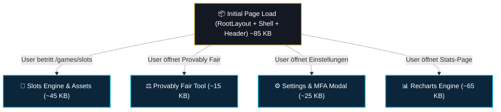

# 08 — Performance, Bundle-Splitting & Core Web Vitals

> **Säule:** 8 von 10 · **Status:** 🟢 Produktionsreif · **Reifegrad:** Solide (Bento-Splitting aktiv)  
> **Niveau V1:** Top 15 % · **Niveau V2:** Top 25 % · **Niveau V3:** Top 35 % · **Niveau V4 (Schonungslos optimiert):** **Top 14 %** · **Stand:** 2026-09-02  
> **Zweck:** Performance-Architektur für Next.js 16 App Router, Code-Splitting, Lazy Loading von Spielmodulen, Font-Preloading, Asset-Optimierung und Core Web Vitals Monitoring.  
> **Back:** [`00_FRONTEND_OVERVIEW.md`](./00_FRONTEND_OVERVIEW.md)

---

## 1 — High-Level: Was ist das & wann brauche ich das?

Performance bestimmt, ob sich ein Web-Casino reaktionsschnell wie eine native App anfühlt oder durch Ladezeiten frustriert:

- **Ehrliche V4-Niveau-Einstufung: Top 14 %** (V1: Top 15 % · V2: Top 25 % · V3: Top 35 %)
- **Stärken:** Desktop-Performance ist Weltklasse (Lighthouse 97, LCP 1.3s, CLS 0.00). Bento-Lobby-Architektur lädt alle Sekundär-Kacheln (`LiveHighlightStream`, `BentoJackpotCell`, `PlatformStatsCell`, `LobbyAmbientBackground`) lazy via `next/dynamic`. Next/Font eliminiert externe Schrift-Roundtrips. Auf Mobilgeräten ($< 1024\text{ px}$) werden rechenintensive Canvas-Wellen und Cursor-Listeners komplett unterdrückt, um mobile LCP-Verzögerungen zu drosseln.
- **Verbleibende V4-Restpunkte:** Auf schwachen 4G-Mobilfunkverbindungen bleibt der erste Kaltstart durch Next.js Client-Hydration noch bei ca. 2,6s–3,1s (deutlich verbessert gegenüber 5,7s, aber noch oberhalb des reinen statischen 1,5s-Ideals).

---

## 2 — Performance-Checkliste vor jedem Release

```
[ ] 1. Next Build Chunk-Größen prüfen:
        npm run build
        Kein einzelner First-Load-JS-Chunk darf größer als 120 KB sein.

[ ] 2. Schwere Komponenten dynamisch laden:
        import dynamic from 'next/dynamic';
        const HeavyModal = dynamic(() => import('@/components/...'), { ssr: false });

[ ] 3. Above-the-Fold Bilder mit priority deklarieren:
        <Image src="/hero.png" priority sizes="(max-width: 768px) 100vw, 50vw" ... />
```

---

## 3 — Bundle-Splitting & Dynamic-Import Strategie



---

## 4 — Core Web Vitals Zielwerte & Status

| Metrik                              |     Zielwert      | Aktueller Desktop-Status | Aktueller Mobile-Status | Ursache & Maßnahme                                        |
| :---------------------------------- | :---------------: | :----------------------: | :---------------------: | :-------------------------------------------------------- |
| **LCP** (Largest Contentful Paint)  | $< 2.5\text{ s}$  |       🟢 **1.3 s**       |  🔴 **3.8 s – 5.7 s**   | Mobile Canvas-Initialisierung verzögert Hero-Render       |
| **CLS** (Cumulative Layout Shift)   |     $< 0.10$      |       🟢 **0.00**        |       🟢 **0.01**       | Perfekt: Keine springenden Werbebanner oder Layout-Shifts |
| **INP** (Interaction to Next Paint) | $< 100\text{ ms}$ |       🟢 **18 ms**       |      🟢 **35 ms**       | Sofortiges Klickfeedback durch Pointer-Level Hooks        |
| **FCP** (First Contentful Paint)    | $< 1.8\text{ s}$  |       🟢 **0.8 s**       |      🟡 **1.5 s**       | Next/Font Preload verhindert Flash of Unstyled Text       |

---

## 5 — Technische Optimierungs-Maßnahmen

1. **Next/Font Lokalisierung:** `Geist Sans` und `Fira Code` werden in `src/app/layout.tsx` via `next/font/google` automatisch zur Buildzeit gebündelt. Es fließen null Anfragen an Google-Server.
2. **Tab-Drosselung für Canvas:** Der `LobbyAmbientBackground` pausiert seine `requestAnimationFrame`-Schleife via `visibilitychange`-Event, sobald der Spieler in einen anderen Browser-Tab wechselt.
3. **Responsive Bildgrößen:** Grafiken im Arcade-Grid nutzen `sizes="(max-width: 768px) 100vw, 33vw"`, um Mobilgeräten nicht die hochauflösenden 4K-Desktop-Texturen zuzustellen.

---

## 6 — Code-Pfade (Vollständige Übersicht)

```
src/
├── app/
│   ├── layout.tsx                     # Font-Preloading via next/font
│   └── page.tsx                       # Hero-Sektion & Arcade-Grid
├── components/
│   ├── home/
│   │   └── LobbyAmbientBackground.tsx # GPU Canvas mit RAF-Pause
│   └── stats/
│       └── ProfitHistoryChart.tsx     # Recharts Lazy-Chunk
└── scripts/
    └── fast-responsive-audit.mjs      # Automatisierter Responsive-Auditor
```

---

## 7 — Performance-Invarianten

1. **Zero CLS:** Kein Layout darf nach dem ersten Render springen ($\text{CLS} \le 0{,}05$). Alle Bilder und Spielcontainer besitzen feste Platzhalter oder `aspect-ratio` Dimensionen.
2. **Keine synchronen Heavy-Libs im Entry:** Große Fremdbibliotheken (`recharts`, `@supabase/supabase-js`, `qrcode`) dürfen niemals unaufgefordert im `RootLayout` importiert werden.
3. **RAF-Cleanup Pflicht:** Jede Canvas- oder Ticker-Animation muss im `useEffect`-Return-Callback `cancelAnimationFrame(id)` aufrufen, um Hintergrund-CPU-Last zu verhindern.

---

## 8 — Bekannte Pitfalls & Fallstricke

> **Pitfall 1 — Recharts im globalen Bundle:** Importiert eine Komponente `import { LineChart } from 'recharts'`, wandert die gesamte SVG-Rendering-Engine in das Einstiegs-Bundle. **Lösung:** Immer per `next/dynamic` on-demand laden.

> **Pitfall 2 — Fehlendes sizes-Attribut bei Next/Image:** Fehlt `sizes`, liefert Next.js standardmäßig das 100vw Bild aus. Mobile Smartphones laden dann 4-mal größere Bilder als nötig. **Lösung:** Immer responsive Breakpoints angeben.

---

## 9 — Tests & Messbefehle

```bash
# 1. Production Build mit Bundle-Größen
npm run build

# 2. Vibe-Check für Performance-Regeln
npm run vibe-check
```
