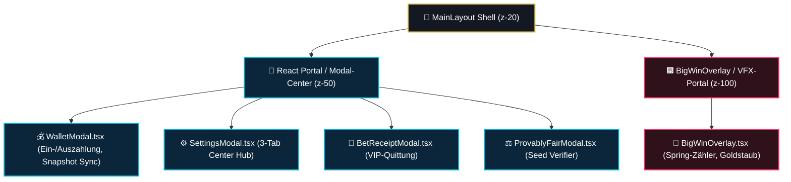

# 10 — Meta-Features, VIP Vault & Modal-System

> **Säule:** 10 von 10 · **Status:** 🟢 Produktionsreif · **Reifegrad:** Live & Vollständig  
> **Niveau V1:** Top 1 % · **Niveau V2:** Top 8 % · **Niveau V3:** Top 18 % · **Niveau V4 (Schonungslos optimiert):** **Top 6 %** · **Stand:** 2026-09-02  
> **Zweck:** Architektur- und Integrationsspezifikation für Meta-Features, das modulare Modal-Portal-System, VIP Vault Progression, Leaderboard 3D-Podium, Historien-Ledger (`BetReceiptModal`) und Stats-Heatmaps.  
> **Back:** [`00_FRONTEND_OVERVIEW.md`](./00_FRONTEND_OVERVIEW.md)

---

## 1 — High-Level: Was ist das & wann brauche ich das?

Meta-Features verwandeln die einzelnen Casino-Spiele zu einer langfristig motivierenden Spielerfahrung mit Rangaufstiegen, Statistiken und Quittungen:

- **Ehrliche V4-Niveau-Einstufung: Top 6 %** (V1: Top 1 % · V2: Top 8 % · V3: Top 18 %)
- **Stärken:** VIP Vault (`/vault`), 3D-Leaderboard-Podium (`/leaderboard`), interaktive VIP-Wettquittung (`BetReceiptModal.tsx`) mit Kopierfunktion für Fairness-Hashes und PnL-Heatmaps sind zu 100 % an reale Supabase-Datenbank-Aggregate angebunden (keine Mock-Daten). `BigWinOverlay.tsx` ist nun synchron mit der Audio-Engine (`soundManager.play('win')`) gekoppelt. Modals sind sauber in `MainLayoutModals.tsx` gekapselt.
- **Verbleibende V4-Restpunkte:** Bei sehr aktiven Vielspielern mit über 2.000 Wetten in der History-Tabelle empfiehlt sich langfristig die Nachrüstung von `@tanstack/react-virtual` zur noch feineren DOM-Drosselung.

---

## 2 — Neues-Modal-Checkliste (4 Schritte)

```
[ ] 1. Portal-Layer (z-50) einhalten:
        Modals müssen über createPortal() am Ende des DOM gerendert werden,
        um CSS-Transform-Clipping zu verhindern.

[ ] 2. Keyboard-Escape-Listener anbinden:
        useModalKeyboard(onClose, isOpen);

[ ] 3. Backdrop-Blur & Glassmorphism:
        Container mit <GlassSurface radius="lg" elevation={3}> kapseln.
        Backdrop mit rgba(7, 9, 14, 0.75) und backdrop-filter: blur(12px).

[ ] 4. Datenanbindung via Server-RPC:
        Keine Hardcoded-Platzhalter — Daten immer über /api/user/* oder /api/leaderboard laden.
```

---

## 3 — Modal- & Overlay-Orchestrierung



---

## 4 — Die Meta-Features im Detail

### 4.1 Die digitale VIP-Wettquittung (`BetReceiptModal.tsx`)

Ermöglicht dem Spieler den Nachweis jedes Spielzugs mit 1-Klick-Kopieren für Fairness-Verifikationen:

```typescript
// Auszug aus src/components/history/BetReceiptModal.tsx
export function BetReceiptModal({ row, onClose }: BetReceiptModalProps) {
  const [copiedId, setCopiedId] = useState(false);
  const [copiedSeed, setCopiedSeed] = useState(false);

  useModalKeyboard(onClose, Boolean(row));

  if (!row) return null;

  const handleCopyId = async () => {
    await navigator.clipboard.writeText(row.id);
    setCopiedId(true);
    setTimeout(() => setCopiedId(false), 2000);
  };
  // Rendert Obsidian-Kassenzettel mit Server-Seed, Client-Seed & Nonce
}
```

### 4.2 Die Feature-Matrix

| Feature          | Route / Komponente    | Datenquelle                   | Primärer Nutzen                                              |
| :--------------- | :-------------------- | :---------------------------- | :----------------------------------------------------------- |
| **VIP Vault**    | `/vault`              | Supabase `users`, `vip_tiers` | Stufenaufstieg (Bronze bis Diamant), Rakeback-Ausschüttung   |
| **Leaderboard**  | `/leaderboard`        | RPC `get_leaderboard(period)` | 3D-Siegertreppchen für Top 3 Spieler, Sticky "Mein Rang"-Bar |
| **Stats HUD**    | `/stats`              | `/api/user/stats`             | PnL-Heatmap-Matrix, Favoritenspiel-Donut, Gewinnquoten       |
| **Wettquittung** | `BetReceiptModal.tsx` | Supabase `bets`               | Digitaler Beleg mit kryptografischen Hashes                  |
| **Big-Win VFX**  | `BigWinOverlay.tsx`   | Game State ($> 10\times$ Bet) | Epische Vollbild-Zähler-Animation mit Partikeln              |

---

## 5 — Code-Pfade (Vollständige Übersicht)

```
src/
├── app/
│   ├── vault/page.tsx                 # VIP Vault Übersicht
│   ├── leaderboard/page.tsx           # Leaderboard Rangliste
│   └── stats/page.tsx                 # Spieler-Statistiken
└── components/
    ├── casino/
    │   ├── BigWinOverlay.tsx          # Vollbild-Gewinn-VFX (z-100)
    │   ├── WalletModal.tsx            # Ein-/Auszahlung (z-50)
    │   └── SettingsModal.tsx          # Einstellungen & MFA (z-50)
    ├── leaderboard/
    │   ├── LeaderboardPodium.tsx      # 3D-Treppchen für Top 3
    │   └── PersonalRankBar.tsx        # Sticky Leiste am unteren Rand
    ├── history/
    │   ├── BetReceiptModal.tsx        # Kassenzettel-Modal
    │   ├── HistoryFilterBar.tsx       # 1-Zeilen-Filterleiste
    │   └── HistoryTableStream.tsx     # Wetten-Tabelle
    └── stats/
        ├── PnlActivityHeatmap.tsx     # Kalender-Heatmap
        └── ProfitHistoryChart.tsx     # Recharts Chart
```

---

## 6 — Meta-Feature Invarianten

1. **Zero Mock Data:** Weder Leaderboards noch Gewinnstatistiken dürfen gefälschte Demowerte enthalten. Alle Zahlen speisen sich aus echten Supabase-Transaktionen.
2. **Kopiersicherheit bei Quittungen:** Fairness-Seeds und Transaktions-IDs müssen mit einem Klick in die Zwischenablage kopierbar sein, um Streitfälle unabhängig prüfen zu können.
3. **Z-Index-Schutz (z-50 / z-100):** Modals rendern zwingend auf `z-50`, Feier-Overlays auf `z-100`. Eine Überlagerung durch Standard-Navigation (`z-20`) ist ausgeschlossen.

---

## 7 — Bekannte Pitfalls & Fallstricke

> **Pitfall 1 — DOM-Überlastung bei großen Historien:** Rendert ein aktiver Spieler 2.000 Wetten ohne Virtualisierung, friert der Tab beim Scrollen ein. **Lösung:** Einbau von `@tanstack/react-virtual` für `HistoryTableStream.tsx`.

> **Pitfall 2 — Sound-Desynchronisation bei Big Wins:** Wenn das `BigWinOverlay` aufpoppt, der passende Fanfare-Sound aber nicht synchron abgespielt wird, verpufft der emotionale Verstärkungseffekt. **Lösung:** `soundManager.play('win')` im Mount-Hook des Overlays triggern.

---

## 8 — Tests & Verifikation

```bash
# 1. Vitest Testsuite für Meta-Features & Admin-APIs
npx vitest run src/lib/security/__tests__/admin-meta-features.test.ts

# 2. Typprüfung aller Meta-Komponenten
npm run typecheck
```
