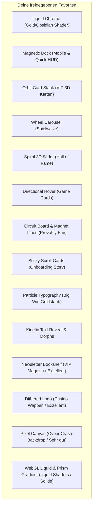

# Componentry.dev — Vollständiger Komponenten-Katalog (49 Komponenten)

**Datum:** 6. September 2026  
**Status:** Interaktiver Klick-Katalog für UI/UX-Entscheidungen  
**Referenzquelle:** [componentry.dev](https://componentry.dev/) (Harsh Jadhav)  
**Kanonische Projekt-Ablage:** [`docs/frontend/12_componentry_complete_catalog.md`](file:///v:/VibeCoding/Casino/docs/frontend/12_componentry_complete_catalog.md)  
**Konzept-Dokument mit Vorab-Audits:** [`docs/frontend/11_componentry_luxury_recommendations_2026.md`](file:///v:/VibeCoding/Casino/docs/frontend/11_componentry_luxury_recommendations_2026.md)

---

## 1. Quickstart & MCP-Integration

Alle Komponenten können direkt über das Componentry- oder shadcn-CLI in React-/Next.js-Projekte installiert werden:

```bash
# Einzelne Komponente hinzufügen (z. B. Liquid Chrome oder Magnetic Dock)
npx componentry@latest add liquid-chrome
npx shadcn@latest add @componentry/magnetic-dock

# MCP-Server für KI-Agenten (Cursor, Claude, Antigravity)
# Config: { "mcpServers": { "componentry": { "command": "npx", "args": ["-y", "@componentry/mcp"] } } }
```

---

## 2. Übersicht der 7 Kategorien (49 Komponenten)

Klicke auf eine Kategorie, um direkt zur jeweiligen Tabelle zu springen:

1. [Kategorie 1: Text- & Typografie-Animationen](#kategorie-1-text--typografie-animationen) _(7 Komponenten)_
2. [Kategorie 2: 3D-Karten, Stacks & Scroll-Choreografien](#kategorie-2-3d-karten-stacks--scroll-choreografien) _(10 Komponenten)_
3. [Kategorie 3: 3D-Karussells, Picker & Slider](#kategorie-3-3d-karussells-picker--slider) _(4 Komponenten)_
4. [Kategorie 4: Navigation, HUD & Taktile Controls](#kategorie-4-navigation-hud--taktile-controls) _(5 Komponenten)_
5. [Kategorie 5: WebGL-Shader, Fluid & Flüssigmetall-Hintergründe](#kategorie-5-webgl-shader-fluid--flüssigmetall-hintergründe) _(9 Komponenten)_
6. [Kategorie 6: Cursor-Reaktionen, Canvas- & Brechungseffekte](#kategorie-6-cursor-reaktionen-canvas--brechungseffekte) _(8 Komponenten)_
7. [Kategorie 7: Krypto-Tech, Retro & Dekorative FX](#kategorie-7-krypto-tech-retro--dekorative-fx) _(6 Komponenten)_

---

### Legende zum User-Votum

- ⭐⭐⭐ **Absoluter Favorit** (Vom User explizit als „gigantisch gut“, „extrem geil“ oder „extrem cool“ priorisiert)
- ⭐⭐ **Bestätigt** (Vom User positiv bewertet und für den Einbau freigegeben)
- ❌ **Abgelehnt** (Vom User als „gefällt nicht / langweilig“ eingestuft — nicht für Rollout vorgesehen)
- ⚪ **Katalog-Bestand** (Vollständige Componentry-Komponente zum Durchklicken und Inspirieren)

---

## Kategorie 1: Text- & Typografie-Animationen

| Komponente              | Offizieller Link (componentry.dev)                                                                                                |          User-Votum           | Casino-Einsatzbereich                                                                                                     | Technologie                         |
| :---------------------- | :-------------------------------------------------------------------------------------------------------------------------------- | :---------------------------: | :------------------------------------------------------------------------------------------------------------------------ | :---------------------------------- |
| **Particle Typography** | [`/docs/components/cursor-driven-particle-typography`](https://componentry.dev/docs/components/cursor-driven-particle-typography) |        ⭐⭐ Bestätigt         | Big Win Overlay ([`BigWinOverlay.tsx`](file:///v:/VibeCoding/Casino/src/components/casino/BigWinOverlay.tsx)), Lobby Hero | HTML5 2D Canvas + Spring Physics    |
| **Kinetic Text Reveal** | [`/docs/components/kinetic-text-reveal`](https://componentry.dev/docs/components/kinetic-text-reveal)                             |        ⭐⭐ Bestätigt         | Game Status Overlays (Crash, Blackjack, Roulette)                                                                         | Framer Motion Stagger + Blur-Filter |
| **Letter Cascade**      | [`/docs/components/letter-cascade`](https://componentry.dev/docs/components/letter-cascade)                                       |        ⭐⭐ Bestätigt         | Multiplikator-Reveals, Jackpot-Ankündigungen                                                                              | Framer Motion Spring Dynamics       |
| **Text Morph**          | [`/docs/components/text-morph`](https://componentry.dev/docs/components/text-morph)                                               |        ⭐⭐ Bestätigt         | Header Währungs-Switcher ([`MainHeader.tsx`](file:///v:/VibeCoding/Casino/src/components/layout/MainHeader.tsx))          | SVG Matrix Threshold + CSS Filters  |
| **Flipping Word Swap**  | [`/docs/components/flipping-word-swap`](https://componentry.dev/docs/components/flipping-word-swap)                               |        ⭐⭐ Bestätigt         | Spielmodus-Tabs (Manuell $\leftrightarrow$ Auto-Bet)                                                                      | CSS 3D Perspective Flip             |
| **Text Repel**          | [`/docs/components/text-repel`](https://componentry.dev/docs/components/text-repel)                                               | ⭐⭐ Bestätigt _(„sehr gut“)_ | Interaktive Badges, VIP-Slogan                                                                                            | Pointer Proximity Spring            |
| **Velocity Scroll**     | [`/docs/components/scroll-based-velocity`](https://componentry.dev/docs/components/scroll-based-velocity)                         |      ❌ Eher weniger gut      | Endlos-Laufband für Sponsor- & Trust-Partner                                                                              | Framer Motion Scroll-Transform      |

---

## Kategorie 2: 3D-Karten, Stacks & Scroll-Choreografien

| Komponente                | Offizieller Link (componentry.dev)                                                                        |                        User-Votum                         | Casino-Einsatzbereich                                                                                                                                                                        | Technologie                             |
| :------------------------ | :-------------------------------------------------------------------------------------------------------- | :-------------------------------------------------------: | :------------------------------------------------------------------------------------------------------------------------------------------------------------------------------------------- | :-------------------------------------- |
| **Orbit Card Stack**      | [`/docs/components/orbit-card-stack`](https://componentry.dev/docs/components/orbit-card-stack)           |                 ⭐⭐⭐ Absoluter Favorit                  | VIP-Tier-Präsentation ([`RankBenefitsModal.tsx`](file:///v:/VibeCoding/Casino/src/components/casino/RankBenefitsModal.tsx), [`/vault`](file:///v:/VibeCoding/Casino/src/app/vault/page.tsx)) | CSS 3D Transform + Framer Motion        |
| **Sticky Scroll Cards**   | [`/docs/components/sticky-scroll-cards`](https://componentry.dev/docs/components/sticky-scroll-cards)     |                 ⭐⭐⭐ Absoluter Favorit                  | Onboarding Flow, Provably-Fair Erklärung                                                                                                                                                     | Scroll-Linked Layered Scaling           |
| **Case Study Flip Stack** | [`/docs/components/case-study-flip-stack`](https://componentry.dev/docs/components/case-study-flip-stack) |         ⭐⭐⭐ Absoluter Favorit _(„exzellent“)_          | Auszahlungs-Sicherheit & Audit-Stories                                                                                                                                                       | Scroll-Driven Card Flipping             |
| **Scroll Split Card**     | [`/docs/components/scroll-split-card`](https://componentry.dev/docs/components/scroll-split-card)         |         ⭐⭐⭐ Absoluter Favorit _(„exzellent“)_          | Interaktive Bonus-Enthüllung                                                                                                                                                                 | 3-Panel Split & Flip                    |
| **Scroll Choreography**   | [`/docs/components/scroll-choreography`](https://componentry.dev/docs/components/scroll-choreography)     |               ⭐⭐ Bestätigt _(„sehr gut“)_               | Landing-Page Storytelling                                                                                                                                                                    | Multi-Image Framer Motion Orchestration |
| **Collection Surfer**     | [`/docs/components/collection-surfer`](https://componentry.dev/docs/components/collection-surfer)         |               ⭐⭐ Bestätigt _(„sehr gut“)_               | Schnelles Browsen durch Casino-Originals                                                                                                                                                     | Smooth Surfing Pointer Physics          |
| **Scroll Tilted Grid**    | [`/docs/components/scroll-tilted-grid`](https://componentry.dev/docs/components/scroll-tilted-grid)       |               ⭐⭐ Gut _(„nicht schlecht“)_               | Game-Übersicht in `/games`                                                                                                                                                                   | Viewport Tilt & Focus Depth             |
| **Fisheye Infinite Grid** | [`/docs/components/fisheye-infinite-grid`](https://componentry.dev/docs/components/fisheye-infinite-grid) | ⚪ Neutral _(„in Ordnung, nicht sonderlich berauschend“)_ | Community-Gewinnerwand                                                                                                                                                                       | Draggable Surface + Fisheye Warp        |
| **Infinite Image Field**  | [`/docs/components/infinite-image-field`](https://componentry.dev/docs/components/infinite-image-field)   |           ⚪ Neutral _(„so lala / in Ordnung“)_           | Dynamischer Gewinner-Backdrop                                                                                                                                                                | Cursor-Driven Infinite Canvas           |
| **Layered Stack**         | [`/docs/components/layered-stack`](https://componentry.dev/docs/components/layered-stack)                 |          ❌ Abgelehnt _(„nicht wirklich meins“)_          | Blackjack Hand-Historie                                                                                                                                                                      | Hover-Responsive Card Stack             |

---

## Kategorie 3: 3D-Karussells, Picker & Slider

| Komponente               | Offizieller Link (componentry.dev)                                                                      |                      User-Votum                       | Casino-Einsatzbereich                                                                                                                           | Technologie                          |
| :----------------------- | :------------------------------------------------------------------------------------------------------ | :---------------------------------------------------: | :---------------------------------------------------------------------------------------------------------------------------------------------- | :----------------------------------- |
| **Wheel Carousel**       | [`/docs/components/wheel-carousel`](https://componentry.dev/docs/components/wheel-carousel)             |               ⭐⭐⭐ Absoluter Favorit                | Spielauswahl-Walze ([`/games`](file:///v:/VibeCoding/Casino/src/app/games/page.tsx)), Daily Bonus Wheel                                         | 3D Cylinder + Inertial Momentum Drag |
| **Spiral 3D Slider**     | [`/docs/components/spiral-3d-slider`](https://componentry.dev/docs/components/spiral-3d-slider)         |               ⭐⭐⭐ Absoluter Favorit                | Hall of Fame & Größte Gewinne der Woche ([`BentoArcadeCells.tsx`](file:///v:/VibeCoding/Casino/src/components/home/bento/BentoArcadeCells.tsx)) | WebGL 3D Spiral Helix Stage          |
| **Newsletter Bookshelf** | [`/docs/components/newsletter-bookshelf`](https://componentry.dev/docs/components/newsletter-bookshelf) | ⭐⭐⭐ Absoluter Favorit _(„extrem gut / exzellent“)_ | VIP Club Magazin / Community Updates                                                                                                            | 3D Orbiting Shelf + Hover Lift       |
| **Music Player**         | [`/docs/components/music-player`](https://componentry.dev/docs/components/music-player)                 |     ❌ Abgelehnt _(„eher ein bisschen schlecht“)_     | Lounge-Audio / Hintergrundmusik-Player                                                                                                          | Vinyl Record 3D Tonearm Animation    |

---

## Kategorie 4: Navigation, HUD & Taktile Controls

| Komponente             | Offizieller Link (componentry.dev)                                                                  |                   User-Votum                    | Casino-Einsatzbereich                                                                                                                            | Technologie                                      |
| :--------------------- | :-------------------------------------------------------------------------------------------------- | :---------------------------------------------: | :----------------------------------------------------------------------------------------------------------------------------------------------- | :----------------------------------------------- |
| **Magnetic Dock**      | [`/docs/components/magnetic-dock`](https://componentry.dev/docs/components/magnetic-dock)           |            ⭐⭐⭐ Absoluter Favorit             | Ersatz der mobilen Leiste ([`MobileNav.tsx`](file:///v:/VibeCoding/Casino/src/components/layout/MobileNav.tsx)), Desktop HUD                     | Magnetic Proximity Magnification + Glassmorphism |
| **Hover Transition**   | [`/docs/components/hover-transition`](https://componentry.dev/docs/components/hover-transition)     |            ⭐⭐⭐ Absoluter Favorit             | Direktionale Glanzkanten auf Spielkarten ([`ElevatedGameCard.tsx`](file:///v:/VibeCoding/Casino/src/app/games/_components/ElevatedGameCard.tsx)) | 8-Directional Vector Sheen + Per-Card Theme      |
| **Split-Flap Display** | [`/docs/components/split-flap-display`](https://componentry.dev/docs/components/split-flap-display) |  ❌ Abgelehnt _(„gefällt nicht / langweilig“)_  | Archiviert (vormals für Jackpot-Zähler angedacht)                                                                                                | CSS 3D Mechanical Flap Animation                 |
| **Flight Status Card** | [`/docs/components/flight-status-card`](https://componentry.dev/docs/components/flight-status-card) | ❌ Abgelehnt _(„zu oft verwendet / abgelehnt“)_ | Crash Rocket Live-Flugdaten Anzeige                                                                                                              | Animated HUD Card Primitives                     |
| **Mac Keyboard**       | [`/docs/components/mac-keyboard`](https://componentry.dev/docs/components/mac-keyboard)             |                   ⭐⭐ Solide                   | Tastatur-Shortcuts Cheat-Sheet (Hotkeys 1–5, Space)                                                                                              | Realistic Keycap Depth + Active Glow             |

---

## Kategorie 5: WebGL-Shader, Fluid & Flüssigmetall-Hintergründe

| Komponente            | Offizieller Link (componentry.dev)                                                                |                 User-Votum                  | Casino-Einsatzbereich                                                                                                                                                                                        | Technologie                            |
| :-------------------- | :------------------------------------------------------------------------------------------------ | :-----------------------------------------: | :----------------------------------------------------------------------------------------------------------------------------------------------------------------------------------------------------------- | :------------------------------------- |
| **Liquid Chrome**     | [`/docs/components/liquid-chrome`](https://componentry.dev/docs/components/liquid-chrome)         |          ⭐⭐⭐ Absoluter Favorit           | Flüssiges 24k-Gold & Obsidian ([`LobbyAmbientBackground.tsx`](file:///v:/VibeCoding/Casino/src/components/home/LobbyAmbientBackground.tsx), [`/vault`](file:///v:/VibeCoding/Casino/src/app/vault/page.tsx)) | Standalone WebGL Metal Fragment Shader |
| **WebGL Liquid**      | [`/docs/components/webgl-liquid`](https://componentry.dev/docs/components/webgl-liquid)           |   ⭐⭐ Bestätigt _(„sehr gut / solide“)_    | Alternative für VIP-Lounge Hintergründe                                                                                                                                                                      | Cinematic Liquid Flow Shader           |
| **Aurora Flow**       | [`/docs/components/aurora-flow`](https://componentry.dev/docs/components/aurora-flow)             |      ❌ Abgelehnt _(„eher schlecht“)_       | Zarter Atmosphären-Nebel für Spieltische                                                                                                                                                                     | Procedural Ambient Lighting            |
| **Animated Gradient** | [`/docs/components/animated-gradient`](https://componentry.dev/docs/components/animated-gradient) |                ⚪ In Ordnung                | Subtiler Gold-Glimmer in Bento-Cards                                                                                                                                                                         | WebGL Perlin Noise Gradient            |
| **Prism Gradient**    | [`/docs/components/prism-gradient`](https://componentry.dev/docs/components/prism-gradient)       |      ⭐⭐ Bestätigt _(„sehr solide“)_       | Diamant-Reflexionen für High-Roller                                                                                                                                                                          | Refractive Prism Mesh Shader           |
| **Closing Plasma**    | [`/docs/components/closing-plasma`](https://componentry.dev/docs/components/closing-plasma)       |                ⚪ In Ordnung                | Footer-CTA Hintergrund                                                                                                                                                                                       | Atmospheric Plasma Field               |
| **Hero Geometric**    | [`/docs/components/hero-geometric`](https://componentry.dev/docs/components/hero-geometric)       |       ❌ Abgelehnt _(„eher schwach“)_       | Abstrakte geometrische Akzente                                                                                                                                                                               | Clean Geometric Mesh Vector            |
| **Silk Aurora**       | [`/docs/components/silk-aurora`](https://componentry.dev/docs/components/silk-aurora)             | ❌ Abgelehnt _(„gefällt mir nicht so gut“)_ | Entfernt aus den Top-Empfehlungen                                                                                                                                                                            | Satin WebGL Ribbon Shader              |
| **Dither Prism Hero** | [`/docs/components/dither-prism-hero`](https://componentry.dev/docs/components/dither-prism-hero) | ❌ Abgelehnt _(„gefällt mir nicht so gut“)_ | Entfernt aus den Top-Empfehlungen                                                                                                                                                                            | Holographic Iridescent Dither Shader   |

---

## Kategorie 6: Cursor-Reaktionen, Canvas- & Brechungseffekte

| Komponente              | Offizieller Link (componentry.dev)                                                                    |                 User-Votum                 | Casino-Einsatzbereich                                                                                                                                             | Technologie                          |
| :---------------------- | :---------------------------------------------------------------------------------------------------- | :----------------------------------------: | :---------------------------------------------------------------------------------------------------------------------------------------------------------------- | :----------------------------------- |
| **Image Ripple Effect** | [`/docs/components/image-ripple-effect`](https://componentry.dev/docs/components/image-ripple-effect) |               ⭐⭐ Bestätigt               | Taktiles Klick-Feedback auf Aktionstasten ([`GameActionButton.tsx`](file:///v:/VibeCoding/Casino/src/components/casino/controls/GameActionButton.tsx)), Tischfilz | WebGL Refractive Displacement Wave   |
| **Magnet Lines**        | [`/docs/components/magnet-lines`](https://componentry.dev/docs/components/magnet-lines)               |          ⭐⭐⭐ Absoluter Favorit          | Magnetische Feldlinien im Provably-Fair Tool                                                                                                                      | Cursor Magnetic Field Vectors        |
| **Ripple Transition**   | [`/docs/components/ripple-transition`](https://componentry.dev/docs/components/ripple-transition)     |               ⚪ In Ordnung                | Übergänge zwischen Spiel-Runden                                                                                                                                   | Click-Triggered Chromatic Aberration |
| **Image Trail**         | [`/docs/components/image-trail`](https://componentry.dev/docs/components/image-trail)                 |      ❌ Abgelehnt _(„eher schwach“)_       | Goldmünzen-Schweif bei Mausbewegung                                                                                                                               | Pointer Velocity Lag Trail           |
| **Pixel Image Trail**   | [`/docs/components/pixel-image-trail`](https://componentry.dev/docs/components/pixel-image-trail)     |    ❌ Abgelehnt _(„ebenfalls schwach“)_    | Progressive Enthüllung von VIP-Vorteilen                                                                                                                          | Bounded Pixel Grid Dissolve          |
| **Pixel Canvas**        | [`/docs/components/pixel-canvas`](https://componentry.dev/docs/components/pixel-canvas)               |       ⭐⭐ Bestätigt _(„sehr gut“)_        | Interaktiver Cyber-Backdrop für Crash-Spiel                                                                                                                       | Reactive Particle Pixel Array        |
| **Dithered Logo**       | [`/docs/components/dithered-logo`](https://componentry.dev/docs/components/dithered-logo)             |  ⭐⭐⭐ Absoluter Favorit _(„exzellent“)_  | Casino Royale Wappen im Header                                                                                                                                    | Dithered Canvas Particle Dispersion  |
| **Dither Gradient**     | [`/docs/components/dither-gradient`](https://componentry.dev/docs/components/dither-gradient)         | ❌ Abgelehnt _(„extrem voll Katastrophe“)_ | Feinkörnige Textur für Modal-Hintergründe                                                                                                                         | High-Density Dither Noise Canvas     |

---

## Kategorie 7: Krypto-Tech, Retro & Dekorative FX

| Komponente          | Offizieller Link (componentry.dev)                                                            |                    User-Votum                     | Casino-Einsatzbereich                                                                                                                 | Technologie                           |
| :------------------ | :-------------------------------------------------------------------------------------------- | :-----------------------------------------------: | :------------------------------------------------------------------------------------------------------------------------------------ | :------------------------------------ |
| **Circuit Board**   | [`/docs/components/circuit-board`](https://componentry.dev/docs/components/circuit-board)     |             ⭐⭐⭐ Absoluter Favorit              | Kryptografische Seed-Verifikation ([`ProvablyFairTool.tsx`](file:///v:/VibeCoding/Casino/src/components/casino/ProvablyFairTool.tsx)) | SVG/Canvas Circuit Trace Pathing      |
| **Matrix Rain**     | [`/docs/components/matrix-rain`](https://componentry.dev/docs/components/matrix-rain)         | ❌ Abgelehnt _(„eher schwach / wannabe-Effekt“)_  | Developer-Mode / Security-Audit Terminal                                                                                              | Classic Digital Stream Rain           |
| **ASCII Effect**    | [`/docs/components/ascii-effect`](https://componentry.dev/docs/components/ascii-effect)       |          ❌ Abgelehnt _(„eher schwach“)_          | Retro-Modus für Spielkarten / Easter-Egg                                                                                              | Real-time Responsive ASCII Typography |
| **Signature**       | [`/docs/components/signature`](https://componentry.dev/docs/components/signature)             |      ⭐⭐ Bestätigt _(„gar nicht schlecht“)_      | VIP Royal Obsidian Beitritts-Zertifikat                                                                                               | Animated SVG Path Length Stroke       |
| **Eye Tracking**    | [`/docs/components/eye-tracking`](https://componentry.dev/docs/components/eye-tracking)       |             ⚪ Neutral _(„so lala“)_              | Interaktives Maskottchen / Dealer Avatar                                                                                              | Smooth Spring Eye Proximity Physics   |
| **Github Calendar** | [`/docs/components/github-calendar`](https://componentry.dev/docs/components/github-calendar) | ⚠️ Defekt / Disqualifiziert _(„failed to fetch“)_ | Tägliche Login-Streak & Rakeback-Aktivität                                                                                            | Heatmap Cell Matrix Visualization     |

---

## 2. Zusammenfassung: Die freigegebenen Gewinner-Komponenten

Basierend auf deinem Feedback werden für den anstehenden Luxus-Revamp ausschließlich folgende Highlights verwendet:


