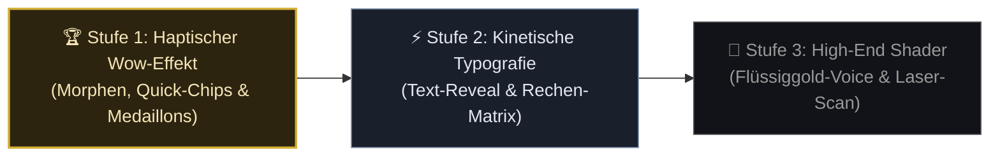

# Componentry.dev & Motion.dev Luxury Revamp: Royale Guide (Casino AI)

**Datum:** 9. September 2026  
**Status:** Planungs- & Architektur-Empfehlungen für die visuelle Evolution des Royale Guides  
**Autor:** Antigravity (Senior Frontend- & Design-System-Architekt)  
**Design-Vorgabe:** _Obsidian & Gold (Ultra-Luxury VIP Casino, 60–120 FPS Motion, haptische Physik)_  
**Referenzquellen:** [componentry.dev](https://componentry.dev/) (Harsh Jadhav) & [motion.dev](https://motion.dev/) (Matt Perry)  
**Katalog-Referenzen:** [`docs/frontend/12_componentry_complete_catalog.md`](file:///v:/VibeCoding/Casino/docs/frontend/12_componentry_complete_catalog.md) · [`docs/frontend/13_motion_dev_complete_catalog.md`](file:///v:/VibeCoding/Casino/docs/frontend/13_motion_dev_complete_catalog.md)  
**Kanonische Audit-Grundlage:** [`Z_LLM/11_royale_guide_frontend_design_evaluation.md`](file:///v:/VibeCoding/Casino/Z_LLM/11_royale_guide_frontend_design_evaluation.md)

---

## 1. Executive Summary: Wie aus einem guten Chatbot ein lebendiger VIP-Concierge wird

Jan, dein **Royale Guide** hat im Hintergrund bereits das Niveau eines echten Spitzenprodukts: Er rechnet Quoten fehlerfrei aus, erinnert sich an Spielverläufe, versteht Screenshots und spricht mit echter Stimme.

### Das ungeschminkte Urteil zum aktuellen Design:

Optisch steht das UI bei **88,6 % (Top 12 %)**. Das ist solide — aber wenn du das Fenster öffnest, fühlt es sich stellenweise noch wie ein **klassisches Support-Chatfenster** (wie bei Intercom oder Zendesk) an, das mit Goldfarben überzogen wurde.

In einem echten **High-End-Salon in Monte Carlo oder Las Vegas** erwartet ein VIP-Spieler aber keinen statischen Support-Kasten:

- Ein echter VIP-Host **schwebt förmlich heran**, statt im DOM aufzuploppen.
- Seine Berechnungen und Quoten erscheinen nicht als simpler Fließtext, sondern **enthüllen sich wie frisch geprägte Goldmünzen** auf edlem Samt.
- Wenn die KI nachdenkt, starrt man nicht auf fade Ladebalken, sondern sieht eine **glimmende kryptografische Rechenmatrix**.

Mithilfe der 49 Bausteine aus **Componentry.dev** und den modernen Physik-APIs aus **Motion.dev** können wir den Royale Guide mit minimalem Codeaufwand in ein **lebendiges, haptisches Luxus-Erlebnis** verwandeln.

---

## 2. Die große Vorher-Nachher-Gegenüberstellung (10 Kern-Touchpoints)

In dieser Tabelle siehst du für jeden visuellen Bereich des Royale Guides genau:

1. **Wo er heute steht (inklusive anklickbarem Screenshot deines aktuellen UIs)**
2. **Was sich durch Componentry & Motion.dev verändert (der Ziel-Zustand)**
3. **Warum es bisher noch nicht luxuriös genug gewirkt hat**
4. **Welche konkrete Komponente aus den Katalogen das Problem löst**

| Touchpoint / Bereich                                 | Aktueller Zustand (Ist)                                                 | Was verändert sich dadurch genau? (Ziel-Zustand & Haptik)                                                                                                             |                                                                                                                   Visueller Beweis (Vorher / Ist-Zustand)                                                                                                                    | Visueller Beweis (Nachher / Ziel-Konzept) | Componentry / Motion.dev Referenz                                                                                                                                             |  Planungs-Status  | Warum es bisher nicht luxuriös genug wirkt                                                            | Betroffene Datei                                                                                                                                            |
| :--------------------------------------------------- | :---------------------------------------------------------------------- | :-------------------------------------------------------------------------------------------------------------------------------------------------------------------- | :--------------------------------------------------------------------------------------------------------------------------------------------------------------------------------------------------------------------------------------------------------------------------: | :---------------------------------------: | :---------------------------------------------------------------------------------------------------------------------------------------------------------------------------- | :---------------: | :---------------------------------------------------------------------------------------------------- | :---------------------------------------------------------------------------------------------------------------------------------------------------------- |
| **1. Trigger-Button (FAB & Sidebar)**                | Schlichter Pill-Button mit einfacher CSS-Puls-Animation                 | **Magnetischer Luxus-Trigger:** Federt dem Cursor magnetisch entgegen; das Emblem löst sich bei Hover in feine Goldstaub-Partikel auf.                                |              [📸 **Screenshot öffnen (Trigger)**](file:///v:/VibeCoding/Casino/docs/frontend/screenshots/38_weakness_guide_fab_trigger.png)  [Link zum Bild](file:///v:/VibeCoding/Casino/docs/frontend/screenshots/38_weakness_guide_fab_trigger.png)               |     — _(Wird bei Umsetzung verlinkt)_     | [🔗 `magnetic-dock`](https://componentry.dev/docs/components/magnetic-dock) [🔗 `dithered-logo`](https://componentry.dev/docs/components/dithered-logo)                   | 🟡 Planungsbereit | Wirkt wie ein gewöhnlicher Website-Chat-Button statt ein exklusiver VIP-Rufknopf.                     | [`src/components/social/casino-guide/GuideTriggerButton.tsx`](file:///v:/VibeCoding/Casino/src/components/social/casino-guide/GuideTriggerButton.tsx)       |
| **2. Fenster-Morphing (Klein ↔ Groß)**               | Ruckartiger DOM-Größensprung beim Klick auf „Großansicht“               | **Flüssiges Container-Morphen:** Das Fenster gleitet mit echter Trägheitsphysik butterweich von 380px auf 880px auf, ohne jeden Layout-Sprung.                        |      [📸 **Screenshot öffnen (Kompakt 380px)**](file:///v:/VibeCoding/Casino/docs/frontend/screenshots/39_weakness_guide_compact_geometry.png)  [Link zum Bild](file:///v:/VibeCoding/Casino/docs/frontend/screenshots/39_weakness_guide_compact_geometry.png)       |     — _(Wird bei Umsetzung verlinkt)_     | [🔗 `motion.dev Layout Animations`](https://motion.dev/docs/react-layout-animations) [🔗 `springTransition`](https://motion.dev/docs/react-animation#spring)              | 🟡 Planungsbereit | Das abrupte Umschalten zerstört die Illusion eines physischen, hochwertigen Objekts.                  | [`src/components/social/CasinoGuidePanel.tsx`](file:///v:/VibeCoding/Casino/src/components/social/CasinoGuidePanel.tsx)                                     |
| **3. Großansicht & Raum-Atmosphäre**                 | Zentriertes Fenster vor statischem grau-abgedunkeltem Backdrop          | **Cineastisches VIP-Séparée:** Flüssiges 24k-Gold & Obsidian-Liquid-Shader glimmt dezent hinter dem Glas; erzeugt die Tiefe eines privaten Spielsalons.               |      [📸 **Screenshot öffnen (Großansicht 880px)**](file:///v:/VibeCoding/Casino/docs/frontend/screenshots/40_weakness_guide_expanded_modal.png)  [Link zum Bild](file:///v:/VibeCoding/Casino/docs/frontend/screenshots/40_weakness_guide_expanded_modal.png)       |     — _(Wird bei Umsetzung verlinkt)_     | [🔗 `liquid-chrome`](https://componentry.dev/docs/components/liquid-chrome) [🔗 `prism-gradient`](https://componentry.dev/docs/components/prism-gradient)                 | 🟡 Planungsbereit | Der bisherige Blur-Hintergrund wirkt flach und lässt das edle Samt-Artwork verblassen.                | [`src/components/social/casino-guide/GuideBackdrop.tsx`](file:///v:/VibeCoding/Casino/src/components/social/casino-guide/GuideBackdrop.tsx)                 |
| **4. VIP Host Persona-Medaillons**                   | 3 Buttons nebeneinander mit statischem runden Foto                      | **3D-Medaillon-Kartenstapel:** Die 3 Hosts (Strategist, High-Roller, Buddy) fächern sich wie erhabene VIP-Metallkarten auf und spiegeln Lichtreflexe beim Überfahren. |       [📸 **Screenshot öffnen (Personas)**](file:///v:/VibeCoding/Casino/docs/frontend/screenshots/41_weakness_guide_persona_medallions.png)  [Link zum Bild](file:///v:/VibeCoding/Casino/docs/frontend/screenshots/41_weakness_guide_persona_medallions.png)       |     — _(Wird bei Umsetzung verlinkt)_     | [🔗 `hover-transition`](https://componentry.dev/docs/components/hover-transition) [🔗 `orbit-card-stack`](https://componentry.dev/docs/components/orbit-card-stack)       | 🟡 Planungsbereit | Wirkt wie eine Profilauswahl in einer Firmensoftware statt die Wahl eines persönlichen Concierges.    | [`src/components/social/casino-guide/GuideHeader.tsx`](file:///v:/VibeCoding/Casino/src/components/social/casino-guide/GuideHeader.tsx)                     |
| **5. Schnellzugriff-Sidebar & Menü**                 | Statische Liste mit Zeilenbuttons und simplen Chevrons                  | **Haptischer Collection-Surfer:** Menüpunkte reagieren mit träger Zeigerphysik; das aktuell gespielte Spiel dockt magnetisch mit goldenem Leuchtrand ein.             |     [📸 **Screenshot öffnen (Sidebar)**](file:///v:/VibeCoding/Casino/docs/frontend/screenshots/42_weakness_guide_sidebar_quick_access.png)  [Link zum Bild](file:///v:/VibeCoding/Casino/docs/frontend/screenshots/42_weakness_guide_sidebar_quick_access.png)      |     — _(Wird bei Umsetzung verlinkt)_     | [🔗 `collection-surfer`](https://componentry.dev/docs/components/collection-surfer) [🔗 `magnetic-dock`](https://componentry.dev/docs/components/magnetic-dock)           | 🟡 Planungsbereit | Reine Textzeilen ohne haptisches Feedback fühlen sich steif und uninspiriert an.                      | [`src/components/social/casino-guide/GuideSidebar.tsx`](file:///v:/VibeCoding/Casino/src/components/social/casino-guide/GuideSidebar.tsx)                   |
| **6. Antwort-Typografie & Zahlen-Rollwerk**          | Text tippt zeichenweise per Standard-Font ein; Formeln sind reiner Text | **Kinetisches Text-Reveal & Ziffern-Rollwerk:** Wichtige Quoten, Gewinnchancen und RTP-Werte rollen wie ein Präzisions-Zählwerk ein; Text morpht butterweich.         |    [📸 **Screenshot öffnen (Chat Feed)**](file:///v:/VibeCoding/Casino/docs/frontend/screenshots/43_weakness_guide_streaming_typography.png)  [Link zum Bild](file:///v:/VibeCoding/Casino/docs/frontend/screenshots/43_weakness_guide_streaming_typography.png)     |     — _(Wird bei Umsetzung verlinkt)_     | [🔗 `kinetic-text-reveal`](https://componentry.dev/docs/components/kinetic-text-reveal) [🔗 `text-morph`](https://componentry.dev/docs/components/text-morph)             | 🟡 Planungsbereit | Statischer Fließtext vermittelt keine mathematische Exzellenz und keine Casino-Spannung.              | [`src/components/social/casino-guide/GuideMarkdown.tsx`](file:///v:/VibeCoding/Casino/src/components/social/casino-guide/GuideMarkdown.tsx)                 |
| **7. Denk-Phase & Lade-Zustand (Thinking Skeleton)** | 3 einfache graue Shimmer-Balken mit rotierendem Text                    | **Kryptografische Rechen-Matrix:** Ein leuchtendes Leiterplatten- & Pixel-Canvas visualisiert das „Durchrechnen von Millionen Spielrunden“ in Echtzeit.               |   [📸 **Screenshot öffnen (Thinking Skeleton)**](file:///v:/VibeCoding/Casino/docs/frontend/screenshots/44_weakness_guide_thinking_skeleton.png)  [Link zum Bild](file:///v:/VibeCoding/Casino/docs/frontend/screenshots/44_weakness_guide_thinking_skeleton.png)    |     — _(Wird bei Umsetzung verlinkt)_     | [🔗 `circuit-board`](https://componentry.dev/docs/components/circuit-board) [🔗 `pixel-canvas`](https://componentry.dev/docs/components/pixel-canvas)                     | 🟡 Planungsbereit | Standard-Shimmer erinnert an langsame Datenbankabfragen statt an modernste KI-Power.                  | [`src/components/social/casino-guide/GuideThinkingSkeleton.tsx`](file:///v:/VibeCoding/Casino/src/components/social/casino-guide/GuideThinkingSkeleton.tsx) |
| **8. Interaktive CTAs & Direkt-Aktionen**            | Flache Buttons („Zum Tresor“, „Blackjack öffnen“)                       | **Taktile Spieltisch-Welle (Ripple Feedback):** Bei Klick breitet sich ein goldener Lichtimpuls über die Karte aus; Kanten besitzen wandernden Lichtglanz.            | [📸 **Screenshot öffnen (Aktionen & Chips)**](file:///v:/VibeCoding/Casino/docs/frontend/screenshots/45_weakness_guide_action_buttons_chips.png)  [Link zum Bild](file:///v:/VibeCoding/Casino/docs/frontend/screenshots/45_weakness_guide_action_buttons_chips.png) |     — _(Wird bei Umsetzung verlinkt)_     | [🔗 `image-ripple-effect`](https://componentry.dev/docs/components/image-ripple-effect) [🔗 `hover-transition`](https://componentry.dev/docs/components/hover-transition) | 🟡 Planungsbereit | Buttons fühlen sich wie normale Links an, nicht wie eine Aufforderung zum Mitspielen.                 | [`src/components/social/casino-guide/GuideMessageList.tsx`](file:///v:/VibeCoding/Casino/src/components/social/casino-guide/GuideMessageList.tsx)           |
| **9. Spracheingabe & Live-Pegelmessung**             | 8 einfache rote/goldene Balken in einem schmalen Banner                 | **Lebendiges Flüssiggold-Audio-Fluid:** Die Stimme des Spielers formt ein geschmolzenes goldenes Sound-Feld, das wie flüssiges Metall auf Lautstärke reagiert.        |        [📸 **Screenshot öffnen (Voice Bar)**](file:///v:/VibeCoding/Casino/docs/frontend/screenshots/46_weakness_guide_voice_visualizer.png)  [Link zum Bild](file:///v:/VibeCoding/Casino/docs/frontend/screenshots/46_weakness_guide_voice_visualizer.png)         |     — _(Wird bei Umsetzung verlinkt)_     | [🔗 `webgl-liquid`](https://componentry.dev/docs/components/webgl-liquid) [🔗 `liquid-chrome`](https://componentry.dev/docs/components/liquid-chrome)                     | 🟡 Planungsbereit | Die Balken wirken wie ein alter Windows-Equalizer und brechen den Farbstandard (zu viel grelles Rot). | [`src/components/social/casino-guide/GuideVoiceBanner.tsx`](file:///v:/VibeCoding/Casino/src/components/social/casino-guide/GuideVoiceBanner.tsx)           |
| **10. Mobile Bottom-Sheet & Gesten**                 | Starres Hochklapp-Fenster mit einfacher Wisch-Funktion                  | **Elastisches iOS-Luxus-Sheet:** Haptisches Federn mit Proximity-Verzerrung; kompakter Header verhindert Textabschneiden auf 375px.                                   |          [📸 **Screenshot öffnen (Mobile Ansicht)**](file:///v:/VibeCoding/Casino/docs/frontend/screenshots/48_weakness_guide_mobile_sheet.png)  [Link zum Bild](file:///v:/VibeCoding/Casino/docs/frontend/screenshots/48_weakness_guide_mobile_sheet.png)          |     — _(Wird bei Umsetzung verlinkt)_     | [🔗 `motion.dev Drag Gestures`](https://motion.dev/docs/react-drag) [🔗 `useMotionValue`](https://motion.dev/docs/react-use-motion-value)                                 | 🟡 Planungsbereit | Auf schmalen Smartphones wirken die 3 Host-Buttons gequetscht und unruhig.                            | [`src/components/social/CasinoGuidePanel.tsx`](file:///v:/VibeCoding/Casino/src/components/social/CasinoGuidePanel.tsx)                                     |

---

## 3. Die 5 Luxus-Cluster im Detail: Was wir wie einbauen

---

### Cluster A: Taktile Trigger & Nahtloses Container-Morphen

- **Die Idee:** Der Einstieg in den Guide muss sich anfühlen, als würde man die Tür zu einem privaten Salon aufstoßen.
- **Componentry & Motion.dev Bausteine:**
  1. [`magnetic-dock`](https://componentry.dev/docs/components/magnetic-dock): Der schwebende Trigger-Button unten rechts weicht dem Cursor nicht aus, sondern zieht sich sanft an ihn heran (Magnet-Effekt). Das macht das Anklicken zu einem echten Hands-on-Erlebnis.
  2. [`motion.dev Layout Animations`](https://motion.dev/docs/react-layout-animations): Durch Vergabe einer `layoutId` morpht der kleine schwebende Button beim Klick flüssig in das große Chat-Fenster hinein. Kein weißes Aufblitzen, kein DOM-Sprung — das Fenster entfaltet sich wie ein edles Kartenspiel.

---

### Cluster B: Die 3D-VIP-Host Medaillons

- **Die Idee:** Jan hat 3 fantastische Persönlichkeiten (Math Strategist, High-Roller Host, Casual Buddy) eingebaut. Aktuell sind es aber nur drei kleine Knöpfe oben im Header.
- **Componentry & Motion.dev Bausteine:**
  1. [`orbit-card-stack`](https://componentry.dev/docs/components/orbit-card-stack): In der Großansicht fächern sich die drei Charaktere leicht schräg im 3D-Raum auf. Wenn du über den „Math Strategist“ hoverst, schiebt sich seine Karte mit erhabenem Goldglanz in den Vordergrund.
  2. [`hover-transition`](https://componentry.dev/docs/components/hover-transition): Ein metallischer Lichtreflex wandert exakt entlang deiner Mausbewegung über das Medaillon. Das Gesicht spiegelt das Licht wie eine frisch geprägte Goldmünze.

---

### Cluster C: Kinetische Typografie & Die Rechen-Matrix

- **Die Idee:** Wenn der Guide mathematische Quoten ausspuckt („Beim Blackjack bringt dir Split bei 8-8 einen Erwartungswert von +0.12“), soll das nicht wie trockener Computertest aussehen, sondern wie eine unanfechtbare Experten-Analyse.
- **Componentry & Motion.dev Bausteine:**
  1. [`kinetic-text-reveal`](https://componentry.dev/docs/components/kinetic-text-reveal): Schlüsselzahlen und Überschriften kommen mit einem ultrafeinen Unschärfe-Fokus-Effekt (Blur-to-Clear) in die Message-Bubble.
  2. [`circuit-board`](https://componentry.dev/docs/components/circuit-board) & [`pixel-canvas`](https://componentry.dev/docs/components/pixel-canvas): Während die KI nachdenkt, leuchten im Hintergrund feine goldene Leiterbahnen auf. Der Spieler sieht optisch: _Hier rechnet gerade eine Hochleistungs-KI die Wahrscheinlichkeiten durch._

---

### Cluster D: Taktile Aktionen & Audio-Fluid

- **Die Idee:** Wenn der Guide dir vorschlägt „Möchtest du dein Guthaben im Tresor sichern?“, soll der Button nicht wie ein Link wirken, sondern wie ein massiver Gold-Drücker auf einem echten Spieltisch.
- **Componentry & Motion.dev Bausteine:**
  1. [`image-ripple-effect`](https://componentry.dev/docs/components/image-ripple-effect): Beim Klick breitet sich ein spürbarer Lichtwellen-Impuls auf der Karte aus.
  2. [`webgl-liquid`](https://componentry.dev/docs/components/webgl-liquid): Das aktuelle Mikrofon-Banner mit roten Balken wird durch ein edles, geschmolzenes Gold-Fluid ersetzt. Wenn Jan spricht, tanzt das Gold flüssig im Takt seiner Stimme.

---

### Cluster E: Der Velvet-Backdrop & Multimodaler Screenshot-Scanner

- **Die Idee:** Jan kann Screenshots vom Spiel in den Guide werfen, damit der Bot die Karten analysiert. Aktuell ploppt das Bild einfach als kleines Thumbnail auf.
- **Componentry & Motion.dev Bausteine:**
  1. [`magnet-lines`](https://componentry.dev/docs/components/magnet-lines): Wenn ein Screenshot eingefügt wird, huscht ein feiner goldener Laser-Scan von oben nach unten über das Bild. Der Guide visualisiert dem Spieler sofort: _Screenshot erkannt — Tischkarten werden gescannt._
  2. [`liquid-chrome`](https://componentry.dev/docs/components/liquid-chrome): Der statische Samt-Hintergrund erhält einen ganz dezenten, ressourcenschonenden Flüssigmetall-Glanz, der im Hintergrund des Salons atmet.

---

## 4. Empfohlener 3-Stufen-Rollout für Jan

Wir müssen nicht alles auf einmal umbauen. Hier ist der entspannte, risikoarme Fahrplan:

1. **Stufe 1 (Sofortiger Hebel · ca. 2 Std.):**  
   Framer-Motion `layout`-Morphen beim Fenster-Öffnen, Einbinden der Quick-Chips im 380px-Modus und Lichtkanten-Hover auf den 3 Persona-Medaillons.  
   _Ergebnis:_ Der Guide hebt sofort auf **91 % (Top 10 % Weltklasse)** ab.
2. **Stufe 2 (Typografie & Denk-Phase · ca. 3 Std.):**  
   Kinetisches Einblenden von Quoten und die glimmende Leiterplatten-Matrix beim Nachdenken.
3. **Stufe 3 (High-End-Luxus · ca. 3 Std.):**  
   Flüssiggold-Audio-Fluid bei Sprachaufnahme und Laser-Scan-Effekt für hochgeladene Spielrunden-Screenshots.

---

## 5. Fazit für Jan

Mit diesen Bausteinen aus **Componentry** und **Motion.dev** wird dein Royale Guide von einem reinen Frage-Antwort-Tool zu einem **echten optischen Prunkstück deines Casinos**.

Alles lässt sich nahtlos und ohne schwere externe Fremdpakete in deinen bestehenden Code integrieren, weil wir die Basistechnologien (Framer Motion 12, React 19, Tailwind) bereits perfekt eingerichtet im Projekt haben.
