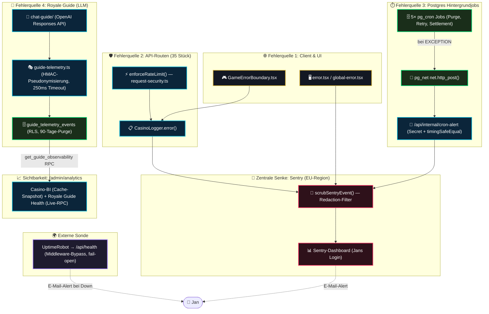
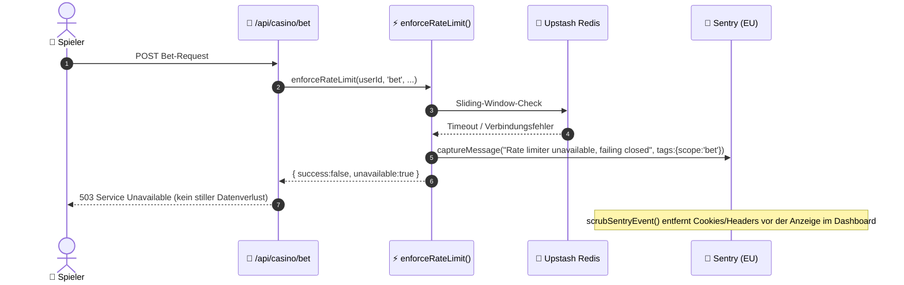
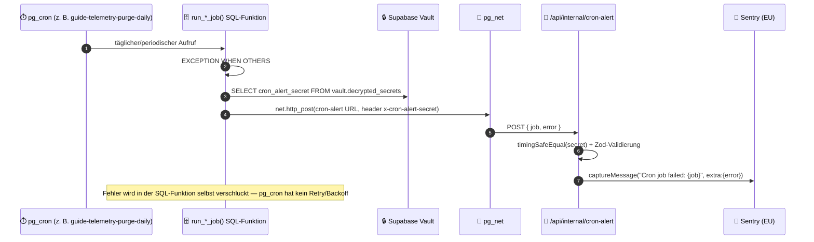

# 00 — Observability & Error/Alert Logging (Master-Dokumentation)

> **Status:** 🟢 Produktionsreif (**Top 8 % laut Worldmap-Selbsteinschätzung** — siehe [`worldmap/00_WORLDMAP_STATUS.md`](../../worldmap/00_WORLDMAP_STATUS.md), Kategorie 05) · **Stand:** 2026-09-01 · **Owner:** Jan / LLM
> **Zweck:** Zentrale Wissensschaltzentrale und portables Dokumentationspaket für alles, was einen Fehler, einen Ausfall oder ein Hintergrundjob-Problem in diesem Projekt sichtbar macht — von der ersten `Sentry.captureException()` bis zur E-Mail, die Jan bei einem toten Cron-Job bekommt. Dient als übergeordneter Index für das Projekt sowie als Wissensfundus für den direkten Transfer in das Obsidian `_Brain`.
> **Quellcode-Basis:** Alle Aussagen in dieser Dokumentation wurden am 2026-08-31 gegen den tatsächlichen, aktuellen Quellcode verifiziert (nicht nur gegen die historischen Planungsdateien in `docs/architecture/`) — Abweichungen zwischen Plan und Ist-Zustand sind in den jeweiligen Modul-Dateien explizit als **„Drift"** markiert.
> **Update 2026-09-01 (Logger):** Säule 3 (Logger) wurde auf Jans Anweisung in 10 Subkategorien auditiert (Top 35 % → **Top 8 %**), alle gefundenen Lücken über `xx_sop/02_workflow_jan_execution.md` behoben (TDD, 12 migrierte Dateien, ESLint-Guardrail, Security-Review PASS) — als Nebeneffekt wurde auch Säule 4 (Error-Boundaries) von Top 25 % auf **Top 8 %** hochgestuft. Volldetails: [`03_logger_error_capture.md`, Abschnitt 4](./03_logger_error_capture.md#4--audit-10-subkategorien-niveau-bewertung-lücken--fix-status).
> **Update 2026-09-01 (Health-Check):** Säule 6 (Health-Check) wurde nach demselben Muster auditiert (Top 20 % → **Top 10 %**) — behoben: fehlende Security-Header auf `/api/health` (war die einzige Route ohne sie), faktisch falscher `HEALTH_FORCE_FAIL`-Kommentar, unsichtbare Rate-Limit-Trips. Security-Review: PASS (1 akzeptiertes MEDIUM). Volldetails: [`06_health_check_uptime_monitoring.md`](./06_health_check_uptime_monitoring.md).
> **Update 2026-09-03 (Cron-Alerting):** Säule 7 (Cron-Alerting) wurde auditiert (Top 20 % → **Top 10 %**) — dabei gefunden: eine bereits abgeschlossene, deutlich breitere Nachbararbeit (`worldmap/07_background_jobs_scheduling.md`, Migration 060) hatte die SQL-seitige Architektur bereits erheblich gehärtet (1 gemeinsame Alarm-Funktion statt 5× dupliziertem Code, begrenzter Retry, Test-Abdeckung ergänzt) — Scope entsprechend auf die 2 verbleibenden, noch offenen Next.js-Route-Lücken verengt (Sentry-`tags`, fail-offener Rate-Limiter), keine Duplikation. Security-Review: PASS (1 akzeptiertes MEDIUM). Volldetails: [`07_cron_failure_alerting.md`](./07_cron_failure_alerting.md).
> **Update 2026-09-03 (Admin-Dashboard):** Säule 9 (Admin-Dashboard) wurde auditiert (Top 15 % → **Top 8 %**) — behoben: 3 von 4 `CasinoLogger.error()`-Aufrufen in `/api/admin/analytics` fehlte das Error-Objekt, wodurch zwei strukturell unterschiedliche Guide-Fehlerpfade in Sentry identisch und kontextlos aussahen. Ein neues, sibling-gebautes Job-Health-Panel (`/admin`, aus derselben Nachbararbeit wie bei Cron-Alerting) wurde bewusst nicht dupliziert, nur referenziert. Security-Review: PASS (1 informativer Hinweis für künftige Sentry-Config-Änderungen). Volldetails: [`09_admin_observability_dashboard.md`](./09_admin_observability_dashboard.md).

---

## 1 — Executive Summary für Jan (High-Level & Verständlich)

Observability in diesem Projekt ist keine einzelne Sentry-Integration, sondern **9 unabhängig funktionierende Säulen**, die sich in vier Signalquellen bündeln: Anwendungsfehler (Browser + Server), Infrastruktur-Ausfälle (Rate-Limiter, Uptime), Hintergrundjobs (Postgres `pg_cron`) und ein spezialisierter KI-Beobachtungskanal (Royale Guide). Hier ist auf einen Blick erklärt, was jede Säule tut:

| Säule                    | Feature                                        | Niveau                                     | Was Jan/Ops sieht & erlebt                                                                                                                                 | Welchen Wert es bietet                                                                                                                                                                                              | Warum das bemerkenswert ist                                                                                                                                                                                                                                                                                                                                                                                                                                                                                                                                                             |
| :----------------------- | :--------------------------------------------- | :----------------------------------------- | :--------------------------------------------------------------------------------------------------------------------------------------------------------- | :------------------------------------------------------------------------------------------------------------------------------------------------------------------------------------------------------------------ | :-------------------------------------------------------------------------------------------------------------------------------------------------------------------------------------------------------------------------------------------------------------------------------------------------------------------------------------------------------------------------------------------------------------------------------------------------------------------------------------------------------------------------------------------------------------------------------------- |
| **SDK-Kern**             | **Sentry Multi-Runtime-Setup**                 | 🟢 **Top 5 %**                             | Jeder unbehandelte Fehler und jeder gezielt gemeldete Fehler erscheint als Issue im Sentry-Dashboard (EU-Region).                                          | Zentrale Fehlersichtbarkeit über Server-, Edge- und Client-Runtime hinweg, ohne eigenes Log-Aggregations-System zu betreiben.                                                                                       | Drei separate `Sentry.init()`-Aufrufe (Server/Edge/Client) mit **identischer** Datenschutz-Policy statt kopierter, driftender Configs.                                                                                                                                                                                                                                                                                                                                                                                                                                                  |
| **Redaction**            | **PII-/Secret-Filter vor jedem Event**         | 🟢 **Top 3 %**                             | Jan sieht im Dashboard nie ein Passwort, `serverSeed`, Cookie oder Access-Token — auch nicht versehentlich.                                                | Verhindert, dass ein Drittanbieter-SaaS (Sentry) zum Datenleck-Vektor wird.                                                                                                                                         | Musterbasierter Filter mit negativem Lookahead: `serverSeedHash` bleibt sichtbar (harmlos, nützlich zur Fehlersuche), `serverSeed` selbst nie.                                                                                                                                                                                                                                                                                                                                                                                                                                          |
| **Logger**               | **`CasinoLogger` als einheitlicher Log-Kanal** | 🟢 **Top 8 %** (2026-09-01, war Top 35 %)  | Entwickler sehen farbcodierte Konsolen-Ausgaben lokal; Fehler **und** betriebsrelevante Warnungen landen zusätzlich automatisch in Sentry.                 | Ein Aufruf (`CasinoLogger.error(...)`/`.warn(...)`) statt doppelter Wartung von `console.*` und `Sentry.capture*` an jeder Stelle im Code — jetzt lückenlos durchgesetzt statt nur an einem Teil der Aufrufstellen. | Sentry-Aufruf ist selbst try/catch-isoliert. Nach 10-Subkategorien-Audit: `warn()` erreicht Produktion jetzt immer (vorher nie), 12 Dateien mit rohem `console.*`-Bypass migriert (darunter Login-Audit, Fraud-ML, Proxy-Boundary), `no-console`-ESLint-Regel verhindert Regression. Details: [Modul 03](./03_logger_error_capture.md).                                                                                                                                                                                                                                                 |
| **Error-Boundaries**     | **3-stufige Absturzsicherung**                 | 🟢 **Top 8 %** (2026-09-01, war Top 25 %)  | Ein Spieler sieht bei einem UI-Crash eine kontrollierte Fehlerseite statt eines weißen Bildschirms.                                                        | Die App bleibt bedienbar, selbst wenn eine einzelne Komponente abstürzt.                                                                                                                                            | Route-Boundary, Root-Boundary und spielspezifische Boundary decken alle drei React-Fehlerebenen jetzt mit **gleicher** Fidelity ab — `GameErrorBoundary` verlor zuvor den nativen Stack-Trace (behoben als Nebeneffekt des Logger-Audits), Route-/Root-Boundary hatten zuvor kein `module`-Tag (jetzt ergänzt). Details: [Modul 04](./04_error_boundaries.md).                                                                                                                                                                                                                          |
| **Fail-Closed-Alerting** | **Zentrale Rate-Limiter-Instrumentierung**     | 🟢 **Top 10 %**                            | Bei einem Redis-Ausfall bekommt der Spieler eine kontrollierte 503-Antwort statt eines stillen Datenverlusts — und Jan bekommt einen Sentry-Alarm.         | Geld-Pfade (Bet, Blackjack, Redeem-Code) schließen bei Infrastruktur-Ausfall garantiert fail-closed.                                                                                                                | **35 Routen** über eine einzige Funktion instrumentiert (DRY) statt 35× denselben Code zu kopieren. **Abzug:** keine `request_id`-Korrelation am Alarm selbst (Modul 05, Pitfall 1).                                                                                                                                                                                                                                                                                                                                                                                                    |
| **Health-Check**         | **Externe Lebenszeichen-Sonde**                | 🟢 **Top 10 %** (2026-09-01, war Top 20 %) | Jan bekommt eine E-Mail von einem kostenlosen externen Dienst (UptimeRobot), wenn die Seite nicht erreichbar ist.                                          | Unabhängige, von der eigenen Infrastruktur entkoppelte Ausfallerkennung — auch wenn Supabase oder Sentry selbst down wären.                                                                                         | Middleware-Bypass sorgt dafür, dass ein Supabase-Problem die Liveness-Route nicht fälschlich „down" erscheinen lässt; ein expliziter Chaos-Schalter erlaubt gefahrlose Alarm-Tests, voller Zyklus live gegen Produktion verifiziert. Nach 10-Subkategorien-Audit: `/api/health` bekommt jetzt dieselben 7 Security-Header wie jede andere Route (war die einzige Ausnahme), Rate-Limit-Trips sind jetzt sichtbar. **Verbleibender Abzug:** Single-Channel/Single-Region-Checker (Subkategorie 8, keine LLM-Zuständigkeit). Details: [Modul 06](./06_health_check_uptime_monitoring.md). |
| **Cron-Alerting**        | **Wächter für 5 Alarmquellen**                 | 🟢 **Top 10 %** (2026-09-03, war Top 20 %) | Scheitert ein Postgres-Job endgültig (nach 3 Versuchen mit Backoff), bekommt Jan genau einmal einen Sentry-Alarm statt eines still gescheiterten Jobs.     | `pg_cron` hat keine eingebaute Retry-/Benachrichtigungslogik — dieser Kanal schließt genau diese Lücke.                                                                                                             | Seit Migration 060 (Nachbararbeit, siehe [Modul 07](./07_cron_failure_alerting.md), Abschnitt 9): 1 gemeinsame `enqueue_cron_alert()`-Funktion statt 5× dupliziertem Code, begrenzter Retry (3 Versuche) statt täglichem Alarm-Rauschen, deduplizierte Terminal-Alerts. Nach eigenem 10-Subkategorien-Audit zusätzlich: `tags: {job}` für Dashboard-Filterung, fail-offener Rate-Limiter. **Verbleibender Abzug:** Rate-Limit-Key über Header-Rotation umgehbar (Modul 07, Pitfall 5, bewusst akzeptiert), kein Zustellnachweis (Pitfall 4).                                            |
| **LLM-Telemetrie**       | **Pseudonyme Royale-Guide-Beobachtung**        | 🟢 **Top 8 %**                             | Im Admin-Dashboard sieht Jan Anfragevolumen, Erfolgsquote, Latenz, Tokenverbrauch und eine Kostenschätzung für den KI-Guide — nie den Gesprächsinhalt.     | Betriebssicht auf eine KI-Funktion, ohne ein einziges Wort eines Nutzergesprächs zu speichern.                                                                                                                      | HMAC-Pseudonymisierung + 250-ms-Timeout-Wächter, der garantiert, dass Telemetrie die eigentliche Guide-Antwort nie verzögert. **Abzug:** Streaming-Antworten liefern strukturell nie echte Token-/Kostendaten (Modul 08, Abschnitt 5).                                                                                                                                                                                                                                                                                                                                                  |
| **Admin-Dashboard**      | **Ein Ort für alle Signale**                   | 🟢 **Top 8 %** (2026-09-03, war Top 15 %)  | `/admin/analytics` zeigt Casino-BI und Royale-Guide-Health nebeneinander, in einer Ansicht — plus seit 2026-09-02 ein neues Job-Health-Panel auf `/admin`. | Kein Kontextwechsel zwischen mehreren Tools nötig, um den Systemzustand zu verstehen.                                                                                                                               | Bewusste, dokumentierte Architektur-Asymmetrie: Guide-Daten werden live pro Request geladen, während der Rest der BI aus einem Cache-Snapshot bedient wird — begründet, nicht zufällig. Nach 10-Subkategorien-Audit: 3 von 4 Fehlerpfaden bekamen ihr Error-Objekt zurück (vorher zwei strukturell unterschiedliche Guide-Fehler mit identischer, kontextloser Sentry-Meldung). Details: [Modul 09](./09_admin_observability_dashboard.md).                                                                                                                                             |

**Niveau-Skala** (niedrigerer Prozentwert = besser — dieselbe Konvention wie in [`worldmap/00_WORLDMAP_STATUS.md`](../../worldmap/00_WORLDMAP_STATUS.md)):

| Band            | Bedeutung                                                                                                         |
| :-------------- | :---------------------------------------------------------------------------------------------------------------- |
| 🟢 Top 1–10 %   | Weltklasse bis sehr stark — TDD-abgesichert bzw. zentral/DRY instrumentiert, keine praxisrelevante offene Lücke.  |
| 🟡 Top 11–25 %  | Solide, funktional korrekt — mit mindestens einer realen, im Modul unter „Pitfalls" dokumentierten Einschränkung. |
| 🟠 Top 26–50 %  | Basis-Niveau — funktioniert zuverlässig, aber mit spürbarem, konkret benennbarem Verbesserungsbedarf.             |
| 🔴 Top 51–100 % | Nachholbedarf — im Observability-Ordner aktuell nicht vertreten.                                                  |

**Bewertungsmethode:** Jede Einstufung ist an die in Abschnitt 7 (bzw. 6/8, je nach Modul) „Pitfalls" des jeweiligen Submoduls dokumentierten Befunde gekoppelt — keine Pauschal-Schätzung. Ein Modul ohne dokumentierten Pitfall mit Praxisrelevanz liegt bei Top 1–10 %; jeder zusätzliche reale Abzug senkt das Niveau nachvollziehbar. Diese Bewertung ist eine Selbsteinschätzung zum Stand 2026-08-31 und sinkt automatisch als „veraltet" ein, sobald ein referenzierter Pitfall behoben wird, ohne dass diese Tabelle danach aktualisiert wurde.

---

## 2 — Technischer Deep-Dive für das LLM (Architektur & Obsidian-Fundus)

### 2.1 Gesamtsystem-Architektur & vier Signalpfade

### 2.2 Sequenz-Diagramm: Fail-Closed-Fehlerpfad (Beispiel `POST /api/casino/bet`)

### 2.3 Sequenz-Diagramm: Cron-Job-Ausfall-Alarm

---

## 3 — Unverletzliche Sicherheits- & Verlässlichkeits-Invarianten (Obsidian Callouts)

> [!SECURITY] **1. Nie Secrets oder PII an Sentry**
> Jedes Event durchläuft `scrubSentryEvent()` (`src/lib/casino/sentry-scrub.ts`) via `beforeSend`, bevor es das SDK verlässt. `sendDefaultPii: false` ist in allen drei Runtime-Configs (Server/Edge/Client) explizit gesetzt, auch wenn es der SDK-Default wäre — für Auditierbarkeit.

> [!CAUTION] **2. Ein Sentry-SDK-Fehler darf nie den Aufrufer brechen**
> Jeder `Sentry.captureException()`/`captureMessage()`-Aufruf im Projekt ist try/catch-isoliert (`logger.ts`, `request-security.ts`, `error.tsx`, `global-error.tsx`). Ein Netzwerkproblem beim Senden an Sentry darf niemals eine Spielrunde, einen Wallet-Pfad oder eine API-Antwort verändern.

> [!NOTE] **3. Telemetrie ist fail-open, Wallet-Pfade sind fail-closed — bewusst unterschiedlich**
> Die Royale-Guide-Telemetrie (`recordGuideTelemetry()`) verschluckt jeden Schreibfehler und wartet maximal 250 ms — sie darf die Guide-Antwort nie verzögern oder verändern. Der Rate-Limiter für Geld-Pfade schließt hingegen bei Ausfall strikt **fail-closed** (503). Beides ist beabsichtigt, nicht inkonsistent: Beobachtung darf nie wichtiger werden als die eigentliche Funktion; Geld-Sicherheit hat Vorrang vor Verfügbarkeit.

> [!TIP] **4. Exakter Host statt Wildcard in der CSP**
> `src/proxy.ts` erlaubt in `connect-src` exakt `https://o4511899214020608.ingest.de.sentry.io` — kein `*.ingest.de.sentry.io`-Wildcard. Ein Wildcard hätte Exfiltration zu jedem anderen Sentry-Kundenprojekt in derselben Region erlaubt (gefunden im Security-Review M7 der ursprünglichen Sentry-Einführung).

> [!SECURITY] **5. Timing-Safe Secret-Vergleich für den Cron-Alarm-Kanal**
> `/api/internal/cron-alert` vergleicht das `x-cron-alert-secret`-Header mit `node:crypto`s `timingSafeEqual()`, nicht mit `===`. `pg_net` sendet keine Browser-Origin-Header oder Cookies — die Route authentifiziert daher ausschließlich über dieses Secret, nach demselben Muster wie `/api/telegram/webhook`.

---

## 4 — Visuelle Komponenten-Matrix & Code-Pfade

| Schicht                 | Datei / Komponente                                                                                                   | Rolle                                                   | Modul                                          |
| :---------------------- | :------------------------------------------------------------------------------------------------------------------- | :------------------------------------------------------ | :--------------------------------------------- |
| **SDK-Kern**            | `sentry.server.config.ts`, `sentry.edge.config.ts`, `src/instrumentation-client.ts`, `src/instrumentation.ts`        | Drei Runtime-Inits + `onRequestError`-Hook              | [`01`](./01_sentry_sdk_core.md)                |
| **Redaction**           | [`src/lib/casino/sentry-scrub.ts`](../../src/lib/casino/sentry-scrub.ts)                                             | `scrubSentryEvent()` — Muster-Filter + Tiefenbegrenzung | [`02`](./02_pii_secret_redaction.md)           |
| **Logger**              | [`src/lib/casino/logger.ts`](../../src/lib/casino/logger.ts)                                                         | `CasinoLogger` statische Klasse                         | [`03`](./03_logger_error_capture.md)           |
| **Error-Boundaries**    | `src/app/error.tsx`, `src/app/global-error.tsx`, `src/components/casino/GameErrorBoundary.tsx`                       | 3-stufige React-Absturzsicherung                        | [`04`](./04_error_boundaries.md)               |
| **Rate-Limit-Alerting** | [`src/lib/security/request-security.ts`](../../src/lib/security/request-security.ts)                                 | `enforceRateLimit()`, `reportRateLimiterUnavailable()`  | [`05`](./05_ratelimit_failclosed_alerting.md)  |
| **Health-Check**        | [`src/app/api/health/route.ts`](../../src/app/api/health/route.ts), `src/proxy.ts` (Bypass)                          | Liveness-Probe + externer Checker                       | [`06`](./06_health_check_uptime_monitoring.md) |
| **Cron-Alerting**       | [`src/app/api/internal/cron-alert/route.ts`](../../src/app/api/internal/cron-alert/route.ts)                         | Secret-Auth + Sentry-Weiterleitung für 5 Cron-Jobs      | [`07`](./07_cron_failure_alerting.md)          |
| **LLM-Telemetrie**      | [`src/lib/casino/guide-telemetry.ts`](../../src/lib/casino/guide-telemetry.ts), `supabase/migrations/024_*`, `027_*` | HMAC-Pseudonymisierung, Kostenschätzung, RLS            | [`08`](./08_llm_guide_telemetry.md)            |
| **Admin-Dashboard**     | `src/app/api/admin/analytics/route.ts`, `src/lib/admin/guide-observability.ts`, `AnalyticsPageClient.tsx`            | Aggregation + „Royale Guide Health"-UI                  | [`09`](./09_admin_observability_dashboard.md)  |

---

## 5 — Die 9 modularen Deep-Dive-Dokumente (Modul-Navigator)

Jede der folgenden Dateien ist eine in sich geschlossene, sofort einsatzbereite Wissens- und Implementierungs-Blaupause mit vollständigen TypeScript/SQL-Code-Snippets, Datenflüssen, Checklisten und ehrlich dokumentierten Pitfalls/Trade-offs — inklusive der Lücken, die bei der Verifikation gegen den aktuellen Code gefunden wurden (kein Blackbox-Marketing).

| Modul                                                                                | Primärer Fokus                                                      | Kern-Datei                         |
| :----------------------------------------------------------------------------------- | :------------------------------------------------------------------ | :--------------------------------- |
| **[`01_sentry_sdk_core.md`](./01_sentry_sdk_core.md)**                               | Sentry-SDK-Grundgerüst über 3 Next.js-Runtimes (Server/Edge/Client) | `sentry.server.config.ts`          |
| **[`02_pii_secret_redaction.md`](./02_pii_secret_redaction.md)**                     | TDD-Redaction-Filter gegen Secret-/PII-Leaks in Sentry-Events       | `sentry-scrub.ts`                  |
| **[`03_logger_error_capture.md`](./03_logger_error_capture.md)**                     | `CasinoLogger` als einheitlicher Konsolen- + Sentry-Kanal           | `logger.ts`                        |
| **[`04_error_boundaries.md`](./04_error_boundaries.md)**                             | 3-stufige React-Absturzsicherung (Route/Root/Game)                  | `GameErrorBoundary.tsx`            |
| **[`05_ratelimit_failclosed_alerting.md`](./05_ratelimit_failclosed_alerting.md)**   | Zentrale Fail-Closed-Instrumentierung für 35 API-Routen             | `request-security.ts`              |
| **[`06_health_check_uptime_monitoring.md`](./06_health_check_uptime_monitoring.md)** | Liveness-Probe + externer Free-Uptime-Checker                       | `api/health/route.ts`              |
| **[`07_cron_failure_alerting.md`](./07_cron_failure_alerting.md)**                   | Secret-geschützter Alarm-Kanal für 5 `pg_cron`-Jobs                 | `api/internal/cron-alert/route.ts` |
| **[`08_llm_guide_telemetry.md`](./08_llm_guide_telemetry.md)**                       | Pseudonyme, textfreie KI-Beobachtung des Royale Guide               | `guide-telemetry.ts`               |
| **[`09_admin_observability_dashboard.md`](./09_admin_observability_dashboard.md)**   | Admin-BI-Aggregation & „Royale Guide Health"-UI                     | `admin/analytics/route.ts`         |

---

## 6 — Bekannte Lücken & bewusste Trade-offs (ehrliche Bestandsaufnahme)

Diese Dokumentation ist bewusst **keine Marketing-Zusammenfassung**. Bei der Verifikation gegen den aktuellen Code wurden folgende reale Einschränkungen gefunden — jede ist in ihrem jeweiligen Modul mit Kontext dokumentiert. Behobene Lücken werden aus dieser Liste entfernt, sobald sie verifiziert geschlossen sind (Historie bleibt im jeweiligen Modul erhalten, siehe z. B. [Modul 03, Abschnitt 4](./03_logger_error_capture.md#4--audit-10-subkategorien-niveau-bewertung-lücken--fix-status) für die am 2026-09-01 behobene `GameErrorBoundary`-Fidelity-Lücke):

1. **`onRouterTransitionStart`-Navigations-Breadcrumbs bewusst nicht verdrahtet** (Modul 01) — würde volle Navigations-URLs inkl. Query-Strings erfassen, potenziell inkl. OAuth-`code`-Parameter auf `/auth/callback`. Bewusst ausgelassen statt unreviewed ergänzt.
2. **`/api/internal/cron-alert` verschluckt ungültige Payloads still** (Modul 07) — bei fehlgeschlagener Zod-Validierung antwortet die Route mit `{ ok: true }` statt einem Fehler, damit ein fehlerhafter Cron-Aufrufer nie in eine Retry-Schleife gerät. Bei der erneuten Prüfung 2026-09-03 als bereits test-verriegelt bestätigt (nicht verändert). Ein wirklich kaputter Alarm-Aufruf bleibt dadurch aber unsichtbar.
3. **Streaming-Guide-Antworten liefern nie echte Kosten-Telemetrie** (Modul 08) — `recordGuideTelemetry()` wird beim Streaming-Pfad mit `usage: null` aufgerufen, bevor der Stream überhaupt konsumiert wurde. Token-/Kostendaten fehlen für gestreamte Antworten systematisch.
4. **Admin-BI-Architektur-Asymmetrie** (Modul 09) — Royale-Guide-Daten werden bei jedem Request live per RPC geladen, während der Rest der Admin-Analytics aus einem periodischen Cache-Snapshot (Migration 046) bedient wird. Kein Fehler, aber eine Abweichung vom sonstigen Muster, die man beim Erweitern der BI kennen sollte.
5. **Sentry-Redaction-Filter scrubt keine Exception-Message-/Stack-Freitexte** (Modul 02, gefunden 2026-09-01 als Nebenbefund des Logger-Security-Reviews) — `scrubSentryEvent()` filtert `extra`/`contexts`/`breadcrumbs`/`request`/`user` nach Schlüsselnamen, aber nicht `event.exception.values[].value` oder den Stack-Trace-Text selbst. Ein künftiges `throw new Error(...)` mit einem interpolierten Secret würde über jeden `captureException`-Aufruf im Projekt ungefiltert an Sentry gelangen. Als separate Aufgabe ausgegliedert, nicht akut (aktueller Code interpoliert nachweislich keine Secrets in Fehlermeldungen).
6. **`/api/health`-Sustained-Flood erzeugt fortlaufende, aber hart begrenzte Sentry-Events** (Modul 06, Security-Review-Fund 2026-09-01) — ein unauthentifizierter Angreifer kann die öffentliche Liveness-Route trivial fluten und löst dadurch alle 60 Sekunden ein neues `Sentry.captureMessage()` aus. Begrenzt auf max. 1 Event/60s pro Identifier und durch Sentrys Issue-Fingerprinting auf ein einzelnes Issue — bewusst akzeptiert, keine weitere Mitigation ergänzt (Overengineering-Risiko für ein bereits begrenztes, nicht-Wallet-relevantes Restrisiko).
7. **Health-Check: Single-Channel/Single-Region externer Checker** (Modul 06) — nur ein UptimeRobot-Monitor mit nur einem Alarm-Kanal (E-Mail) — ein Single Point of Failure für die Alarmierung selbst. Keine LLM-Zuständigkeit (Drittanbieter-UI-Aktion), daher nicht behoben.
8. **Cron-Alerting: Rate-Limit-Key über Header-Rotation umgehbar** (Modul 07, Security-Review-Fund 2026-09-03) — der fail-offene In-Memory-Limiter auf `/api/internal/cron-alert` schützt nur vor einer einzelnen fehlkonfigurierten Quelle, nicht vor einem gezielten Angreifer mit geleaktem Secret, der `X-Forwarded-For` rotiert. Bewusst akzeptiert — die eigentliche Sicherheitsgrenze bleibt das Secret selbst, der Limiter ist Rauschen-/Kosten-Kontrolle.
9. **Cron-Alerting: `pg_net`-Erfolg ist kein Zustellnachweis** (Modul 07) — bereits als bewusste Restlücke in `worldmap/07_background_jobs_scheduling.md` dokumentiert, außerhalb des schmalen Observability-Scopes.
10. **Kein Trigger.dev-seitiges Alerting** (angrenzend an Modul 07, siehe `worldmap/07_background_jobs_scheduling.md`) — nur die `pg_cron`-Seite alarmiert über Sentry; ein final gescheiterter Trigger.dev-Task (z. B. `player-onboarding-drip`) ist nur im externen Trigger.dev-Dashboard sichtbar. Bereits als Prio-2-Folgearbeit in der breiteren Kategorie-07-Aufschlüsselung geführt — nicht Teil dieses Observability-Moduls, um Doppelarbeit zu vermeiden.

---

## 7 — Verwandte, aber bewusst nicht Teil dieser Dokumentation

- **PostHog-Produkt-Analytics** (`src/lib/analytics/`) — deckt Nutzerverhalten/Events ab, nicht Fehler/Ausfälle. Siehe [`xx_docs/06_analytics_context.md`](../../xx_docs/06_analytics_context.md) und [`xx_sop/08_analytics_posthog.md`](../../xx_sop/08_analytics_posthog.md).
- **Chaos-/Lasttest-Harness** (Artillery, `worldmap/05_Observability_und_Lasttest.md`) — nutzt die hier dokumentierten Fail-Closed-Pfade als Beobachtungsziel, ist aber selbst eine separate Test-Initiative, kein Observability-Baustein.
- **Auth-Audit-Log** (`docs/auth/06_login_audit_history.md`) — protokolliert Login-Ereignisse für Nutzer-Sichtbarkeit, ist eine Sicherheits-/UX-Funktion, kein System-Observability-Kanal.
