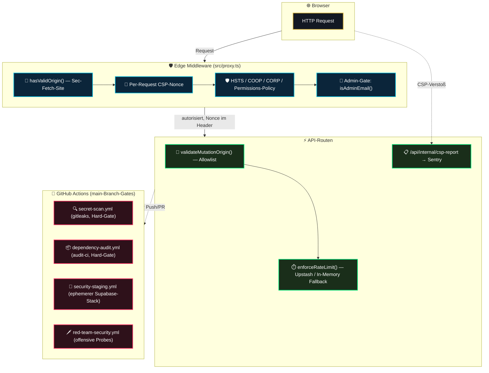

# 00 — Security Hardening (Headers, CSP, CSRF, Secrets & CI-Gates) — Master-Dokumentation

> **Status:** 🟡 Größtenteils committed & live-verifiziert, zwei Gates aktuell rot (siehe Tabelle) · **Stand:** 2026-08-30, ca. 17:20 UTC · **Owner:** Jan / LLM
> **Zweck:** Zentrale Wissensschaltzentrale und portables Dokumentationspaket für die technische Security-Hardening-Schicht (Headers/CSP, CSRF/Origin-Guard, Secrets, Supply-Chain- und CI-Gates, Red-Team-Probes). Analog zu [`docs/auth/00_AUTH_OVERVIEW.md`](../auth/00_AUTH_OVERVIEW.md), aber für die Nicht-Identity-Sicherheitsschicht. Dient als Index für das Projekt sowie als Wissensfundus für den Transfer in das Obsidian `_Brain`.

> **Wichtiger Unterschied zur Auth-Dokumentation:** Auth (`docs/auth/`) ist eine abgeschlossene, produktionsreife „Top 1 %“-Schicht. Diese Schicht ist **in aktiver Bewegung** — während dieser Dokumentation lief auf `main` eine echte, live verfolgbare Debugging-Session an `red-team-security.yml` (mehrere Commits zwischen 17:00 und 17:20 UTC, siehe `09_red_team_probes.md`). Jede Zahl in dieser Doku trägt deshalb einen Zeitstempel und einen Befehl, mit dem sie sich nachprüfen lässt — nicht raten, nachmessen.

---

## 1 — Executive Summary für Jan (High-Level & Verständlich)

Diese Schicht ist kein einzelnes Feature, sondern **10 einzeln bewertbare Härtungsmaßnahmen**, die zusammen die Angriffsfläche der App absichern, ohne dass ein Spieler davon je etwas im UI sieht (im Gegensatz zu Auth). Bewusst nach demselben „max. 10 Unterkategorien“-Schema gegliedert wie [`worldmap/04_security_hardening.md`](../../worldmap/04_security_hardening.md), aber pro Maßnahme mit eigener Implementierungs-Blaupause statt nur Bewertung.

| #      | Maßnahme                                      | Was sie technisch tut                                                                                                                                        | Welchen Schutz sie bietet                                                                                                               | Live-Status (verifiziert 2026-08-30)                                                                                                            |
| :----- | :-------------------------------------------- | :----------------------------------------------------------------------------------------------------------------------------------------------------------- | :-------------------------------------------------------------------------------------------------------------------------------------- | :---------------------------------------------------------------------------------------------------------------------------------------------- |
| **1**  | **CSP `script-src`-Härtung**                  | Pro Request ein zufälliger Nonce (`crypto.randomUUID()`) statt `unsafe-inline`/`unsafe-eval` in Produktion.                                                  | Verhindert, dass injizierter Fremd-Code (XSS) im Browser ausgeführt wird — der Angreifer kennt den Nonce des jeweiligen Requests nicht. | 🟢 Committed (`1e75626`), `style-src` bleibt bewusst `unsafe-inline` (Restlücke).                                                               |
| **2**  | **Security-Header-Set**                       | HSTS, X-Frame-Options, X-Content-Type-Options, Referrer-Policy, COOP, CORP, 21-Direktiven-Permissions-Policy.                                                | Schützt vor Clickjacking, MIME-Sniffing, Cross-Origin-Fenster-Zugriff und ungenutzten Browser-Features (Kamera, USB, Geolocation …).    | 🟢 Committed, jede Direktive grep-verifiziert gegen echte Feature-Nutzung.                                                                      |
| **3**  | **CSP-Violation-Reporting**                   | Browser meldet CSP-Verstöße an `/api/internal/csp-report`, Weiterleitung an Sentry.                                                                          | Macht reale Angriffsversuche/Fehlkonfigurationen sichtbar, statt sie stumm zu verwerfen.                                                | 🟢 Committed, 6/6 Tests grün (`csp-report-route.test.ts`, verifiziert 2026-08-30).                                                              |
| **4**  | **CSRF- / Origin-Guard**                      | Zwei Schichten: `src/proxy.ts` (`hasValidOrigin`, `Sec-Fetch-Site`-basiert) + `request-security.ts` (`validateMutationOrigin`, Allowlist).                   | Blockiert state-verändernde Requests von fremden Origins.                                                                               | 🟡 Committed & 8/8 Unit-Tests grün — aber der Red-Team-Probe gegen die echte Laufzeitumgebung schlägt aktuell live fehl (siehe #9).             |
| **5**  | **Env-/Secrets-Schema (Fail-Fast)**           | `assertCoreEnv()` prüft 3 Supabase-Kernvariablen per Zod, bricht den Boot sonst kontrolliert ab.                                                             | Verhindert kryptische Runtime-Fehler durch fehlende/leere Secrets.                                                                      | 🟢 Committed, 6 Testausführungen grün (4 Testfälle, 1 davon `it.each` über 3 Keys).                                                             |
| **6**  | **Secret-Rotation-Prozess & Secret-Scanning** | SOP mit Rotationsturnus nach Blast-Radius + `gitleaks` als CI-Hard-Gate auf jeden Push/PR.                                                                   | Reduziert das Zeitfenster kompromittierter Secrets; verhindert neue Klartext-Secrets im Commit.                                         | 🟢 CI-Gate live grün (5 von 5 beobachteten Läufen `Secret scan` erfolgreich).                                                                   |
| **7**  | **Dependency-/Supply-Chain-Audit-Gate**       | `audit-ci` mit getrackter Allowlist als Hard-Gate + SBOM-Export.                                                                                             | Blockiert Merges mit neuen High/Critical-Schwachstellen in Abhängigkeiten.                                                              | 🔴 **Live rot** — 2 neue, nicht allowlistete High-Funde (`brace-expansion`, `js-yaml`, `deepmerge-ts`-Kette) seit der letzten Allowlist-Pflege. |
| **8**  | **Security-CI-Gate (Staging-Regression)**     | Ephemerer lokaler Supabase-Stack + Phase-1-Sicherheitsskripte in CI.                                                                                         | Automatisierte, kontinuierliche Verifikation der Security-Invarianten statt nur lokaler LLM-Behauptung.                                 | 🟢 Letzter abgeschlossener Lauf grün; erneuter Lauf zum Dokumentationszeitpunkt in Bearbeitung.                                                 |
| **9**  | **Red-Team-Probes (offensive CI-Gate)**       | Vier Skripte (`target-guard`, `rate-limit-bypass`, `admin-idor`, `ephemeral-bootstrap`) greifen die laufende App aktiv an (Rate-Limit-Umgehung, Admin-IDOR). | Verifiziert Schutzmechanismen aus Angreiferperspektive, nicht nur über Unit-Tests.                                                      | 🔴 **Aktiv in Bearbeitung** — mehrere Debug-Commits zwischen 17:00–17:20 UTC, Ausgang zum Dokumentationszeitpunkt offen.                        |
| **10** | **`security.txt` (RFC 9116) & HSTS-Preload**  | Standardisierte Kontaktstelle für Sicherheitsforscher + `.app`-TLD-erzwungenes HSTS-Preload.                                                                 | Erlaubt koordinierte Offenlegung von Schwachstellen; Downgrade-Schutz auf Transportebene ab dem ersten Request.                         | 🟢 Vorhanden und ausliefert (statischer Inhalt, kein CI-Bezug).                                                                                 |

---

## 2 — Technischer Deep-Dive für das LLM (Architektur & Datenfluss)

### 2.1 Request-Pfad durch die Härtungsschichten

### 2.2 Warum zwei Origin-Checks (`hasValidOrigin` UND `validateMutationOrigin`)?

Beide prüfen denselben Angriffstyp (CSRF), aber an unterschiedlichen Stellen und mit unterschiedlicher Fehlertoleranz — bewusste Tiefenverteidigung, keine Redundanz zum Streichen:

- **`src/proxy.ts` → `hasValidOrigin()`:** Läuft für **jeden** nicht-GET-Request am Edge, bevor überhaupt eine Route erreicht wird. Primärsignal `Sec-Fetch-Site` (Browser-gesetzt, von Seiten-JS nicht fälschbar), Fallback auf `Origin`-vs-`Host`.
- **`src/lib/security/request-security.ts` → `validateMutationOrigin()`:** Läuft **zusätzlich** innerhalb einzelner Geld-Routen (z. B. `/api/casino/bet`) mit einer expliziten `APP_ORIGINS`-Allowlist statt Host-Vergleich — greift auch dann noch, wenn die Middleware aus irgendeinem Grund umgangen würde (z. B. direkter Serverless-Funktionsaufruf ohne Edge-Hop).

Details, Code und der aktuell offene Red-Team-Befund dazu: [`04_csrf_origin_guard.md`](./04_csrf_origin_guard.md).

---

## 3 — Unverletzliche Sicherheits-Invarianten

> [!SECURITY] **1. Hard-Gate statt Soft-Warning**
> `secret-scan.yml` und `dependency-audit.yml` laufen **ohne** `continue-on-error`. Ein neuer, nicht allowlisteter Fund blockiert den Merge — er wird nicht nur geloggt.

> [!CAUTION] **2. Fail-Closed bei Rate-Limiter-Ausfall**
> `enforceRateLimit()` liefert in Produktion `success: false` (503), wenn Upstash nicht erreichbar ist — es gibt keinen stillschweigenden Durchlass bei Infrastrukturausfall (`src/lib/security/request-security.ts`).

> [!NOTE] **3. Keine Secret-Werte im Rotation-Log**
> `xx_docs/13_secret_rotation_log.md` speichert ausschließlich Datum + Grund, niemals den Secret-Wert selbst. Rotation ist immer eine K5-Aktion (Jans manueller Eingriff im Anbieter-Dashboard) — das LLM darf erinnern, nie selbst rotieren.

> [!TIP] **4. Jede Allowlist-Ausnahme braucht eine dokumentierte Begründung**
> `.audit-ci.jsonc` und `.gitleaks.toml` verbieten stille Ausnahmen — jeder Allowlist-Eintrag trägt einen Kommentar mit Herkunft und einen Verweis auf die Stelle, die die Ausnahme entschieden hat.

---

## 4 — Komponenten-Matrix & Code-Pfade

| Schicht                   | Datei / Workflow                                                                                                                                      | Rolle                                                                    | Kontext                             |
| :------------------------ | :---------------------------------------------------------------------------------------------------------------------------------------------------- | :----------------------------------------------------------------------- | :---------------------------------- |
| **Edge Perimeter**        | [`src/proxy.ts`](../../src/proxy.ts)                                                                                                                  | CSP-Nonce, Security-Header, `hasValidOrigin()`, Admin-Gate               | Middleware, jeder Request           |
| **Origin-Guard (Edge)**   | [`src/lib/security/origin-guard.ts`](../../src/lib/security/origin-guard.ts)                                                                          | `Sec-Fetch-Site`-basierte CSRF-Prüfung, testbar isoliert                 | 8/8 Tests grün                      |
| **Origin-Guard (API)**    | [`src/lib/security/request-security.ts`](../../src/lib/security/request-security.ts)                                                                  | `validateMutationOrigin()`, `enforceRateLimit()`, Client-Identifier      | Pro Geld-Route                      |
| **Env-Schema**            | [`src/lib/env.ts`](../../src/lib/env.ts)                                                                                                              | `assertCoreEnv()`, Zod-Fail-Fast für 3 Kernvariablen                     | Boot-Zeit                           |
| **CSP-Reporting**         | [`src/app/api/internal/csp-report/route.ts`](../../src/app/api/internal/csp-report/route.ts)                                                          | Nimmt Legacy- und Reporting-API-Batch-Format an, leitet an Sentry weiter | Unauthentifiziert by design         |
| **Admin-Gate**            | [`src/lib/security/admin.ts`](../../src/lib/security/admin.ts)                                                                                        | `isAdminEmail()` Allowlist, fail-closed ohne `SUPABASE_ADMIN_EMAILS`     | `/admin/**`, `/api/admin/**`        |
| **Disclosure**            | [`public/.well-known/security.txt`](../../public/.well-known/security.txt)                                                                            | RFC-9116-Kontaktstelle für Sicherheitsforscher                           | Statisch, öffentlich                |
| **Secret-Scan-Gate**      | [`.github/workflows/secret-scan.yml`](../../.github/workflows/secret-scan.yml) + [`.gitleaks.toml`](../../.gitleaks.toml)                             | gitleaks Hard-Gate mit dokumentierter Allowlist                          | Jeder Push/PR auf `main`            |
| **Dependency-Audit-Gate** | [`.github/workflows/dependency-audit.yml`](../../.github/workflows/dependency-audit.yml) + [`.audit-ci.jsonc`](../../.audit-ci.jsonc)                 | `audit-ci` Hard-Gate + SBOM-Export                                       | Jeder Push/PR auf `main`            |
| **Staging-Regression**    | [`.github/workflows/security-staging.yml`](../../.github/workflows/security-staging.yml)                                                              | Ephemerer lokaler Supabase-Stack, Phase-1-Sicherheitsskripte             | Push auf sicherheitsrelevante Pfade |
| **Red-Team-Probes**       | [`.github/workflows/red-team-security.yml`](../../.github/workflows/red-team-security.yml) + [`scripts/red-team/`](../../scripts/red-team)            | Offensive Probes gegen laufende Dev-Instanz                              | `workflow_dispatch` (manuell)       |
| **Secret-Rotation**       | [`xx_sop/14_secret_rotation.md`](../../xx_sop/14_secret_rotation.md) + [`xx_docs/13_secret_rotation_log.md`](../../xx_docs/13_secret_rotation_log.md) | Rotationsturnus, Fälligkeits-Tracking                                    | `npm run check-secret-rotation`     |

---

## 5 — Die 10 modularen Deep-Dive-Dokumente (Modul-Navigator)

| Modul                                                                              | Typ        | Primärer Fokus                                        | Kern-Datei                     |
| :--------------------------------------------------------------------------------- | :--------- | :---------------------------------------------------- | :----------------------------- |
| **[`01_csp_script_hardening.md`](./01_csp_script_hardening.md)**                   | `Säule 1`  | Nonce-basiertes `script-src`, `strict-dynamic`        | `src/proxy.ts`                 |
| **[`02_security_headers.md`](./02_security_headers.md)**                           | `Säule 2`  | HSTS, X-Frame-Options, COOP, CORP, Permissions-Policy | `src/proxy.ts`                 |
| **[`03_csp_violation_reporting.md`](./03_csp_violation_reporting.md)**             | `Säule 3`  | CSP-Report-Sink, Sentry-Weiterleitung, Rate-Limit     | `csp-report/route.ts`          |
| **[`04_csrf_origin_guard.md`](./04_csrf_origin_guard.md)**                         | `Säule 4`  | Doppelte Origin-Prüfung, offener Red-Team-Befund      | `origin-guard.ts`              |
| **[`05_env_secrets_schema.md`](./05_env_secrets_schema.md)**                       | `Säule 5`  | Zod-Fail-Fast für Kern-Env-Variablen                  | `src/lib/env.ts`               |
| **[`06_secret_rotation_gitleaks.md`](./06_secret_rotation_gitleaks.md)**           | `Säule 6`  | Rotationsturnus + gitleaks CI-Gate                    | `xx_sop/14_secret_rotation.md` |
| **[`07_dependency_supply_chain_audit.md`](./07_dependency_supply_chain_audit.md)** | `Säule 7`  | `audit-ci` Hard-Gate, SBOM, aktuell rote Funde        | `.audit-ci.jsonc`              |
| **[`08_security_ci_gates.md`](./08_security_ci_gates.md)**                         | `Säule 8`  | Ephemerer Supabase-Stack, Phase-1-Regression          | `security-staging.yml`         |
| **[`09_red_team_probes.md`](./09_red_team_probes.md)**                             | `Säule 9`  | Offensive Probes, laufende Debugging-Session          | `red-team-security.yml`        |
| **[`10_security_txt_hsts_preload.md`](./10_security_txt_hsts_preload.md)**         | `Säule 10` | RFC 9116, `.app`-TLD-HSTS-Preload                     | `security.txt`                 |

Kanonische, portable Einzeldatei-Zusammenfassung (analog zu `docs/auth/13_master_summary.md`): [`11_master_summary.md`](./11_master_summary.md).

---

## 6 — Verwandte Artefakte (bestehende Docs, nicht dupliziert)

| Bedarf                                                                                 | Datei                                                                                                                    |
| :------------------------------------------------------------------------------------- | :----------------------------------------------------------------------------------------------------------------------- |
| Sub-Kategorie-Bewertung / Bottleneck-Analyse (Herkunft dieser Struktur)                | [`worldmap/04_security_hardening.md`](../../worldmap/04_security_hardening.md)                                           |
| Lebender Ist-Zustands-Report (Vorgänger-Snapshot, teils überholt — siehe Hinweis oben) | [`docs/status-reports/06_2_SECURITY_HARDENING_HEADERS_CSP.md`](../status-reports/06_2_SECURITY_HARDENING_HEADERS_CSP.md) |
| Vollständige Entscheidungshistorie M1–M10                                              | [`docs/archive/06_2_security_hardening_plan_m1_m10.md`](../archive/06_2_security_hardening_plan_m1_m10.md)               |
| Secret-Rotation-Härtungsplan (ausgeführt)                                              | [`docs/archive/06_3_secret_rotation_hardening_plan.md`](../archive/06_3_secret_rotation_hardening_plan.md)               |
| Security-CI-Gate-Härtungsplan (ausgeführt)                                             | [`docs/archive/06_4_security_ci_gate_hardening_plan.md`](../archive/06_4_security_ci_gate_hardening_plan.md)             |
| Dependency-Audit-Gate-Härtungsplan (ausgeführt)                                        | [`docs/archive/06_5_dependency_audit_gate_hardening_plan.md`](../archive/06_5_dependency_audit_gate_hardening_plan.md)   |
| Auth & Identity (separate Kategorie)                                                   | [`docs/auth/00_AUTH_OVERVIEW.md`](../auth/00_AUTH_OVERVIEW.md)                                                           |
| Live-Status-Master-Quelle                                                              | [`worldmap/00_WORLDMAP_STATUS.md`](../../worldmap/00_WORLDMAP_STATUS.md)                                                 |
