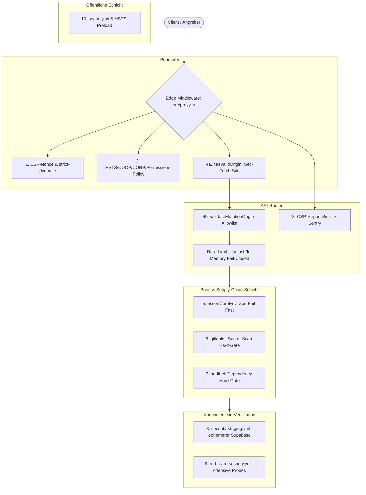

# 11 — Security Hardening (Kanonische Zusammenfassung)

> **Status:** 🟡 9 von 10 Säulen committed & funktionsfähig, 1 Säule live rot (aktualisiert 2026-08-30, ~17:45 UTC — Säule 9 hat seit dem ursprünglichen Stand einen bestätigten grünen CI-Lauf erhalten) · **Stand:** 2026-08-30 · **Owner:** Jan / LLM
> **Geltungsbereich:** Portable Einzeldatei-Zusammenfassung dieser Kategorie für den Transfer in Obsidian `_Brain`. Die kanonische, ausführliche Version mit vollem Kontext liegt in [`00_SECURITY_OVERVIEW.md`](./00_SECURITY_OVERVIEW.md) und den 10 Einzelmodulen. Anders als [`docs/auth/13_master_summary.md`](../auth/13_master_summary.md) (eine abgeschlossene „Executed“-Kategorie) beschreibt diese Zusammenfassung eine **Kategorie in aktiver Bewegung** — Zahlen und Live-Status können sich unmittelbar nach diesem Stand bereits geändert haben.

---

## 1 — Architektur-Übersicht



---

## 2 — Die 10 Härtungs-Säulen

| Säule  | Feature                            | Technische Implementierung                                          | Sicherheit & Schutzwirkung                                           | Status                                                                                                                                                                                                                                  | Detail-Nachweis                                                                |
| ------ | ---------------------------------- | ------------------------------------------------------------------- | -------------------------------------------------------------------- | --------------------------------------------------------------------------------------------------------------------------------------------------------------------------------------------------------------------------------------- | ------------------------------------------------------------------------------ |
| **1**  | **CSP `script-src`-Nonce**         | `crypto.randomUUID()` pro Request in `src/proxy.ts`                 | XSS-Payloads können ohne gültigen Nonce nicht ausgeführt werden      | 🟢 Committed                                                                                                                                                                                                                            | [`01_csp_script_hardening.md`](./01_csp_script_hardening.md)                   |
| **2**  | **Security-Header-Set**            | HSTS, X-Frame-Options, COOP, CORP, 21-Direktiven-Permissions-Policy | Clickjacking-, MIME-Sniffing- und ungenutzte-Feature-Schutz          | 🟢 Committed                                                                                                                                                                                                                            | [`02_security_headers.md`](./02_security_headers.md)                           |
| **3**  | **CSP-Violation-Reporting**        | `/api/internal/csp-report`, Sentry-Weiterleitung, Rate-Limit        | Macht reale Angriffsversuche/Fehlkonfigurationen sichtbar            | 🟢 Committed, 6/6 Tests                                                                                                                                                                                                                 | [`03_csp_violation_reporting.md`](./03_csp_violation_reporting.md)             |
| **4**  | **CSRF-/Origin-Guard**             | `hasValidOrigin()` (Edge) + `validateMutationOrigin()` (API)        | Blockiert Cross-Site-State-Änderungen                                | 🟢 8/8 Unit-Tests grün, Red-Team-Live-Probe seit `33324856360` (2026-08-30) bestätigt grün — **Hinweis:** `04_csrf_origin_guard.md` selbst trägt diesen Ausgang zum Zeitpunkt dieser Zusammenfassung noch nicht nach, siehe Abschnitt 6 | [`04_csrf_origin_guard.md`](./04_csrf_origin_guard.md)                         |
| **5**  | **Env-Fail-Fast**                  | `assertCoreEnv()`, Zod-Schema für 3 Kernvariablen                   | Kontrollierter Boot-Abbruch statt kryptischer Runtime-Fehler         | 🟢 Committed, 6 Testausführungen                                                                                                                                                                                                        | [`05_env_secrets_schema.md`](./05_env_secrets_schema.md)                       |
| **6**  | **Secret-Rotation & gitleaks**     | SOP mit Blast-Radius-Turnus + CI-Hard-Gate                          | Begrenzt Zeitfenster kompromittierter Secrets, verhindert neue Leaks | 🟢 CI 5/5 grün                                                                                                                                                                                                                          | [`06_secret_rotation_gitleaks.md`](./06_secret_rotation_gitleaks.md)           |
| **7**  | **Dependency-/Supply-Chain-Audit** | `audit-ci` + Allowlist + SBOM-Export                                | Blockiert Merges mit neuen High/Critical-Schwachstellen              | 🔴 Live rot (neue unallowlistete Funde)                                                                                                                                                                                                 | [`07_dependency_supply_chain_audit.md`](./07_dependency_supply_chain_audit.md) |
| **8**  | **Security-CI-Gate (Staging)**     | Ephemerer lokaler Supabase-Stack in CI                              | Kontinuierliche, automatisierte Invarianten-Verifikation             | 🟢 Letzter Lauf grün                                                                                                                                                                                                                    | [`08_security_ci_gates.md`](./08_security_ci_gates.md)                         |
| **9**  | **Red-Team-Probes**                | Rate-Limit-Bypass-, Admin-IDOR-, Target-Guard-Skripte               | Offensive Verifikation aus Angreiferperspektive                      | 🟢 Erster bestätigter grüner Lauf (`33324856360`, 2026-08-30) nach behobenem Host-Mismatch                                                                                                                                              | [`09_red_team_probes.md`](./09_red_team_probes.md)                             |
| **10** | **`security.txt` & HSTS-Preload**  | RFC 9116 Kontaktdatei, `.app`-TLD-HSTS                              | Koordinierte Offenlegung, Transport-Downgrade-Schutz                 | 🟢 Vorhanden                                                                                                                                                                                                                            | [`10_security_txt_hsts_preload.md`](./10_security_txt_hsts_preload.md)         |

---

## 3 — Sicherheits-Invarianten & Richtlinien

1. **Hard-Gate statt Soft-Warning:** `secret-scan.yml` und `dependency-audit.yml` laufen ohne `continue-on-error` — ein neuer, nicht allowlisteter Fund blockiert den Merge.
2. **Fail-Closed bei Infrastrukturausfall:** `enforceRateLimit()` liefert in Produktion `503`, wenn Upstash nicht erreichbar ist, statt stillschweigend durchzulassen.
3. **Keine Secret-Werte im Rotation-Log:** Nur Datum + Grund, niemals der Wert selbst. Rotation ist immer eine K5-Aktion.
4. **Jede Allowlist-Ausnahme braucht eine dokumentierte Begründung:** `.audit-ci.jsonc` und `.gitleaks.toml` verbieten stille Ausnahmen.
5. **Zwei unabhängige CSRF-Schichten sind Tiefenverteidigung, keine Redundanz:** Edge-Middleware (`Sec-Fetch-Site`-basiert) und API-Route-Ebene (explizite `APP_ORIGINS`-Allowlist) prüfen an unterschiedlichen Stellen mit unterschiedlicher Fehlertoleranz.

---

## 4 — Zentrale Code-Pfade & Komponenten

```
src/
├── proxy.ts                          # CSP-Nonce, Security-Header, Edge-Origin-Guard, Admin-Gate
├── lib/
│   ├── env.ts                        # assertCoreEnv() — Zod-Fail-Fast
│   └── security/
│       ├── origin-guard.ts           # hasValidOrigin() — Sec-Fetch-Site-basiert
│       ├── request-security.ts       # validateMutationOrigin(), enforceRateLimit()
│       └── admin.ts                  # isAdminEmail() — Fail-Closed-Allowlist
└── app/api/internal/csp-report/
    └── route.ts                      # CSP-Violation-Sink -> Sentry

scripts/red-team/
├── target-guard.ts                   # Verhindert Probes gegen echte Produktion
├── ephemeral-bootstrap.ts            # Wegwerf-Nutzer + Session-Cookies für CI
├── rate-limit-bypass.ts              # Rate-Limit-Contract-Probe
└── admin-idor.ts                     # Admin-IDOR-Probe

.github/workflows/
├── secret-scan.yml                   # gitleaks Hard-Gate
├── dependency-audit.yml              # audit-ci Hard-Gate + SBOM
├── security-staging.yml              # Ephemerer Supabase, Phase-1-Regression
└── red-team-security.yml             # Offensive Probes (workflow_dispatch)

.audit-ci.jsonc                       # Dependency-Allowlist mit Begründungen
.gitleaks.toml                        # Secret-Scan-Allowlist (nur bekannte Platzhalter)
public/.well-known/security.txt       # RFC 9116 Disclosure-Kontakt
xx_sop/14_secret_rotation.md          # Rotationsturnus nach Blast-Radius
xx_docs/13_secret_rotation_log.md     # Rotations-Fälligkeits-Log (nur Datum, nie Wert)
```

---

## 5 — Testabdeckung & Verifikation (Stand 2026-08-30, ~17:45 UTC)

- **`origin-guard.test.ts`:** 8/8 Tests grün.
- **`env.test.ts`:** 4 Testfälle, 6 tatsächliche Testausführungen (1 parametrisiert über 3 Keys), alle grün.
- **`csp-report-route.test.ts`:** 6/6 Tests grün.
- **`proxy-security-headers.test.ts`:** 3 Testfälle (Header-Vollständigkeit, CSP-Direktiven, PostHog-Exact-Host-Scoping) — ergänzt, weil zuvor fälschlich behauptet wurde, es gäbe kein Test-File für die CSP-Konstruktion (korrigiert in `01`).
- **`proxy-routing.test.ts`:** deckt u. a. `isPublicRoute('/.well-known/security.txt') === true` ab — ergänzt, weil zuvor fälschlich behauptet wurde, `security.txt` habe keine Testabdeckung (korrigiert in `10`).
- **CI-Gates live (`gh run list`, zuletzt geprüft 2026-08-30 ~17:45 UTC):** `Secret scan` 5/5 grün · `Security staging regression` 3/3 grün (`33323199618`, `33324311550`, `33324850543`) · `Dependency audit` **weiterhin live rot** (5 High-Funde in frischem `npm ci`, 3 nicht allowlistet) · `Security red team probes` **erster bestätigter grüner Lauf** (`33324856360`) nach vorherigen 5 roten Läufen.
- **Nicht Teil dieser Verifikation:** Produktions-Deploy-Stand (`curl -I https://casino-xi-six.vercel.app`) — außerhalb des Scopes dieser reinen Dokumentationsaufgabe, siehe [`00_SECURITY_OVERVIEW.md`](./00_SECURITY_OVERVIEW.md).

---

## 6 — Bekannte, bewusst offen gelassene Inkonsistenz

Diese Datei wurde im Rahmen einer gezielten Überarbeitung von `01`, `03`, `05`, `06`, `08`, `09`, `10` und dieser Datei selbst aktualisiert — `00_SECURITY_OVERVIEW.md`, `02_security_headers.md`, `04_csrf_origin_guard.md` und `07_dependency_supply_chain_audit.md` waren **nicht** Teil dieser Runde. Konkret bekannt:

- `04_csrf_origin_guard.md` Abschnitt 4 trägt den in dieser Zusammenfassung bereits vermerkten grünen Red-Team-Ausgang noch nicht nach.
- `00_SECURITY_OVERVIEW.md` Zeile 9 (Red-Team-Probes) und die dortige Warnung über eine „live laufende Debugging-Session“ sind ebenfalls veraltet.

Vor der nächsten Verwendung dieser Dateien als alleinige Quelle: gegen diese Datei (`11`) und `09_red_team_probes.md` abgleichen.
