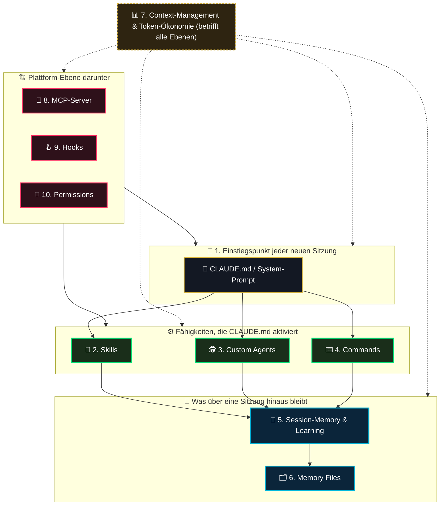
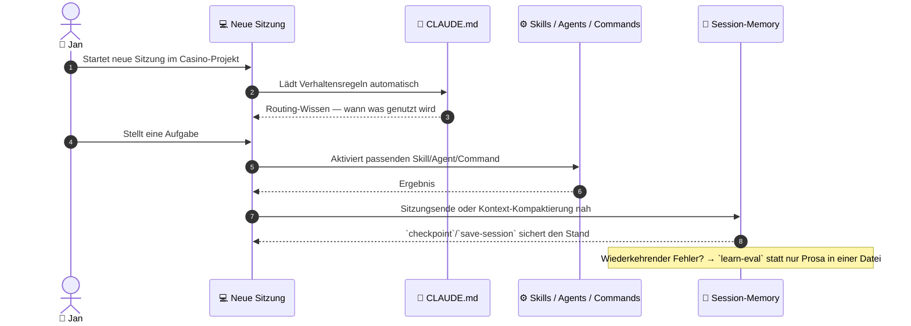

# 00 — Claude-Code-Skill-Erweiterung (Master-Übersicht)

> **Status:** 🟢 Vollständig aufgeschlüsselt · **Stand:** 2026-08-30 · **Owner:** Jan / LLM
> **Zweck:** Zentrale Übersicht für Jans persönliche Skill-Erweiterung im Umgang mit Claude Code selbst — nicht das Casino-Produkt. Das Casino-Projekt ist dabei die praktische Übungsgrundlage („Grundlage mit verschiedenen Bereichen"), an der die einzelnen Kategorien konkret angewendet werden. Jede Kategorie hat ihre eigene(n) Detaildatei(en); hier steht nur, was es gibt, wie es zusammenhängt und wo Jan aktuell steht.
>
> **Hinweis zur Einordnung:** Backlog-/Verweis-Datei, keine Plan-Datei im Sinne von `xx_sop/03_workflow_jan_planungsdateien.md` §1 — analog zur Rolle von `worldmap/00_WORLDMAP_STATUS.md` für das Gesamtprojekt: Reihenfolge und Verweise, keine Doppelpflege von Inhalten.

---

## 1 — Executive Summary für Jan: Die Kategorien im Überblick

Claude Code besteht aus mehreren zusammenspielenden Bausteinen. Fünf davon kanntest du schon (CLAUDE.md, Skills, Agents, Commands, Session-Memory); fünf weitere habe ich ergänzt, weil sie zum vollständigen Bild dazugehören. **Auf deinen ausdrücklichen Wunsch (2026-08-30)** ist die Niveau-Spalte jetzt erstmals von der LLM eingeschätzt — mit Beleg, in einer eigenen Unterkategorie-Datei je Kategorie, analog zur bereits etablierten Methodik in `worldmap/00_WORLDMAP_STATUS.md`. Skala wie dort: **Top 1 % = Weltklasse**, **Top 100 % = schlechtestes Viertel** unter vergleichbaren Hobby-/Indie-Setups, die Claude Code aktiv nutzen. Jeder Wert ist ein rechnerischer Schnitt über bis zu 10 einzeln belegte Unterkategorien in der jeweiligen Detaildatei — nicht geraten.

|  #  | Kategorie                                | Gewichtung | Was ist das? (kinderleicht)                                                                                                               | Ordner/Herkunft                                                                               |               Niveau (LLM-Einschätzung, Beleg in Detaildatei)                |
| :-: | :--------------------------------------- | :--------: | :---------------------------------------------------------------------------------------------------------------------------------------- | :-------------------------------------------------------------------------------------------- | :--------------------------------------------------------------------------: |
|  1  | **CLAUDE.md / System-Prompt**            |  **20 %**  | Die Verhaltensregeln, die am Anfang jeder Unterhaltung automatisch „vorgelesen" werden.                                                   | `CLAUDE.md`, `AGENTS.md` im Projekt                                                           |                                 **Top 8 %**                                  |
|  2  | **Skills**                               |  **10 %**  | Fertige „Rezepte", die Claude Code auf Zuruf oder automatisch anwendet (z. B. ein Code-Review-Ablauf).                                    | Globale Skill-Sammlung (nicht im Casino-Ordner)                                               |                                 **Top 59 %**                                 |
|  3  | **Custom Agents (Subagents)**            |  **10 %**  | Spezial-Helfer für einzelne Teilaufgaben, die eigenständig arbeiten (z. B. ein Sicherheits-Check nur für Datenbank-Änderungen).           | `.claude/agents/` im Projekt                                                                  |                                 **Top 20 %**                                 |
|  4  | **Commands & Workflow-Automatisierung**  |  **8 %**   | Feste Kurzbefehle für wiederkehrende Aufgaben im Projekt (statt jedes Mal alles neu zusammenzusuchen).                                    | `package.json`-Scripts, `xx_docs/02_command_reference.md`                                     |                                 **Top 45 %**                                 |
|  5  | **Session-Memory & Continuous Learning** |  **12 %**  | Ob dafür gesorgt ist, dass zwischen Sitzungen nichts verloren geht und aus wiederkehrenden Fehlern gelernt wird.                          | Verhalten, das `CLAUDE.md` vorschreiben müsste                                                |                                 **Top 60 %**                                 |
|  6  | **Memory Files**                         |  **5 %**   | Die konkreten Notizen, die sich Claude Code von sich aus über frühere Gespräche zu diesem Projekt merkt — die Dateien hinter Kategorie 5. | `C:\Users\hambu\.claude\projects\V--VibeCoding-Casino\memory\` (außerhalb des Projektordners) |                                 **Top 55 %**                                 |
|  7  | **Context-Management & Token-Ökonomie**  |  **10 %**  | Wie viel vom „Gedächtnis-Platz" pro Sitzung wofür draufgeht — betrifft alle anderen Kategorien gleichzeitig.                              | Sichtbar über den `/context`-Befehl                                                           |                                 **Top 48 %**                                 |
|  8  | **MCP-Server & externe Programme**       |  **7 %**   | Extern angebundene Zusatzprogramme wie Notion, GitHub, Figma, Gmail, die Claude Code nutzen kann.                                         | Account-/Maschinen-Einrichtung, nicht im Projektordner                                        |                                 **Top 51 %**                                 |
|  9  | **Hooks & Automatisierungs-Trigger**     |  **8 %**   | Regeln, die automatisch bei bestimmten Ereignissen auslösen (z. B. „vor jedem Werkzeug-Aufruf erst X prüfen").                            | `settings.json` (projekt- oder account-weit)                                                  | **Top 68 %** (nachbewertet 2026-09-05: 4 Hooks aktiv, siehe `01_9_hooks.md`) |
| 10  | **Permissions & Auto-Allow-Policy**      |  **10 %**  | Welche Aktionen automatisch erlaubt sind und welche erst bestätigt werden müssen.                                                         | `CLAUDE.md` „Auto-Allow & Execution Policy", `.claude/settings.local.json`                    |                                 **Top 55 %**                                 |

**Rechnerischer Schnitt über alle 10 Kategorien: (8+59+20+45+60+55+48+51+68+55)/10 = Top 47 %** (vorher Top 49 % mit dem veralteten Hooks-Wert).

**Gewichteter Schnitt (Niveau × Gewichtung, ergänzt 2026-09-05 auf Jans Wunsch): (8·0,20 + 59·0,10 + 20·0,10 + 45·0,08 + 60·0,12 + 55·0,05 + 48·0,10 + 51·0,07 + 68·0,08 + 55·0,10) = Top 42 %.** Der gewichtete Wert ist **besser** als der ungewichtete, weil die stärkste Kategorie (CLAUDE.md, Top 8 %) die höchste Gewichtung trägt und die schwächsten (Hooks, Permissions) nur 8–10 % wiegen — das System ist real stärker, als der flache Schnitt aussagt.

### Gewichtslogik (grobe Begründung, bewusst nicht feiner)

Die Gewichtung bewertet **wie viel jeder Kategorie für Jans konkretes Ziel schadet, wenn sie schlecht ist** — nicht ihre generische Wichtigkeit. Drei Faustregeln: (a) wirkt sie in **jeder** Sitzung automatisch, bekommt sie hohes Gewicht (CLAUDE.md 20 %); (b) entscheidet sie über **Ergebnisqualität oder Lerneffekt** der Projektarbeit, mittleres Gewicht (Session-Memory 12 %, Skills/Agents/Context/Permissions je 10 %); (c) ist sie **Plattform-Hygiene oder Reserve**, niedriges Gewicht (Memory Files 5 %, MCP 7 %, Commands/Hooks 8 % — Hooks sind ein Durchsetzungs-Layer für Regeln, die ohne sie trotzdem über Prosa wirken; Commands sind Schreibarbeit, kein Denken). Das ist eine grobe, aber offen gelegte Schätzung — wenn Jan einzelne Gewichte anders sieht, ändert sich nur die Spalte, nicht die Detaildateien.

### 1a — Bottleneck-Ranking (schlechtestes zuerst — das ist deine Prioritätenliste)

| Rang | Kategorie                                    |               Niveau               | Größter Einzelbefund                                                                                                                                                                                                                                                                              |
| :--: | :------------------------------------------- | :--------------------------------: | :------------------------------------------------------------------------------------------------------------------------------------------------------------------------------------------------------------------------------------------------------------------------------------------------ |
|  1   | **9 — Hooks & Automatisierungs-Trigger**     | Top 68 % (nachbewertet 2026-09-05) | Bis 2026-08-30 0 konfigurierte Hooks (größter Einzel-Bottleneck) — seitdem **4 Hooks aktiv** (1× PreToolUse, 1× PostToolUse, 2× Stop); Rest-Bottleneck: 24 unverbundene Hook-Definitionen in `hooks.json` + weiterhin 0 `SessionStart`-Hooks (`hooks/01_hooks_active_audit.md` 🟡 wartet auf Jan) |
|  2   | **5 — Session-Memory & Continuous Learning** |              Top 60 %              | Kein Handoff-/Kompaktierungs-Protokoll in `CLAUDE.md`; Lösung liegt fertig vor (`01_5_session_memory.md`), wartet auf Jans A/B/C-Entscheidung                                                                                                                                                     |
|  3   | **2 — Skills**                               |              Top 59 %              | 0 projekteigene Skills trotz 150+ verfügbarer globaler Skills                                                                                                                                                                                                                                     |
|  4   | **6 — Memory Files**                         |              Top 55 %              | 2 von 4 vorgesehenen Memory-Typen (`user`, `reference`) haben 0 Einträge trotz 836 Sitzungsstarts                                                                                                                                                                                                 |
|  4   | **10 — Permissions & Auto-Allow-Policy**     |              Top 55 %              | Projekt-Allow-List unstrukturiert gewachsen, inkl. toter Pfade auf einen nicht mehr existierenden Benutzer                                                                                                                                                                                        |
|  6   | **8 — MCP-Server & externe Programme**       |              Top 51 %              | ≈ 15–16 Account-weite MCP-Server ohne projektbezogene Begründung, plus tote Permission-Einträge                                                                                                                                                                                                   |
|  7   | **7 — Context-Management & Token-Ökonomie**  |              Top 48 %              | Kein dokumentiertes Kontext-Budget-Protokoll in `CLAUDE.md` (Baustein E fertig, nicht freigegeben)                                                                                                                                                                                                |
|  8   | **4 — Commands & Workflow-Automatisierung**  |              Top 45 %              | `CLAUDE.md` kennt 5 von 25 `package.json`-Scripts                                                                                                                                                                                                                                                 |
|  9   | **3 — Custom Agents (Subagents)**            |              Top 20 %              | 2 von 3 gebauten Agenten weiterhin ohne `CLAUDE.md`-Router-Zeile — inzwischen aber evaluiert (20/20 Läufe ✅, 2026-08-30); `casino-code-explorer` ist Pilot, `casino-residue-scout` Draft (3 reale Prüfungen offen); Router-Zeilen bleiben Jan-Pflicht                                            |
|  10  | **1 — CLAUDE.md / System-Prompt**            |              Top 8 %               | Stärkste Kategorie — Restlücken sind vollständig als fertige, unfreigegebene Bausteine A–E dokumentiert                                                                                                                                                                                           |

### 1b — Hebel-Ranking (Niveau × Gewichtung — wohin die nächste Stunde am meisten bringt)

Das Bottleneck-Ranking oben sortiert nach rohem Niveau. Mit der neuen Gewichtungsspalte entsteht eine zweite, genauere Sicht: **Verbesserungshebel = Niveau × Gewicht** (hoch = schlechtes Niveau trifft auf hohe Bedeutung). Nach diesem Maßstab lohnt sich Arbeit in dieser Reihenfolge am meisten:

| Rang | Kategorie                  |  Niveau  | Gewicht |  Hebel  |
| :--: | :------------------------- | :------: | :-----: | :-----: |
|  1   | **5 — Session-Memory**     | Top 60 % |  12 %   | **720** |
|  2   | **2 — Skills**             | Top 59 % |  10 %   | **590** |
|  3   | **10 — Permissions**       | Top 55 % |  10 %   | **550** |
|  4   | **9 — Hooks**              | Top 68 % |   8 %   | **544** |
|  5   | **7 — Context-Management** | Top 48 % |  10 %   | **480** |
|  6   | **4 — Commands**           | Top 45 % |   8 %   | **360** |
|  7   | **8 — MCP-Server**         | Top 51 % |   7 %   | **357** |
|  8   | **6 — Memory Files**       | Top 55 % |   5 %   | **275** |
|  9   | **3 — Custom Agents**      | Top 20 % |  10 %   | **200** |
|  10  | **1 — CLAUDE.md**          | Top 8 %  |  20 %   | **160** |

**Kernunterschied zum Bottleneck-Ranking:** Custom Agents (Rang 9 im Bottleneck-Ranking, weil Niveau schon Top 20 %) fallen im Hebel-Ranking fast ans Ende — der große Teil der Verbesserung ist dort bereits geleistet. Umgekehrt rückt Session-Memory klar auf Platz 1: mittelmäßiges Niveau trifft auf die zweithöchste Gewichtung. Die beiden Listen sagen dieselbe Geschichte mit unterschiedlicher Schärfe — **für die Reihenfolge der nächsten Arbeitsschritte zählt das Hebel-Ranking, nicht das Bottleneck-Ranking.**

---

## 2 — Grafik: Wie die Kategorien zusammenhängen

### Grafik: Eine Sitzung von Start bis Ende

---

## 3 — Rahmenbedingungen

> [!NOTE] **Zweck dieses Ordners**
> Diese Sammlung dient in erster Linie Jans persönlicher Skill-Erweiterung im Umgang mit Claude Code — das Casino-Projekt ist die praktische Übungsgrundlage, nicht Selbstzweck. Ergebnisse können später in andere VibeCoding-Projekte übertragen werden.

> [!TIP] **Kategorien 6–10 sind Vorschläge**
> Von der LLM ergänzt, weil sie zum vollständigen Bild von „Claude Code beherrschen" dazugehören — keine davon ist verpflichtend. Wirf raus, was für dich nicht relevant ist.

> [!TIP] **Niveau-Spalte jetzt gefüllt (2026-08-30, auf deinen expliziten Wunsch)**
> Bis 2026-08-29 bewusst leer (nur deine eigene Einschätzung). Am 2026-08-30 hast du die LLM explizit gebeten, alle 10 Kategorien nach demselben Top-1-%-bis-Top-100-%-Schema wie `worldmap/00_WORLDMAP_STATUS.md` einzuschätzen, in eigene Unterkategorie-Dateien aufzuschlüsseln und Bottlenecks zu identifizieren. Jeder Wert ist ein Beleg-gestützter, rechnerischer Schnitt — keine Bauchgefühl-Schätzung. Deine eigene Einschätzung bleibt jederzeit willkommen und kann von der LLM-Zahl abweichen.

---

## 3a — Vollständigkeits-Check: Fehlt eine 11. Kategorie? (2026-08-30)

Auf Jans Wunsch geprüft, bevor die Detaildateien erstellt wurden: Deckt der Katalog wirklich alle relevanten Claude-Code-Bausteine ab, oder fehlt etwas? Geprüft gegen die volle Werkzeug-/Fähigkeiten-Liste dieser Sitzung (Cron/`ScheduleWakeup`, `EnterPlanMode`/`ExitPlanMode`, Worktrees, Teams/`SendMessage`/`ListAgents`, Artifacts, Checkpoints/Rewind, Statusline/Voice/Remote-Control, Plugins).

**Ergebnis: Die 10 Kategorien sind vollständig — keine 11. Top-Level-Kategorie nötig.** Folgende Kandidaten wurden geprüft und bewusst als **Unterkategorie einer bestehenden Kategorie** eingeordnet statt als eigene Zeile:

| Kandidat                                                        | Eingeordnet unter                                 | Warum keine eigene Kategorie                                                                                                                                         |
| :-------------------------------------------------------------- | :------------------------------------------------ | :------------------------------------------------------------------------------------------------------------------------------------------------------------------- |
| Plan Mode (`EnterPlanMode`/`ExitPlanMode`)                      | Kategorie 4 (Commands & Workflow-Automatisierung) | Ist ein Ausführungsmodus für Aufgaben, kein eigenständiger Wissensspeicher — passt konzeptionell zu „wie Aufgaben abgearbeitet werden"                               |
| Worktrees (`EnterWorktree`/`ExitWorktree`)                      | Kategorie 4                                       | Isolations-Mechanik für Workflows, kein eigenes Konzept                                                                                                              |
| Cron/Scheduled Tasks/Loop                                       | Kategorie 9 (Hooks & Automatisierungs-Trigger)    | Passt wörtlich zum Kategorienamen „Automatisierungs-Trigger" — bereits als Unterkategorie #7 in `01_9_hooks.md` geführt                                              |
| Teams/Multi-Session-Orchestrierung (`SendMessage`/`ListAgents`) | Kategorie 3 (Custom Agents/Subagents)             | Verwandtes Konzept (Delegation), aber für Casino aktuell 0 Nutzung nachweisbar — als Randnotiz statt eigener Kategorie geführt, um keine leere Kategorie zu erzeugen |
| Checkpoints/Rewind                                              | Kategorie 5 (Session-Memory)                      | Bereits als konkreter Lösungsbaustein in `01_5_session_memory.md` Abschnitt 3.1 behandelt (`checkpoint`-Skill)                                                       |
| Plugins (Packaging)                                             | Kategorie 2 (Skills)                              | Laut `skills/13_skill_worldclass_creation.md` Abschnitt 2 selbst als „Reifegrad 5" eines Skills definiert, kein eigenständiges Konzept                               |
| Statusline/Voice-Mode/Remote-Control                            | Keine — bewusst außerhalb des Scopes              | Reine Bedienoberflächen-/Ergonomie-Features ohne Bezug zu „wie gut nutzt Jan Claude Code für Projektarbeit"; würden die Übersicht ohne Lerneffekt aufblähen          |
| Artifacts                                                       | Keine — bewusst außerhalb des Scopes              | Chat-Produkt-Feature für visuelle Deliverables, nicht Teil des agentischen Coding-Workflows an diesem Next.js/Supabase-Projekt                                       |

---

## 4 — Modul-Navigator: Bereits vorhandene Detaildateien

Alle 10 Kategorien haben jetzt mindestens eine Detaildatei nach dem einheitlichen Schema `01_<Kategorienummer>_<Kategoriename>.md` (Umbenennung/Neuanlage am 2026-08-30).

| Datei                                                                                                | Kategorie              | Typ                           | Primärer Fokus                                                                                                                                                                                 |
| :--------------------------------------------------------------------------------------------------- | :--------------------- | :---------------------------- | :--------------------------------------------------------------------------------------------------------------------------------------------------------------------------------------------- |
| [`01_1_claude_md.md`](01_1_claude_md.md)                                                             | 1 — CLAUDE.md          | Master-Matrix                 | 10-Dimensionen-Ist-Audit von `CLAUDE.md` (umbenannt von `01_claude_md_worldclass_optimization.md`)                                                                                             |
| [`01_2_skills.md`](01_2_skills.md)                                                                   | 2 — Skills             | Sub-Kategorie-Aufschlüsselung | 10 Unterkategorien, Ist-Nutzungsnachweis für Casino (neu)                                                                                                                                      |
| [`01_3_custom_agents.md`](01_3_custom_agents.md)                                                     | 3 — Custom Agents      | Deep-Dive                     | Subagent-Lifecycle, Pilot-Evaluierung, Router-Sichtbarkeit (umbenannt von `01_7_subagent.md`)                                                                                                  |
| [`01_4_command_workflow.md`](01_4_command_workflow.md)                                               | 4 — Commands           | Deep-Dive                     | Command- & Workflow-Automatisierung, Scoped-Tests, CI-Parität (umbenannt von `01_6_command.md`)                                                                                                |
| [`01_5_session_memory.md`](01_5_session_memory.md)                                                   | 5 — Session-Memory     | Deep-Dive                     | Handoff-Protokoll, Fehler-Pattern-Lernen, Options-Gate (umbenannt von `01_8_session_memory.md`)                                                                                                |
| [`01_6_memory_files.md`](01_6_memory_files.md)                                                       | 6 — Memory Files       | Sub-Kategorie-Aufschlüsselung | 10 Unterkategorien, korrigiert den 2026-08-29-Zwischenstand (neu)                                                                                                                              |
| [`01_7_context_management.md`](01_7_context_management.md)                                           | 7 — Context-Management | Sub-Kategorie-Aufschlüsselung | 10 Unterkategorien, Querschnitts-Verweise statt Doppelmessung (neu)                                                                                                                            |
| [`01_8_mcp_server.md`](01_8_mcp_server.md)                                                           | 8 — MCP-Server         | Sub-Kategorie-Aufschlüsselung | 10 Unterkategorien, Abgrenzung zu `02_mcp.md` (neu)                                                                                                                                            |
| [`01_9_hooks.md`](01_9_hooks.md)                                                                     | 9 — Hooks              | Sub-Kategorie-Aufschlüsselung | 8 Unterkategorien, Abgrenzung zu Git-Hooks/Husky (neu)                                                                                                                                         |
| [`01_10_permissions.md`](01_10_permissions.md)                                                       | 10 — Permissions       | Sub-Kategorie-Aufschlüsselung | 8 Unterkategorien, Allow-List-Hygiene (neu)                                                                                                                                                    |
| [`agents/12_workflow_agent_creation.md`](agents/12_workflow_agent_creation.md)                       | 3 — Custom Agents      | Registry & Scorecard          | Generalisierte 10-Kategorien-Rubric mit Punktzahl je Agent; Kandidaten-Registrierung & Governance (löst die am 2026-08-30 gelöschte Kandidaten-Datei `11_agenten_kandidaten_evaluation.md` ab) |
| [`agents/13_agent_registry_ergebnis_2026-08-30.md`](agents/13_agent_registry_ergebnis_2026-08-30.md) | 3 — Custom Agents      | Ergebnisbericht               | IST→NEU-Scores aller 3 Agenten, Governance-Entscheidungen (#14/#20 gelöscht), Pilot-Evaluierung 11/31 (20/20 ✅) — Prüfbericht für Jan                                                         |
| [`skills/13_skill_worldclass_creation.md`](skills/13_skill_worldclass_creation.md)                   | 2 — Skills             | Deep-Dive                     | Skill-Erstellung auf Weltklasse-Niveau                                                                                                                                                         |
| [`benchmarks/01_llm_benchmark_uebersicht.md`](benchmarks/01_llm_benchmark_uebersicht.md)             | — (Querschnitt)        | Lernreferenz                  | Modellunabhängige Benchmark-Einordnung                                                                                                                                                         |

> **Hinweis: parallele Sitzung (2026-08-30) — inzwischen aufgelöst.** Während dieser Aufschlüsselung liefen sichtbare, zeitgleiche Änderungen an `.claude/agents/`, `t_claude_code/agents/11_agenten_kandidaten_evaluation.md` und `t_claude_code/agents/12_workflow_agent_creation.md` (u. a. Umbenennung `casino-cleanup-residue-finder` → `casino-residue-scout`, Aufbau einer 10-Kategorien-Agenten-Rubric). Die dort zunächst bestehende Diskrepanz — `12` §1 behielt die Kandidaten-Datei als existierend, sie war aber noch auf der Festplatte — wurde im selben Tag aufgelöst: **`11_agenten_kandidaten_evaluation.md` ist jetzt tatsächlich gelöscht**, ihre Governance liegt vollständig in `agents/12_workflow_agent_creation.md` §2.

---

## 5 — Offener Punkt: `CLAUDE.md` verweist noch auf einen umbenannten Dateinamen

`CLAUDE.md` Abschnitt „Session-Kontinuität" (letzte Zeile) lautet aktuell: „Neue Fehler-Pattern-Datei-Klasse nicht ohne Freigabe — offen in `01_8_session_memory.md` §4a." Die Datei heißt seit dieser Aufschlüsselung `01_5_session_memory.md`. Da `CLAUDE.md` laut projektweiter Hard Rule ausschließlich von Jan selbst und nur nach ausdrücklicher Freigabe im laufenden Chat editiert werden darf, wurde dieser Verweis **bewusst nicht** mit angepasst. Einzeiliger manueller Fix, sobald Jan möchte: `01_8_session_memory.md` → `01_5_session_memory.md` in genau dieser einen Zeile.

## 6 — Pflegehinweis

Diese Datei nur um **neue Kategorien**, **Statuswechsel** oder **neue Detaildateien im Modul-Navigator** ergänzen, nie Inhalte aus den Detaildateien hierher kopieren (Prinzip aus `xx_sop/03` §2: keine Referenz doppelt pflegen).
