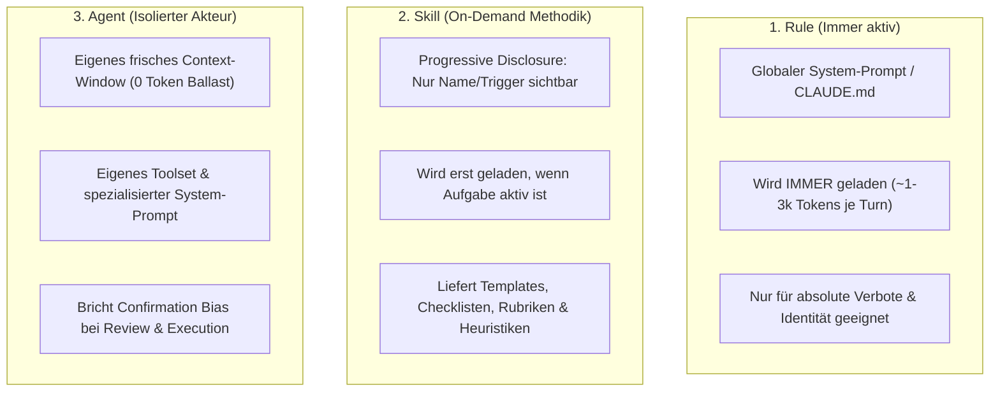

# 01 — LLM Workflow SOPs Architecture (Option-Gate · Execution · Planungsdateien)

> **Status:** 🟢 Executed / Vollständig aktiv · **Stand:** 2026-09-05 · **Owner:** Jan / LLM · **Scope:** Multi-Repo-Standardisierung der drei Kern-SOPs via Global Skills, spezialisierte Agenten und lokale Projekt-Adapter.

---

## 1 — Management Summary (Für Jan)

### 1.1 Kernaussage & Kernentscheidung
Wir trennen **Methodik (Global Skills)** strikt von **Ausführungsumgebung (Agenten/Sessions)** und **lokalem Kontext (Projekt-Adapter SOPs)**:
1. **Methodik gehört in SKILLS (`.claude/skills/` bzw. `_Brain/skills/`):**
   Skills sind verfahrensbasiert, token-effizient (Progressive Disclosure) und definieren das exakte Regelwerk für Option-Gates, Planungsdateien und Verifikation.
2. **Ausführung gehört in dedizierte AGENTEN / frische SESSIONS:**
   Um Confirmation Bias und Kontext-Rotting zu eliminieren, wird die Ausführung (Execution) an einen isolierten Agenten bzw. eine neue Konversation übergeben.
3. **Lokale SOPs (`xx_sop/01`, `02`, `03`) werden schlanke ADAPTER (~20 Zeilen):**
   Sie verlinken den globalen Skill und definieren nur noch projektspezifische Parameter (z. B. Casino: `Money-Pfad`, Supabase RPCs; Redate: `Audio-Latency`, Python/FastAPI).

### 1.2 Die 3 Kern-SOPs im neuen Zielzustand

| SOP | Typ im Zielzustand | Zentraler Speicherort | Lokale Aufgabe im Projekt-Repo |
|---|---|---|---|
| **01 — Option-Gate** | **Global Skill** (`skill-jan-option-gate`) | `v:/VibeCoding/.claude/skills/jan-option-gate/` | Definiert projektspezifische Bewertungs-Schwerpunkte & Nicht-Scopes |
| **03 — Planungsdateien** | **Global Skill** (`skill-jan-planner`) | `v:/VibeCoding/.claude/skills/jan-planner/` | Definiert lokale Pfade (`worldmap/`, Archiv), Gates (`Money-Pfad`) |
| **02 — Execution** | **Agent + Verifier Skill** (`skill-jan-execution`) | `v:/VibeCoding/.claude/skills/jan-execution/` | Definiert lokale Test-Befehle (`npm test`, `typecheck`, `build`) |

---

## 2 — Phasen- & Schritteübersicht (Status Quo für Jan)

> **Live-Tracking:** Diese Übersicht zeigt jederzeit auf einen Blick den exakten Stand der Umsetzung aller Subschritte, Zuständigkeiten und nächsten Aktionen.

| Phase / Meilenstein | Subkategorie / Arbeitsschritt | Status | Zuständigkeit | Beschreibung & Ergebnis |
|---|---|:---:|:---:|---|
| **M1: Zentrale Skills** | **M1.1: Option-Gate Skill** | 🟢 Erledigt | LLM | `jan-option-gate/SKILL.md` in `v:\VibeCoding\.claude\skills\` erstellt. Standard 30/25/25/20, Pre-Mortem, 30s-Tabelle. |
| | **M1.2: Planer Skill** | 🟢 Erledigt | LLM | `jan-planner/SKILL.md` in `v:\VibeCoding\.claude\skills\` erstellt. 10 Subkategorien (Top 1%–100%), 100% LLM, Template. |
| | **M1.3: Execution Skill** | 🟢 Erledigt | LLM | `jan-execution/SKILL.md` in `v:\VibeCoding\.claude\skills\` erstellt. 5-Stufen-DoD (Typecheck, Test, Lint, Build, Diff). |
| **M2: Junction & Git** | **M2.1: `.gitignore` Absicherung** | 🟢 Erledigt | LLM | `xx_sop/shared/` in `Casino/.gitignore` eingetragen. Git ignoriert Junction 100%. |
| | **M2.2: Directory Junction** | 🟢 Erledigt | LLM | `mklink /J "Casino\xx_sop\shared" ".claude\skills"` erfolgreich gesetzt. |
| | **M2.3: Dateizugriffs-Test** | 🟢 Erledigt | LLM | Dateizugriff über `xx_sop/shared/...` verifiziert (0 Popups, transparente Kernel-Auflösung). |
| **M3: Casino-Adapter** | **M3.1: Adapter Option-Gate** | 🟢 Erledigt | LLM | `Casino/xx_sop/01_workflow_jan_option_gate.md` verschlankt auf ~25 Zeilen mit Link auf zentralen Skill. |
| | **M3.2: Adapter Execution** | 🟢 Erledigt | LLM | `Casino/xx_sop/02_workflow_jan_execution.md` verschlankt auf lokale Testbefehle (5-Stufen-DoD) & RPC-Review. |
| | **M3.3: Adapter Planungsdatei** | 🟢 Erledigt | LLM | `Casino/xx_sop/03_workflow_jan_planungsdateien.md` verschlankt auf lokale Pfade & Casino-`Money-Pfad`-Gate. |
| **M4: Multi-Repo** | **M4.1: 1-Klick Setup-Skript** | 🟢 Erledigt | LLM | `v:\VibeCoding\setup-shared-sop.ps1` erstellt & mit Testlauf erfolgreich verifiziert. |
| | **M4.2: Rollout-Dokumentation** | 🟢 Erledigt | LLM | Vollständige Anleitung für 1-Klick-Anbindung von `Redate.ai` und `Regen` hinterlegt. |

---

## 3 — Tiefen-Recherche: Skills vs. Agenten vs. Rules

### 2.1 Konzeptionelle Abgrenzung



### 2.2 Detaillierte Entscheidungsmatrix: Wann Skill, wann Agent?

| Kriterium | Rule (`CLAUDE.md`) | Skill (`SKILL.md`) | Subagent / Neuer Chat (`agent.md`) |
|---|---|---|---|
| **Ladezeitpunkt** | Bei jedem Prompt (Permanent) | Bei Trigger / On-Demand | Bei explizitem Delegations-Aufruf |
| **Token-Overhead** | Sehr hoch (Dauerlast) | **Nahezu 0** (nur bei Bedarf) | Isoliert (belastet Haupt-Chat nicht) |
| **Confirmation Bias** | Kann Bias nicht brechen | Kann Bias nicht brechen | **Bricht Bias vollständig** |
| **Hauptzweck** | Invarianten (z. B. Zero-Wallet-Autorität) | **Verfahren, Templates, Rubriken** | **Komplexe Ausführung & unvoreingenommener Audit** |
| **Urteil für unsere 3 SOPs** | ❌ Ungeeignet (zu viel Text) | 🟢 **Perfekt für SOP 01, 02, 03** | 🟢 **Perfekt für die Übergabe in SOP 02** |

**Ergebnis:** 
* **Option-Gate (01)** und **Planungsdateien (03)** sind **Skills**, weil sie strukturierte Vorlagen, Heuristiken und Schemata liefern, die jedes Modell anwenden muss.
* **Execution (02)** nutzt einen **Skill** (für die strikte 5-Stufen-DoD-Prüfung), wird aber bevorzugt von einem **frischen Agenten / separatem Modell** ausgeführt.

---

## 3 — Architektur der 3 Core-Workflows

---

### 3.1 Workflow 1: Jan Option-Gate (`01`)

#### Rolle des globalen Skills: `skills/jan-option-gate/SKILL.md`
* **Trigger:** Vor Architekturentscheidungen, Framework-Auswahlen, Migrationsschritten oder größeren Refactorings.
* **Universelle Logik:**
  1. Standard-Kriterien: `Lerneffekt 30 % · Aufwand 25 % · Risiko 25 % · Wartbarkeit 20 %`.
  2. Erzwingt genau 3 distinkte Optionen auf echten Trade-off-Achsen (keine künstliche Aufwands-Leiter, keine Strohmänner).
  3. Pre-Mortem-Pflicht für die Führungsoption: *"Scheitert diese Option in 6 Monaten, woran läge es?"*
  4. 30-Sekunden-Vergleichstabelle mit A/B/C-Labels.
  5. **Harter Stopp:** Keine Code-Edits vor Jans expliziter Wahl.

#### Lokaler Adapter im Projekt (`xx_sop/01_workflow_jan_option_gate.md`)
```markdown
# 01 — Workflow-Jan Option-Gate (Projekt-Adapter)

> **Basis-Skill:** 🔗 `v:/VibeCoding/.claude/skills/jan-option-gate/SKILL.md`

## Projekt-Spezifische Anpassungen
* **Schwerpunkt-Gewichtung:** Wenn Krypto-/Geldpfade berührt werden, erhöht sich Kriterium "Risiko" auf 40 %.
* **Verbotene Optionen:** Client-Authoritative Lösungen sind von vornherein ungültig.
```

---

### 3.2 Workflow 2: Jan Planungsdateien (`03`)

#### Rolle des globalen Skills: `skills/jan-planner/SKILL.md`
* **Trigger:** Vor der Umsetzung von Features, Refactorings oder Härtungsmaßnahmen.
* **Universelle Logik (Das 3-Ebenen-System):**
  1. **Ebene 1 (Dekomposition):** Aufteilung in max. 10 Subkategorien, Einstufung Top 1 % bis 100 % mit harten Code-/Test-Belegen, Identifikation der 🔴 JA-Bottlenecks.
  2. **Ebene 2 (Execution-Ready Plan):** 
     - 100 % LLM-Zuständigkeit (Jan nur bei Credentials / Deployments).
     - Self-Contained Kontext-Koffer: Klickbare Pfade, Typen, Nicht-Scope, Fail-Closed-Verhalten.
  3. **Ebene 3 (Lebenszyklus):** Statuswechsel `Geplant` → `Execution-Ready` → `In Execution` → `Executed (archiviert)`.

#### Lokaler Adapter im Projekt (`xx_sop/03_workflow_jan_planungsdateien.md`)
```markdown
# 03 — Workflow-Jan Planungsdateien (Projekt-Adapter)

> **Basis-Skill:** 🔗 `v:/VibeCoding/.claude/skills/jan-planner/SKILL.md`

## Projekt-Spezifische Parameter & Invarianten
* **Ablageort aktiver Pläne:** `worldmap/<NN>_<thema>_plan.md`
* **Archiv-Pfad:** `docs/archive/`
* **Status-Zentrale:** `worldmap/00_WORLDMAP_STATUS.md`
* **Money-Pfad-Gate:** Bei `src/lib/casino/` und DB-RPCs ist `Security-Review: Pflicht` zwingend.
```

---

### 3.3 Workflow 3: Jan Execution (`02`)

#### Rolle des globalen Skills: `skills/jan-execution/SKILL.md`
* **Trigger:** Nach Freigabe einer Option oder Vorliegen eines `Execution-Ready` Plans.
* **Universelle Logik:**
  1. **Start-Gate:** Prüfen, ob Plan `Execution-Ready` ist und keine offene Unsicherheit besteht.
  2. **Scope-Disziplin:** Keine ungeplanten Refactorings in Nachbardateien.
  3. **Die 5-Stufen-Abschlussprüfung (DoD):**
     * Stufe 1: Typecheck (0 Fehler)
     * Stufe 2: Automatisierte Tests (Kernpfade & Negativtests)
     * Stufe 3: Linter (0 Warnings/Errors)
     * Stufe 4: Build-Validierung (Production-Build erfolgreich)
     * Stufe 5: Git Diff Audit (Abgleich mit Nicht-Scope)
  4. **Archivierung & Handoff:** Verschieben des Plans und Aktualisierung der Status-Quelle.

#### Lokaler Adapter im Projekt (`xx_sop/02_workflow_jan_execution.md`)
```markdown
# 02 — Workflow-Jan Execution (Projekt-Adapter)

> **Basis-Skill:** 🔗 `v:/VibeCoding/.claude/skills/jan-execution/SKILL.md`

## Lokale Verifikations-Befehle (DoD)
* **Typecheck:** `npm run typecheck`
* **Tests:** `npm test`
* **Lint:** `npm run lint`
* **Build:** `npm run build`
* **Diff:** `git status --short`
```

---

## 4 — State-of-the-Art: Windows Directory Junctions (`mklink /J`)

### 4.1 Technische Validierung & Warum das Best Practice ist
Eine NTFS Directory Junction (`mklink /J`) ist ein *NTFS Reparse Point* auf Kernel-Ebene. Für alle lokalen Werkzeuge (Node.js `fs`, Windows Explorer, PowerShell, Antigravity, Claude Code) verhält sich der verknüpfte Ordner exakt wie ein nativer, lokaler Unterordner im Projekt:
* **Workspace-Boundary-Bypass:** Da der Pfad `v:\VibeCoding\Casino\xx_sop\shared\...` lautet, schlägt der Sandbox-Schutz der KI-Agenten **nicht** an. Es gibt 0 manuelle Sicherheits-Popups.
* **Keine Admin-Rechte erforderlich:** Im Gegensatz zu symbolischen Verknüpfungen (`mklink /D`), die den Windows-Entwicklermodus oder Administratorrechte erzwingen, funktioniert `mklink /J` für jeden Standardbenutzer.
* **Zero Latenz & 100 % Konsistenz:** Es werden keine Dateien kopiert. Jede Änderung an einer SOP wird im exakt selben Moment in allen angebundenen Repositories wirksam.

### 4.2 Die 3 unverrückbaren Sicherheits-Leitplanken
1. **`.gitignore` Absicherung:** In jedem Projekt wird `xx_sop/shared/` in die `.gitignore` aufgenommen. Dadurch verhindert man, dass Git die geteilten Skills doppelt ins Repository committet.
2. **Sichere Entkopplung:** Um eine Junction zu löschen, darf niemals rekursiv gelöscht werden (`rm -rf` oder `Remove-Item -Recurse`). Genutzt wird ausschließlich: `cmd /c rmdir "pfad\zur\junction"` (löscht nur den Zeiger, nie den Inhalt).
3. **Reproduzierbarkeit via 1-Klick-Setup:** Ein zentrales Skript (`v:\VibeCoding\setup-shared-sop.ps1`) richtet neue Projekte (`Redate.ai`, `Regen`) in 1 Sekunde ein.

---

## 5 — Rollout-Plan: Schritt für Schritt

### Meilenstein M1: Zentrale Skill-Basis anlegen
- Ablage in `v:\VibeCoding\.claude\skills\`:
  1. `jan-option-gate/SKILL.md` (Universelles 3-Optionen-Gate, Pre-Mortem, 30s-Tabelle)
  2. `jan-planner/SKILL.md` (10-Subkategorien-Assessment, Standard-Template, 100 % LLM)
  3. `jan-execution/SKILL.md` (5-Stufen-DoD, Archivierung)

### Meilenstein M2: Junction & `.gitignore` in Casino einrichten
- Junction anlegen: `cmd /c mklink /J "v:\VibeCoding\Casino\xx_sop\shared" "v:\VibeCoding\.claude\skills"`
- `.gitignore` in `Casino` um `xx_sop/shared/` ergänzen.

### Meilenstein M3: Casino-Adapter modernisieren
- Lokale SOPs verschlanken auf ~20 Zeilen:
  - `xx_sop/01_workflow_jan_option_gate.md` -> referenziert `xx_sop/shared/jan-option-gate/SKILL.md`
  - `xx_sop/02_workflow_jan_execution.md` -> referenziert `xx_sop/shared/jan-execution/SKILL.md`
  - `xx_sop/03_workflow_jan_planungsdateien.md` -> referenziert `xx_sop/shared/jan-planner/SKILL.md`

### Meilenstein M4: Multi-Repo-Automation bereitstellen
- Bereitstellung von `v:\VibeCoding\setup-shared-sop.ps1` für zukünftige Projekte (`Redate.ai`, `Regen`).

---

## 6 — Verifikation & Qualitätssicherung

1. **Link-Integrität:** `npm run check-doc-links` läuft fehlerfrei; relative Links im Projekt lösen über die Junction transparent auf.
2. **Permission-Check:** Ein frisches LLM im Casino-Projekt liest `xx_sop/shared/...` ohne Workspace-Grenzen-Warnung.
3. **Git-Sauberkeit:** `git status --short` ignoriert `xx_sop/shared/` vollständig.
