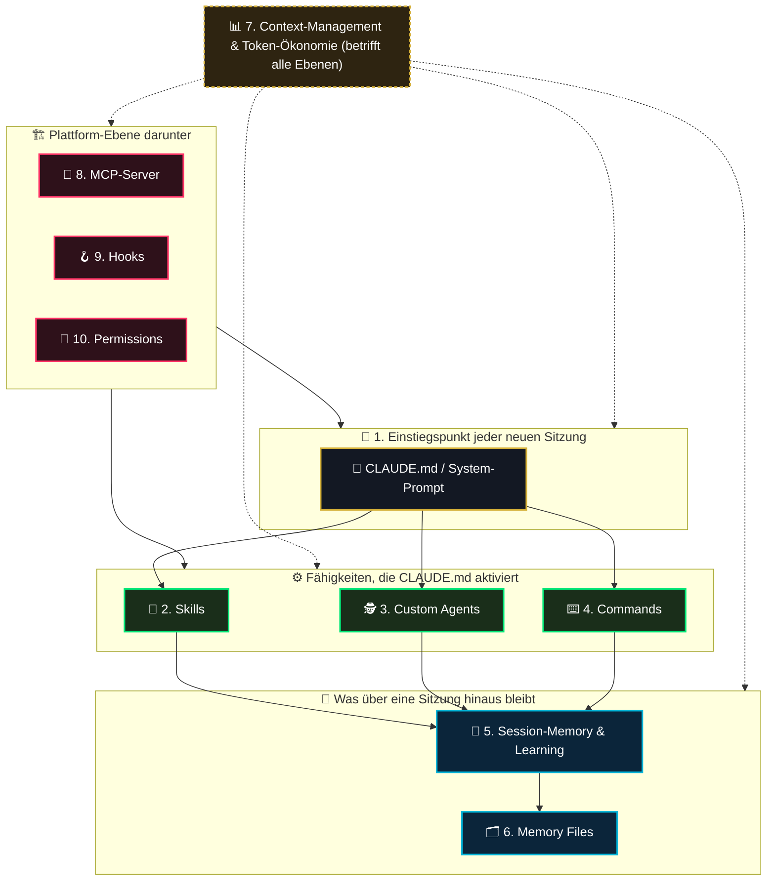
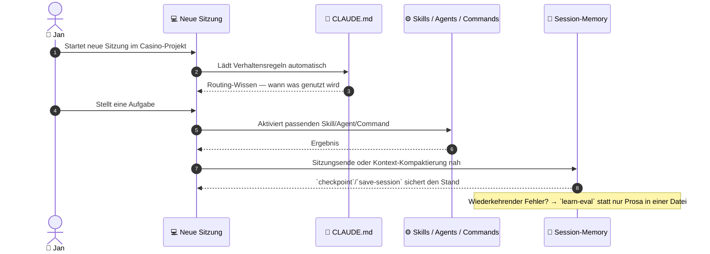

# 00 — Claude-Code-Skill-Erweiterung (Master-Übersicht)

> **Status:** 🟢 Vollständig aufgeschlüsselt · **Stand:** 2026-09-14 (Niveau-Spalte, §1a/§1b und beide Schnitt-Formeln nachgeführt 2026-09-18) · **Owner:** Jan / LLM
> **Zweck:** Zentrale Übersicht für Jans persönliche Skill-Erweiterung im Umgang mit Claude Code selbst — nicht das Casino-Produkt. Das Casino-Projekt ist dabei die praktische Übungsgrundlage („Grundlage mit verschiedenen Bereichen"), an der die einzelnen Kategorien konkret angewendet werden. Jede Kategorie hat ihre eigene(n) Detaildatei(en); hier steht nur, was es gibt, wie es zusammenhängt und wo Jan aktuell steht.
>
> **Hinweis zur Einordnung:** Backlog-/Verweis-Datei, keine Plan-Datei im Sinne von `xx_sop/03_workflow_jan_planungsdateien.md` §1 — analog zur Rolle von `worldmap/00_WORLDMAP_STATUS.md` für das Gesamtprojekt: Reihenfolge und Verweise, keine Doppelpflege von Inhalten.

---

## 1 — Executive Summary für Jan: Die Kategorien im Überblick

Claude Code besteht aus mehreren zusammenspielenden Bausteinen. Fünf davon kanntest du schon (CLAUDE.md, Skills, Agents, Commands, Session-Memory); fünf weitere habe ich ergänzt, weil sie zum vollständigen Bild dazugehören. **Auf deinen ausdrücklichen Wunsch (2026-08-30)** ist die Niveau-Spalte jetzt erstmals von der LLM eingeschätzt — mit Beleg, in einer eigenen Unterkategorie-Datei je Kategorie, analog zur bereits etablierten Methodik in `worldmap/00_WORLDMAP_STATUS.md`. Skala wie dort: **Top 1 % = Weltklasse**, **Top 100 % = schlechtestes Viertel** unter vergleichbaren Hobby-/Indie-Setups, die Claude Code aktiv nutzen. Jeder Wert ist ein rechnerischer Schnitt über bis zu 10 einzeln belegte Unterkategorien in der jeweiligen Detaildatei — nicht geraten.

|  #  | Kategorie                                | Gewichtung |                         Niveau (LLM-Einschätzung)                          | Referenzdatei                                              | Was ist das? (kinderleicht)                                                                                                               | Ordner/Herkunft                                                                               |
| :-: | :--------------------------------------- | :--------: | :------------------------------------------------------------------------: | :--------------------------------------------------------- | :---------------------------------------------------------------------------------------------------------------------------------------- | :-------------------------------------------------------------------------------------------- |
|  1  | **CLAUDE.md / System-Prompt**            |  **20 %**  |                                **Top 8 %**                                 | [`01_1_claude_md.md`](01_1_claude_md.md)                   | Die Verhaltensregeln, die am Anfang jeder Unterhaltung automatisch „vorgelesen" werden.                                                   | `CLAUDE.md`, `AGENTS.md` im Projekt                                                           |
|  2  | **Skills**                               |  **10 %**  |                                **Top 59 %**                                | [`01_2_skills.md`](01_2_skills.md)                         | Fertige „Rezepte", die Claude Code auf Zuruf oder automatisch anwendet (z. B. ein Code-Review-Ablauf).                                    | Globale Skill-Sammlung (nicht im Casino-Ordner)                                               |
|  3  | **Custom Agents (Subagents)**            |  **10 %**  |                    **Top 13 %** (Re-Rating 2026-09-18)                     | [`01_3_custom_agents.md`](01_3_custom_agents.md)           | Spezial-Helfer für einzelne Teilaufgaben, die eigenständig arbeiten (z. B. ein Sicherheits-Check nur für Datenbank-Änderungen).           | `.claude/agents/` im Projekt                                                                  |
|  4  | **Commands & Workflow-Automatisierung**  |  **8 %**   | **Top 30 %** (gewichtet neu bewertet 2026-09-13; globale Governance offen) | [`01_4_command_workflow.md`](01_4_command_workflow.md)     | Feste Kurzbefehle für wiederkehrende Aufgaben im Projekt (statt jedes Mal alles neu zusammenzusuchen).                                    | `package.json`-Scripts, `xx_docs/02_command_reference.md`                                     |
|  5  | **Session-Memory & Continuous Learning** |  **12 %**  |                                **Top 60 %**                                | [`01_5_session_memory.md`](01_5_session_memory.md)         | Ob dafür gesorgt ist, dass zwischen Sitzungen nichts verloren geht und aus wiederkehrenden Fehlern gelernt wird.                          | Verhalten, das `CLAUDE.md` vorschreiben müsste                                                |
|  6  | **Memory Files**                         |  **5 %**   |                    **Top 25 %** (Re-Rating 2026-09-18)                     | [`01_6_memory_files.md`](01_6_memory_files.md)             | Die konkreten Notizen, die sich Claude Code von sich aus über frühere Gespräche zu diesem Projekt merkt — die Dateien hinter Kategorie 5. | `C:\Users\hambu\.claude\projects\V--VibeCoding-Casino\memory\` (außerhalb des Projektordners) |
|  7  | **Context-Management & Token-Ökonomie**  |  **10 %**  |                                **Top 48 %**                                | [`01_7_context_management.md`](01_7_context_management.md) | Wie viel vom „Gedächtnis-Platz" pro Sitzung wofür draufgeht — betrifft alle anderen Kategorien gleichzeitig.                              | Sichtbar über den `/context`-Befehl                                                           |
|  8  | **MCP-Server & externe Programme**       |  **7 %**   |                                **Top 51 %**                                | [`01_8_mcp_server.md`](01_8_mcp_server.md)                 | Extern angebundene Zusatzprogramme wie Notion, GitHub, Figma, Gmail, die Claude Code nutzen kann.                                         | Account-/Maschinen-Einrichtung, nicht im Projektordner                                        |
|  9  | **Hooks & Automatisierungs-Trigger**     |  **8 %**   |           **Top 68 %** (nachbewertet 2026-09-05: 4 Hooks aktiv)            | [`01_9_hooks.md`](01_9_hooks.md)                           | Regeln, die automatisch bei bestimmten Ereignissen auslösen (z. B. „vor jedem Werkzeug-Aufruf erst X prüfen").                            | `settings.json` (projekt- oder account-weit)                                                  |
| 10  | **Permissions & Auto-Allow-Policy**      |  **10 %**  |                                **Top 55 %**                                | [`01_10_permissions.md`](01_10_permissions.md)             | Welche Aktionen automatisch erlaubt sind und welche erst bestätigt werden müssen.                                                         | `CLAUDE.md` „Auto-Allow & Execution Policy", `.claude/settings.local.json`                    |

**Rechnerischer Schnitt über alle 10 Kategorien: (8+59+13+30+60+25+48+51+68+55)/10 = 417/10 = Top 42 %** (Custom-Agents-Term am 2026-09-18 final auf 13 re-rated — nach Jans eigenem `CLAUDE.md:114`-Status-Label-Edit, siehe `01_3_custom_agents.md` §1; Memory-Files-Term am 2026-09-18 von 44 auf 25 nach Ausführung aller 10 Pläne 06_u01–u10 gezogen, siehe `01_6_memory_files.md`; davor Top 44 %, davor Top 45 %, davor Top 47 % mit dem veralteten Commands-Wert).

**Gewichteter Schnitt (Niveau × Gewichtung, ergänzt 2026-09-05 auf Jans Wunsch): (8·0,20 + 59·0,10 + 13·0,10 + 30·0,08 + 60·0,12 + 25·0,05 + 48·0,10 + 51·0,07 + 68·0,08 + 55·0,10) = 38,96 → Top 39 %** (Custom-Agents-Term final 20 → 13 nach Re-Rating 2026-09-18 und Memory-Files-Term 44 → 25 nach Ausführung des Sammel-Batches am 2026-09-18 ziehen den Wert von zuvor Top 41 % auf Top 39 %). Der gewichtete Wert ist **besser** als der ungewichtete, weil die stärkste Kategorie (CLAUDE.md, Top 8 %) die höchste Gewichtung trägt und die schwächsten (Hooks, Permissions) nur 8–10 % wiegen — das System ist real stärker, als der flache Schnitt aussagt.

### Gewichtslogik (grobe Begründung, bewusst nicht feiner)

Die Gewichtung bewertet **wie viel jeder Kategorie für Jans konkretes Ziel schadet, wenn sie schlecht ist** — nicht ihre generische Wichtigkeit. Drei Faustregeln: (a) wirkt sie in **jeder** Sitzung automatisch, bekommt sie hohes Gewicht (CLAUDE.md 20 %); (b) entscheidet sie über **Ergebnisqualität oder Lerneffekt** der Projektarbeit, mittleres Gewicht (Session-Memory 12 %, Skills/Agents/Context/Permissions je 10 %); (c) ist sie **Plattform-Hygiene oder Reserve**, niedriges Gewicht (Memory Files 5 %, MCP 7 %, Commands/Hooks 8 % — Hooks sind ein Durchsetzungs-Layer für Regeln, die ohne sie trotzdem über Prosa wirken; Commands sind Schreibarbeit, kein Denken). Das ist eine grobe, aber offen gelegte Schätzung — wenn Jan einzelne Gewichte anders sieht, ändert sich nur die Spalte, nicht die Detaildateien.

### 1a — Bottleneck-Ranking (schlechtestes zuerst — das ist deine Prioritätenliste)

| Rang | Kategorie                                    |                    Niveau                    | Größter Einzelbefund                                                                                                                                                                                                                                                                                                        | Planungsdatei (wo die offene Lösung/Steuerung liegt)                                                                                                            | Execution                                                                                            |
| :--: | :------------------------------------------- | :------------------------------------------: | :-------------------------------------------------------------------------------------------------------------------------------------------------------------------------------------------------------------------------------------------------------------------------------------------------------------------------- | :-------------------------------------------------------------------------------------------------------------------------------------------------------------- | ---------------------------------------------------------------------------------------------------- |
|  1   | **9 — Hooks & Automatisierungs-Trigger**     |      Top 68 % (nachbewertet 2026-09-05)      | Bis 2026-08-30 0 konfigurierte Hooks (größter Einzel-Bottleneck) — seitdem **4 Hooks aktiv** (1× PreToolUse, 1× PostToolUse, 2× Stop); Rest-Bottleneck: 24 unverbundene Hook-Definitionen in `hooks.json` + weiterhin 0 `SessionStart`-Hooks                                                                                | [`hooks/01_hooks_active_audit.md`](hooks/01_hooks_active_audit.md)                                                                                              | 🟡 teilweise (4 Hooks ✅, Rest wartet auf Jan)                                                       |
|  2   | **5 — Session-Memory & Continuous Learning** |                   Top 60 %                   | Vollständig aufgeschlüsselt (10 Subkategorien, 10 Übersichtsdateien, 10 execution-ready Pläne 21–30); Ziel: Top 20 %                                                                                                                                                                                                        | [`01_5_session_memory.md`](01_5_session_memory.md)                                                                                                              | 🔵 Execution-Ready (10 Pläne bereit)                                                                 |
|  3   | **2 — Skills**                               |                   Top 59 %                   | 0 projekteigene Skills trotz 150+ verfügbarer globaler Skills                                                                                                                                                                                                                                                               | — _(noch keine Planung)_                                                                                                                                        | 🔵 geplant/wartet                                                                                    |
|  4   | **10 — Permissions & Auto-Allow-Policy**     |                   Top 55 %                   | Projekt-Allow-List unstrukturiert gewachsen, inkl. toter Pfade auf einen nicht mehr existierenden Benutzer                                                                                                                                                                                                                  | — _(noch keine Planung)_                                                                                                                                        | 🔵 geplant/wartet                                                                                    |
|  5   | **8 — MCP-Server & externe Programme**       |                   Top 51 %                   | ≈ 15–16 Account-weite MCP-Server ohne projektbezogene Begründung, plus tote Permission-Einträge                                                                                                                                                                                                                             | — _(noch keine Planung)_                                                                                                                                        | 🔵 geplant/wartet                                                                                    |
|  6   | **7 — Context-Management & Token-Ökonomie**  |                   Top 48 %                   | Kein dokumentiertes Kontext-Budget-Protokoll in `CLAUDE.md` (Baustein E fertig, nicht freigegeben); Laufzeit-Hälfte inzwischen durch [`01_15_token_oekonomie_effizienz.md`](01_15_token_oekonomie_effizienz.md) abgedeckt (§1c unten)                                                                                       | [`01_7_context_management.md`](01_7_context_management.md) (Baustein E) + [`01_15_token_oekonomie_effizienz.md`](01_15_token_oekonomie_effizienz.md) (Laufzeit) | 🟡 teilweise (Laufzeit 🟢, Baustein-E-Freigabe offen)                                                |
|  7   | **4 — Commands & Workflow-Automatisierung**  | Top 30 % (gewichtet neu bewertet 2026-09-13) | Projekt-Referenz deckt 43 Scripts, 12 CI-Workflows und Hook-Grenzen ab; Rest-Bottleneck: globale 58-Commands-Governance wartet auf Jan                                                                                                                                                                                      | [`01_4_command_workflow.md`](01_4_command_workflow.md)                                                                                                          | 🟡 teilweise (Projekt ✅, globale Governance wartet auf Jan)                                         |
|  8   | **6 — Memory Files**                         |       Top 25 % (Re-Rating 2026-09-18)        | Alle vier Memory-Typen belegt — **feedback 5 · project 4 · user 3 · reference 5** — bei **17 Notiz-Dateien + 17 Indexzeilen**; der frühere Befund „1 von 4 Typen 0 Einträge trotz 836 Sitzungsstarts“ ist seit 2026-09-18 geschlossen und im U08-Baseline-Lauf re-verifiziert (0 Duplikate, 0 tote Verweise, 17/17 Deckung) | [10 Pläne 06_u01–u10](Planungsdateien/06_u10_faktenluecke_plan.md)                                                                                              | 🟢 vollumfänglich ausgeführt (alle 10 Pläne `Executed (archiviert)` am 2026-09-18 — Top 44 % → 25 %) |
|  9   | **3 — Custom Agents (Subagents)**            |       Top 13 % (Re-Rating 2026-09-18)        | Alle 3 Agenten mindestens Pilot (`casino-residue-scout` bestand am 2026-09-18 zusätzlich 3 reale read-only Prüfungen); `CLAUDE.md:114` nennt alle drei samt Trigger-Schwelle **und** Lifecycle-Status-Label (Jans eigener, gespeicherter Edit) — keine offene Lücke mehr                                                    | [`01_3_custom_agents.md`](01_3_custom_agents.md) / [`agents/12_workflow_agent_creation.md`](agents/12_workflow_agent_creation.md) (Registry/Governance)         | 🟢 vollständig umgesetzt                                                                             |
|  10  | **1 — CLAUDE.md / System-Prompt**            |                   Top 8 %                    | Stärkste Kategorie — Restlücken sind vollständig als fertige, unfreigegebene Bausteine A–E dokumentiert                                                                                                                                                                                                                     | [`01_1_claude_md.md`](01_1_claude_md.md) §4 (Bausteine A–E)                                                                                                     | 🟡 teilweise (Bausteine fertig, Freigaben offen)                                                     |

### 1b — Hebel-Ranking (Niveau × Gewichtung — wohin die nächste Stunde am meisten bringt)

Das Bottleneck-Ranking oben sortiert nach rohem Niveau. Mit der neuen Gewichtungsspalte entsteht eine zweite, genauere Sicht: **Verbesserungshebel = Niveau × Gewicht** (hoch = schlechtes Niveau trifft auf hohe Bedeutung). Nach diesem Maßstab lohnt sich Arbeit in dieser Reihenfolge am meisten:

| Rang | Kategorie                  |  Niveau  | Gewicht |  Hebel  |
| :--: | :------------------------- | :------: | :-----: | :-----: |
|  1   | **5 — Session-Memory**     | Top 60 % |  12 %   | **720** |
|  2   | **2 — Skills**             | Top 59 % |  10 %   | **590** |
|  3   | **10 — Permissions**       | Top 55 % |  10 %   | **550** |
|  4   | **9 — Hooks**              | Top 68 % |   8 %   | **544** |
|  5   | **7 — Context-Management** | Top 48 % |  10 %   | **480** |
|  6   | **8 — MCP-Server**         | Top 51 % |   7 %   | **357** |
|  7   | **4 — Commands**           | Top 30 % |   8 %   | **240** |
|  8   | **1 — CLAUDE.md**          | Top 8 %  |  20 %   | **160** |
|  9   | **3 — Custom Agents**      | Top 13 % |  10 %   | **130** |
|  10  | **6 — Memory Files**       | Top 25 % |   5 %   | **125** |

**Kernunterschied zum Bottleneck-Ranking:** Custom Agents (Rang 9 im Bottleneck-Ranking, Niveau nach dem Re-Rating vom 2026-09-18 jetzt Top 13 % statt vormals Top 20 %) fällt im Hebel-Ranking ans Ende (Hebel 130, direkt vor Memory Files mit 125) — der große Teil der Verbesserung ist dort bereits geleistet. Memory Files rutscht nach der Ausführung des Sammel-Batches (Top 44 % → Top 25 %) sogar auf den letzten Hebel-Platz (125) — dort ist kein nennenswerter Hebel mehr, was die mit 5 % ohnehin niedrige Gewichtung noch verstärkt. Umgekehrt rückt Session-Memory klar auf Platz 1: mittelmäßiges Niveau trifft auf die zweithöchste Gewichtung. Die beiden Listen sagen dieselbe Geschichte mit unterschiedlicher Schärfe — **für die Reihenfolge der nächsten Arbeitsschritte zählt das Hebel-Ranking, nicht das Bottleneck-Ranking.**

### 1c — Querschnittsthema auf sekundärer Ebene: Tokenökonomie & Token-Effizienz (**Prio 3**, hinzugefügt 2026-09-14)

**Warum sekundäre Ebene und keine 11. Kategorie:** Tokenökonomie ist selbst kein Werkzeug-Baustein wie die 10 Kategorien oben, sondern eine Eigenschaft, die **durch alle 10 gleichzeitig** läuft (Agents verbrauchen, CLAUDE.md regelt, Memory/MCP/Skills lasten den Kontext). Eine eigene Tabellen-Zeile würde den Schnitt verzerren und die in §3a bewusst geschlossene 11-Kategorien-Frage wieder öffnen. Deshalb: eigener Querschnitts-Eintrag, direkt hier unter dem Executive Summary, mit Direkteinstieg.

|                                   |                                                                                                                                                                                                                                                                                                                                                                                                                                                                                                                                                                                                                                                                                                                                                                                                                                                                                                                                                                                                        |
| --------------------------------- | ------------------------------------------------------------------------------------------------------------------------------------------------------------------------------------------------------------------------------------------------------------------------------------------------------------------------------------------------------------------------------------------------------------------------------------------------------------------------------------------------------------------------------------------------------------------------------------------------------------------------------------------------------------------------------------------------------------------------------------------------------------------------------------------------------------------------------------------------------------------------------------------------------------------------------------------------------------------------------------------------------ |
| **Prio**                          | **3** — Regel-Arbeit abgeschlossen; Rest wartet auf **Jans 1 offene Entscheidung (Read-Deny `database.types.ts`, Plan R08 L1)** + erste Messwerte. Erhebung auf Prio 2 nach 2–3 Wochen gelebter Praxis mit echten `/cost`-Werten (Routine in 15a §3).                                                                                                                                                                                                                                                                                                                                                                                                                                                                                                                                                                                                                                                                                                                                                  |
| **Master-Datei (Direkteinstieg)** | [`01_15_token_oekonomie_effizienz.md`](01_15_token_oekonomie_effizienz.md) — Executive-Summary, Kompaktübersicht mit allen 10 Unterkategorien (Niveau + Execution + Planungsdatei-Verweise je Zeile), Durchschnitts-Niveau unterhalb der Spalte 10                                                                                                                                                                                                                                                                                                                                                                                                                                                                                                                                                                                                                                                                                                                                                     |
| **Stand**                         | **Top 27 %** Endstand nach allen 10 Plänen (vorher Top 54 %), ausgeführt am 2026-09-14; nach beiden Umsetzungen (X3 + W3 am 2026-09-18) Position 3 von 23 auf **19** gezogen — der Durchschnitt bleibt rechnerisch Top 27 % (240/9 = 26,7)                                                                                                                                                                                                                                                                                                                                                                                                                                                                                                                                                                                                                                                                                                                                                             |
| **Struktur**                      | 10 Unterkategorien mit je einer Übersichtsdatei `01_15_<Nr>_<Name>.md` und je einer Planungsdatei in `Planungsdateien/<Nr>_<Name>_plan.md` (alle 10 Pläne `Executed (archiviert)` — die 10 Umsetzungen, auf die sich dieser Eintrag bezieht)                                                                                                                                                                                                                                                                                                                                                                                                                                                                                                                                                                                                                                                                                                                                                           |
| **Offen (Jan-Gates)**             | ① ~~Crash-Loop Option-Wahl~~ **entschieden 2026-09-16: X3 (4,20)** — ebenso WalletService **W3 (4,25)**; **beide umgesetzt am 2026-09-18**: [`03b X3`](Planungsdateien/03b_x3_crash_loop_schnitt_plan.md) (Hooks 982→849 / 782→663 Z., 5 Module, 71 Tests) · [`03c W3`](Planungsdateien/03c_w3_wallet_service_schnitt_plan.md) (`wallet.ts` 880→569 Z., 7 Verträge + 4 Module, +37 Tests). Katalog R7 68→**78 %**, R3 62→**78 %**, Schnitt 74→**77 %**. Verbleibende **Abnahmen, keine Code-Arbeit**: Sichtprüfung der beiden Crash-Seiten + Klick-Check der Promo-Route. **Klartext-Erklärung beider Umbauten: [`01_15_03b_w3_x3_erklaerung.md`](01_15_03b_w3_x3_erklaerung.md)** · ② Baustein-E A/B/C (Position 7, 3 Bullets in `01_1_claude_md.md` §4) · ③ Read-Deny `database.types.ts` (Plan R08 L1, projekt-weite `settings.json`, Dateiinhalt fertig in `Planungsdateien/03a_r08_generierter_code_plan.md` §5) · ④ `CLAUDE.md` Z. 125 Hotspot-Zahlen veraltet (X3/W3) — Update nur mit Freigabe |
| **Abgrenzung**                    | Statisch-technische Kontext-Seite (was pro Sitzung vorgeladen ist) bleibt in **Kategorie 7** (`01_7_context_management.md`, Top 48 %) — `01_15` misst bewusst nur die Laufzeit-Ökonomie (Tokens **pro Aufgabe**), Position 8 ist reine Referenz                                                                                                                                                                                                                                                                                                                                                                                                                                                                                                                                                                                                                                                                                                                                                        |

_Frage in der Tabelle oben, die dieser Eintrag beantwortet: Kategorie 7 (Top 48 %) nennt als Bottleneck „kein Kontext-Budget-Protokoll" — die Laufzeit-Hälfte dieser Lücke ist jetzt geschlossen (Regeln in `CLAUDE.md` § Subagent-Disziplin / § Model-Routing / § Tool-Output-Ökonomie), die statische Hälfte bleibt in `01_7`._

---

## 2 — Grafik: Wie die Kategorien zusammenhängen

### Grafik: Eine Sitzung von Start bis Ende

---

## 3 — Rahmenbedingungen

> [!NOTE] **Zweck dieses Ordners**
> Diese Sammlung dient in erster Linie Jans persönlicher Skill-Erweiterung im Umgang mit Claude Code — das Casino-Projekt ist die praktische Übungsgrundlage, nicht Selbstzweck. Ergebnisse können später in andere VibeCoding-Projekte übertragen werden.

> [!TIP] **Kategorien 6–10 sind Vorschläge**
> Von der LLM ergänzt, weil sie zum vollständigen Bild von „Claude Code beherrschen" dazugehören — keine davon ist verpflichtend. Wirf raus, was für dich nicht relevant ist.

> [!TIP] **Niveau-Spalte jetzt gefüllt (2026-08-30, auf deinen expliziten Wunsch)**
> Bis 2026-08-29 bewusst leer (nur deine eigene Einschätzung). Am 2026-08-30 hast du die LLM explizit gebeten, alle 10 Kategorien nach demselben Top-1-%-bis-Top-100-%-Schema wie `worldmap/00_WORLDMAP_STATUS.md` einzuschätzen, in eigene Unterkategorie-Dateien aufzuschlüsseln und Bottlenecks zu identifizieren. Jeder Wert ist ein Beleg-gestützter, rechnerischer Schnitt — keine Bauchgefühl-Schätzung. Deine eigene Einschätzung bleibt jederzeit willkommen und kann von der LLM-Zahl abweichen.

---

## 3a — Vollständigkeits-Check: Fehlt eine 11. Kategorie? (2026-08-30)

Auf Jans Wunsch geprüft, bevor die Detaildateien erstellt wurden: Deckt der Katalog wirklich alle relevanten Claude-Code-Bausteine ab, oder fehlt etwas? Geprüft gegen die volle Werkzeug-/Fähigkeiten-Liste dieser Sitzung (Cron/`ScheduleWakeup`, `EnterPlanMode`/`ExitPlanMode`, Worktrees, Teams/`SendMessage`/`ListAgents`, Artifacts, Checkpoints/Rewind, Statusline/Voice/Remote-Control, Plugins).

**Ergebnis: Die 10 Kategorien sind vollständig — keine 11. Top-Level-Kategorie nötig.** Folgende Kandidaten wurden geprüft und bewusst als **Unterkategorie einer bestehenden Kategorie** eingeordnet statt als eigene Zeile:

| Kandidat                                                        | Eingeordnet unter                                 | Warum keine eigene Kategorie                                                                                                                                         |
| :-------------------------------------------------------------- | :------------------------------------------------ | :------------------------------------------------------------------------------------------------------------------------------------------------------------------- |
| Plan Mode (`EnterPlanMode`/`ExitPlanMode`)                      | Kategorie 4 (Commands & Workflow-Automatisierung) | Ist ein Ausführungsmodus für Aufgaben, kein eigenständiger Wissensspeicher — passt konzeptionell zu „wie Aufgaben abgearbeitet werden"                               |
| Worktrees (`EnterWorktree`/`ExitWorktree`)                      | Kategorie 4                                       | Isolations-Mechanik für Workflows, kein eigenes Konzept                                                                                                              |
| Cron/Scheduled Tasks/Loop                                       | Kategorie 9 (Hooks & Automatisierungs-Trigger)    | Passt wörtlich zum Kategorienamen „Automatisierungs-Trigger" — bereits als Unterkategorie #7 in `01_9_hooks.md` geführt                                              |
| Teams/Multi-Session-Orchestrierung (`SendMessage`/`ListAgents`) | Kategorie 3 (Custom Agents/Subagents)             | Verwandtes Konzept (Delegation), aber für Casino aktuell 0 Nutzung nachweisbar — als Randnotiz statt eigener Kategorie geführt, um keine leere Kategorie zu erzeugen |
| Checkpoints/Rewind                                              | Kategorie 5 (Session-Memory)                      | Bereits als konkreter Lösungsbaustein in `01_5_session_memory.md` Abschnitt 3.1 behandelt (`checkpoint`-Skill)                                                       |
| Plugins (Packaging)                                             | Kategorie 2 (Skills)                              | Laut `skills/13_skill_worldclass_creation.md` Abschnitt 2 selbst als „Reifegrad 5" eines Skills definiert, kein eigenständiges Konzept                               |
| Statusline/Voice-Mode/Remote-Control                            | Keine — bewusst außerhalb des Scopes              | Reine Bedienoberflächen-/Ergonomie-Features ohne Bezug zu „wie gut nutzt Jan Claude Code für Projektarbeit"; würden die Übersicht ohne Lerneffekt aufblähen          |
| Artifacts                                                       | Keine — bewusst außerhalb des Scopes              | Chat-Produkt-Feature für visuelle Deliverables, nicht Teil des agentischen Coding-Workflows an diesem Next.js/Supabase-Projekt                                       |

---

## 4 — Modul-Navigator: Bereits vorhandene Detaildateien

Alle 10 Kategorien haben jetzt mindestens eine Detaildatei nach dem einheitlichen Schema `01_<Kategorienummer>_<Kategoriename>.md` (Umbenennung/Neuanlage am 2026-08-30).

| Datei                                                                                                                                                                                                                                                                                                                                                                                                                                                                                            | Kategorie                                            | Typ                                                     | Primärer Fokus                                                                                                                                                                                                             |
| :----------------------------------------------------------------------------------------------------------------------------------------------------------------------------------------------------------------------------------------------------------------------------------------------------------------------------------------------------------------------------------------------------------------------------------------------------------------------------------------------- | :--------------------------------------------------- | :------------------------------------------------------ | :------------------------------------------------------------------------------------------------------------------------------------------------------------------------------------------------------------------------- |
| [`01_1_claude_md.md`](01_1_claude_md.md)                                                                                                                                                                                                                                                                                                                                                                                                                                                         | 1 — CLAUDE.md                                        | Master-Matrix                                           | 10-Dimensionen-Ist-Audit von `CLAUDE.md` (umbenannt von `01_claude_md_worldclass_optimization.md`)                                                                                                                         |
| [`01_2_skills.md`](01_2_skills.md)                                                                                                                                                                                                                                                                                                                                                                                                                                                               | 2 — Skills                                           | Sub-Kategorie-Aufschlüsselung                           | 10 Unterkategorien, Ist-Nutzungsnachweis für Casino (neu)                                                                                                                                                                  |
| [`01_3_custom_agents.md`](01_3_custom_agents.md)                                                                                                                                                                                                                                                                                                                                                                                                                                                 | 3 — Custom Agents                                    | Deep-Dive                                               | Subagent-Lifecycle, Pilot-Evaluierung, Router-Sichtbarkeit (umbenannt von `01_7_subagent.md`)                                                                                                                              |
| [`01_4_command_workflow.md`](01_4_command_workflow.md)                                                                                                                                                                                                                                                                                                                                                                                                                                           | 4 — Commands                                         | Deep-Dive                                               | Command- & Workflow-Automatisierung, Scoped-Tests, CI-Parität (umbenannt von `01_6_command.md`)                                                                                                                            |
| [`01_5_session_memory.md`](01_5_session_memory.md)                                                                                                                                                                                                                                                                                                                                                                                                                                               | 5 — Session-Memory                                   | Deep-Dive                                               | Handoff-Protokoll, Fehler-Pattern-Lernen, Options-Gate (umbenannt von `01_8_session_memory.md`)                                                                                                                            |
| [`01_6_memory_files.md`](01_6_memory_files.md)                                                                                                                                                                                                                                                                                                                                                                                                                                                   | 6 — Memory Files                                     | Sub-Kategorie-Aufschlüsselung                           | 10 Unterkategorien + 10 Übersichtsdateien + 10 execution-ready Pläne; korrigiert den 2026-08-29-Zwischenstand — **alle 10 Pläne am 2026-09-18 `Executed (archiviert)`**, gewichteter Schnitt Top 44 % → **Top 25 %**       |
| [`01_7_context_management.md`](01_7_context_management.md)                                                                                                                                                                                                                                                                                                                                                                                                                                       | 7 — Context-Management                               | Sub-Kategorie-Aufschlüsselung                           | 10 Unterkategorien, Querschnitts-Verweise statt Doppelmessung (neu)                                                                                                                                                        |
| [`01_8_mcp_server.md`](01_8_mcp_server.md)                                                                                                                                                                                                                                                                                                                                                                                                                                                       | 8 — MCP-Server                                       | Sub-Kategorie-Aufschlüsselung                           | 10 Unterkategorien, Abgrenzung zu `02_mcp.md` (neu)                                                                                                                                                                        |
| [`01_9_hooks.md`](01_9_hooks.md)                                                                                                                                                                                                                                                                                                                                                                                                                                                                 | 9 — Hooks                                            | Sub-Kategorie-Aufschlüsselung                           | 8 Unterkategorien, Abgrenzung zu Git-Hooks/Husky (neu)                                                                                                                                                                     |
| [`01_10_permissions.md`](01_10_permissions.md)                                                                                                                                                                                                                                                                                                                                                                                                                                                   | 10 — Permissions                                     | Sub-Kategorie-Aufschlüsselung                           | 8 Unterkategorien, Allow-List-Hygiene (neu)                                                                                                                                                                                |
| [`agents/12_workflow_agent_creation.md`](agents/12_workflow_agent_creation.md)                                                                                                                                                                                                                                                                                                                                                                                                                   | 3 — Custom Agents                                    | Registry & Scorecard                                    | Generalisierte 10-Kategorien-Rubric mit Punktzahl je Agent; Kandidaten-Registrierung & Governance (löst die am 2026-08-30 gelöschte Kandidaten-Datei `11_agenten_kandidaten_evaluation.md` ab)                             |
| [`agents/13_agent_registry_ergebnis_2026-08-30.md`](agents/13_agent_registry_ergebnis_2026-08-30.md)                                                                                                                                                                                                                                                                                                                                                                                             | 3 — Custom Agents                                    | Ergebnisbericht                                         | IST→NEU-Scores aller 3 Agenten, Governance-Entscheidungen (#14/#20 gelöscht), Pilot-Evaluierung 11/31 (20/20 ✅) — Prüfbericht für Jan                                                                                     |
| [`skills/13_skill_worldclass_creation.md`](skills/13_skill_worldclass_creation.md)                                                                                                                                                                                                                                                                                                                                                                                                               | 2 — Skills                                           | Deep-Dive                                               | Skill-Erstellung auf Weltklasse-Niveau                                                                                                                                                                                     |
| [`benchmarks/01_llm_benchmark_uebersicht.md`](benchmarks/01_llm_benchmark_uebersicht.md)                                                                                                                                                                                                                                                                                                                                                                                                         | — (Querschnitt)                                      | Lernreferenz                                            | Modellunabhängige Benchmark-Einordnung                                                                                                                                                                                     |
| [`01_multi_agent_scaling_und_autonomie.md`](01_multi_agent_scaling_und_autonomie.md)                                                                                                                                                                                                                                                                                                                                                                                                             | 3 — Custom Agents (Querschnitt, siehe Hinweis unten) | Master-Bewertungsdatei                                  | Fan-out/Fan-in, Redundanz, Wissensrückfluss — 10 Subkategorien, ergänzt am 2026-09-09 als eigenständiges Thema neben `01_3_custom_agents.md`, nicht als Ersatz dafür                                                       |
| [`agents/15_parallele_subagenten_nutzung_plan.md`](agents/15_parallele_subagenten_nutzung_plan.md) + [`agents/15a_parallele_subagenten_status.md`](agents/15a_parallele_subagenten_status.md)                                                                                                                                                                                                                                                                                                    | 3 — Custom Agents                                    | Übersicht + Planungsdatei (dieselbe Datei) + Status-Log | Subkategorie #1 aus der Multi-Agent-Datei — 2 real ausgeführte Testzyklen (Fan-out via `Agent`-Tool)                                                                                                                       |
| [`01_multi_agent_wissensrueckfluss_plan.md`](01_multi_agent_wissensrueckfluss_plan.md)                                                                                                                                                                                                                                                                                                                                                                                                           | 5 — Session-Memory (Querschnitt)                     | Übersicht + Planungsdatei (dieselbe Datei)              | Subkategorie #7 der Multi-Agent-Datei — G1+G2 real ausgeführt 2026-09-13/14/18                                                                                                                                             |
| [`01_multi_agent_teams_orchestrierung_plan.md`](01_multi_agent_teams_orchestrierung_plan.md), [`01_multi_agent_autonomie_stufenmodell_plan.md`](01_multi_agent_autonomie_stufenmodell_plan.md), [`01_multi_agent_redundanz_qualitaetshebel_plan.md`](01_multi_agent_redundanz_qualitaetshebel_plan.md), [`01_multi_agent_adversariale_qs_plan.md`](01_multi_agent_adversariale_qs_plan.md), [`01_multi_agent_token_transparenz_fanout_plan.md`](01_multi_agent_token_transparenz_fanout_plan.md) | 3 — Custom Agents (Querschnitt)                      | 5 Übersichtsdateien (Sub-Subkategorie-Bewertung)        | Subkategorien #2/#3/#5/#6/#10 der Multi-Agent-Datei — reine Bestandsaufnahme, noch keine Planungsdateien (Skalierungs-Gate vom 2026-09-12 wartet auf Jans Auswahl, welche der 15 offenen 🔴-JA-Punkte einen Plan bekommen) |

> **Hinweis: parallele Sitzung (2026-08-30) — inzwischen aufgelöst.** Während dieser Aufschlüsselung liefen sichtbare, zeitgleiche Änderungen an `.claude/agents/`, `t_claude_code/agents/11_agenten_kandidaten_evaluation.md` und `t_claude_code/agents/12_workflow_agent_creation.md` (u. a. Umbenennung `casino-cleanup-residue-finder` → `casino-residue-scout`, Aufbau einer 10-Kategorien-Agenten-Rubric). Die dort zunächst bestehende Diskrepanz — `12` §1 behielt die Kandidaten-Datei als existierend, sie war aber noch auf der Festplatte — wurde im selben Tag aufgelöst: **`11_agenten_kandidaten_evaluation.md` ist jetzt tatsächlich gelöscht**, ihre Governance liegt vollständig in `agents/12_workflow_agent_creation.md` §2.

---

## 5 — Offener Punkt: `CLAUDE.md` verweist noch auf einen umbenannten Dateinamen

`CLAUDE.md` Abschnitt „Session-Kontinuität" (letzte Zeile) lautet aktuell: „Neue Fehler-Pattern-Datei-Klasse nicht ohne Freigabe — offen in `01_8_session_memory.md` §4a." Die Datei heißt seit dieser Aufschlüsselung `01_5_session_memory.md`. Da `CLAUDE.md` laut projektweiter Hard Rule ausschließlich von Jan selbst und nur nach ausdrücklicher Freigabe im laufenden Chat editiert werden darf, wurde dieser Verweis **bewusst nicht** mit angepasst. Einzeiliger manueller Fix, sobald Jan möchte: `01_8_session_memory.md` → `01_5_session_memory.md` in genau dieser einen Zeile.

## 6 — Pflegehinweis

Diese Datei nur um **neue Kategorien**, **Statuswechsel** oder **neue Detaildateien im Modul-Navigator** ergänzen, nie Inhalte aus den Detaildateien hierher kopieren (Prinzip aus `xx_sop/03` §2: keine Referenz doppelt pflegen).
