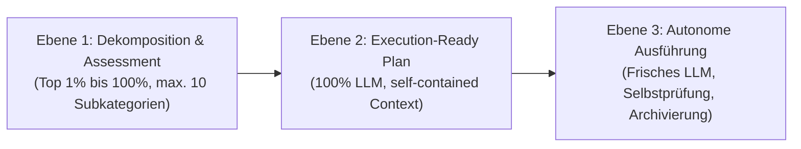

# 01 — LLM Workflow Operating System (Bewertung → Planung → Ausführung)

> **Status:** Dauerhaft / Aktiv · **Stand:** 2026-09-05 · **Owner:** Jan / LLM · **Scope:** Standardisiertes Framework für Kategoriedekomposition, konversationsunabhängige Planungsdateien und modellgetrennte Ausführung.

---

## 1 — Zweck & Kernaussage

Dieses Dokument definiert das verbindliche operative System für das Zusammenspiel von Jan und LLMs im Projekt. Es löst das Problem von Informationsverlust, Konversations-Abbrüchen ("Usage limit reached"), Bestätigungsfehlern (Confirmation Bias) und unklaren Zuständigkeiten.

Das System folgt einer strikten 3-Ebenen-Architektur:



---

## 2 — Ebene 1: Bewertung & Subkategorie-Dekomposition

Wenn ein übergeordnetes Thema (z. B. eine bestehende Kategorie auf Top 30%-Niveau) optimiert werden soll, führt das Planungs-LLM zuerst ein strukturiertes Bottleneck-Assessment durch.

### 2.1 Regeln für die Dekomposition

1. **Maximal 10 Subkategorien:** Eine künstliche Aufblähung über 10 Punkte hinaus ist verboten (Fokus-Erhalt).
2. **Keine weichen Schätzungen:** Jedes Perzentil muss auf einem überprüfbaren Kriterium basieren (Tests, Code-Befunde, CI-Gates, Architektur-Invariante).
3. **Echtes Perzentil-Raster (Referenz: `worldmap/00_WORLDMAP_STATUS.md`):**
   - **Top 1–10 % (Weltklasse / Prod-Ready):** Automatisiert verifiziert, 100 % Testabdeckung im Kernpfad, 0 Blocker, saubere Typen, Fail-Closed-Verhalten.
   - **Top 11–30 % (Solide):** Funktioniert vollständig, keine Security-Risiken, Lücken sind sauber dokumentiert.
   - **Top 31–50 % (Funktional, aber technische Schulden):** Feature läuft, aber fehlende Edge-Case-Tests, Code-Duplikate oder manuelle Schritte nötig.
   - **Top 51–75 % (Eingeschränkt / Fallback):** Funktionalität nur teilweise aktiv, ungetestete Pfade oder fehleranfälliges Fallback.
   - **Top 76–100 % (Kritisch / Nominell):** Code existiert, weicht aber vom dokumentierten Laufzeitverhalten ab oder blockiert den Build/Sicherheit.

### 2.2 Schema für das Bottleneck-Assessment (Output des Planers)

```markdown
### Assessment: <Kategorie-Name> (Status Quo: Top X %)

| #                       | Subkategorie | Niveau   | Befund & Beleg (Datei / Test)   | Bottleneck? | Action Item               |
| ----------------------- | ------------ | -------- | ------------------------------- | ----------- | ------------------------- |
| 01                      | Subthema A   | Top 15 % | 24/24 Tests grün, Typen strikt  | Nein        | Erhalt / Monitoring       |
| 02                      | Subthema B   | Top 65 % | Kein Rate-Limit auf Endpoint XY | 🔴 JA       | Härtung via Action Item B |
| ... (maximal 10 Zeilen) |

**Rechnerischer Schnitt:** Top Y %
**Härteste Bottlenecks:** Subthema B, Subthema D
```

Aus den identifizierten **🔴 JA**-Bottlenecks werden die Meilensteine für die Planungsdatei in Ebene 2 abgeleitet.

---

## 3 — Ebene 2: Der Execution-Ready Handoff

Ein Handoff gilt **nur dann** als `Execution-Ready`, wenn ein völlig neues LLM in einer frischen Konversation ohne jeglichen Chat-Verlauf und ohne implizites Projektwissen die Aufgabe fehlerfrei ausführen kann.

### 3.1 Unverrückbare Invarianten für Planungsdateien

- **Zuständigkeit = 100 % LLM:** Alle Implementierungs-, Test-, Refactoring- und Prüfschritte liegen beim LLM. Jan agiert ausschließlich als Gatekeeper für menschliche Aktionen (z. B. externe Third-Party-Credentials eintragen, Vercel-DNS umstellen, visuelle UI-Endabnahme).
- **Self-Contained Context (Weltklasse-Kontext):** Die Planungsdatei muss alle relevanten Dateipfade (als klickbare Markdown-Links), Architekturinvariante, Verifikationsbefehle und Nicht-Scopes enthalten.
- **Keine Annahmen über Vorwissen:** Relevante Imports, Schnittstellen oder Schema-Strukturen werden in Snippets direkt im Plan referenziert.
- **Fail-Closed & Rollback:** Jeder Meilenstein enthält das Verhalten bei Fehlschlag.

### 3.2 Standardisiertes Planungsdatei-Template

Dieses Template wird für jede neue Aufgabe in `worldmap/<NN>_<thema>_plan.md` angelegt:

```markdown
# NN — <Themenname>

> **Status:** Execution-Ready · **Stand:** YYYY-MM-DD · **Owner:** LLM (Jan nur bei Gate) · **Scope:** <Präzise 1-Satz-Grenze>
> **Kontext:** Ausgelöst durch Bottleneck-Assessment in Kategorie <XX>. Hebt Niveau von Top A % auf Top B %.

---

## 1 — Übersicht für Jan & Ausführungs-LLM

| Nummer | Meilenstein          | Scope (Dateien) | Status     | Zuständigkeit | Verifikation    |
| ------ | -------------------- | --------------- | ---------- | ------------- | --------------- |
| L0     | Baseline & Diagnose  | `src/...`       | 🔴 Geplant | LLM           | `npm test`      |
| L1     | Kern-Implementierung | `src/...`       | 🔴 Geplant | LLM           | Unit Tests grün |
| L2     | Edge Cases & Härtung | `src/...`       | 🔴 Geplant | LLM           | Negativ-Tests   |
| L3     | Self-Audit & Build   | Repo-weit       | 🔴 Geplant | LLM           | `npm run build` |
| L4     | Abschluss & Archiv   | `worldmap/`     | 🔴 Geplant | LLM           | Doku-Update     |

---

## 2 — Kontext-Koffer (Für frische Konversation)

### 2.1 Relevante Dateien

- Zielkomponente: [`src/components/...`](file:///v:/VibeCoding/Casino/src/...)
- API / Service: [`src/lib/...`](file:///v:/VibeCoding/Casino/src/...)
- Testsuite: [`src/.../__tests__/...`](file:///v:/VibeCoding/Casino/src/...)

### 2.2 Systemregeln & Invarianten

- Wallet-Invariant: Browser besitzt 0 % Wallet-Autorität (`xx_sop/09_security_wallet_invariants.md`).
- Design System: Obsidian & Gold (`#0B0E14`, `#D4AF37`), Monospace für Zahlen (`xx_sop/04_design_system_ui.md`).
- Commands: Auto-Allow beachten (`npm test`, `npm run build`), keine dynamischen Inline-Skripte über Shell.

### 2.3 Nicht-Scope (Was ausdrücklich NICHT angefasst werden darf)

- Kein Refactoring von Nachbardateien außerhalb von `[Scope]`.
- Keine Änderungen an bestehenden uncommitteten Arbeitsständen anderer Features.

---

## 3 — Detaillierte Meilensteine (L0 bis Ln)

### Meilenstein L1: <Name>

- **Ziel:** <Was wird konkret erreicht?>
- **Schritte:**
  1. Datei X öffnen und Zeile Y anpassen.
  2. Typ-Definition Z erweitern.
- **Erwartetes Verhalten:** <Konkrete Ein-/Ausgabe>
- **Fehlschlag-Bedingung:** Wenn Test A fehlschlägt -> Abbruch und Analyse.

---

## 4 — 5-Stufen-Abschlussprüfung (DoD)

Vor Meldung der Fertigstellung MÜSSEN alle 5 Stufen lokal grün sein:

1. `npm run typecheck` (0 TypeScript-Fehler)
2. `npm test` (Alle betroffenen und bestehenden Tests grün)
3. `npm run lint` (0 ESLint-Errors)
4. `npm run build` (Next.js Production Build erfolgreich)
5. `git diff` (Prüfung: Keine unbeabsichtigten Dateiänderungen)
```

---

## 4 — Ebene 3: Autonome Ausführung & Abschluss

Das ausführende LLM erhält in der neuen Konversation lediglich die Planungsdatei als Referenz mit der Aufforderung:

> _"Führe den Plan in `worldmap/<NN>_<thema>_plan.md` autonom Meilenstein für Meilenstein aus. Melde dich erst, wenn alle Meilensteine ausgeführt und die 5 Stufen der Abschlussprüfung lokal verifiziert sind."_

### 4.1 Lifecycle nach erfolgreicher Ausführung (100 % abgeschlossen)

Sobald alle Meilensteine und Tests grün sind:

1. **Temporäre Datei vs. Dokumentation:**
   - Handelt es sich um einen reinen Umsetzungs-Task, wird die Planungsdatei nach `docs/archive/<NN>_<thema>_plan.md` verschoben (oder bei reinem Wegwerf-Gerüst gelöscht).
   - Wurde neue dauerhafte Architektur geschaffen, wird sie in `xx_docs/` oder `docs/` als kanonische Referenz abgelegt.
2. **Status-Aktualisierung:**
   - In `worldmap/00_WORLDMAP_STATUS.md` wird der Eintrag von `In Execution` auf `Executed (archiviert)` umgestellt bzw. der Tabellenschnitt der Kategorie angepasst.
3. **Commit-Vorbereitung:**
   - `git status --short` zur finalen Sichtkontrolle ausführen.

---

## 5 — Modell-Matrix & Rollen-Allokation (Stand 2026)

Basierend auf den Coding-Agent- und Reasoning-Benchmarks von **Artificial Analysis** (Intelligence Index v4.2, SWE-Bench, DeepSWE, Terminal-Bench) werden den Aufgabenprofilen die optimalen Modelle aus Jans Subscriptions zugewiesen.

### 5.1 Verfügbare Subscriptions im Überblick

1. **Claude Code (Anthropic — 20 €/Monat):** Sonnet 3.7 / Sonnet 5, Opus 3.5 / 3.7, Haiku 3.5.
2. **OpenAI / Codex (ChatGPT Plus — 20 €/Monat):** GPT-5.6 Sol, GPT-5.6 Terra, GPT-5.6 Luna, GPT-6 Astra.
3. **Ollama Cloud (20 €/Monat):** GLM-5.3 Flash (Z.ai MoE-Architektur), Open-Source Cloud-Endpoints.
4. **Antigravity / Google (Google Ecosystem):** Gemini 3.8 Flash, Gemini 3.7 Pro.

---

### 5.2 Zuordnungs-Matrix: Welches Modell für welche Phase?

| Phase                                         | Anforderungsprofil                                                                                        | Primäre Empfehlung (Best in Class)        | Sekundäre Option (Cost/Speed)             | Warum dieses Modell? (Benchmark-Evidenz)                                                                                                                                                                                          |
| --------------------------------------------- | --------------------------------------------------------------------------------------------------------- | ----------------------------------------- | ----------------------------------------- | --------------------------------------------------------------------------------------------------------------------------------------------------------------------------------------------------------------------------------- |
| **Ebene 1: Assessment & Dekomposition**       | Breites Systemverständnis, strategischer Weitblick, neutrale Risikoanalyse, Vermeidung von Halbwahrheiten | **Claude Sonnet 3.7 / 5** _(Claude Code)_ | **Gemini 3.7 Pro** _(Antigravity)_        | Höchster Reasoning-Score bei Systemanalysen; deckt versteckte Kopplungen und Inkonsistenzen schonungslos auf; neigt nicht zum Beschönigen.                                                                                        |
| **Ebene 2: Planungsdatei-Erstellung**         | Strikte Regeltreue, Formatstabilität, lückenlose Kontextaufbereitung, strukturierte Tabellen              | **Claude Sonnet 3.7 / 5** _(Claude Code)_ | **GPT-5.6 Sol** _(Codex/OpenAI)_          | Exzellente Befolgung von SOP-Regeln (`xx_sop/03_workflow_jan_planungsdateien.md`), kein Verlust von Pfaden oder Invarianten.                                                                                                      |
| **Ebene 3: Routine-Execution & TDD**          | Hohe Token-Geschwindigkeit, präzise Tool-Nutzung, geringe Latenz, atomare Edits                           | **GLM-5.3 Flash** _(Ollama Cloud)_        | **Gemini 3.8 Flash** _(Antigravity)_      | **GLM-5.3 Flash** glänzt mit extrem hoher Geschwindigkeit und starkem Tool-Calling auf Terminal-Bench (Index 57 bei minimalen Kosten). **Gemini 3.8 Flash** bietet riesiges Kontextfenster und extrem schnelle L0–L4 Abarbeitung. |
| **Ebene 3: Komplexe Refactorings / Security** | Fehlertoleranz-Minimierung, tiefe Typsicherheit, Multi-File-Konsistenz, Wallet-/DB-RPCs                   | **GPT-6 Astra / GPT-5.6 Sol** _(Codex)_   | **Claude Sonnet 3.7 / 5** _(Claude Code)_ | Führend auf DeepSWE und komplexen Multi-File-Refactorings. Verhindert Logik-Drifts in Finanz- und Krypto-Pfaden.                                                                                                                  |
| **Ebene 3: Selbstprüfung & Build-Fixing**     | Diagnose von Compiler- und Linter-Fehlern, iterative Test-Korrekturen                                     | **Gemini 3.8 Flash** _(Antigravity)_      | **GLM-5.3 Flash** _(Ollama Cloud)_        | Schnelle Iterationsschleifen bei `npm test` & `typecheck`. Verschwendet keine teuren Reasoning-Budgets für reine Syntax-/Import-Fixes.                                                                                            |

---

## 6 — Checkliste: Selbstprüfung vor Übergabe an Jan

- [ ] **Ebene 1 validiert:** Höchstens 10 Subkategorien definiert? Jedes Rating mit konkretem Code-Befund hinterlegt?
- [ ] **Ebene 2 validiert:** Liegen 100 % der Umsetzungszuständigkeiten beim LLM? Ist die Plandatei vollständig ohne Chat-Historie verständlich?
- [ ] **Dateipfade:** Sind alle Dateipfade als relative bzw. klickbare Links formatiert?
- [ ] **Verification-Ready:** Sind die 5 Prüfbefehle (`typecheck`, `test`, `lint`, `build`, `git diff`) explizit als DoD genannt?
- [ ] **Lifecycle geklärt:** Ist definiert, ob die Planungsdatei nach Fertigstellung gelöscht oder nach `docs/archive/` verschoben wird?
