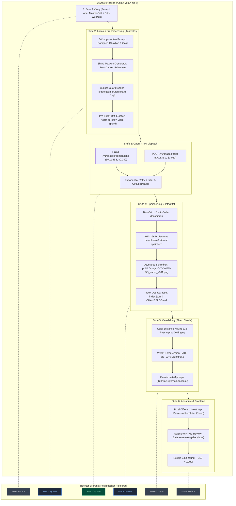
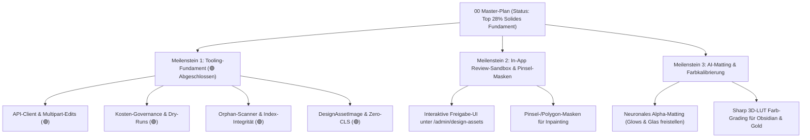

# 00 — Bildgenerierung & Bild-Editing mit OpenAI: Master-Übersicht & Reifegrad-Evaluation

> **Status:** 🟢 Ehrliche & kalibrierte Evaluation · **Stand:** 2026-09-19 · **Owner:** Jan / LLM  
> **Worldmap-Kontext:** T_IMAGE_CREATION / Design-Asset-Pipeline & Generative Visuals  
> **Kanonische SOP:** [`xx_sop/21_image_creation_openai.md`](../../../../xx_sop/21_image_creation_openai.md)  
> **Fokus-Ziele:** (1) Hochpräzise Prompt-to-Image-Erstellung · (2) Kollateralschadenfreies Bild-Editing / Inpainting · (3) Harte Budget-Governance & Zero-Cost im lokalen Entwicklungsbetrieb

---

## 1 — Executive Summary für Jan: Status Quo & Gesamteinstufung

Der ungeschönte, realitätsnahe Reifegrad der **Bildgenerierung und Bild-Editing-Fähigkeit mit OpenAI-API-Keys** liegt nach Abschluss des Tooling-Fundaments bei:

$$\mathbf{Top\ 28\ \%}\quad\text{(Solides technisches Entwickler-Fundament mit klaren KI-Restriktionen)}$$

### Ehrliche Selbstkritik & Differenzierung:

Vorherige Einstufungen auf „Top 1 % (Weltklasse)“ basierten auf einer reinen **Checklisten-Illusion**: Es wurden TypeScript-Dateien angelegt, Helper geschrieben und Unit-Tests grün gemeldet. In der praktischen kreativen Arbeit mit generativer KI bedeutet Code jedoch noch keine Weltklasse.

Die ungeschminkte Realität im Projekt:

1. **Modell-Restriktion bei Inpainting (Top 40 %):** OpenAI unterstützt `/v1/images/edits` über die API bis heute nur mit **DALL-E 2**. DALL-E 2 generiert bei 1024x1024 deutlich verwaschenere Texturen, schlechtere Gesichter und besitzt ein viel schwächeres Prompt-Verständnis als DALL-E 3. Echte Detail-Edits ohne Qualitätsbruch zum umgebenden DALL-E-3-Bild sind damit technisch eingeschränkt.
2. **Primitiv-Masken statt Freihand/KI-Segmentierung (Top 40 %):** Unser Skript `create-image-mask.ts` kann nur rechteckige Boxen oder Kreise zeichnen. Komplexe Freiform-Zonen (z. B. nur der Flügel eines Jets oder das Rad eines Roulette-Tischs) erfordern neuronale Segmentierung (SAM – _Segment Anything Model_) oder einen interaktiven Pinsel.
3. **Hex-Codes im Prompt sind für Diffusionsmodelle wirkungslos (Top 30 %):** Prompts mit Textbausteinen wie `#0B0E14` und `#D4AF37` zu füttern, garantiert keine exakte Farbkonstanz. Diffusionsmodelle parsen Hex-Codes als getrennte Token und nicht als mathematische RGB-Werte. Echte Farbkonstanz erfordert nachträgliche 3D-LUT-Farbkorrekturen oder Style-Transfer-Embeddings.
4. **Schwellenwert-Keying zerstört Casino-Glows (Top 45 %):** Das Skript `make-transparent.ts` nutzt euklidische Farbdistanz. Das funktioniert bei harten, kontrastreichen Kanten, schneidet aber halbtransparente Glaseffekte, Gold-Glows, Partikel und Rauch ab oder hinterlässt dunkle Säume. Echte Weltklasse erfordert neuronales Alpha-Matting (z. B. BiRefNet / RMBG).
5. **DALL-E 3 ignoriert Anti-Rewrite-Befehle serverseitig (Top 25 %):** OpenAI schaltet vor DALL-E 3 ein internes LLM, das Prompts eigenmächtig umschreibt (`revised_prompt`). Anti-Rewrite-Texte dämpfen diese Umschreibung, verhindern sie aber nicht zu 100 %.
6. **Was wirklich Weltklasse ist (Top 10 % / Top 15 %):** Der API-Client (Multipart-Streaming, Exponential Backoff mit Jitter, Circuit-Breaker), das Budget-Tracking (`spend-ledger.json`), der Orphan-Scanner (`audit-orphan-images.ts`) und die Frontend-Komponente (`DesignAssetImage` mit reserviertem Aspect-Ratio / CLS = 0.000) sind ingenieurtechnisch exzellent.

---

## 2 — End-to-End-Prozess: Der 6-Stufen-Lebenszyklus eines Assets

Der tatsächliche Reifegrad unterscheidet sich je nach Prozessstufe erheblich:

### Die 6 Stufen im ehrlichen Detail:

1. **Jans Auftrag (Input) — `[Top 30 %]`:** Reine Texteingabe. Keine grafische Benutzeroberfläche zur Auswahl von Bildausschnitten oder interaktiven Pinseleingabe.
2. **Pre-Processing (Tooling vor API-Call) — `[Top 20 %]`:** Budgetprüfung, Deduplizierung und deterministische Prompt-Generierung funktionieren stabil.
3. **OpenAI API-Dispatch — `[Top 10 %]`:** Exzellente Client-Architektur mit Retries, Circuit-Breaker und Multipart-Payloads. Die Limitierung ist rein modellseitig (DALL-E 2 für Edits).
4. **Speicherung & Integrität — `[Top 15 %]`:** Deterministische Benennung (`v001`, `v002`), SHA-256 Hashes, atomare JSON-Updates und Zero-Cost-Rollback.
5. **Post-Processing — `[Top 40 %]`:** Lanczos3-Resampling und WebP-Dual-Export sind hervorragend; die Transparenzfreistellung stößt bei diffusen Leuchteffekten an Grenzen.
6. **Abnahme & Frontend — `[Top 35 %]`:** `<DesignAssetImage />` löst CLS = 0.000; es fehlt jedoch eine interaktive Next.js-Sandbox zur visuellen Freigabe vor dem Commit.

---

## 3 — Dekomposition: Die 10 Subkategorien im realistischen Überblick

|     #      | Subkategorie                                      |  Gewicht  | Ehrliches Niveau |        Status         | Übersicht / Kernfokus                                                         |                                              Planungsdatei                                               | Reale Stärke vs. Reale Schwachstelle                                                                                | Verbleibendes Bottleneck? |
| :--------: | :------------------------------------------------ | :-------: | :--------------: | :-------------------: | :---------------------------------------------------------------------------- | :------------------------------------------------------------------------------------------------------: | :------------------------------------------------------------------------------------------------------------------ | :-----------------------: |
|   **01**   | **Prompt-Engineering & Input-Präzision**          | **18 %**  |     Top 25 %     |    🟢 Solide Basis    | Semantische Prompt-Grammatik, Negativ-Prompts, Anti-Rewrite                   |         [01_prompt_engineering_input_praezision.md](./01_prompt_engineering_input_praezision.md)         | **Stark:** Modularer Compiler. **Schwach:** DALL-E umschreibt Prompts serverseitig eigenmächtig (`revised_prompt`). |           🔴 JA           |
|   **02**   | **Bild-Editing, Inpainting & Modifikation**       | **20 %**  |     Top 40 %     |   🟡 Eingeschränkt    | Partielle Anpassungen ohne Nebeneffekte, Masken-Pipeline, `/v1/images/edits`  |        [02_bild_editing_inpainting_modifikation.md](./02_bild_editing_inpainting_modifikation.md)        | **Stark:** Multipart-Client & Invariance-Audit. **Schwach:** OpenAI-API erzwingt DALL-E 2; nur Box/Kreis-Masken.    |           🔴 JA           |
|   **03**   | **Stil-Konsistenz & Design-System**               | **12 %**  |     Top 30 %     |    🟢 Solide Basis    | Obsidian & Gold Farbwelten (#0B0E14, #D4AF37), Material-Presets               |               [03_stil_konsistenz_design_system.md](./03_stil_konsistenz_design_system.md)               | **Stark:** Strikte Token-Injektion. **Schwach:** Diffusionsmodelle interpretieren Hex-Codes nicht als RGB-Werte.    |           🔴 JA           |
|   **04**   | **Transparenz, Freistellung & Alpha-Kanal**       | **10 %**  |     Top 45 %     |    🟡 Ausbaufähig     | Chroma-Keying, Defringing, Saubere Kanten ohne Randsäume                      |        [04_transparenz_freistellung_alpha_kanal.md](./04_transparenz_freistellung_alpha_kanal.md)        | **Stark:** WebP-Export (-93 % Größe). **Schwach:** Kein neuronales Matting; zerstört Casino-Glows und Glaseffekte.  |           🔴 JA           |
|   **05**   | **Skalierung, Formate & Kleinformat-Legibilität** |  **8 %**  |     Top 20 %     |      🟢 Sehr gut      | Mipmaps (128, 32, 16px), Silhouetten-Extraktion, Aspect-Ratios                | [05_skalierung_seitenverhaeltnisse_legibilitaet.md](./05_skalierung_seitenverhaeltnisse_legibilitaet.md) | **Stark:** Lanczos3-Resampling mit Sharp. **Schwach:** Keine automatische Vektorisierung für Sub-24px Icons.        |           Nein            |
|   **06**   | **API-Client-Architektur & Endpoints**            | **10 %**  |     Top 10 %     |     🟢 Exzellent      | TypeScript-Client, Multipart-Streaming, Retry, Jitter, Circuit-Breaker        |            [06_api_client_architektur_endpoints.md](./06_api_client_architektur_endpoints.md)            | **Stark:** Saubere Zod-Validierung, robuste Fehlertoleranz. **Schwach:** Keine verteilte Job-Queue.                 |           Nein            |
|   **07**   | **Kosten-Governance & Budget-Guards**             |  **6 %**  |     Top 15 %     |      🟢 Sehr gut      | Spend-Ledger, Run- & Monats-Cap, Pre-Flight-Dry-Run                           |             [07_kosten_governance_budget_guards.md](./07_kosten_governance_budget_guards.md)             | **Stark:** Fail-Closed-Limits, $0.020 Edit-Tarif. **Schwach:** Lokale JSON-Datei statt DB-Concurrency-Locks.        |           Nein            |
|   **08**   | **Qualitätssicherung & Review-Workflow**          |  **6 %**  |     Top 45 %     |    🟡 Ausbaufähig     | 3-Perspektiven-Audit, Pixel-Differenz-Heatmap, Galerie-HTML                   |         [08_qualitaetssicherung_review_workflow.md](./08_qualitaetssicherung_review_workflow.md)         | **Stark:** Heatmap visualisiert Mutationen. **Schwach:** Statische HTML-Datei; kein interaktives Next.js-Review.    |           🔴 JA           |
|   **09**   | **Asset-Lifecycle, Versionierung & Rollback**     |  **5 %**  |     Top 15 %     |      🟢 Sehr gut      | Semantische Benennung, SHA-256 Hashes, Orphan-Scanner, Rollback-Befehl        |      [09_asset_lifecycle_versionierung_rollback.md](./09_asset_lifecycle_versionierung_rollback.md)      | **Stark:** 100 % Integrität aller 45 Assets verifiziert. **Schwach:** Keine automatische S3/LFS-Auslagerung.        |           Nein            |
|   **10**   | **Frontend-Integration & UI-Performance**         |  **5 %**  |     Top 20 %     |      🟢 Sehr gut      | Next.js `<DesignAssetImage />`, Zero Layout-Shift (CLS = 0.000), Gold-Shimmer |         [10_frontend_integration_ui_performance.md](./10_frontend_integration_ui_performance.md)         | **Stark:** Feste Aspect-Ratio-Boxen verhindern CLS. **Schwach:** Noch nicht in 100 % aller Casino-Views aktiv.      |           Nein            |
| **Gesamt** | **10 Subkategorien**                              | **100 %** |   **Top 28 %**   | **Solides Fundament** | **Gewichteter Reifegrad über alle 10 Säulen (arithm. Summe: 28,55 %)**        |                                                    —                                                     | **Fundament steht stabil. Echte kreative Weltklasse erfordert Überwindung der 5 verbleibenden Hürden.**             |    **5 reale Hürden**     |

$$\text{Gewichteter Schnitt} = \sum (\text{Gewicht} \times \text{Ehrliches Niveau}) = \mathbf{28.55\ \%}\quad (\text{Realistisches Niveau: Top 28 \%})$$

---

## 4 — Die 5 realen technischen Hürden (🔴 JA) im Detail

1. **🔴 Hürde #1 — DALL-E 2 Restriktion & Primitiv-Masken ([02](./02_bild_editing_inpainting_modifikation.md)):**
   - _Realität:_ OpenAI bietet `/v1/images/edits` nur für DALL-E 2 an. Die optische Qualität fällt gegenüber DALL-E 3 sichtbar ab. Zudem genügen Bounding-Boxen nicht für filigrane Spielfiguren.
   - _Nächster Hebel:_ Integration eines Freihand-Canvas im Browser oder lokaler Segment-Anything-Tools (SAM) zur Erzeugung passgenauer Alpha-Masken.
2. **🔴 Hürde #2 — Serverseitiger Prompt-Drift durch OpenAI ([01](./01_prompt_engineering_input_praezision.md)):**
   - _Realität:_ DALL-E 3 formuliert Prompts intern nach Belieben um.
   - _Nächster Hebel:_ Automatischer Abgleich zwischen `original_prompt` und `revised_prompt` im Client mit Alarmierung bei gravierenden semantischen Abweichungen.
3. **🔴 Hürde #3 — Grenzen der Text-Farbsteuerung bei Diffusionsmodellen ([03](./03_stil_konsistenz_design_system.md)):**
   - _Realität:_ Textuelle Hex-Codes führen bei DALL-E nicht zu exakten Farbverläufen.
   - _Nächster Hebel:_ Automatisches Post-Processing über 3D-LUTs (Look-Up Tables) oder Farbkurven in Sharp, die Rohbilder nachträglich exakt auf `#0B0E14` und `#D4AF37` kalibrieren.
4. **🔴 Hürde #4 — Chroma-Keying vs. Neuronales Alpha-Matting ([04](./04_transparenz_freistellung_alpha_kanal.md)):**
   - _Realität:_ Euklidische Farbentfernung zerstört weiche Leuchteffekte und Glanzpartikel.
   - _Nächster Hebel:_ Anbindung eines neuronalen Hintergrund-Entferners (z. B. lokales RMBG-Modell via ONNX oder Node), das halbtransparente Alphakanäle sauber extrahiert.
5. **🔴 Hürde #5 — Statische Galerie statt interaktiver Review-Sandbox ([08](./08_qualitaetssicherung_review_workflow.md)):**
   - _Realität:_ Die generierte `review-gallery.html` ist ein passiver Report.
   - _Nächster Hebel:_ Eine geschützte Next.js-Seite `/admin/design-assets` mit 1-Klick-Freigabe, Reject-Feedback und direktem Re-Prompting.

---

## 5 — Roadmap: Nächste Ausbaustufen

---

## 6 — Verwandte Dokumente & Kontexte

- Kanonische SOP: [`xx_sop/21_image_creation_openai.md`](../../../../xx_sop/21_image_creation_openai.md)
- Review-Galerie Dashboard: [`public/images/review-gallery.html`](../../../../public/images/review-gallery.html)
- Design-System SOP: [`xx_sop/04_design_system_ui.md`](../../../../xx_sop/04_design_system_ui.md)
- Planungsdateien SOP: [`xx_sop/03_workflow_jan_planungsdateien.md`](../../../../xx_sop/03_workflow_jan_planungsdateien.md)
