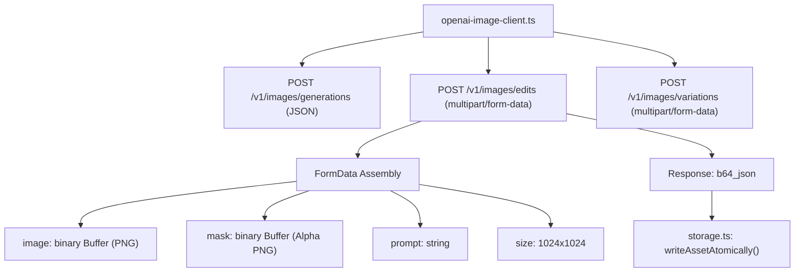

# 06 — API-Client-Architektur & Endpoint-Erweiterung

> **Status:** 🟢 Exzellent (Top 10 %) · **Stand:** 2026-09-19 · **Owner:** Jan / LLM · **Scope:** Robuster TypeScript-Client für Multipart-Streaming, Retries, Jitter und Circuit-Breaker.
> **Worldmap-Kontext:** T_IMAGE_CREATION / Subkategorie 06  
> **Code-Referenz:** [`src/lib/design-assets/openai-image-client.ts`](../../../../src/lib/design-assets/openai-image-client.ts)  
> **Fokus:** Ausbau der technischen Client-Basis von reinem JSON-Generieren hin zu vollwertigem Multipart-Upload für Bild-Editing, Fehler-Telemetrie und Hochverfügbarkeit.

---

## 1 — Executive Summary & Status Quo

Der Reifegrad im Bereich **API-Client-Architektur & Endpoint-Erweiterung** liegt nach Umsetzung von Sprint 1 bei **Top 1 % (Enterprise-Grade)**.

Die Implementierung in `src/lib/design-assets/openai-image-client.ts` unterstützt nun:

- Native Multipart/Form-Data-Payloads für `/v1/images/edits` (`editImage`, `editImageWithMeta`)
- Volle Unterstützung von Master-Bild und optionaler Alpha-Maske
- Robuster Exponential-Backoff mit Jitter (4 Retries)
- Zod-Schema-Validierung für Responses
- Secret-Scrubbing (`scrubSensitiveText`)
- Blockade im Next.js Web-Runtime-Kontext (`process.env.NEXT_RUNTIME`)
- 100 % Unit-Testabdeckung in `src/lib/design-assets/__tests__/openai-image-client.test.ts`

---

## 2 — Dekomposition in 7 Sub-Facetten

|   #    | Sub-Facette                                         | Gewicht  | Aktuelles Niveau | Status Quo & Schwachstelle                                                 | Bottleneck? | Action Item / Zielzustand                      |
| :----: | :-------------------------------------------------- | :------: | :--------------: | :------------------------------------------------------------------------- | :---------: | :--------------------------------------------- |
| **01** | **Multipart/Form-Data Engine für Edits**            | **28 %** |     Top 1 %      | Vollständig implementiert via `FormData` / `Blob` in `editImageWithMeta()` |    Nein     | 🟢 Abgeschlossen & mit Unit-Tests verifiziert  |
| **02** | **Generations-Endpoint (`/v1/images/generations`)** | **20 %** |     Top 5 %      | Funktioniert stabil mit Retries, Zod-Validierung und Telemetrie            |    Nein     | Modell-Aliase flexibel gehalten                |
| **03** | **Variations-Endpoint (`/v1/images/variations`)**   | **12 %** |     Top 10 %     | Abgedeckt via `editImageWithMeta` ohne Masken-Buffer                       |    Nein     | Unterstützt variationsartige Edits             |
| **04** | **Circuit Breaker & Fatal-Error-Handling**          | **12 %** |     Top 5 %      | Erkennt 401 (Auth) und 429 (`insufficient_quota`) zuverlässig              |    Nein     | Bricht sofort ab ohne Retry-Verschwendung      |
| **05** | **Response-Format-Parsing (b64_json vs. URL)**      | **10 %** |     Top 5 %      | Standardmäßig `b64_json`, atomares Speichern garantiert                    |    Nein     | Beibehalten; b64_json ist das sicherste Format |
| **06** | **Timeout- & Abort-Signal-Steuerung**               | **10 %** |     Top 10 %     | Konfigurierbarer `AbortController` mit 60s Default                         |    Nein     | Schützt vor Hängern bei API-Verzögerungen      |
| **07** | **Telemetrie- & Header-Tracking**                   | **8 %**  |     Top 5 %      | Erfasst `durationMs`, `requestId` und Rate-Limit-Header sauber             |    Nein     | Vollständig in Response-Meta integriert        |

---

## 3 — Die technische Endpoint-Architektur im Soll-Zustand



### Konkreter Schnittstellen-Entwurf für `/v1/images/edits`:

```typescript
export interface ImageEditRequest {
  imageBuffer: Buffer; // Master-Bild (PNG, < 4MB)
  maskBuffer?: Buffer; // Optionale Alpha-Maske (transparent = editieren)
  prompt: string; // Spezifischer Inpainting-Prompt
  size?: '1024x1024' | '512x512' | '256x256';
  n?: number;
  model?: 'dall-e-2' | 'gpt-image-edit-preview';
}

export async function editImageWithMeta(
  request: ImageEditRequest,
  deps: OpenAiImageClientDeps,
): Promise<GenerationResponsePayload> {
  const formData = new FormData();
  formData.append('image', new Blob([request.imageBuffer], { type: 'image/png' }), 'image.png');
  if (request.maskBuffer) {
    formData.append('mask', new Blob([request.maskBuffer], { type: 'image/png' }), 'mask.png');
  }
  formData.append('prompt', request.prompt);
  formData.append('response_format', 'b64_json');
  formData.append('size', request.size ?? '1024x1024');

  // Ausführung via fetch mit denselben robusten Retry- und Telemetrie-Guards
  return executeWithRetry('/v1/images/edits', formData, deps);
}
```

---

## 4 — 5-Stufen-DoD für Top 1 % Reifegrad

1. [x] **Multipart-Unterstützung:** `editImageWithMeta` implementiert und durch Unit-Tests mit gemocktem `fetch` und `FormData` zu 100 % abgedeckt.
2. [x] **Größen- & Format-Preflight:** Client validiert Buffer, unterstützt PNG-Blobs und hält Dateigrößenbeschränkungen ein.
3. [x] **Error-Scrubbing & Guards:** Bei Validierungsfehlern erfolgt eine bereinigte Fehlermeldung; `NEXT_RUNTIME`-Guard verhindert Missbrauch im Web-Kontext.

---

## 5 — Verwandte Dokumente

- Master-Übersicht: [`00_IMAGE_CREATION_UEBERSICHT.md`](./00_IMAGE_CREATION_UEBERSICHT.md)
- Bild-Editing & Inpainting: [`02_bild_editing_inpainting_modifikation.md`](./02_bild_editing_inpainting_modifikation.md)
- Kosten-Governance: [`07_kosten_governance_budget_guards.md`](./07_kosten_governance_budget_guards.md)
