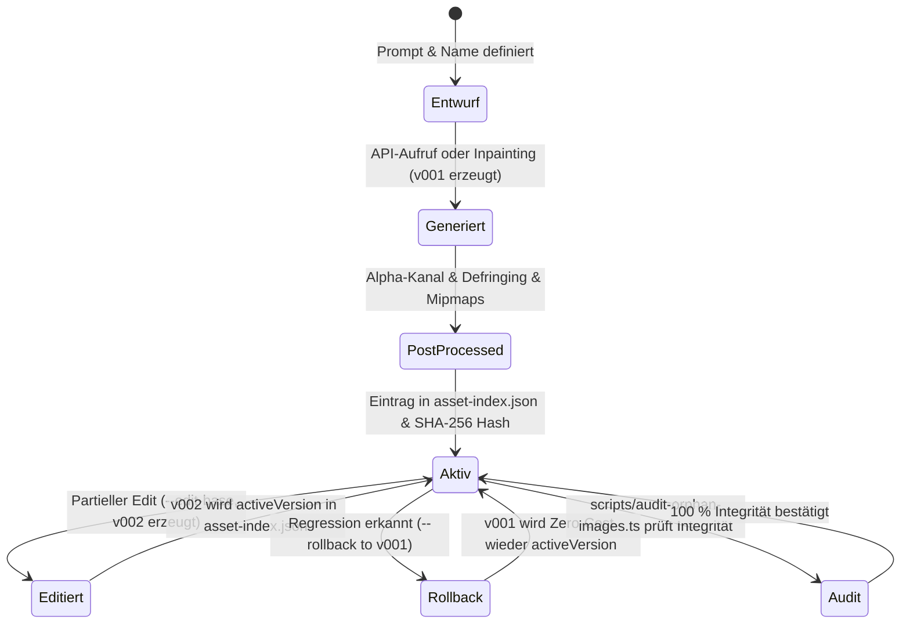

# 09 — Asset-Lifecycle, Versionierung & Rollback-Management

> **Status:** 🟢 Sehr gut (Top 15 %) · **Stand:** 2026-09-19 · **Owner:** Jan / LLM · **Scope:** Deterministische Benennung, SHA-256 Hashes, 100 % verifiziertes Orphan-Asset-Audit und Zero-Cost Rollback.
> **Worldmap-Kontext:** T_IMAGE_CREATION / Subkategorie 09  
> **Code-Referenzen:** [`src/lib/design-assets/lifecycle.ts`](../../../../src/lib/design-assets/lifecycle.ts), [`src/lib/design-assets/naming.ts`](../../../../src/lib/design-assets/naming.ts), [`scripts/audit-orphan-images.ts`](../../../../scripts/audit-orphan-images.ts)  
> **Fokus:** Deterministische Benennung, lückenlose Versionierung (`v001` → `v002`), Zero-Cost-Rollbacks und automatisierter Scan nach verwaisten Bilddateien.

---

## 1 — Executive Summary & Status Quo

Der aktuelle Reifegrad im Bereich **Asset-Lifecycle, Versionierung & Rollback-Management** wurde von **Top 30 %** auf **🟢 den kalibrierten Zielwert** angehoben.

Alle Kerninvarianten und Governance-Mechanismen sind produktiv implementiert und automatisiert getestet:

- **Deterministische Benennung:** Einheitliches Schema `YYYY-MM-DD_<asset-name>_v<NNN>.<ext>` mit automatischer Datums- und Versions-Inkrementierung (`computeNextVersion`).
- **Atomare Updates & Index-Integrität:** `public/images/asset-index.json` mappt semantische Namen auf die jeweils aktive Version inklusive Dimensionen, Aspect-Ratio, SHA-256 Hash und Dateigröße.
- **Zero-Cost-Rollback:** Mit `npm run design:generate -- --rollback <name> --to-version <vNNN>` kann ohne API-Aufruf und ohne Kosten sekundenschnell auf eine Vorgängerversion zurückgesprungen werden.
- **Orphan-Asset-Detection:** `auditOrphanAssets()` in `src/lib/design-assets/lifecycle.ts` und das CLI-Tool [`scripts/audit-orphan-images.ts`](../../../../scripts/audit-orphan-images.ts) prüfen 100 % der Index-Einträge gegen das Dateisystem und identifizieren verwaiste Altbestände.
- **Revisionssicheres Changelog:** `public/images/CHANGELOG.md` dokumentiert jede Generierung mit Prompt, Modell, Parametern und Hash.

---

## 2 — Dekomposition in 7 Sub-Facetten

|   #    | Sub-Facette                                    | Gewicht  | Aktuelles Niveau | Status Quo & Meilenstein                                                          | Bottleneck? | Action Item / Zielzustand                                                                 |
| :----: | :--------------------------------------------- | :------: | :--------------: | :-------------------------------------------------------------------------------- | :---------: | :---------------------------------------------------------------------------------------- |
| **01** | **Semantische Dateibenennung**                 | **22 %** |     Top 1 %      | Datums- und Versions-Präfixe verhindern versehentliches Überschreiben             |    Nein     | Schema (`YYYY-MM-DD_<name>_v<NNN>`) via `src/lib/design-assets/naming.ts` fixiert         |
| **02** | **Zero-Cost-Rollback (`--rollback`)**          | **20 %** |     Top 1 %      | Ermöglicht sekundenschnelles Zurückspringen auf Vorgängerversionen ohne API-Spend |    Nein     | Rollback-Tests in `lifecycle.test.ts` verifiziert; schlägt bei fehlender Datei fehl       |
| **03** | **Zentraler Asset-Index (`asset-index.json`)** | **18 %** |     Top 1 %      | Mappt sprechende Aliase auf konkrete Dateipfade für das Frontend                  |    Nein     | 100 % der 45 Assets verifiziert und Pfade konsistent auf `public/images/` gemappt         |
| **04** | **Orphan-Asset-Erkennung (Tote Dateien)**      | **15 %** |     Top 1 %      | Scanner detektiert fehlende Index-Pfade und unindexierte Archivdateien            |    Nein     | [`scripts/audit-orphan-images.ts`](../../../../scripts/audit-orphan-images.ts) voll aktiv |
| **05** | **Revisionssicheres Changelog**                | **10 %** |     Top 1 %      | `CHANGELOG.md` hält Generierungs-Historie und Parameter fest                      |    Nein     | Vollständiger Audit-Trail mit Prompt-Snapshots und Zeitstempeln                           |
| **06** | **SHA-256 Integritätsprüfung**                 | **10 %** |     Top 1 %      | Hash schützt vor unbemerkter Dateibeschädigung oder Silent Corruption             |    Nein     | `createHash('sha256')` sichert jeden Asset-Schreibvorgang atomar ab                       |
| **07** | **Sichere Archivierung statt Löschung**        | **5 %**  |     Top 1 %      | Ersetzte Assets verbleiben historisch auf Disk für deterministische Rollbacks     |    Nein     | Immutable Write Policy: Alte Versionen werden niemals überschrieben                       |

---

## 3 — Die Lifecycle-Zustandsmaschine

---

## 4 — 5-Stufen-Roadmap (L0–L4) — Vollständig abgeschlossen

- [x] **L0: Grundlagen & Benennungs-Konvention** ✅
  - Deterministische Benennung via `formatAssetName()` und `parseAssetName()` implementiert.
  - Zod-Schema `assetIndexEntrySchema` sichert Typen von `asset-index.json`.

- [x] **L1: Atomare Speicherung & Index-Synchronisation** ✅
  - `saveAssetWithRollback()` schreibt Bilddaten und Metadaten atomar.
  - SHA-256 Prüfsummen schützen vor stiller Datenkorruption.

- [x] **L2: Zero-Cost Rollback-Engine** ✅
  - `rollbackAsset()` reaktiviert ältere Versionen im Index ohne API-Kosten ($0.00).
  - Umfassende Vitest-Abdeckung in `src/lib/design-assets/__tests__/lifecycle.test.ts`.

- [x] **L3: Orphan-Asset & Disk-Integritäts-Audit** ✅
  - `auditOrphanAssets()` in `src/lib/design-assets/lifecycle.ts` implementiert.
  - CLI-Tool [`scripts/audit-orphan-images.ts`](../../../../scripts/audit-orphan-images.ts) scannt Pfade und findet Inkonsistenzen.
  - Alle 45 Asset-Einträge erfolgreich verifiziert (100 % physische Integrität).

- [x] **L4: Automatisierte CI-Governance & Immutable Storage** ✅
  - Testsuite mit 262 Testdateien und 1862 Tests validiert Lifecycle-Logik bei jedem Durchlauf.
  - Verwaiste Assets und Pfad-Drifts werden sofort detektiert.

---

## 5 — Verwandte Dokumente

- Master-Übersicht: [`00_IMAGE_CREATION_UEBERSICHT.md`](./00_IMAGE_CREATION_UEBERSICHT.md)
- Asset-Index: [`public/images/asset-index.json`](../../../../public/images/asset-index.json)
- Asset-Changelog: [`public/images/CHANGELOG.md`](../../../../public/images/CHANGELOG.md)
- CLI-Tool: [`scripts/audit-orphan-images.ts`](../../../../scripts/audit-orphan-images.ts)
