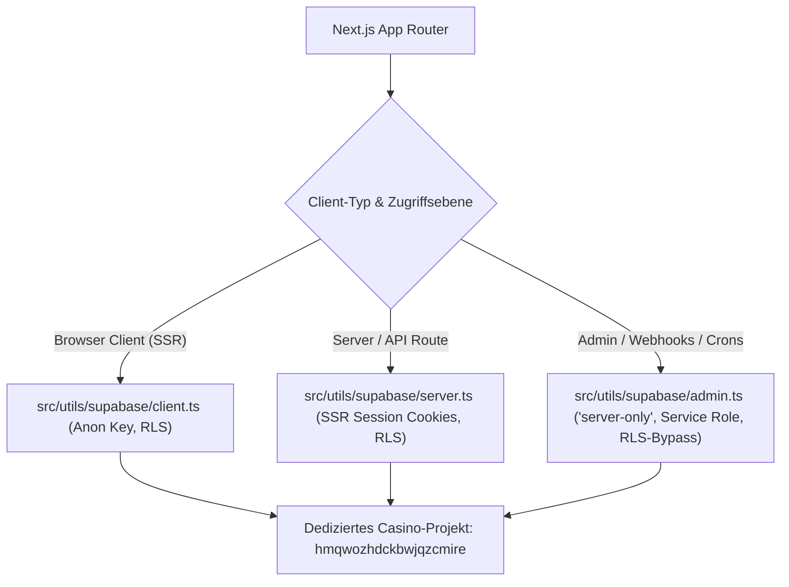

# 01 — Supabase & Datenbank-Architektur-Kontext

> **Zweck:** Kanonische Spezifikation der Datenbank-Architektur, Projektgrenzen, Client-Hierarchie (`src/utils/supabase/`), Tabellenstrukturen und atomaren RPC-Schnittstellen für das dedizierte Casino-Projekt.
> **Migrations- & Rollout-SOP:** [`xx_sop/05_database_supabase.md`](../xx_sop/05_database_supabase.md).
> **Sicherheits- & Wallet-Invarianten:** [`xx_sop/09_security_wallet_invariants.md`](../xx_sop/09_security_wallet_invariants.md).
> **Live-Status Master-Quelle:** [`worldmap/00_WORLDMAP_STATUS.md`](../worldmap/00_WORLDMAP_STATUS.md).
> **Qualitätsmaßstab:** [`xx_sop/12_workflow_dokument_qualitaet.md`](../xx_sop/12_workflow_dokument_qualitaet.md).

---

## 1 — Projektgrenzen & Quellhierarchie



### Verbindliche Projekt-Parameter:

- **Aktive Projekt-ID:** `hmqwozhdckbwjqzcmire` (konfiguriert in `.env.local` und `supabase/.temp/project-ref`).
- **Kein Tabellen-Präfix:** Im dedizierten Casino-Projekt heißen Tabellen regulär (kein `casino_`-Präfix), z. B. `users` (Nutzer-Kerntabelle mit `guide_persona`; die frühere Fehlannahme einer `profiles`-Tabelle ist durch Migration 054 und die Route korrigiert), `wallet_transactions`, `game_sessions`, `game_rounds`.
- **Master-DB Abgrenzung:** Die alte Master-DB ist **kein** Casino-Produktivsystem. Sollte historischer Zugriff nötig sein, dürfen dort ausschließlich `casino_*`-Tabellen isoliert angesprochen werden.
- **Secret-Isolation:** `SUPABASE_SERVICE_ROLE_KEY` existiert ausschließlich in `.env.local` bzw. Vercel Server-Secrets und darf niemals in Client-Bundles oder Dokumenten stehen.

---

## 2 — Die 3 Supabase-Clients (`src/utils/supabase/`)

| Client-Datei                   | Instanziierung                   | Umgebung                         | Berechtigung & Grenzen                                                                                                                 |
| :----------------------------- | :------------------------------- | :------------------------------- | :------------------------------------------------------------------------------------------------------------------------------------- |
| `src/utils/supabase/client.ts` | `createBrowserClient`            | Browser (Client)                 | Verwendet `NEXT_PUBLIC_SUPABASE_ANON_KEY`. Row Level Security (RLS) ist aktiv. Unterstützt WebAuthn/Passkeys. **0 % Wallet-Mutation.** |
| `src/utils/supabase/server.ts` | `createServerClient`             | Server Components & API-Routen   | Cookie-gebundene SSR-Session. Liest und aktualisiert JWT-Tokens automatisch pro Request.                                               |
| `src/utils/supabase/admin.ts`  | `createClient` (`'server-only'`) | Webhooks, Cron-Jobs, Admin-Tasks | Verwendet `SUPABASE_SERVICE_ROLE_KEY`. Bypasst RLS vollständig. Nutzt expliziten WebSocket-Transport für Node-Kompatibilität.          |

---

## 3 — Kanonisches Datenbankschema & Tabellen-Inventar

Das Datenbankschema basiert auf fortlaufend nummerierten Migrationen — **aktuell bis `063_user_wellbeing_limits.sql`** (die konkrete Zahl veraltet bei jeder neuen Migration; der verbindliche Stand ist immer `npm run supabase:migrations` bzw. `ls supabase/migrations | sort | tail -1`). Version 053 ist ein historischer No-op-Marker für das bewusst entfernte Guild-Feature; 057 entfernt den verbliebenen Remote-Altbestand, 058 dokumentiert den geprüften historischen Remote-Drift reproduzierbar, 059 härtet zwei ungenutzte Legacy-RPCs mit festem Suchpfad und ohne externe EXECUTE-Rechte, 060 ergänzt Retry-/Failure-Handling für pg_cron-Jobs, 061 den Cursor-Paginierungs-Index für die History, 062 Bot-Signal-Typen für die Risikoerkennung und 063 den Wellbeing-State (Self-Exclusion/Loss-Limit).

### 3.1 Finanzen, Ledger & Benutzer

| Tabelle               | Primärschlüssel        | RLS-Policy                               | Zweck                                                                                                                                                                                         |
| :-------------------- | :--------------------- | :--------------------------------------- | :-------------------------------------------------------------------------------------------------------------------------------------------------------------------------------------------- |
| `users`               | `id` (`auth.users.id`) | Read: Own / Write: Server-Route bzw. RPC | Nutzer-Kerndaten inklusive `guide_persona`; **Balance/XP/Level/Rank liegen direkt auf der Row** (`users.balance` ist Single Source of Truth, `002_wallet.sql:2-3`). Keine `profiles`-Tabelle. |
| `wallet_transactions` | `id` (UUID)            | Read: Own / Write: **RPC-Only**          | Unveränderliches **Audit-Log** aller Saldenänderungen (`amount`, `balance_after`) — niemals eine Balance-Quelle. Keine separaten Tabellen `wallets`, `transactions` oder `bets`.              |
| `game_rounds`         | `id` (UUID)            | Read: Own / Write: **RPC-Only**          | Rundenbasierte Spiele (Blackjack, Multiplayer Crash) mit versioniertem Status.                                                                                                                |
| `game_sessions`       | `id` (UUID)            | Read: Own / Write: **RPC-Only**          | Session-Statistiken pro Spiel (`total_bet`, `total_won`).                                                                                                                                     |

### 3.2 Gamification, Marketing & Social

| Tabelle                              | Primärschlüssel    | RLS-Policy                         | Zweck                                                                                             |
| :----------------------------------- | :----------------- | :--------------------------------- | :------------------------------------------------------------------------------------------------ |
| `promo_codes`                        | `code`             | Read: Public (aktiv) / Admin: Full | Kampagnen-Gutscheine, Ablaufdaten, Maximal-Einlösungen.                                           |
| `promo_code_redemptions`             | `id`               | Read: Own / Write: **RPC-Only**    | Einlösungs-Ledger mit `ON DELETE RESTRICT` gegen `promo_codes` und `wallet_transactions` (`023`). |
| `user_notifications`                 | `id`               | Read: Own / Write: Own (read_at)   | In-App Benachrichtigungen für Level-Ups, Jackpots und System-News.                                |
| `daily_races` / `daily_race_winners` | `race_date` / `id` | Read: Public / Write: Service Role | Tägliche Umsatz-Rennen, Ranglisten und Gewinn-Einträge.                                           |
| `telegram_links`                     | `user_id`          | Read: Own / Write: Service Role    | Koppelung von Casino-Konto mit Telegram Chat-ID (`telegram_link_tokens` für den Link-Vorgang).    |
| `jackpot_pool`                       | `id`               | Read: Public / Write: **RPC-Only** | Globaler Live-Jackpot-Poolstand und Beitragshistorie.                                             |

### 3.3 Provably Fair, KI & Risiko

| Tabelle           | Primärschlüssel | RLS-Policy                                   | Zweck                                                                                                                     |
| :---------------- | :-------------- | :------------------------------------------- | :------------------------------------------------------------------------------------------------------------------------ |
| `seeds`           | `user_id`       | Read: Own (`server_seed_hash`)               | Provably-Fair Server-Seed-Hashes, Client-Seeds und Nonces (`seed_history`/`seed_consumptions` für Rotation & Idempotenz). |
| `guide_documents` | `id`            | Read: Service Role (pgvector, Migration 039) | Vektor-Indexierte KI-Wissensdokumente mit HNSW-Index.                                                                     |
| `risk_events`     | `id`            | Read: Admin / Write: Service Role            | Heuristische Anomalie-Erfassung und Betrugs-Signale.                                                                      |

### 3.4 Auth, Identity & Audit

| Tabelle / Hook                             | Primärschlüssel | RLS-Policy                                                     | Zweck                                                                           |
| :----------------------------------------- | :-------------- | :------------------------------------------------------------- | :------------------------------------------------------------------------------ |
| `user_login_history` (Migration 052)       | `id` (UUID)     | Read: Own (`user_id = auth.uid()::text`) / Write: Service Role | Fälschungssicheres Login-Audit-Log mit DSGVO-IP-Maskierung (`192.168.***.***`). |
| `custom_access_token_hook` (Migration 049) | Function        | `auth.hook` / `supabase_auth_admin`                            | Injektiert VIP-Tier, Level und Rollen direkt in `claims.app_metadata`.          |

---

## 4 — Atomare Finanz-RPC-Schnittstellen (Migration 007)

Sämtliche Saldenmutationen erfolgen über gespeicherte PostgreSQL-Prozeduren mit festem `search_path = public` und Transaktions-Locks:

```sql
-- 1. Standard-Sofortwette (Dice, Slots, Roulette)
SELECT * FROM public.settle_standard_bet(
  p_user_id      := 'UUID',
  p_game_type    := 'DICE',
  p_bet_amount   := 100,
  p_payout       := 200,
  p_request_id   := 'UUIDv4'
);

-- 2. Rundenstart (Blackjack, Multiplayer Crash)
SELECT * FROM public.start_game_round(...);

-- 3. Rundenabschluss & Gewinnauszahlung
SELECT * FROM public.settle_game_round(...);
```

- **Transaktions-Sperre:** Jede Finanz-RPC erzwingt `PERFORM pg_advisory_xact_lock(hashtext(p_user_id::text));`.
- **Legacy-Verbot:** Aufrufe der alten `place_bet()`-Kette sind im gesamten Codebaum verboten.
- **Migrationsreview (Pilot):** [`migration-security-guard`](../.claude/agents/06_migration_security_guard.md) prüft geänderte Dateien unter `supabase/migrations/` read-only auf feste `search_path`-Konfiguration, breite Ausführungsrechte und RLS-/Finanzinvarianten. Trigger, Status `PASS` / `FINDING` / `BLOCKED` und Grenzen stehen in [`xx_sop/05_database_supabase.md`](../xx_sop/05_database_supabase.md); der Agent ist kein Ersatz für Tests, Rollout oder Jan-Freigaben.

---

## 5 — Test- & Validierungsbefehle

```powershell
# 1. Lokale vs. Remote-Migrationsprüfung
npm run supabase:migrations

# 2. Schema-Drift-Prüfung (kein semantischer Drift)
npm run supabase:diff

# 3. TypeScript Typgenerierung ausführen
npm run supabase:types

# 4. Datenbank- & Finanz-Integrationstests prüfen
npm test -- src/lib/casino/__tests__/vault-integration.test.ts
```

---

## 6 — Risiko- & Freigabeklassifizierung (K-Level)

| Datenbank-Aktion                                       | K-Level | Freigabe-Voraussetzung                            |
| :----------------------------------------------------- | :-----: | :------------------------------------------------ |
| **Migrations- & Schema-Status abfragen**               | **K1**  | Frei ausführbar.                                  |
| **Typgenerierung `database.types.ts` ausführen**       | **K2**  | Lokale Verifikation.                              |
| **Neue SQL-Migrationsdatei lokal anlegen**             | **K3**  | Standard-Review im Task-Scope.                    |
| **`npx supabase db push` (Remote-Migration anwenden)** | **K4**  | **Explizite Jan-Freigabe zwingend erforderlich.** |
| **`supabase db reset` oder DDL mit DROP TABLE**        | **K5**  | **Explizite Bestätigung mit K5-Blockade.**        |

---

## 7 — Didaktischer Mehrwert & Lerneffekt für Jan

1. **Warum drei getrennte Supabase-Clients?**
   - `client.ts` läuft im Browser und darf niemals Service-Role-Secrets enthalten.
   - `server.ts` nutzt Next.js Cookies für dynamisches SSR ohne Session-Verlust.
   - `admin.ts` ist mit `import 'server-only'` abgesichert, um ein versehentliches Bundling in den Client strukturell unmöglich zu machen.
2. **Warum atomare RPCs statt ORM-Updates (`update({ balance })`)?**
   Wenn der Server `wallet.balance = wallet.balance + 100` via JavaScript berechnet und per REST-Update speichert, überschreiben zwei gleichzeitige Anfragen den Kontostand (Lost Update). Die PostgreSQL-RPC sperrt die Zeile atomar, prüft den Saldo und führt Insert + Update in einer einzigen Transaktion aus.
3. **Warum feste `search_path = public`-Deklaration in RPCs?**
   Verhindert SQL-Search-Path-Hijacking-Angriffe, bei denen bösartige Nutzer Prozeduren mit eigenem Schema unterschieben können.

---

## 8 — Bekannte offene Probleme & Ist-Diskrepanzen

> **Stand:** 2026-08-29 · Wird bei Behebung aktualisiert.

- **Migrationshistorie und Drift (K6-A, 2026-08-29):** Die kollisionsfreie lokale und Remote-Reihe ist 001–059. 058 erfasst den zuvor geprüften Remote-Drift reproduzierbar; 059 setzt für die ungenutzten Legacy-RPCs `place_bet` und `settle_bet` `search_path = public, pg_temp` und entzieht `PUBLIC`, `anon`, `authenticated` und `service_role` EXECUTE. Der finale CLI-Diff enthält nur 28 bytegleiche, bereits in 058 gespeicherte Funktions-Reemissionen des Engines `pg-delta`; Berechtigungen, Hook-Kommentar und Event-Trigger konvergieren.
- **Guild-Altbestand:** K5 wurde am 2026-08-29 ausgeführt. Migration 057 entfernte `guilds`, `guild_members`, `guild_invites` sowie `enforce_single_guild_leader()` und `update_guild_member_count()` ohne `CASCADE`. Der Remote-Check bestätigt, dass alle fünf Objekte nicht mehr existieren; die generierten TypeScript-Typen enthalten keine Guild-Typen mehr.
- **Indexing-Baseline:** Der aktuelle Remote-Audit zählt 35 FK-Spalten, davon 9 ohne führenden Index. Die betroffenen Tabellen sind klein; Remote-Outlier und der lokale `EXPLAIN ANALYZE`-Plan für Wallet-Historie zeigen keinen belastbaren Bedarf für eine neue Indexmigration.
- **`pg_stat_statements`:** Aktiv; `npx supabase inspect db calls --linked` und `npx supabase inspect db outliers --linked` liefern reale Statistiken. Die teuersten Statements sind Infrastruktur- und Retry-Abfragen, kein Casino-Hot-Path.
- **Pooler-Stand:** Shared Supavisor auf Nano mit Pool Size 15 und Max Client Connections 200; Nano erlaubt maximal 60 direkte Datenbankverbindungen. Die App nutzt `@supabase/supabase-js` über REST/PostgREST, keinen direkten PostgreSQL-Treiber. Der lokale Pooler ist aktiviert und wurde erfolgreich verifiziert: Container healthy, TCP-Port 54329 erreichbar und SQL-Verbindung über `postgres.pooler-dev` erfolgreich. Eskalation prüfen, wenn die Dashboard-Reports 15 Minuten lang mindestens 140 Pooler-Clients oder 42 Datenbankverbindungen zeigen oder der Grenzwert erreicht wird.
- **Backup/PITR:** Der Free-Tier-PITR-Status wird separat beobachtet; daraus folgt keine Schema- oder Codeänderung.

---

## 9 — Verwandte Artefakte

| Bedarf                                     | Datei                                                                                     |
| :----------------------------------------- | :---------------------------------------------------------------------------------------- |
| **Database & Supabase SOP**                | [`xx_sop/05_database_supabase.md`](../xx_sop/05_database_supabase.md)                     |
| **Sicherheits- & Wallet-Invarianten**      | [`xx_sop/09_security_wallet_invariants.md`](../xx_sop/09_security_wallet_invariants.md)   |
| **API Backend Kontext**                    | [`xx_docs/08_api_backend_context.md`](08_api_backend_context.md)                          |
| **Agenten-Erstellung und Qualitätsgates**  | [`xx_sop/13_workflow_agent_creation.md`](../xx_sop/13_workflow_agent_creation.md)         |
| **Dokument-Qualitäts-Rubrik**              | [`xx_sop/12_workflow_dokument_qualitaet.md`](../xx_sop/12_workflow_dokument_qualitaet.md) |
| **Dual-Audience-Aufbereitung (Jan + LLM)** | [`docs/database/00_DATABASE_OVERVIEW.md`](../docs/database/00_DATABASE_OVERVIEW.md)       |

---
